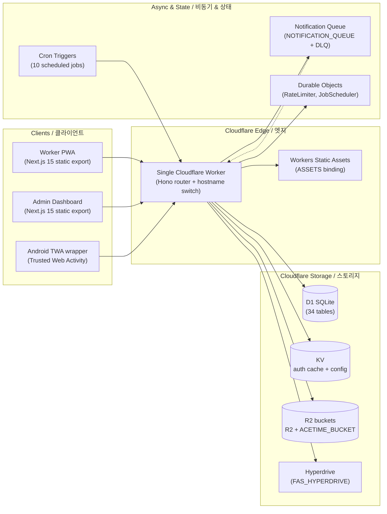

# SafetyWallet / 안전지갑

> Mobile-first PWA for construction-site safety reporting, attendance, and safety-point incentive management — deployed end-to-end on the Cloudflare edge.
> 건설 현장의 안전 보고 · 출퇴근 · 안전 포인트 인센티브를 관리하는 모바일 우선 PWA. **Cloudflare** 엣지에 전량 배포됩니다.


---

## Table of Contents / 목차

- [Overview / 개요](#overview--개요)
- [Key Features / 주요 기능](#key-features--주요-기능)
- [Architecture / 아키텍처](#architecture--아키텍처)
- [Tech Stack / 기술 스택](#tech-stack--기술-스택)
- [Repository Layout / 저장소 구조](#repository-layout--저장소-구조)
- [Quick Start / 빠른 시작](#quick-start--빠른-시작)
- [Configuration / 설정](#configuration--설정)
- [Commands Reference / 명령어 레퍼런스](#commands-reference--명령어-레퍼런스)
- [Local Development / 로컬 개발](#local-development--로컬-개발)
- [Testing / 테스트](#testing--테스트)
- [Android TWA Build / Android TWA 빌드](#android-twa-build--android-twa-빌드)
- [Internationalization / 국제화](#internationalization--국제화)
- [Contribution Guide / 기여 가이드](#contribution-guide--기여-가이드)
- [License / 라이선스](#license--라이선스)

---

## Overview / 개요

**SafetyWallet** is a field-worker safety platform organized as a **Turborepo monorepo** and deployed end-to-end on **Cloudflare**. It targets construction sites where workers need a low-friction, installable mobile experience and site managers need a dashboard to triage safety reports, attendance, and incentive accrual.

**SafetyWallet**은 **Cloudflare** 엣지에 전량 배포되는 **Turborepo 모노레포** 기반 현장 작업자 안전 플랫폼입니다. 작업자가 현장에서 마찰 없이 설치 가능한 모바일 환경을 사용하고, 현장 관리자가 안전 보고 · 출퇴근 · 인센티브 적립을 심사할 수 있도록 설계되었습니다.

The repository is composed of TypeScript workspaces coordinated by Turbo, with the primary application packages located under `apps/` and shared libraries under `packages/`. A single Cloudflare Worker serves the Hono API and statically-exported Next.js frontends via hostname routing. The worker PWA can also be wrapped as an Android Trusted Web Activity (TWA) for store distribution.

이 저장소는 Turbo가 조율하는 TypeScript 워크스페이스로 구성되며, 주요 애플리케이션 패키지는 `apps/` 아래에 공유 라이브러리는 `packages/` 아래에 위치합니다. 단일 Cloudflare Worker가 호스트명 라우팅을 통해 Hono API와 정적 익스포트된 Next.js 프런트엔드를 모두 제공합니다. 작업자용 PWA는 스토어 배포를 위해 Android Trusted Web Activity(TWA)로 래핑될 수도 있습니다.

---

## Key Features / 주요 기능

### For Field Workers / 현장 작업자용

- **Mobile-first PWA** with offline-capable install experience / 오프라인 설치 가능한 모바일 우선 PWA
- **Hazard reporting** with photo and video capture via R2 storage / 사진·영상 첨부 가능한 위험 요인 보고(R2 저장)
- **Attendance check-in/out** with site-specific schedules / 현장별 스케줄 기반 출퇴근 체크인
- **Safety-point accrual** through verified participation / 인증된 활동을 통한 안전 포인트 적립
- **Education content** delivery in multiple languages / 다국어 교육 콘텐츠 제공
- **Push notification** opt-in via service worker / 서비스 워커 기반 푸시 알림 옵트인

### For Site Admins / 현장 관리자용

- **Review workflow** for reports, votes, and settlements / 보고서 · 투표 · 정산 심사 워크플로
- **Site-level dashboards** with exportable compliance data / 내보내기 가능한 컴플라이언스 대시보드
- **Three-tier permissions**: `WORKER`, `SITE_ADMIN`, `SUPER_ADMIN`, `SYSTEM` / 3단계 권한 모델
- **Field-level flags**: `canAwardPoints`, `canReview`, `canExportData` / 필드 단위 기능 플래그
- **Audit-friendly logging** and analytics middleware / 감사 친화적 로깅 및 분석 미들웨어

### For Operators / 운영자용

- **Edge-native stack** — zero cold-start latency at Cloudflare POPs / Cloudflare POP에서 콜드 스타트 없는 엣지 네이티브 스택
- **D1 (SQLite)** primary storage via Drizzle ORM / Drizzle ORM 기반 D1(SQLite) 주 저장소
- **R2** for user-uploaded media / 사용자 업로드 미디어용 R2
- **Hyperdrive** integration with external FAS employee database / 외부 FAS 임직원 DB용 Hyperdrive 연동
- **Queue-based notification pipeline** with DLQ / DLQ를 갖춘 큐 기반 알림 파이프라인
- **Scheduled cron jobs** (10 jobs) for daily/weekly rollups / 일간·주간 집계를 위한 10개의 스케줄 크론 잡

---

## Architecture / 아키텍처

The platform is a single Cloudflare Worker that fans out to two static frontends (worker PWA, admin dashboard) and a Hono API. All clients talk to the same origin, with hostname-based routing inside the Worker.



### Request Flow / 요청 흐름

1. **Edge ingress** — Cloudflare terminates TLS and routes by hostname (e.g. `worker.example` → SPA, `api.example` → Hono API).
2. **Hono dispatch** — the Worker matches the path to a route module under `apps/api/src/routes/`.
3. **Middleware chain** — CORS → security headers → logging → analytics → JWT auth → per-route handler.
4. **Data access** — Drizzle queries against D1; KV cache for auth tokens; R2 for media; Hyperdrive for FAS lookups.
5. **Side effects** — long-running work enqueued to `NOTIFICATION_QUEUE`; rate limits enforced via `RateLimiter` DO.
6. **Response** — JSON for API, static assets for SPA routes (served from `ASSETS` binding).

### Authentication & Authorization / 인증 및 권한

- **JWT issued at login** with **KST same-day midnight expiry**; cached in client Zustand store.
- **Triple-layer validation** — JWT decode → KST date check → KV cache → D1 fallback.
- **Three-tier permissions** — global role (`WORKER` / `SITE_ADMIN` / `SUPER_ADMIN` / `SYSTEM`) → site-specific membership → field-level flags.
- **Client auth** — Zustand persisted store with 401 refresh mutex. Worker key: `safetywallet-auth`. Admin key: `safetywallet-admin-auth`.

---

## Tech Stack / 기술 스택

| Layer / 계층 | Technology / 기술 | Purpose / 용도 |
| --- | --- | --- |
| Language / 언어 | TypeScript | Strict-typed workspaces |
| API framework / API 프레임워크 | Hono | Lightweight router on Workers |
| ORM / ORM | Drizzle | Type-safe D1 queries |
| Database / DB | Cloudflare D1 | SQLite at the edge (34 tables) |
| Frontend / 프런트엔드 | Next.js 15 (App Router) | Static export SPAs |
| Styling / 스타일 | Tailwind CSS | Utility-first CSS |
| UI library / UI 라이브러리 | shadcn/ui | Shared components |
| State / 상태 | Zustand | Persisted client auth + UI state |
| Validation / 검증 | Zod | Request/response schemas |
| Build orchestrator / 빌드 | Turborepo | Pipeline: `types → ui → apps` |
| Package manager / 패키지 매니저 | npm 10.8.2 | Workspaces (`apps/*`, `packages/*`) |
| Edge runtime / 엣지 런타임 | Cloudflare Workers | Single Worker deployment |
| Media / 미디어 | Cloudflare R2 | Uploads + ACETIME bucket |
| Queue / 큐 | Cloudflare Queues | Notification pipeline + DLQ |
| State primitives / 상태 프리미티브 | Durable Objects | `RateLimiter`, `JobScheduler` |
| External DB / 외부 DB | Hyperdrive | FAS employee integration |
| E2E tests / E2E 테스트 | Playwright | 6 projects, 1Password env injection |
| Unit tests / 단위 테스트 | Vitest | Workspace-level unit tests |
| Lint-staged hooks / 훅 | Husky + lint-staged | Prettier + anti-pattern checks |
| Helper tooling / 보조 도구 | Go scripts | `verify.go`, `git-preflight.go`, `check-anti-patterns.go` |

### Runtime Requirements / 런타임 요구 사항

- **Node.js** ≥ `20.0.0`
- **npm** `10.8.2` (pinned via `packageManager`)
- **Wrangler CLI** for Cloudflare deployments
- **Optional**: `op` (1Password CLI) for E2E secret injection, Go for helper scripts

---

## Repository Layout / 저장소 구조

```text
.
├── AGENTS.md                 # Project knowledge base (curated)
├── ARCHITECTURE.md           # Detailed architecture notes
├── CODE_STYLE.md             # Coding conventions
├── CONTRIBUTING.md           # Contribution guidelines
├── LICENSE                   # Project license
├── README.md                 # This document
├── package.json              # Root workspace manifest
├── package-lock.json         # Locked dependency graph
├── playwright.config.ts      # Playwright E2E config
├── turbo.json                # Turborepo pipeline
├── vitest.config.ts          # Root Vitest config
├── wrangler.toml             # Cloudflare Worker bindings
└── apps/
    └── worker/               # Next.js 15 worker PWA (port 3000, static export)
        ├── AGENTS.md
        ├── I18N_IMPLEMENTATION.md
        ├── next.config.mjs
        ├── next-env.d.ts
        ├── package.json
        ├── postcss.config.cjs
        ├── tailwind.config.js
        ├── tsconfig.json
        ├── vitest.config.ts
        ├── android/          # Android TWA wrapper project
        │   ├── build.gradle
        │   ├── gradle.properties
        │   ├── gradlew
        │   ├── gradlew.bat
        │   ├── manifest-checksum.txt
        │   ├── settings.gradle
        │   ├── store_icon.png
        │   ├── twa-manifest.json
        │   ├── app/          # Android app module
        │   │   ├── build.gradle
        │   │   └── src/main/ # Manifest, resources, Java sources
        │   └── gradle/wrapper/
        └── src/
            └── app/          # App Router pages (login, posts, attendance, education)
```

The root `package.json` declares the workspace topology (`apps/*`, `packages/*`); workspace members beyond `apps/worker` (for example the API worker and shared libraries) are resolved through Turbo and are described in their own `AGENTS.md` files.

루트 `package.json`은 워크스페이스 토폴로지(`apps/*`, `packages/*`)를 선언하며, `apps/worker` 외의 워크스페이스 멤버(예: API Worker, 공유 라이브러리)는 Turbo를 통해 해석되며 각자의 `AGENTS.md`에 설명되어 있습니다.

---

## Quick Start / 빠른 시작

### Prerequisites / 사전 요구 사항

- Node.js ≥ 20.0.0
- npm 10.8.2
- Wrangler CLI (`npm i -g wrangler`) authenticated against your Cloudflare account
- A Cloudflare account with D1, R2, KV, Queues, and Hyperdrive enabled

### Install / 설치

```bash
# Clone and enter the repository
git clone <repository-url> safetywallet
cd safetywallet

# Install workspace dependencies
npm install

# (Optional) Authenticate Wrangler
wrangler login
```

### Run Locally / 로컬 실행

```bash
# Start all workspace dev servers (worker PWA, admin, API)
npm run dev

# Or run a single workspace (e.g. the worker PWA only)
npm run dev --workspace=apps/worker
```

The worker PWA listens on `http://localhost:3000`, the admin dashboard on `http://localhost:3001`, and the API worker on `http://localhost:8787` by default.

작업자용 PWA는 기본 `http://localhost:3000`, 관리자 대시보드는 `http://localhost:3001`, API Worker는 `http://localhost:8787`에서 수신합니다.

### First Build / 첫 빌드

```bash
# Build all workspaces (types → ui → apps) and assemble the static dist/
npm run build

# Build only the API + shared types
npm run build:api
```

---

## Configuration / 설정

### Cloudflare Bindings (wrangler.toml) / Cloudflare 바인딩

The single Cloudflare Worker declared in `wrangler.toml` exposes the bindings listed below. Replace binding IDs with your own when running against a personal account.

| Binding | Type | Purpose / 용도 |
| --- | --- | --- |
| `DB` | D1 | Primary database (Drizzle schema) |
| `FAS_HYPERDRIVE` | Hyperdrive | External FAS employee database |
| `ASSETS` | Workers Static Assets | Static frontend files (worker + admin SPAs) |
| `R2` | R2 bucket | User-uploaded images and videos |
| `ACETIME_BUCKET` | R2 bucket | Attendance-related assets |
| `KV` | KV namespace | Auth cache, system status, config |
| `NOTIFICATION_QUEUE` | Queue | Notification delivery pipeline |
| `NOTIFICATION_DLQ` | Queue | Notification dead-letter queue |
| `RATE_LIMITER` | Durable Object | Per-route rate limiting |
| `JOB_SCHEDULER` | Durable Object | Cron orchestration |

### Local Secrets / 로컬 비밀 값

Use `.dev.vars` (Wrangler) for local secrets and `wrangler secret put` for deployed environments. Never commit secrets to the repository.

로컬 비밀 값은 `.dev.vars`(Wrangler), 배포 환경 비밀 값은 `wrangler secret put`을 사용하세요. 저장소에 비밀 값을 커밋하지 마세요.

### Environment Variables / 환경 변수

- `NODE_ENV` — set to `production` for builds
- `APP_ENV` — `local` | `staging` | `production`
- `PUBLIC_API_BASE_URL` — public origin for the Hono API
- `E2E_ENV_FILE` — path to the 1Password-encrypted `.env.e2e`

### 1Password E2E Injection / 1Password E2E 주입

Playwright runs receive environment variables from a 1Password-encrypted file via the `op` CLI:

```bash
op run --env-file=.env.e2e -- npx playwright test
```

---

## Commands Reference / 명령어 레퍼런스

All commands are run from the repository root unless otherwise noted.

| Command | Description / 설명 |
| --- | --- |
| `npm run dev` | Start all workspace dev servers via Turbo |
| `npm run build` | Build every workspace, then assemble `dist/` |
| `npm run build:api` | Build shared `types` package then `apps/api` |
| `npm run build:static` | Compose `dist/` from `apps/worker/out` and `apps/admin/out` |
| `npm run build:one-worker` | Alias for `npm run build:api` |
| `npm run lint` | Lint every workspace via Turbo |
| `npm run lint:naming` | Run naming-convention linter (`scripts/lint-naming.js`) |
| `npm run typecheck` | TypeScript project-graph check across workspaces |
| `npm run test` | Run workspace unit tests via Turbo |
| `npm run test:coverage` | Run unit tests with coverage |
| `npm run check:wrangler-sync` | Verify `wrangler.toml` matches Drizzle bindings |
| `npm run git:preflight` | Run `git-preflight.go` checks before commit |
| `npm run verify` | Run `verify.go` integrity checks |
| `npm run format` | Format with Prettier |
| `npm run format:check` | Verify formatting (CI-friendly) |
| `npm run clean` | Remove build outputs and `node_modules` |
| `npm run db:generate` | Generate Drizzle schema artifacts |
| `npm run e2e` | Run Playwright E2E with 1Password env injection |
| `npm run e2e:headed` | Run Playwright in headed mode |
| `npm run e2e:ui` | Open Playwright UI mode |
| `npm run deploy:api` | Intentionally disabled — deploy is Git-ref driven via CI on `master` |

### Workspace Filtering / 워크스페이스 필터링

```bash
# Run a script in a single workspace
npm run <script> --workspace=<workspace-name>

# Example: typecheck only the worker PWA
npm run typecheck --workspace=apps/worker
```

---

## Local Development / 로컬 개발

### Recommended Workflow / 권장 워크플로

1. Create a feature branch from `master`.
2. Run `npm run dev` to start the affected workspace(s).
3. Iterate with HMR; Turborepo caches unaffected workspaces.
4. Before pushing:
   - `npm run lint`
   - `npm run typecheck`
   - `npm run test`
   - `npm run format`
5. Husky + lint-staged will run `check-anti-patterns.go` and Prettier on staged files automatically.

### Go Helper Scripts / Go 보조 스크립트

The repository ships helper scripts written in Go that are invoked via `go run`:

- `scripts/verify.go` — workspace integrity and binding sanity
- `scripts/git-preflight.go` — pre-commit branch / commit message checks
- `scripts/check-anti-patterns.go` — code-style guards on staged TS/TSX
- `scripts/check-wrangler-sync.js` — Node script that verifies `wrangler.toml` matches Drizzle definitions
- `scripts/lint-naming.js` — naming convention linter

Ensure `go` is installed locally before relying on the Husky hooks; CI installs Go explicitly.

Husky 훅이 의존하므로 로컬에 `go`가 설치되어 있는지 확인하세요. CI에서는 Go를 명시적으로 설치합니다.

### Drizzle Workflow / Drizzle 워크플로

```bash
# Generate schema artifacts after editing src/db/schema/*
npm run db:generate --workspace=apps/api

# Apply migrations to your local D1
wrangler d1 migrations apply <database-name> --local
```

---

## Testing / 테스트

### Unit Tests / 단위 테스트

Each workspace ships its own `vitest.config.ts`. Run them all via Turbo:

```bash
npm run test
npm run test:coverage
```

### E2E Tests / E2E 테스트

Playwright is configured at the repository root with 6 projects covering auth setup, admin, and worker flows.

```bash
# Headless (default)
npm run e2e

# Headed (useful for debugging)
npm run e2e:headed

# Interactive UI
npm run e2e:ui
```

All Playwright runs require a 1Password-encrypted `.env.e2e` file containing the test credentials. Use the `op` CLI wrapper script as shown above.

모든 Playwright 실행은 자격 증명을 담은 1Password 암호화 `.env.e2e` 파일을 필요로 합니다. 위에서 보여준 `op` CLI 래퍼 스크립트를 사용하세요.

### Anti-Pattern Checks / 안티패턴 검사

`scripts/check-anti-patterns.go` runs as a lint-staged hook on staged `*.ts` and `*.tsx` files to enforce project-specific code-style guards. CI also re-runs this check across the whole tree.

`scripts/check-anti-patterns.go`는 스테이지된 `*.ts` 및 `*.tsx` 파일에 대해 lint-staged 훅으로 실행되어 프로젝트별 코드 스타일 가드를 적용합니다. CI에서는 전체 트리에 대해 다시 실행합니다.

---

## Android TWA Build / Android TWA 빌드

The `apps/worker/android/` directory contains a Trusted Web Activity wrapper that loads the worker PWA in a native Android shell. It is intended for distribution on the Play Store with a verified Digital Asset Links relationship.

`apps/worker/android/` 디렉터리는 작업자용 PWA를 네이티브 Android 셸에서 로드하는 Trusted Web Activity 래퍼를 포함합니다. 검증된 Digital Asset Links 관계와 함께 Play Store에 배포하기 위한 것입니다.

### Layout Highlights / 디렉터리 핵심

- `twa-manifest.json` — Bubblewrap-generated TWA manifest
- `app/build.gradle` — Android module build script
- `app/src/main/AndroidManifest.xml` — native manifest with launcher activity
- `app/src/main/java/me/jclee/safetywallet/twa/` — TWA application classes:
  - `Application.java`
  - `DelegationService.java`
  - `LauncherActivity.java`
- `app/src/main/res/` — icons, splash, notification icon, file paths, shortcuts, raw `web_app_manifest.json`

### Building / 빌드

```bash
# 1. Export the static worker PWA
npm run build --workspace=apps/worker

# 2. Serve it at the production origin so Bubblewrap can validate the manifest
#    (or use --useTwaManifest with a known-good URL)

# 3. From apps/worker/android, run the Gradle wrapper
cd apps/worker/android
./gradlew assembleRelease
```

The resulting `app-release-bundle.aab` can be uploaded to Google Play Console. Keep `manifest-checksum.txt` in sync with the deployed `/.well-known/assetlinks.json` so Digital Asset Links verification succeeds.

생성된 `app-release-bundle.aab`는 Google Play Console에 업로드할 수 있습니다. Digital Asset Links 검증이 성공하도록 `manifest-checksum.txt`를 배포된 `/.well-known/assetlinks.json`과 동기화 상태로 유지하세요.

---

## Internationalization / 국제화

The worker PWA ships a custom in-house i18n runtime (not `next-intl` or `react-i18next`) located under `apps/worker/src/i18n/`. Supported locales are configured in `apps/worker/I18N_IMPLEMENTATION.md` and include:

- `ko` — 한국어 (default)
- `en` — English
- `vi` — Tiếng Việt
- `zh` — 中文

Translation data is centrally maintained in `packages/types` and consumed by both frontends. The runtime selects the locale based on browser preference, persisted user choice, and site-level override.

번역 데이터는 `packages/types`에서 중앙 관리되며 두 프런트엔드 모두에서 소비됩니다. 런타임은 브라우저 환경설정, 사용자 선택 영구화, 사이트 단위 재정의를 기반으로 로케일을 선택합니다.

---

## Contribution Guide / 기여 가이드

1. Read `CODE_STYLE.md` and `CONTRIBUTING.md` before opening a pull request.
2. Use the prescribed commit message format enforced by `git-preflight.go`.
3. Keep changes scoped; one logical change per pull request.
4. Add or update unit tests in the affected workspace.
5. If you change `wrangler.toml` or the Drizzle schema, run `npm run check:wrangler-sync`.
6. Ensure CI is green before requesting review: lint → typecheck → guards → test → build → migrate.

For detailed conventions and review expectations, refer to `AGENTS.md` and `ARCHITECTURE.md`.

---

## License / 라이선스

This project is released under the terms described in the [LICENSE](./LICENSE) file.

이 프로젝트는 [LICENSE](./LICENSE) 파일에 명시된 조건에 따라 배포됩니다.