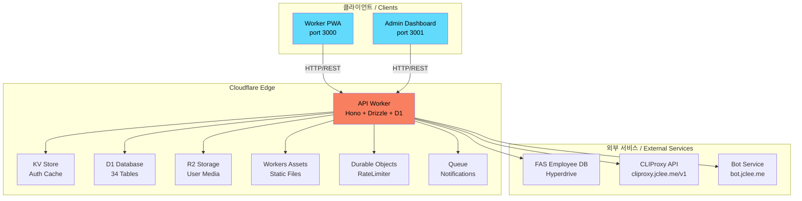
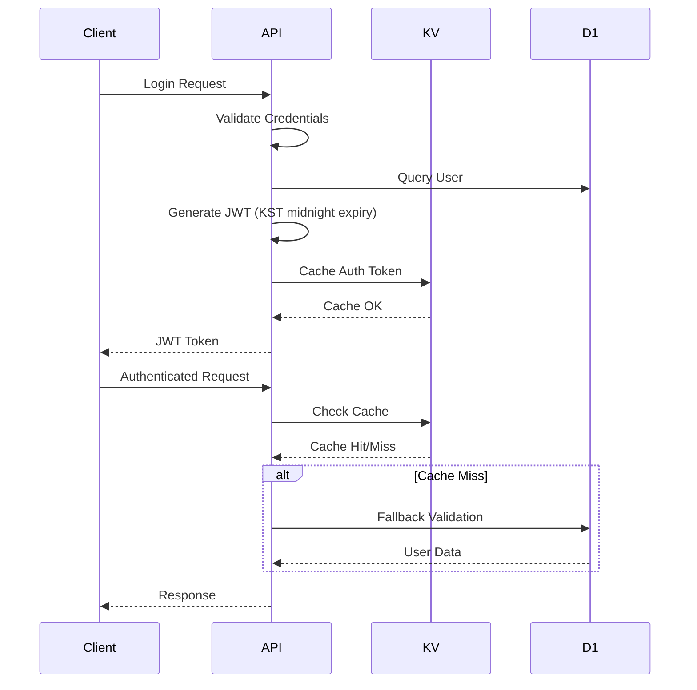

# SafetyWallet

> 건설 현장 안전 관리 플랫폼 / Construction Site Safety Management Platform

[](LICENSE)
[](https://nodejs.org/)
[](https://www.npmjs.com/)
[](https://www.typescriptlang.org/)
[](https://workers.cloudflare.com/)
[](https://turbo.build/)

---

## 목차 / Table of Contents

- [개요 / Overview](#개요--overview)
- [주요 기능 / Features](#주요-기능--features)
- [아키텍처 / Architecture](#아키텍처--architecture)
- [자동화 인벤토리 / Automation Inventory](#자동화-인벤토리--automation-inventory)
- [빠른 시작 / Quick Start](#빠른-시작--quick-start)
- [로컬 개발 / Local Development](#로컬-개발--local-development)
- [명령어 참조 / Commands Reference](#명령어-참조--commands-reference)
- [기여 가이드 / Contributing Guide](#기여-가이드--contributing-guide)
- [라이선스 / License](#라이선스--license)

---

## 개요 / Overview

SafetyWallet은 건설 현장의 안전 관리, 교육, 게시/투표, 리뷰, 포인트, 사용자/현장 관리 기능을 위한 TypeScript 기반 모노레포입니다.

SafetyWallet is a TypeScript-based monorepo for construction-site safety management, education, posts/votes, reviews, points, users, and site-management workflows.

이 저장소는 다음과 같은 구성요소를 포함합니다.

This repository contains the following main components:

| 구성 요소 / Component | 설명 / Description |
|---|---|
| `apps/api` | Cloudflare Workers 기반 API 애플리케이션 (Hono + Drizzle + D1) |
| `apps/admin` | Next.js 15 관리자 대시보드 (port 3001, 정적 내보내기) |
| `apps/worker` | Next.js 15 워커 PWA (port 3000, 정적 내보내기) |
| `packages/types` | 공유 API 타입, DTO, enum, 다국어(i18n) 리소스 |
| `packages/ui` | 공유 React UI 컴포넌트 (shadcn/ui + Tailwind v4) |

**기술 스택 / Tech Stack:**

- **런타임:** Node.js ≥20, Cloudflare Workers
- **언어:** TypeScript
- **API:** Hono 프레임워크 + Drizzle ORM + D1 (SQLite)
- **프론트엔드:** Next.js 15 (App Router, 정적 내보내기)
- **UI:** shadcn/ui + Tailwind CSS v4
- **모노레포:** Turborepo + npm Workspaces
- **인프라:** Cloudflare D1, R2, KV, Durable Objects, Queues

---

## 주요 기능 / Features

### 안전 관리 / Safety Management

- 위험 신고 및 현장 안전 점검
- 안전 포인트 부여 및 추적
- 안전 교육 이수 관리

### 교육 시스템 / Education System

- 교육 콘텐츠 생성 및 관리
- 퀴즈 및 훈련 프로그램
- 교육 이수율 대시보드

### 커뮤니티 / Community

- 게시글 작성 및 관리
- 투표 및 추천 시스템
- 리뷰 및 피드백

### 시스템 기능 / System Features

- 출석 관리 및 추적
- 포인트 시스템
- 다국어 지원 (한국어, 영어, 베트남어, 중국어)
- Real-time 알림

---

## 아키텍처 / Architecture

### 전체 흐름 / Overall Flow



### 모노레포 구조 / Monorepo Structure

```text
safetywallet/
├── apps/
│   ├── api/                 # Cloudflare Worker API (Hono + Drizzle + D1)
│   │   ├── src/routes/      # 18 API route modules
│   │   ├── src/lib/         # Auth, helpers, FAS integration, R2
│   │   ├── src/middleware/  # CORS, logging, analytics, security
│   │   ├── src/db/          # Drizzle schema (34 tables)
│   │   ├── src/durable-objects/  # RateLimiter, JobScheduler DOs
│   │   ├── src/jobs/        # 10 scheduled cron jobs
│   │   └── migrations/      # 31 D1 SQL migrations
│   ├── admin/               # Next.js 15 admin dashboard (port 3001)
│   └── worker/              # Next.js 15 worker PWA (port 3000)
├── packages/
│   ├── types/               # Shared TS types, enums, DTOs, i18n
│   └── ui/                  # Shared shadcn/ui components
├── docs/                    # PRD, requirements, ops runbooks
├── scripts/                 # Go/JS tooling scripts
├── e2e/                     # Playwright E2E tests
├── .github/workflows/       # GitHub Actions CI/CD
├── wrangler.toml            # Cloudflare Workers config
├── turbo.json               # Turborepo pipeline
└── playwright.config.ts     # Playwright configuration
```

### 인증 흐름 / Authentication Flow



### 권한 체계 / Permission Model

| 역할 / Role | 설명 / Description | 권한 / Permissions |
|---|---|---|
| `WORKER` | 현장 작업자 | 게시글 작성, 투표, 출석 체크 |
| `SITE_ADMIN` | 현장 관리자 | 현장 사용자 관리, 포인트 부여, 리뷰 |
| `SUPER_ADMIN` | 슈퍼 관리자 | 전체 시스템 관리, 데이터 내보내기 |
| `SYSTEM` | 시스템 계정 | 내부 자동화 작업 |

---

## 자동화 인벤토리 / Automation Inventory

### GitHub Actions 워크플로우 / GitHub Actions Workflows

이 저장소는 **34개**의 GitHub Actions 워크플로우 파일을 포함합니다.

#### 1. 풀 리퀘스트 및 브랜치 관리 / PR and Branch Management

| 워크플로우 파일 / Workflow File | 설명 / Description | 도구 / Tool |
|---|---|---|
| `01_branch-to-pr.yml` | 브랜치에서 PR로 자동 변환 | GitHub API |
| `02_issue-to-branch.yml` | 이슈에서 브랜치 자동 생성 | GitHub API |
| `09_semantic-pr.yml` |语义 PR 제목 검증 | semantic-pull-requests |
| `10_pr-review.yml` | AI 기반 PR 리뷰 | qodo-ai/pr-agent |
| `13_pr-auto-merge.yml` | 자동 병합 (조건 충족 시) | GitHub Merge Queue |
| `14_bot-auto-fix.yml` | Bot 수정사항 자동 적용 | qodo-ai/pr-agent |
| `15_merged-pr-cleanup.yml` | 병합 후 브랜치 정리 | GitHub API |
| `security/11_pr-review.yml` | 보안 이슈 PR 리뷰 | qodo-ai/pr-agent |

#### 2. CI/CD 및 품질 검사 / CI/CD and Quality Checks

| 워크플로우 파일 / Workflow File | 설명 / Description | 도구 / Tool |
|---|---|---|
| `03_pr-checks.yml` | PR 검증 파이프라인 |turbo, vitest, playwright |
| `04_actionlint.yml` | 워크플로우 lint | actionlint |
| `ci.yml` | 기본 CI 실행 | npm, turbo |
| `standard-ci.yml` | 표준 CI 템플릿 | npm, turbo |
| `60_ci-auto-heal.yml` | CI 실패 자동 복구 | GitHub API |

#### 3. 보안 검사 / Security Scanning

| 워크플로우 파일 / Workflow File | 설명 / Description | 도구 / Tool |
|---|---|---|
| `05_gitleaks.yml` | 시크릿 스캐닝 | gitleaks |
| `06_codeql.yml` | 코드 품질 분석 | CodeQL |
| `07_dependency-review.yml` | 의존성 취약점 검사 | dependency-review-action |
| `08_scorecard.yml` | 보안 점수 산정 | scorecard-action |
| `45_reusable-gitleaks.yml` | 재사용可能な Gitleaks | gitleaks |

#### 4. 의존성 관리 / Dependency Management

| 워크플로우 파일 / Workflow File | 설명 / Description | 도구 / Tool |
|---|---|---|
| `12_dependabot-auto-merge.yml` | Dependabot PR 자동 병합 | dependabot, GitHub API |
| `auto-merge.yml` | 자동 병합 설정 | GitHub Merge Queue |

#### 5. 이슈 관리 / Issue Management

| 워크플로우 파일 / Workflow File | 설명 / Description | 도구 / Tool |
|---|---|---|
| `18_issue-management.yml` | 이슈 라이프사이클 관리 | GitHub API |
| `19_issue-backfill.yml` | 이슈 백필/동기화 | GitHub API |
| `37_ci-failure-issues.yml` | CI 실패 시 이슈 생성 | GitHub Issues |
| `43_reusable-issue-management.yml` | 재사용 가능한 이슈 관리 | GitHub API |
| `91_issue-classification.yml` | 이슈 자동 분류/라벨링 | GitHub API |

#### 6. 문서화 / Documentation

| 워크플로우 파일 / Workflow File | 설명 / Description | 도구 / Tool |
|---|---|---|
| `20_readme-gen.yml` | README.md 자동 생성 | 커스텀 스크립트 |
| `21_docs-sync.yml` | 문서 동기화 | GitHub API |
| `42_reusable-docs-sync.yml` | 재사용 가능한 문서 동기화 | GitHub API |

#### 7. 릴리스 및 배포 / Release and Deploy

| 워크플로우 파일 / Workflow File | 설명 / Description | 도구 / Tool |
|---|---|---|
| `24_release-notes.yml` | 릴리스 노트 자동 생성 | 커스텀 스크립트 |
| `25_release-publish.yml` | 릴리스 게시 자동화 | GitHub Releases |

#### 8. 건강 상태 검사 / Health Checks

| 워크플로우 파일 / Workflow File | 설명 / Description | 도구 / Tool |
|---|---|---|
| `29_downstream-health-check.yml` | Downstream 서비스 상태 검사 | 커스텀 스크립트 |

#### 9. 레이블링 / Labeling

| 워크플로우 파일 / Workflow File | 설명 / Description | 도구 / Tool |
|---|---|---|
| `labeler.yml` | PR/이슈 자동 라벨링 | actions/labeler |

#### 10. 워크플로우 재사용 모듈 / Reusable Workflow Modules

| 워크플로우 파일 / Workflow File | 설명 / Description | 도구 / Tool |
|---|---|---|
| `44_reusable-pr-checks.yml` | PR 검사 재사용 모듈 | turbo, vitest |
| `45_reusable-gitleaks.yml` | Gitleaks 재사용 모듈 | gitleaks |

#### 11. 기타 자동화 / Other Automation

| 워크플로우 파일 / Workflow File | 설명 / Description | 도구 / Tool |
|---|---|---|
| `welcome.yml` |新人 기여자 환영 메시지 | actions/stale |

### 외부 자동화 서비스 / External Automation Services

| 서비스 / Service | 용도 / Purpose | 엔드포인트 / Endpoint |
|---|---|---|
| qodo-ai/pr-agent | AI PR 리뷰 및 수정 | <https://bot.jclee.me> |
| CLIProxy API | CLI 프록시/자동화 | <https://cliproxy.jclee.me/v1> |

### 로컬 스크립트 / Local Scripts

| 스크립트 / Script | 언어 / Language | 설명 / Description |
|---|---|---|
| `scripts/verify.go` | Go | 검증 도구 |
| `scripts/git-preflight.go` | Go | Git 사전 검사 |
| `scripts/check-anti-patterns.go` | Go | 안티패턴 검사 |
| `scripts/lint-naming.js` | Node.js |命名 규칙 lint |
| `scripts/check-wrangler-sync.js` | Node.js | wrangler.toml 동기화 검사 |

---

## 빠른 시작 / Quick Start

### 전제 조건 / Prerequisites

- Node.js ≥20.0.0
- npm 10.8.2
- Git

### 설치 / Installation

```bash
# 저장소 클론
git clone <repository-url>
cd safetywallet

# 의존성 설치
npm install

# Husky 훅 설정
npm run prepare
```

### 개발 서버 실행 / Running Development Servers

```bash
# 모든 워크스페이스 개발 서버 실행
npm run dev

# 개별 앱만 실행
npm run dev --workspace=apps/worker   # Port 3000
npm run dev --workspace=apps/admin    # Port 3001
npm run dev --workspace=apps/api       # Cloudflare Worker
```

### 빌드 / Build

```bash
# 전체 빌드 (API + Worker + Admin)
npm run build

# API만 빌드
npm run build:api

# 정적 파일만 빌드
npm run build:static
```

### 테스트 / Testing

```bash
# 모든 테스트 실행
npm run test

# 커버리지 포함 테스트
npm run test:coverage

# E2E 테스트
npm run e2e

# E2E 헤드리스 모드
npm run e2e:headed

# E2E UI 모드
npm run e2e:ui
```

---

## 로컬 개발 / Local Development

### 환경 변수 / Environment Variables

```bash
# .env.local 예시 (각 앱의 root 또는 apps/* 디렉토리에 배치)
DATABASE_URL=...
KV_NAMESPACE=...
R2_ACCOUNT_ID=...
R2_ACCESS_KEY_ID=...
R2_SECRET_ACCESS_KEY=...
R2_BUCKET_NAME=...
CLOUDFLARE_ACCOUNT_ID=...
CLOUDFLARE_API_TOKEN=...
JWT_SECRET=...
```

### Cloudflare Workers 로컬 개발 / Cloudflare Workers Local Development

```bash
# wrangler를 사용한 로컬 개발
cd apps/api
npx wrangler dev

# 프로덕션模拟 (local mode)
npx wrangler dev --local
```

### 데이터베이스 마이그레이션 / Database Migration

```bash
# D1 마이그레이션 생성
npm run db:generate

# 로컬 D1에 적용
npx wrangler d1 migrations apply safetywallet-api --local
```

### 코드 검사 / Code Linting

```bash
# 전체 lint 실행
npm run lint

# 네이밍 규칙 검사
npm run lint:naming

# 포맷팅 검사
npm run format:check

# 코드 포맷팅
npm run format
```

### 타입 검사 / Type Checking

```bash
# 전체 타입 검사
npm run typecheck
```

---

## 명령어 참조 / Commands Reference

### 기본 명령어 / Basic Commands

| 명령어 / Command | 설명 / Description |
|---|---|
| `npm install` | 모든 의존성 설치 |
| `npm run dev` | 개발 서버 시작 (모든 워크스페이스) |
| `npm run build` | 전체 프로젝트 빌드 |
| `npm run test` | 모든 테스트 실행 |
| `npm run lint` | Linting 실행 |
| `npm run typecheck` | TypeScript 타입 검사 |

### 빌드 명령어 / Build Commands

| 명령어 / Command | 설명 / Description |
|---|---|
| `npm run build` | types → ui → apps 전체 빌드 |
| `npm run build:api` | API 패키지만 빌드 |
| `npm run build:static` | Worker/Admin 정적 파일 빌드 |
| `npm run build:one-worker` | API 빌드만実行 (workers 빌드X) |

### 테스트 명령어 / Test Commands

| 명령어 / Command | 설명 / Description |
|---|---|
| `npm run test` | vitest 유닛 테스트 |
| `npm run test:coverage` | 커버리지 포함 테스트 |
| `npm run e2e` | Playwright E2E 테스트 |
| `npm run e2e:headed` | 헤드리스 E2E 테스트 |
| `npm run e2e:ui` | Playwright UI 모드 |

### 개발 지원 명령어 / Dev Support Commands

| 명령어 / Command | 설명 / Description |
|---|---|
| `npm run format` | Prettier 포맷팅 적용 |
| `npm run format:check` | Prettier 포맷팅 검사 |
| `npm run lint:naming` | 네이밍 규칙 검사 |
| `npm run check:wrangler-sync` | wrangler.toml 동기화 검사 |
| `npm run git:preflight` | Git 사전 검사 |
| `npm run verify` | 전체 검증 실행 |

### 배포 명령어 / Deploy Commands

| 명령어 / Command | 설명 / Description |
|---|---|
| `npm run deploy:api` | ⚠️ 수동 배포 비활성화 (CI를 통해 master 브랜치에 의존) |

### 유틸리티 명령어 / Utility Commands

| 명령어 / Command | 설명 / Description |
|---|---|
| `npm run clean` | 빌드 산출물 및 node_modules 삭제 |
| `npm run db:generate` | Drizzle 마이그레이션 생성 |
| `npm run prepare` | Husky Git 훅 설정 |

### Turborepo 명령어 / Turborepo Commands

```bash
# 특정 워크스페이스만 실행
npx turbo dev --filter=safetywallet-ui
npx turbo build --filter=safetywallet-api
npx turbo test --filter=safetywallet-types

# 캐시 무시
npx turbo build --force

#dry-run 모드
npx turbo build --dry-run
```

---

## 기여 가이드 / Contributing Guide

### 시작하기 / Getting Started

1. **저장소 포크 및 클론**

   ```bash
   git clone <fork-url>
   cd safetywallet
   ```

2. **업스트림 추가**

   ```bash
   git remote add upstream <original-repo-url>
   ```

3. **의존성 설치**

   ```bash
   npm install
   ```

### 브랜치 전략 / Branch Strategy

| 브랜치 유형 / Branch Type | 패턴 / Pattern | 설명 / Description |
|---|---|---|
| Feature | `feature/description` | 새 기능 개발 |
| Bugfix | `fix/description` | 버그 수정 |
| Hotfix | `hotfix/description` | 긴급 수정 |
| Issue | `issue/NUMBER-description` | 이슈 관련 작업 |

### 커밋 규칙 / Commit Rules

이 프로젝트는 **Semantic PR/Commit** 규칙을 따릅니다.

```
<type>(<scope>): <description>

[optional body]

[optional footer]
```

**Types:**

- `feat`: 새 기능
- `fix`: 버그 수정
- `docs`: 문서 변경
- `style`: 코드 스타일 변경 (기능 없음)
- `refactor`: 리팩토링
- `perf`: 성능 개선
- `test`: 테스트 추가/수정
- `chore`: 빌드/도구 변경

### PR 제출流程 / Pull Request Process

1. **브랜치 생성**

   ```bash
   git checkout -b feature/your-feature-name
   ```

2. **변경 작업**

   ```bash
   # 코드 작성
   # 테스트 작성
   # Linting 통과 확인
   npm run lint
   npm run typecheck
   npm run test
   ```

3. **커밋**

   ```bash
   git add .
   git commit -m "feat(scope): description"
   ```

4. **푸시 및 PR 생성**

   ```bash
   git push origin feature/your-feature-name
   ```

5. **PR 템플릿 작성**

   - 설명 작성
   - 관련 이슈 링크
   - 테스트 결과 포함
   - 스크린샷 (해당 시)

### 코드 스타일 / Code Style

- **TypeScript:** strict 모드 활성화
- **ESLint:** Airbnb 규칙 기반
- **Prettier:** 코드 포맷터 (80줄 제한)
- **Husky:** pre-commit 훅에서 자동 검사

### 테스트 요구사항 / Testing Requirements

| 테스트 유형 / Test Type | 도구 / Tool | 대상 / Target |
|---|---|---|
| 유닛 테스트 | vitest | packages/*, apps/* |
| E2E 테스트 | Playwright | 워크플로우 전체 |
| 타입 검사 | TypeScript | 전체 코드베이스 |

### 문서화 / Documentation

- **AGENTS.md:** 각 패키지/앱의 AI 에이전트 지침
- **ARCHITECTURE.md:** 아키텍처 상세 문서
- **CODE_STYLE.md:** 코드 스타일 가이드
- **CONTRIBUTING.md:** 기여 가이드 (본 문서)

### 문제 보고 / Reporting Issues

1. 기존 이슈 검색
2. 재현 가능한 버그 보고
3. 템플릿 사용:
   - Bug Report
   - Feature Request
   - Question

---

## 라이선스 / License

이 프로젝트는 MIT 라이선스 하에 공개되어 있습니다. 자세한 내용은 [LICENSE](LICENSE) 파일을 참조하세요.

This project is published under the MIT License. See the [LICENSE](LICENSE) file for details.

---

## 연락처 / Contact

- **프로젝트:** SafetyWallet
- **버전:** 0.1.0
- **라이선스:** MIT

---

*이 문서는 자동으로 생성되었습니다. 마지막 업데이트 시점에 대한 내용은 각 워크플로우 파일의 실행 로그를 참조하세요.*

*This document is auto-generated. See workflow execution logs for last update timestamp.*
