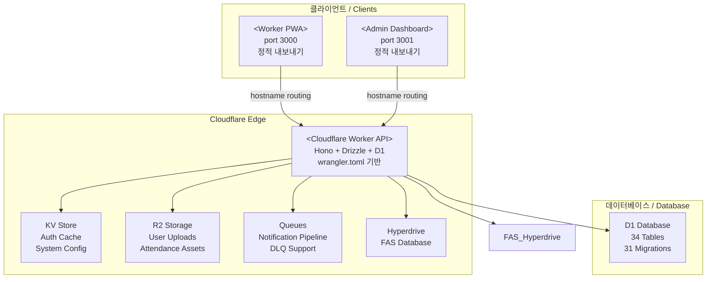

# SafetyWallet README

```markdown
# SafetyWallet

> 건설 현장 안전 관리 플랫폼 / Construction Site Safety Management Platform

[](LICENSE)
[](https://nodejs.org/)
[](https://www.npmjs.com/)
[](https://www.typescriptlang.org/)
[](https://workers.cloudflare.com/)
[](https://turbo.build/)

---

## 목차 / Table of Contents

- [개요 / Overview](#개요--overview)
- [주요 기능 / Features](#주요-기능--features)
- [아키텍처 / Architecture](#아키텍처--architecture)
- [자동화 인벤토리 / Automation Inventory](#자동화-인벤토리--automation-inventory)
- [빠른 시작 / Quick Start](#빠른-시작--quick-start)
- [로컬 개발 / Local Development](#로컬-개발--local-development)
- [명령어 참조 / Commands Reference](#명령어-참조--commands-reference)
- [기여 가이드 / Contributing Guide](#기여-가이드--contributing-guide)
- [라이선스 / License](#라이선스--license)

---

## 개요 / Overview

SafetyWallet은 건설 현장의 안전 관리, 교육, 게시/투표, 리뷰, 포인트, 사용자/현장 관리 기능을 위한 TypeScript 기반 모노레포입니다.

SafetyWallet is a TypeScript-based monorepo for construction-site safety management, education, posts/votes, reviews, points, users, and site-management workflows.

이 저장소는 다음과 같은 구성요소를 포함합니다.

This repository contains the following main components:

| 구성 요소 / Component | 설명 / Description |
|---|---|
| `apps/api` | Cloudflare Workers 기반 API 애플리케이션 (Hono + Drizzle + D1) |
| `apps/admin` | Next.js 15 관리자 대시보드 (port 3001, 정적 내보내기) |
| `apps/worker` | Next.js 15 워커 PWA (port 3000, 정적 내보내기) |
| `packages/types` | 공유 API 타입, DTO, enum, 다국어(i18n) 리소스 |
| `packages/ui` | 공유 React UI 컴포넌트 (shadcn/ui + Tailwind v4) |

**기술 스택 / Tech Stack:**

- **런타임:** Node.js ≥20, Cloudflare Workers
- **언어:** TypeScript
- **API:** Hono 프레임워크 + Drizzle ORM + Cloudflare D1 (SQLite)
- **프론트엔드:** Next.js 15 App Router
- **모노레포:** Turborepo
- **UI:** shadcn/ui + Tailwind CSS v4
- **인프라:** Cloudflare Workers, R2, KV, Queues, Hyperdrive

---

## 주요 기능 / Features

### 안전 관리 / Safety Management

- 위험 요소 신고 및 기록
- 안전 점수 기반 인센티브 시스템
- 현장별 접근 제어 및 권한 관리

### 교육 / Education

- 안전 교육 콘텐츠 관리
- 퀴즈 및 교육 이수 추적
- AI 기반 교육 지원 (education-ai)

### 참여 / Engagement

- 게시판 및 투표 시스템
- 리뷰 및 평점 기능
- 공지사항 관리

### 운영 / Operations

- 출석 관리 및 추적
- 포인트 시스템 (적립, 사용, 정산)
- 자산 관리 (이미지/동영상 업로드 via R2)

---

## 아키텍처 / Architecture

### 시스템 구성 / System Architecture



### 모노레포 구조 / Monorepo Structure

```
safetywallet/
├── apps/
│   ├── api/                  # Cloudflare Worker API
│   │   ├── src/
│   │   │   ├── routes/      # API 라우트 모듈
│   │   │   ├── lib/          # 인증, 헬퍼, FAS 통합
│   │   │   ├── middleware/   # CORS, 로깅, 보안
│   │   │   ├── db/           # Drizzle 스키마
│   │   │   ├── durable-objects/  # RateLimiter, JobScheduler
│   │   │   ├── jobs/         # Cron Jobs
│   │   │   └── validators/   # Zod 스키마
│   │   └── migrations/       # D1 마이그레이션
│   ├── admin/                # Next.js 관리자 대시보드
│   └── worker/               # Next.js 워커 PWA
├── packages/
│   ├── types/                # 공유 타입, DTO, i18n
│   └── ui/                   # 공유 UI 컴포넌트
├── scripts/                  # Go/JS 도구
├── e2e/                      # Playwright E2E 테스트
├── .github/
│   └── workflows/            # GitHub Actions
├── wrangler.toml             # Cloudflare Worker 설정
└── turbo.json                # Turborepo 설정
```

---

## 자동화 인벤토리 / Automation Inventory

### GitHub Actions 워크플로우 / GitHub Actions Workflows

#### Pull Request 워크플로우 / Pull Request Workflows

| 워크플로우 파일 / Workflow File | 설명 / Description |
|---|---|
| `01_branch-to-pr.yml` | 브랜치에서 PR로 자동 전환 |
| `02_issue-to-branch.yml` | 이슈 기반 브랜치 생성 |
| `03_pr-checks.yml` | PR 검사 (lint, typecheck, test) |
| `04_actionlint.yml` | GitHub Actions YAML 검증 |
| `05_gitleaks.yml` | секрет 검색 (gitleaks) |
| `06_codeql.yml` | 코드 품질 분석 |
| `07_dependency-review.yml` | 의존성 보안 검토 |
| `08_scorecard.yml` | OpenSSF Scorecard |
| `09_semantic-pr.yml` | 시맨틱 PR 제목 검증 |
| `10_pr-review.yml` | AI 기반 PR 리뷰 |
| `12_dependabot-auto-merge.yml` | Dependabot 자동 병합 |
| `13_pr-auto-merge.yml` | 자동 병합 규칙 |
| `14_bot-auto-fix.yml` | 봇 자동 수정 |
| `15_merged-pr-cleanup.yml` | 병합 후 정리 |
| `auto-merge.yml` | 자동 병합 설정 |
| `labeler.yml` | 라벨 자동 분류 |
| `standard-ci.yml` | 표준 CI 파이프라인 |

#### 이슈 관리 워크플로우 / Issue Management Workflows

| 워크플로우 파일 / Workflow File | 설명 / Description |
|---|---|
| `18_issue-management.yml` | 이슈 관리 및 업데이트 |
| `19_issue-backfill.yml` | 이슈 백필 자동화 |
| `37_ci-failure-issues.yml` | CI 실패 시 이슈 생성 |
| `43_reusable-issue-management.yml` | 재사용 가능한 이슈 관리 |
| `91_issue-classification.yml` | 이슈 분류 |

#### 문서 및 릴리스 워크플로우 / Documentation & Release Workflows

| 워크플로우 파일 / Workflow File | 설명 / Description |
|---|---|
| `20_readme-gen.yml` | README 자동 생성 |
| `21_docs-sync.yml` | 문서 동기화 |
| `24_release-notes.yml` | 릴리스 노트 생성 |
| `25_release-publish.yml` | 릴리스 게시 |
| `42_reusable-docs-sync.yml` | 재사용 가능한 문서 동기화 |

#### 下游检查 / Downstream Workflows

| 워크플로우 파일 / Workflow File | 설명 / Description |
|---|---|
| `29_downstream-health-check.yml` |下游 저장소 상태 확인 |

#### CI 복구 워크플로우 / CI Healing Workflows

| 워크플로우 파일 / Workflow File | 설명 / Description |
|---|---|
| `60_ci-auto-heal.yml` | CI 실패 자동 복구 |

#### 보안 워크플로우 / Security Workflows

| 워크플로우 파일 / Workflow File | 설명 / Description |
|---|---|
| `security/11_pr-review.yml` | 보안 PR 리뷰 |
| `45_reusable-gitleaks.yml` | 재사용 가능한 gitleaks |
| `44_reusable-pr-checks.yml` | 재사용 가능한 PR 검사 |

#### 기타 워크플로우 / Other Workflows

| 워크플로우 파일 / Workflow File | 설명 / Description |
|---|---|
| `ci.yml` | 기본 CI 구성 |
| `welcome.yml` | 신규 기여자 환영 |

### 빌드 도구 / Build Tools

| 도구 / Tool | 용도 / Purpose |
|---|---|
| `turbo` | 모노레포 빌드 오케스트레이션 |
| `wrangler` | Cloudflare Workers 배포 |
| `playwright` | E2E 테스트 |
| `vitest` | 단위 테스트 |
| `prettier` | 코드 포맷팅 |
| `husky` | Git hooks |

### 개발 스크립트 / Development Scripts

| 스크립트 / Script | 용도 / Purpose |
|---|---|
| `scripts/check-anti-patterns.go` | 안티 패턴 검사 |
| `scripts/check-wrangler-sync.js` | wrangler.toml 동기화 확인 |
| `scripts/git-preflight.go` | Git 사전 검사 |
| `scripts/lint-naming.js` | 네이밍 규칙 lint |
| `scripts/verify.go` | 빌드 검증 |

---

## 빠른 시작 / Quick Start

### 전제 조건 / Prerequisites

- Node.js ≥20.0.0
- npm 10.8.2 이상
- Cloudflare Wrangler (배포용)

### 설치 / Installation

```bash
# 저장소 복제
git clone <repository-url>
cd safetywallet

# 의존성 설치
npm install

# Husky Git hooks 설정
npm run prepare
```

### 환경 설정 / Environment Setup

```bash
# E2E 테스트 환경 파일 복사
cp .env.e2e.example .env.e2e

# 필요한 환경 변수 설정
# (AUTH_SECRET, DATABASE_ID, CLOUDFLARE_ACCOUNT_ID 등)
```

### 첫 번째 개발 실행 / First Development Run

```bash
# 전체 개발 서버 실행 (API + Worker + Admin)
npm run dev

# 또는 개별 실행
npm run dev --workspace=apps/api
npm run dev --workspace=apps/worker
npm run dev --workspace=apps/admin
```

---

## 로컬 개발 / Local Development

### 구조 / Structure

```
safetywallet/
├── apps/
│   ├── api/         → Cloudflare Worker API (Hono)
│   ├── worker/      → Worker PWA (Next.js 15, port 3000)
│   └── admin/       → Admin Dashboard (Next.js 15, port 3001)
├── packages/
│   ├── types/       → 공유 타입 및 DTO
│   └── ui/          → 공유 UI 컴포넌트
└── scripts/         → 개발 유틸리티
```

### API 개발 / API Development

```bash
# API 빌드
npm run build:api

# API 타입 생성 (Drizzle)
npm run db:generate

# API 실행 (Cloudflare Workers Emulator)
npx wrangler dev
```

### 프론트엔드 개발 / Frontend Development

```bash
# Worker PWA 실행 (port 3000)
npm run dev --workspace=apps/worker

# Admin Dashboard 실행 (port 3001)
npm run dev --workspace=apps/admin
```

### 테스트 / Testing

```bash
# 전체 테스트 실행
npm run test

# 커버리지 포함 테스트
npm run test:coverage

# E2E 테스트
npm run e2e

# headed 모드 (디버깅용)
npm run e2e:headed

# Playwright UI 모드
npm run e2e:ui
```

### 코드 품질 / Code Quality

```bash
# Lint 실행
npm run lint

# 네이밍 규칙 검사
npm run lint:naming

# 타입检查
npm run typecheck

# 포맷팅 확인
npm run format:check

# 포맷팅 적용
npm run format
```

---

## 명령어 참조 / Commands Reference

### 기본 명령어 / Basic Commands

| 명령어 / Command | 설명 / Description |
|---|---|
| `npm run dev` | 전체 개발 서버 실행 |
| `npm run build` | 전체 빌드 (turbo + static) |
| `npm run test` | 전체 테스트 실행 |
| `npm run lint` | Lint 실행 |
| `npm run typecheck` | TypeScript 타입检查 |

### 빌드 명령어 / Build Commands

| 명령어 / Command | 설명 / Description |
|---|---|
| `npm run build` | 전체 빌드 (types → ui → apps → static) |
| `npm run build:api` | API 및 types 패키지 빌드 |
| `npm run build:one-worker` | Worker만 빌드 |
| `npm run build:static` | 정적 파일 정리 및 복사 |
| `npm run db:generate` | Drizzle 마이그레이션 생성 |

### 테스트 명령어 / Test Commands

| 명령어 / Command | 설명 / Description |
|---|---|
| `npm run test` | 전체 테스트 실행 |
| `npm run test:coverage` | 커버리지 포함 테스트 |
| `npm run e2e` | Playwright E2E 테스트 |
| `npm run e2e:headed` | headed 모드 E2E 테스트 |
| `npm run e2e:ui` | Playwright UI 모드 |

### 코드 품질 명령어 / Code Quality Commands

| 명령어 / Command | 설명 / Description |
|---|---|
| `npm run lint` | 전체 Lint 실행 |
| `npm run lint:naming` | 네이밍 규칙 검사 |
| `npm run format` | 포맷팅 적용 |
| `npm run format:check` | 포맷팅 확인 |
| `npm run typecheck` | TypeScript 타입检查 |

### 유틸리티 명령어 / Utility Commands

| 명령어 / Command | 설명 / Description |
|---|---|
| `npm run check:wrangler-sync` | wrangler.toml 동기화 확인 |
| `npm run git:preflight` | Git 사전 검사 |
| `npm run verify` | 빌드 검증 |
| `npm run clean` | 빌드产物 및 node_modules 정리 |

### 배포 명령어 / Deploy Commands

| 명령어 / Command | 설명 / Description |
|---|---|
| `npm run deploy:api` | 수동 배포 비활성화 (CI로 자동 배포) |

---

## 기여 가이드 / Contributing Guide

### 시작하기 / Getting Started

1. 저장소를 포크합니다
2..feature` 브랜치를 생성합니다: `git checkout -b feature/my-feature`
3. 변경사항을 커밋합니다: `git commit -m 'feat: add new feature'`
4. 푸시합니다: `git push origin feature/my-feature`
5. Pull Request를 생성합니다

### 커밋 규칙 / Commit Rules

이 프로젝트는 시맨틱 커밋을 사용합니다:

- `feat:` 새로운 기능
- `fix:` 버그 수정
- `docs:` 문서 변경
- `style:` 코드 스타일 변경 (기능 변경 없음)
- `refactor:` 코드 리팩토링
- `test:` 테스트 추가/수정
- `chore:` 빌드/도구 변경

### PR 리뷰 프로세스 / PR Review Process

1. CI 워크플로우가 모두 통과해야 합니다
2. 최소 1명의 리뷰어 승인이 필요합니다
3. 시맨틱 PR 제목이 강제됩니다 (`09_semantic-pr.yml`)
4. 자동 병합 규칙을 확인합니다 (`13_pr-auto-merge.yml`)

### 코드 스타일 / Code Style

- TypeScript(strict 모드)
- Prettier 포맷팅
- ESLint 규칙 준수
- 파일명: kebab-case 또는 PascalCase (컴포넌트)

### 테스트 요구사항 / Testing Requirements

- 모든 새로운 기능에는 단위 테스트가 필요합니다
- E2E 테스트는 Playwright로 작성됩니다
- 커버리지 목표: 80% 이상

### 문서 / Documentation

- 모든 공개 API에는 JSDoc 주석이 필요합니다
- AGENTS.md 파일이 각 디렉토리에 존재합니다
- README는 자동 생성됩니다 (`20_readme-gen.yml`)

### 워크플로우 자동화 / Workflow Automation

이 프로젝트는 광범위한 GitHub Actions 오토메이션을 사용합니다:

- **PR 워크플로우**: 자동 검사, 리뷰, 병합
- **이슈 워크플로우**: 자동 분류, 백필, 관리
- **CI 복구**: 실패 자동 복구 (`60_ci-auto-heal.yml`)
- **문서**: README 자동 생성 및 동기화

---

## 라이선스 / License

MIT License - 자세한 내용은 [LICENSE](LICENSE) 파일을 참조하세요.

---

## 지원 / Support

문제나 질문이 있으시면 GitHub Issues를 생성해 주세요.

## Acknowledgments

- [shadcn/ui](https://ui.shadcn.com/) - UI 컴포넌트
- [Turborepo](https://turbo.build/) - 빌드 시스템
- [Cloudflare Workers](https://workers.cloudflare.com/) - 엣지 런타임
- [qodo-ai/pr-agent](https://github.com/qodo-ai/pr-agent) - AI PR 리뷰
