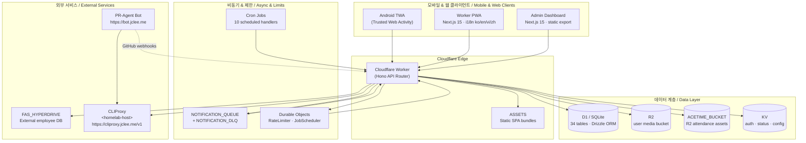

# SafetyWallet

> **건설 현장 안전 관리 플랫폼**
> **Construction Site Safety Management Platform**

[](#license)
[](https://nodejs.org)
[](https://www.typescriptlang.org)
[](https://nextjs.org)
[](https://workers.cloudflare.com)
[](https://developers.cloudflare.com/d1)
[](https://hono.dev)
[](https://orm.drizzle.team)
[](https://turbo.build)
[](https://vitest.dev)
[](https://playwright.dev)
[](#android-trusted-web-activity)
[](#internationalization)

---

## Table of Contents / 목차

- [Overview / 개요](#overview--개요)
- [Features / 주요 기능](#features--주요-기능)
- [Architecture / 아키텍처](#architecture--아키텍처)
- [Repository Structure / 저장소 구조](#repository-structure--저장소-구조)
- [Automation Inventory / 자동화 인벤토리](#automation-inventory--자동화-인벤토리)
- [Quick Start / 빠른 시작](#quick-start--빠른-시작)
- [Local Development / 로컬 개발](#local-development--로컬-개발)
- [Commands Reference / 명령어 레퍼런스](#commands-reference--명령어-레퍼런스)
- [Internationalization / 다국어](#internationalization--다국어)
- [Android Trusted Web Activity](#android-trusted-web-activity)
- [Contribution Guide / 기여 가이드](#contribution-guide--기여-가이드)
- [License / 라이선스](#license--라이선스)

---

## Overview / 개요

**SafetyWallet** is a field-first safety operations platform for construction sites.
현장 근로자는 모바일 PWA로 위험 요소를 신고하고, 출퇴근을 기록하며, 안전 포인트를 적립합니다.
**Field workers** use the mobile PWA to report hazards, log attendance, and earn safety points.
현장 관리자는 대시보드에서 제보 검토, 포인트 정산, 컴플라이언스를 관리합니다.
**Site administrators** manage hazard reviews, point settlements, and compliance from a single dashboard.

A single **Cloudflare Worker** serves the **Hono** API and two statically-exported **Next.js 15** frontends via hostname routing, backed by **Cloudflare D1** (SQLite), **R2**, **KV**, and **Durable Objects**.
단일 **Cloudflare Worker**가 호스트명 기반 라우팅으로 **Hono** API와 정적 export된 **Next.js 15** 프런트엔드 두 개를 동시에 제공하며, **D1**, **R2**, **KV**, **Durable Objects**로 구동됩니다.

The repository is a **Turborepo** monorepo with three apps and shared packages; all source-of-truth documentation lives in colocated `AGENTS.md` files (60+ across the codebase).
이 저장소는 **Turborepo** 모노레포로 세 개의 앱과 공유 패키지로 구성되며, 모든 진실의 원천 문서는 코드 옆에 배치된 `AGENTS.md`(코드베이스 전반에 60개 이상)에 있습니다.

---

## Features / 주요 기능

### For Field Workers / 현장 근로자용

- **Hazard Reporting / 위험 요소 신고** — Photo + video capture, geotag, category tagging.
  사진·영상 첨부, 위치 태깅, 카테고리 분류를 지원하는 위험 신고.
- **Attendance Logging / 출퇴근 기록** — GPS-validated check-in/out, shift tracking.
  GPS 기반 출퇴근 체크인/아웃 및 교대 기록.
- **Safety Points / 안전 포인트** — Earn points for verified safe behaviors and education completion.
  검증된 안전 행동과 교육 이수 시 포인트 적립.
- **Multilingual UI / 다국어 UI** — Korean, English, Vietnamese, Chinese (in-app runtime i18n).
  한국어·영어·베트남어·중국어(런타임 다국어) 지원.

### For Site Admins / 현장 관리자용

- **Review Workflow / 검토 워크플로** — Approve, reject, request more info on hazard reports.
  위험 제보에 대한 승인, 반려, 추가 정보 요청.
- **Point Settlement / 포인트 정산** — Audit trails, batch settlement, export to payroll.
  감사 로그, 일괄 정산, 급여 시스템 연동 export.
- **Compliance Dashboard / 컴플라이언스 대시보드** — Real-time safety KPIs and incident trends.
  실시간 안전 KPI와 사고 트렌드.
- **Role-based Access Control / 역할 기반 접근 제어** — Worker · Site Admin · Super Admin · System roles with site-scoped membership and field-level flags.
  Worker · Site Admin · Super Admin · System 역할, 현장 단위 멤버십, 필드 단위 플래그.

### For Platform Operators / 운영자용

- **GitHub-native Automation / GitHub 기반 자동화** — 14 GitHub Actions workflows covering CI, AI PR review, auto-merge, dependabot, release, and issue triage.
  14개 GitHub Actions 워크플로로 CI, AI PR 리뷰, 자동 머지, Dependabot, 릴리스, 이슈 분류를 자동화.
- **Reproducible Deploys / 재현 가능한 배포** — Deploy is Git-ref driven via CI on `master`; manual deploy is intentionally disabled.
  배포는 `master` 브랜치의 CI가 Git ref 기반으로 트리거하며, 수동 배포는 의도적으로 비활성화됨.
- **Observability / 관측성** — Structured logging, R2-backed media, KV-cached auth, queue-based notification delivery with DLQ.
  구조화 로깅, R2 미디어, KV 인증 캐시, DLQ 포함 큐 기반 알림 전송.

---

## Architecture / 아키키텍처



**Data plane / 데이터 평면:** All user traffic terminates at the Cloudflare Worker, which routes by hostname to either a static SPA bundle (`ASSETS`) or the Hono API. State is held in D1 (primary), R2 (blobs), KV (auth/status), and two Durable Objects (`RateLimiter`, `JobScheduler`).
모든 사용자 트래픽은 Cloudflare Worker에서 종료되며, 호스트명별로 정적 SPA 번들(`ASSETS`) 또는 Hono API로 라우팅됩니다. 상태는 D1(주 데이터), R2(블롭), KV(인증/상태), 두 개의 Durable Object(`RateLimiter`, `JobScheduler`)에 보관됩니다.

**Control plane / 제어 평면:** Ten scheduled cron jobs run via `JobScheduler` for settlement, retention, and reporting. Notifications are dispatched through `NOTIFICATION_QUEUE` with a paired dead-letter queue.
10개의 스케줄 크론 잡이 `JobScheduler`를 통해 정산·보관·리포팅을 실행합니다. 알림은 `NOTIFICATION_QUEUE`와 페어링된 DLQ로 전달됩니다.

**AI automation plane / AI 자동화 평면:** GitHub Actions dispatch PR review and bot auto-fix jobs to a self-hosted **PR-Agent** instance at `https://bot.jclee.me`, which calls the **CLIProxy** LLM gateway hosted on the homelab (`<homelab-host>`) and exposed at `https://cliproxy.jclee.me/v1`. This is the same endpoint the Worker uses for any internal LLM features.
GitHub Actions가 PR 리뷰와 봇 자동 수정 잡을 `https://bot.jclee.me`의 self-hosted **PR-Agent** 인스턴스로 디스패치하며, 해당 인스턴스는 홈랩(`<homelab-host>`)에서 호스팅되고 `https://cliproxy.jclee.me/v1`로 노출되는 **CLIProxy** LLM 게이트웨이를 호출합니다. Worker 내부 LLM 기능도 동일 엔드포인트를 사용합니다.

---

## Repository Structure / 저장소 구조

The repository is a **Turborepo** monorepo. The visible top-level layout (as shipped) is shown below; the full project structure (including `apps/api`, `apps/admin`, `packages/types`, `packages/ui`, `docs/`, `scripts/`, `e2e/`, `.github/workflows/`) is documented in the colocated [`AGENTS.md`](./AGENTS.md).
이 저장소는 **Turborepo** 모노레포입니다. 실제 최상위 레이아웃은 아래와 같으며, 전체 구조(`apps/api`, `apps/admin`, `packages/types`, `packages/ui`, `docs/`, `scripts/`, `e2e/`, `.github/workflows/` 포함)는 동봉된 [`AGENTS.md`](./AGENTS.md)에 문서화되어 있습니다.

```text
.
├── AGENTS.md                  # Project knowledge base (source of truth)
├── ARCHITECTURE.md            # Long-form architecture notes
├── CODE_STYLE.md              # Coding conventions
├── CONTRIBUTING.md            # Contribution guide
├── LICENSE                    # MIT
├── README.md                  # This file
├── package.json               # Root workspace + script catalog
├── package-lock.json
├── turbo.json                 # Turborepo pipeline (types → ui → apps)
├── wrangler.toml              # Root Cloudflare Worker config + bindings
├── vitest.config.ts           # Vitest configuration
├── playwright.config.ts       # Playwright E2E configuration (6 projects)
└── apps/
    └── worker/                # Next.js 15 worker PWA (static export, port 3000)
        ├── AGENTS.md
        ├── I18N_IMPLEMENTATION.md
        ├── next.config.mjs
        ├── postcss.config.cjs
        ├── tailwind.config.js
        ├── tsconfig.json
        ├── vitest.config.ts
        ├── android/           # Android TWA wrapper (Gradle, manifest, icons)
        │   ├── build.gradle
        │   ├── settings.gradle
        │   ├── twa-manifest.json
        │   ├── store_icon.png
        │   ├── app/           # Android app module
        │   └── gradle/
        └── src/
            └── app/           # App Router: login, posts, attendance, education
                ├── AGENTS.md
                ├── error.tsx
                ├── globals.css
                ├── layout.tsx
                └── page.tsx
```

Workspace packages declared in the root `package.json`: `apps/*` and `packages/*`.
루트 `package.json`에 선언된 워크스페이스 패키지: `apps/*`, `packages/*`.

---

## Automation Inventory / 자동화 인벤토리

This repository ships **14 GitHub Actions workflows** under `.github/workflows/`. Workflow filenames use a stable two-digit numeric prefix that defines execution ordering and ownership boundaries.
이 저장소는 `.github/workflows/` 아래 **14개의 GitHub Actions 워크플로**를 제공합니다. 파일명의 두 자리 숫자 접두사는 실행 순서와 소유 경계를 정의합니다.

### CI / CD (지속적 통합·배포)

| File / 파일 | Trigger / 트리거 | Purpose / 목적 |
| --- | --- | --- |
| `ci.yml` | push, pull_request | Lint → typecheck → guards → test → build → migrate 파이프라인. Pipeline: lint → typecheck → guards → test → build → migrate. |
| `01_branch-to-pr.yml` | branch push | 브랜치를 자동으로 PR로 승격. Promotes a pushed branch into a pull request. |
| `02_issue-to-branch.yml` | issue opened / labeled | 이슈를 작업 브랜치로 변환. Converts an issue into a working branch. |
| `15_merged-pr-cleanup.yml` | pull_request closed (merged) | 머지된 PR의 원격 브랜치 정리. Cleans up remote branches of merged PRs. |
| `24_release-notes.yml` | release published | 릴리스 노트 자동 생성. Generates release notes. |
| `25_release-publish.yml` | tag / manual | 빌드 산출물 배포 (`master` Git-ref driven). Publishes build artifacts (Git-ref driven from `master`). |
| `29_downstream-health-check.yml` | schedule, workflow_dispatch | 다운스트림 서비스 헬스 체크. Downstream service health checks. |

### AI PR Review & Auto-merge / AI PR 리뷰 및 자동 머지

| File / 파일 | Trigger / 트리거 | Purpose / 목적 |
| --- | --- | --- |
| `10_pr-review.yml` | pull_request | [PR-Agent](https://github.com/qodo-ai/pr-agent) 기반 AI PR 리뷰. AI PR review backed by [PR-Agent](https://github.com/qodo-ai/pr-agent), routed through `https://bot.jclee.me` → `https://cliproxy.jclee.me/v1`. |
| `11_security-pr-review.yml` | pull_request (security paths) | 보안 경로에 대한 특화 PR 리뷰. Specialized PR review for security-sensitive paths. |
| `12_dependabot-auto-merge.yml` | pull_request (Dependabot) | Dependabot PR에 대한 자동 머지. Auto-merge for Dependabot pull requests. |
| `13_pr-auto-merge.yml` | pull_request (labeled) | 라벨 기반 자동 머지 (예: `auto-merge`). Label-driven auto-merge (e.g. `auto-merge`). |
| `14_bot-auto-fix.yml` | pull_request review comments | 리뷰 코멘트 기반 봇 자동 수정 적용. Applies bot-driven fixes from review comments. |

### Issue Triage / 이슈 분류

| File / 파일 | Trigger / 트리거 | Purpose / 목적 |
| --- | --- | --- |
| `19_issue-backfill.yml` | schedule | 누락된 이슈 메타데이터 백필. Backfills missing issue metadata. |
| `37_ci-failure-issues.yml` | workflow_run (ci.yml) | CI 실패를 이슈로 자동 등록. Auto-files issues for CI failures. |

### Local Tooling / 로컬 도구

Beyond GitHub Actions, the repo includes Go and Node-based local tooling invoked from `package.json` scripts. These are run on developer machines and in CI, not as scheduled jobs.
GitHub Actions 외에, 저장소는 `package.json` 스크립트에서 호출되는 Go/Node 기반 로컬 도구를 포함합니다. 이는 개발자 머신과 CI에서 실행되며 스케줄 잡은 아닙니다.

| Script / 스크립트 | Language | Purpose / 목적 |
| --- | --- | --- |
| `scripts/verify.go` | Go | Pre-commit / pre-push 전체 검증. Full pre-commit / pre-push verification gate. |
| `scripts/git-preflight.go` | Go | 커밋 전 브랜치·상태 점검. Branch and state checks before commit. |
| `scripts/check-anti-patterns.go` | Go | lint-staged 단계에서 안티 패턴 차단. Blocks anti-patterns at the lint-staged step. |
| `scripts/check-wrangler-sync.js` | Node | `wrangler.toml` ↔ 소스 동기화 검증. `wrangler.toml` ↔ source sync verification. |
| `scripts/lint-naming.js` | Node | 명명 규칙 린트. Naming convention lint. |

---

## Quick Start / 빠른 시작

### Prerequisites / 사전 요구사항

- **Node.js** ≥ 20.0.0
- **npm** ≥ 10.8.2 (`packageManager` 필드로 고정)
- **Go** ≥ 1.22 (로컬 검증 도구용, for local verification tools)
- **Wrangler** (Cloudflare Workers CLI) — `npx wrangler`로 사용 가능
- **1Password CLI** (`op`) — E2E 테스트 시 secrets 주입용

### Install / 설치

```bash
git clone <repository-url>
cd safetywallet
npm install
npm run prepare    # husky 훅 설치 / install husky hooks
```

### First run / 첫 실행

```bash
npm run typecheck        # 타입 검증 / type-check the monorepo
npm run lint             # 린트 / run lint
npm test                 # 단위 테스트 / unit tests (Vitest)
npm run build            # 프로덕션 빌드 / production build
```

For local API emulation, run the API workspace with Wrangler:
로컬 API 에뮬레이션은 Wrangler로 API 워크스페이스를 실행합니다.

```bash
npx wrangler dev --config apps/api/wrangler.toml
```

---

## Local Development / 로컬 개발

### Workspace layout / 워크스페이스 레이아웃

| Workspace | Path | Port | Description |
| --- | --- | --- | --- |
| `apps/worker` | `apps/worker` | 3000 | Next.js 15 worker PWA, 정적 export, `worker.jclee.me` 호스트. |
| `apps/admin` | `apps/admin` | 3001 | Next.js 15 admin dashboard, 정적 export, `admin.jclee.me` 호스트. |
| `apps/api` | `apps/api` | — | Cloudflare Worker API (Hono + Drizzle + D1), 단일 진입점. |
| `packages/types` | `packages/types` | — | 공유 TS 타입, enum, DTO, i18n 번역 데이터. |
| `packages/ui` | `packages/ui` | — | 공유 shadcn/ui 컴포넌트 + Tailwind v4 테마 토큰. |

### Environment variables / 환경 변수

Secrets (D1 IDs, KV namespace IDs, R2 bucket names, JWT signing keys, FAS Hyperdrive ID, CLIProxy token) are injected via:

- **Local / 로컬:** `.dev.vars` (gitignored) for Wrangler; `.env.e2e` injected via `op run` for Playwright.
- **CI / CI:** Encrypted GitHub Actions secrets; see `.github/workflows/25_release-publish.yml` and `ci.yml`.

### Husky + lint-staged / Husky + lint-staged

`prepare` 훅이 `.husky/`에 git 훅을 설치합니다. 커밋 시 `*.{ts,tsx}` 파일에 대해 Go 안티패턴 검사 → Prettier 포맷이, 그 외 텍스트 파일에 대해 Prettier가 자동 실행됩니다.
The `prepare` hook installs git hooks in `.husky/`. On commit, `*.{ts,tsx}` files run the Go anti-pattern check then Prettier; other text files run Prettier.

### E2E / E2E 테스트

```bash
# .env.e2e를 1Password에서 주입한 뒤 Playwright 실행
op run --env-file=.env.e2e -- npx playwright test

# Headed 모드 / Headed
npm run e2e:headed

# UI 모드 / UI mode
npm run e2e:ui
```

Playwright config defines **6 projects** covering worker flows, admin flows, and the auth setup project.
Playwright 설정은 worker/admin 플로우와 인증 설정 프로젝트를 포함한 **6개 프로젝트**를 정의합니다.

### Database migrations / DB 마이그레이션

```bash
# Drizzle 스키마에서 마이그레이션 생성
# Generate migrations from Drizzle schema
npm run db:generate --workspace=apps/api

# 로컬 D1에 적용 (Wrangler)
# Apply to local D1 via Wrangler
npx wrangler d1 migrations apply DB --local --config apps/api/wrangler.toml
```

31 SQL migrations are checked in under `apps/api/migrations/` and applied automatically by `ci.yml` during the migrate stage.
31개의 SQL 마이그레이션이 `apps/api/migrations/` 아래에 체크인되어 있으며, `ci.yml`의 migrate 단계에서 자동 적용됩니다.

---

## Commands Reference / 명령어 레퍼런스

All commands are run from the repository root unless noted.
별도 표기 없는 한 모든 명령은 저장소 루트에서 실행합니다.

| Command | Description / 설명 |
| --- | --- |
| `npm run dev` | 모든 워크스페이스를 dev 모드로 실행. Runs all workspaces in dev mode. |
| `npm run build` | `turbo run build` 후 `build:static` 실행. Builds everything, then assembles the static `dist/` bundle (`worker/` + `admin/`). |
| `npm run build:api` | `packages/types` → `apps/api` 빌드. Builds the API workspace pipeline. |
| `npm run build:static` | `dist/`를 재조립: `apps/worker/out/*` → `dist/`, `apps/admin/out/*` → `dist/admin/`. Reassembles `dist/` from static exports. |
| `npm run build:one-worker` | API 단독 빌드 (alias for `build:api`). API-only build. |
| `npm run lint` | 모든 워크스페이스 린트. Runs lint across the monorepo via Turborepo. |
| `npm run lint:naming` | 명명 규칙 린트 (`scripts/lint-naming.js`). Naming convention lint. |
| `npm test` | Vitest 단위 테스트. Runs Vitest unit tests via Turborepo. |
| `npm run test:coverage` | 커버리지 포함 단위 테스트. Unit tests with coverage. |
| `npm run typecheck` | 모든 워크스페이스 `tsc --noEmit`. Type-checks all workspaces. |
| `npm run check:wrangler-sync` | `wrangler.toml` ↔ 소스 일관성 검증. Verifies `wrangler.toml` ↔ source consistency. |
| `npm run git:preflight` | 브랜치/상태 사전 점검 (Go). Branch and state preflight (Go). |
| `npm run verify` | 전체 사전 검증 게이트 (Go). Full pre-push verification gate (Go). |
| `npm run format` | Prettier로 전체 포맷. Formats the repo with Prettier. |
| `npm run format:check` | Prettier 체크 (수정 없음). Prettier check, no writes. |
| `npm run clean` | Turborepo 출력 + `node_modules` 정리. Cleans Turborepo outputs and `node_modules`. |
| `npm run db:generate` | Drizzle 마이그레이션 생성. Generates Drizzle migrations. |
| `npm run deploy:api` | **의도적으로 실패** — 수동 배포는 비활성화, CI만 배포. **Intentionally fails** — manual deploy is disabled; deploy is CI-only. |
| `npm run e2e` | Playwright E2E (1Password로 secrets 주입). Playwright E2E with 1Password secrets. |
| `npm run e2e:headed` | 헤디드 모드 E2E. Headed E2E. |
| `npm run e2e:ui` | Playwright UI 모드. Playwright UI mode. |

### Cloudflare bindings reference / Cloudflare 바인딩

| Binding | Type | Purpose / 용도 |
| --- | --- | --- |
| `DB` | D1 | Primary database (34 tables, Drizzle ORM). 주 데이터베이스. |
| `FAS_HYPERDRIVE` | Hyperdrive | External FAS employee DB connection. 외부 임직원 DB 연결. |
| `ASSETS` | Workers Static Assets | Static frontend bundles (worker + admin SPAs). 정적 프런트엔드 번들. |
| `R2` | R2 | User-uploaded images and videos. 사용자 업로드 미디어. |
| `ACETIME_BUCKET` | R2 | Attendance-related assets. 출퇴근 관련 자산. |
| `KV` | KV | Auth cache, system status, config. 인증 캐시, 시스템 상태, 설정. |
| `NOTIFICATION_QUEUE` / `NOTIFICATION_DLQ` | Queue | Notification delivery pipeline + dead-letter. 알림 전송 파이프라인 + DLQ. |
| `RATE_LIMITER` | Durable Object | Per-IP and per-user rate limiting. IP·사용자 단위 rate limit. |
| `JOB_SCHEDULER` | Durable Object | Cron job orchestration. 크론 잡 오케스트레이션. |

---

## Internationalization / 다국어

SafetyWallet ships an in-house runtime i18n (no third-party i18n library) supporting **Korean (default)**, **English**, **Vietnamese**, and **Chinese**. Translation data lives in `packages/types`; the worker PWA's implementation details are in [`apps/worker/I18N_IMPLEMENTATION.md`](./apps/worker/I18N_IMPLEMENTATION.md).
SafetyWallet은 외부 i18n 라이브러리 없이 자체 런타임 다국어를 제공하며, **한국어(기본)**, **영어**, **베트남어**, **중국어**를 지원합니다. 번역 데이터는 `packages/types`에, 워커 PWA의 구현 세부사항은 [`apps/worker/I18N_IMPLEMENTATION.md`](./apps/worker/I18N_IMPLEMENTATION.md)에 있습니다.

Adding a new locale:
새 로케일 추가:

1. Add locale code to the locale registry in `packages/types`.
   `packages/types`의 로케일 레지스트리에 코드 추가.
2. Provide translation keys in the matching JSON / TS file.
   동일한 JSON / TS 파일에 번역 키 추가.
3. Add the locale option to the in-app language switcher.
   앱 내 언어 전환 UI에 옵션 추가.

---

## Android Trusted Web Activity

`apps/worker/android/` is a **TWA (Trusted Web Activity)** wrapper that publishes the worker PWA to the Play Store as a native Android app. It uses [Bubblewrap](https://github.com/GoogleChromeLabs/bubblewrap)-compatible Gradle tooling and validates the Digital Asset Links via `assetlinks.json` published by the Worker.
`apps/worker/android/`는 워커 PWA를 네이티브 Android 앱으로 Play Store에 게시하기 위한 **TWA(Trusted Web Activity)** 래퍼입니다. [Bubblewrap](https://github.com/GoogleChromeLabs/bubblewrap) 호환 Gradle 도구를 사용하며, Worker가 게시하는 `assetlinks.json`을 통해 Digital Asset Links를 검증합니다.

Build / 빌드:

```bash
cd apps/worker/android
./gradlew :app:bundleRelease    # AAB for Play Store
./gradlew :app:assembleRelease  # APK
```

The trust between the TWA shell and the PWA origin is established by `twa-manifest.json` and `assetlinks.json`; both must stay in sync when changing the publishing domain.
TWA 셸과 PWA 오리진 간 신뢰는 `twa-manifest.json`과 `assetlinks.json`으로 설정되며, 게시 도메인 변경 시 두 파일을 함께 갱신해야 합니다.

---

## Contribution Guide / 기여 가이드

We welcome contributions. Please read the following before opening a pull request:
기여를 환영합니다. Pull Request를 열기 전에 다음 문서를 정독해 주세요.

1. **[`CONTRIBUTING.md`](./CONTRIBUTING.md)** — 브랜치 전략, PR 템플릿, 리뷰 SLA, 머지 정책.
   Branch strategy, PR template, review SLA, merge policy.
2. **[`CODE_STYLE.md`](./CODE_STYLE.md)** — TypeScript 스타일, 명명 규칙, 모듈 경계.
   TypeScript style, naming rules, module boundaries.
3. **[`ARCHITECTURE.md`](./ARCHITECTURE.md)** — 시스템 아키텍처, 데이터 흐름, 배포 토폴로지.
   System architecture, data flow, deployment topology.
4. **Colocated `AGENTS.md`** — 각 워크스페이스/모듈별 세부 규칙. PR을 열 영역의 `AGENTS.md`를 먼저 확인하세요.
   Per-workspace / per-module rules. Read the `AGENTS.md` colocated with the area you are touching first.

### PR flow / PR 흐름

```text
issue → branch → push → 01_branch-to-pr.yml
   → 10_pr-review.yml (AI review)
   → 11_security-pr-review.yml (security paths)
   → human review
   → 13_pr-auto-merge.yml (if labeled `auto-merge`)
   → 15_merged-pr-cleanup.yml
```

- Label a PR with `auto-merge` (and any required `status/*` checks) to opt in to automated merging.
  `auto-merge` 라벨(및 필요한 `status/*` 체크)을 지정하면 자동 머지에 옵트인됩니다.
- Dependabot PRs are auto-merged by `12_dependabot-auto-merge.yml` after CI passes.
  Dependabot PR은 CI 통과 후 `12_dependabot-auto-merge.yml`에 의해 자동 머지됩니다.
- The bot can apply review-driven fixes via `14_bot-auto-fix.yml` (e.g. for `qodo-ai/pr-agent` style suggestions routed through the CLIProxy gateway).
  봇은 `14_bot-auto-fix.yml`을 통해 리뷰 기반 수정(예: CLIProxy 게이트웨이를 경유한 `qodo-ai/pr-agent` 스타일 제안)을 적용할 수 있습니다.

### Commit signing / 커밋 서명

All commits should be GPG/SSH signed; unsigned commits will be rejected by `02_issue-to-branch.yml` and CI guards.
모든 커밋은 GPG/SSH 서명해야 하며, 미서명 커밋은 `02_issue-to-branch.yml`과 CI 가드에 의해 거부됩니다.

---

## License / 라이선스

This project is released under the **MIT License** — see [`LICENSE`](./LICENSE) for the full text.
이 프로젝트는 **MIT 라이선스** 하에 배포됩니다. 전문은 [`LICENSE`](./LICENSE)를 참조하세요.