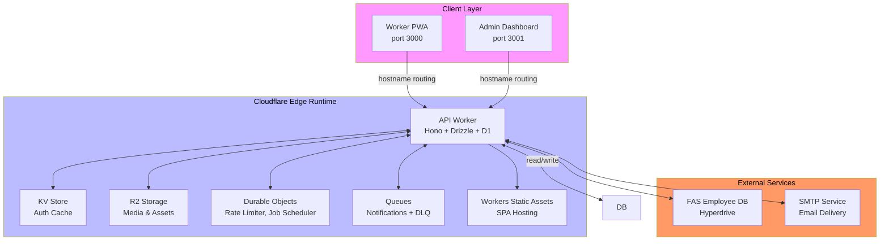

# SafetyWallet

> 건설 현장 안전 관리 플랫폼 / Construction Site Safety Management Platform

[](LICENSE)
[](https://nodejs.org/)
[](https://www.npmjs.com/)
[](https://www.typescriptlang.org/)
[](https://workers.cloudflare.com/)
[](https://turbo.build/)

---

## 목차 / Table of Contents

- [개요 / Overview](#개요--overview)
- [주요 기능 / Features](#주요-기능--features)
- [아키텍처 / Architecture](#아키텍처--architecture)
- [자동화 인벤토리 / Automation Inventory](#자동화-인벤토리--automation-inventory)
- [빠른 시작 / Quick Start](#빠른-시작--quick-start)
- [로컬 개발 / Local Development](#로컬-개발--local-development)
- [명령어 참조 / Commands Reference](#명령어-참조--commands-reference)
- [기여 가이드 / Contributing Guide](#기여-가이드--contributing-guide)
- [라이선스 / License](#라이선스--license)

---

## 개요 / Overview

SafetyWallet은 건설 현장의 안전 관리, 교육, 게시/투표, 리뷰, 포인트, 사용자/현장 관리 기능을 위한 TypeScript 기반 모노레포입니다.

SafetyWallet is a TypeScript-based monorepo for construction-site safety management, education, posts/votes, reviews, points, users, and site-management workflows.

이 저장소는 다음과 같은 구성요소를 포함합니다.

This repository contains the following main components:

| 구성 요소 / Component | 설명 / Description |
|---|---|
| `apps/api` | Cloudflare Workers 기반 API 애플리케이션 (Hono + Drizzle + D1) |
| `apps/admin` | Next.js 15 관리자 대시보드 (port 3001, 정적 내보내기) |
| `apps/worker` | Next.js 15 워커 PWA (port 3000, 정적 내보내기) |
| `packages/types` | 공유 API 타입, DTO, enum, 다국어(i18n) 리소스 |
| `packages/ui` | 공유 React UI 컴포넌트 (shadcn/ui + Tailwind v4) |

---

## 주요 기능 / Features

### 안전 관리 / Safety Management

- 위험 신고 및 현장 안전 점검
- 안전 포인트 부여 및 추적
- 안전 교육 이수 관리

### 교육 시스템 / Education System

- 교육 콘텐츠 생성 및 관리
- 퀴즈 및 답안지 기능
- 교육 이수율 추적

### 게시 및 투표 / Posts and Votes

- 현장별 게시판
- 익명 투표 시스템
- 공지사항 관리

### 리뷰 및 정산 / Reviews and Settlements

- 현장 리뷰 작성 및 관리
- 포인트 정산 시스템

### 사용자 관리 / User Management

- 역할 기반 접근 제어 (WORKER, SITE_ADMIN, SUPER_ADMIN, SYSTEM)
- 현장별 멤버십 관리
- 세|AUT| 필드 권한 (canAwardPoints, canReview, canExportData)

---

## 아키텍처 / Architecture



### 기술 스택 / Tech Stack

| 계층 / Layer | 기술 / Technology |
|---|---|
| API Framework | Hono + Cloudflare Workers |
| Database | Drizzle ORM + D1 (SQLite) |
| Frontend | Next.js 15 (App Router, Static Export) |
| UI Components | shadcn/ui + Tailwind CSS v4 |
| State Management | Zustand |
| i18n | Custom runtime (ko, en, vi, zh) |
| Monorepo | Turborepo + npm Workspaces |
| E2E Testing | Playwright |
| IaC | Wrangler (Cloudflare) |

---

## 자동화 인벤토리 / Automation Inventory

### GitHub Actions 워크플로우 / Workflows

#### Pull Request 워크플로우

| 워크플로우 파일 / Workflow File | 목적 / Purpose |
|---|---|
| `01_branch-to-pr.yml` | 브랜치에서 PR로 자동 전환 |
| `03_pr-checks.yml` | PR 체크리스트 실행 (lint, typecheck, test, build) |
| `04_actionlint.yml` | GitHub Actions YAML 문법 검증 |
| `05_gitleaks.yml` | 시크릿/민감정보 스캔 |
| `06_codeql.yml` | CodeQL 정적 분석 |
| `07_dependency-review.yml` | 의존성 보안 검토 |
| `08_scorecard.yml` | OpenSSF Scorecard 평가 |
| `09_semantic-pr.yml` | Semantic PR 제목 검증 |
| `10_pr-review.yml` | AI 기반 PR 리뷰 (qodo-ai/pr-agent) |
| `13_pr-auto-merge.yml` | 자동 병합 (LABEL 기반) |
| `14_bot-auto-fix.yml` | Bot 수정 사항 자동 적용 |
| `15_merged-pr-cleanup.yml` | 병합 후 브랜치 정리 |
| `44_reusable-pr-checks.yml` | 재사용 가능한 PR 체크 재정의 |
| `45_reusable-gitleaks.yml` | 재사용 가능한 Gitleaks 재정의 |
| `standard-ci.yml` | 표준 CI 파이프라인 |
| `ci.yml` | CI 워크플로우 |
| `auto-merge.yml` | 자동 병합 설정 |
| `labeler.yml` | PR 라벨 자동 분류 |
| `security/11_pr-review.yml` | 보안 강화 PR 리뷰 |

#### Release 및 Publish 워크플로우

| 워크플로우 파일 / Workflow File | 목적 / Purpose |
|---|---|
| `24_release-notes.yml` |.Release 노트 생성 |
| `25_release-publish.yml` |.Release 게시 및 배포 |

#### Issue 관리 워크플로우

| 워크플로우 파일 / Workflow File | 목적 / Purpose |
|---|---|
| `02_issue-to-branch.yml` | Issue에서 브랜치 자동 생성 |
| `18_issue-management.yml` | Issue 라이프사이클 관리 |
| `19_issue-backfill.yml` | Issue 데이터 백필 |
| `37_ci-failure-issues.yml` | CI 실패 시 Issue 자동 생성 |
| `43_reusable-issue-management.yml` | 재사용 가능한 Issue 관리 |
| `91_issue-classification.yml` | Issue 자동 분류 |
| `welcome.yml` |新人 기여자 환영 |

#### Downstream 및 Health Check 워크플로우

| 워크플로우 파일 / Workflow File | 목적 / Purpose |
|---|---|
| `29_downstream-health-check.yml` | Downstream 서비스 상태 확인 |

#### 자동화 문서 워크플로우

| 워크플로우 파일 / Workflow File | 목적 / Purpose |
|---|---|
| `20_readme-gen.yml` | README 자동 생성 (AI) |
| `21_docs-sync.yml` | 문서 동기화 |
| `42_reusable-docs-sync.yml` | 재사용 가능한 문서 동기화 |

#### Dependabot 워크플로우

| 워크플로우 파일 / Workflow File | 목적 / Purpose |
|---|---|
| `12_dependabot-auto-merge.yml` | Dependabot PR 자동 병합 |

#### CI 자동 복구 워크플로우

| 워크플로우 파일 / Workflow File | 목적 / Purpose |
|---|---|
| `60_ci-auto-heal.yml` | CI 실패 자동 복구 |

### 스크립트 도구 / Script Tools

#### Go 스크립트

| 스크립트 / Script | 목적 / Purpose |
|---|---|
| `scripts/verify.go` | 프로젝트 검증 |
| `scripts/git-preflight.go` | Git 프리플라이트 체크 |
| `scripts/check-anti-patterns.go` | 안티패턴 검사 |

#### JavaScript 스크립트

| 스크립트 / Script | 목적 / Purpose |
|---|---|
| `scripts/check-wrangler-sync.js` | Wrangler 설정 동기화 확인 |
| `scripts/lint-naming.js` | 네이밍 컨벤션 검사 |

#### npm 스크립트 (Hooks)

| 스크립트 / Script | 목적 / Purpose |
|---|---|
| `husky` (prepare) | Git hooks 설정 |

### AI 도구 / AI Tools

| 도구 / Tool | 용도 / Usage |
|---|---|
| [qodo-ai/pr-agent](https://qodo-ai/pr-agent) | AI 기반 PR 리뷰 및 자동 수정 |
| [CLIProxy API](https://cliproxy.jclee.me/v1) | README 생성 (`20_readme-gen.yml`) |

---

## 빠른 시작 / Quick Start

### 전제 조건 / Prerequisites

- Node.js >= 20.0.0
- npm 10.8.2
- Git
- [Wrangler](https://developers.cloudflare.com/workers/wrangler/install-and-update/) (Cloudflare CLI)
- 1Password CLI (`op`) (E2E 테스트용)

### 설치 / Installation

```bash
# 저장소 클론
git clone <repository-url>
cd safetywallet

# 의존성 설치
npm install

# Git hooks 설정
npm run prepare
```

### 환경 변수 / Environment Variables

```bash
# E2E 테스트 환경 파일
cp .env.example .env.e2e
# .env.e2e 파일을 편집하여 필요한 환경 변수 설정
```

### 개발 서버 실행 / Running Development Servers

```bash
# 모든 워크스페이스 개발 서버 실행
npm run dev

# 개별 앱만 실행
npm run dev --workspace=apps/api
npm run dev --workspace=apps/admin
npm run dev --workspace=apps/worker
```

---

## 로컬 개발 / Local Development

### 데이터베이스 마이그레이션 / Database Migration

```bash
# D1 마이그레이션 생성
npm run db:generate

# 마이그레이션 적용 (로컬 D1)
wrangler d1 migrations apply safetywallet-api --local
```

### 빌드 / Build

```bash
# 전체 빌드 (types → ui → apps)
npm run build

# API만 빌드
npm run build:api

# 정적 파일만 빌드
npm run build:static
```

### 테스트 / Testing

```bash
# 모든 테스트 실행
npm run test

# 커버리지 포함 테스트
npm run test:coverage

# E2E 테스트 실행
npm run e2e

# E2E UI 모드
npm run e2e:ui

# E2E 헤드리스 디버그 모드
npm run e2e:headed
```

### 코드 품질 / Code Quality

```bash
# lint 실행
npm run lint

# 타입 체크
npm run typecheck

# 포맷팅 확인
npm run format:check

# 포맷팅 적용
npm run format
```

### Wrangler 동기화 확인 / Wrangler Sync Check

```bash
npm run check:wrangler-sync
```

---

## 명령어 참조 / Commands Reference

### 빌드 명령어 / Build Commands

| 명령어 / Command | 설명 / Description |
|---|---|
| `npm run build` | 전체 빌드 (turbo + static) |
| `npm run build:api` | API 타입 및 앱 빌드 |
| `npm run build:static` | 정적 파일 빌드 (worker/admin out) |
| `npm run build:one-worker` | API 워크스페이스만 빌드 |

### 개발 명령어 / Development Commands

| 명령어 / Command | 설명 / Description |
|---|---|
| `npm run dev` | 모든 워크스페이스 개발 서버 |
| `npm run dev --workspace=apps/api` | API만 개발 |
| `npm run dev --workspace=apps/admin` | Admin만 개발 |
| `npm run dev --workspace=apps/worker` | Worker만 개발 |

### 테스트 명령어 / Test Commands

| 명령어 / Command | 설명 / Description |
|---|---|
| `npm run test` | 모든 테스트 실행 |
| `npm run test:coverage` | 커버리지 포함 테스트 |
| `npm run e2e` | Playwright E2E 테스트 |
| `npm run e2e:ui` | Playwright UI 모드 |
| `npm run e2e:headed` | Playwright 헤드리스 디버그 |

### 코드 품질 명령어 / Code Quality Commands

| 명령어 / Command | 설명 / Description |
|---|---|
| `npm run lint` | ESLint 실행 |
| `npm run lint:naming` | 네이밍 컨벤션 검사 |
| `npm run typecheck` | TypeScript 타입 체크 |
| `npm run format` | Prettier 포맷팅 적용 |
| `npm run format:check` | Prettier 포맷팅 확인 |
| `npm run check:wrangler-sync` | Wrangler 동기화 확인 |

### 데이터베이스 명령어 / Database Commands

| 명령어 / Command | 설명 / Description |
|---|---|
| `npm run db:generate` | Drizzle 마이그레이션 생성 |
| `npm run db:migrate` | 마이그레이션 적용 (CI) |

### 유틸리티 명령어 / Utility Commands

| 명령어 / Command | 설명 / Description |
|---|---|
| `npm run git:preflight` | Git 프리플라이트 체크 |
| `npm run verify` | 프로젝트 검증 |
| `npm run clean` | 빌드 아티팩트 및 node_modules 정리 |

### 배포 관련 / Deployment Commands

| 명령어 / Command | 설명 / Description |
|---|---|
| `npm run deploy:api` | **비활성화됨** - 수동 배포 거부 (CI에서 master로 자동 배포) |

---

## 저장소 구조 / Repository Structure

```
safetywallet/
├── apps/
│   ├── api/                  # Cloudflare Worker API
│   │   ├── src/
│   │   │   ├── routes/       # 18 API 라우트 모듈
│   │   │   ├── lib/          # Auth, helpers, FAS, R2
│   │   │   ├── middleware/   # CORS, logging, analytics
│   │   │   ├── db/           # Drizzle schema (34 테이블)
│   │   │   ├── durable-objects/  # RateLimiter, JobScheduler
│   │   │   ├── jobs/         # 10 스케줄링된 cron jobs
│   │   │   └── validators/   # Zod 스키마
│   │   ├── migrations/       # 31 D1 마이그레이션
│   │   └── *.config.ts
│   ├── admin/                # Next.js 15 Admin (port 3001)
│   │   └── src/app/         # App Router
│   └── worker/               # Next.js 15 PWA (port 3000)
│       └── src/
│           ├── app/         # App Router
│           ├── i18n/        # 다국어 (ko, en, vi, zh)
│           └── components/  # Worker 전용 컴포넌트
├── packages/
│   ├── types/               # 공유 타입, DTO, enum, i18n
│   │   └── src/
│   │       ├── dto/        # 15 DTO 모듈
│   │       ├── i18n/       # 번역 리소스
│   │       └── __tests__/
│   └── ui/                  # 공유 UI 컴포넌트
│       └── src/
│           ├── components/  # 15+ shadcn/ui 컴포넌트
│           ├── lib/         # 유틸리티
│           └── __tests__/
├── scripts/                 # Go/JS 도구
├── e2e/                     # Playwright E2E 테스트
├── docs/                    # PRD, 요구사항, OPS 가이드
├── wrangler.toml            # Cloudflare Workers 설정
├── turbo.json               # Turborepo 파이프라인
├── playwright.config.ts     # Playwright 설정 (6 프로젝트)
├── package.json             # 루트 패키지 설정
└── .github/
    └── workflows/           # 34 GitHub Actions 워크플로우
```

---

## 기여 가이드 / Contributing Guide

贡献指南详细内容请参阅 [CONTRIBUTING.md](./CONTRIBUTING.md)。

For detailed contribution guidelines, please refer to [CONTRIBUTING.md](./CONTRIBUTING.md).

### 공통 기여 규칙 / Common Contribution Rules

1. **브랜치 명명 규칙 / Branch Naming**
   - Feature: `feature/<issue-number>-<description>`
   - Bugfix: `fix/<issue-number>-<description>`
   - Hotfix: `hotfix/<issue-number>-<description>`

2. **커밋 메시지 / Commit Messages**
   - Conventional Commits 형식 사용
   - 예시: `feat(api): add new endpoint`, `fix(ui): resolve button style`

3. **PR 리뷰 요청 / Pull Request Reviews**
   - 최소 1명 이상의 리뷰어 승인 필요
   - 모든 CI 체크 통과 필요
   - `10_pr-review.yml` 워크플로우를 통한 AI 리뷰 활용 가능

4. **코드 스타일 / Code Style**
   - TypeScript Strict 모드
   - ESLint + Prettier 규칙 적용
   - 상세한 코드 스타일 가이드는 [CODE_STYLE.md](./CODE_STYLE.md) 참조

### AI 지원 개발 / AI-Assisted Development

- **PR 리뷰**: `10_pr-review.yml` 워크플로우가 qodo-ai/pr-agent를 사용하여 자동 리뷰 제공
- **README 생성**: `20_readme-gen.yml` 워크플로우가 CLIProxy API를 사용하여 문서 자동 생성
- **자동 수정**: `14_bot-auto-fix.yml` 워크플로우가 Bot 수정 사항 자동 적용

### 보안 취약점 보고 / Security Vulnerability Reporting

보안 취약점을 발견하셨다면, 공개 Issue 대신 보안 채널을 통해 보고해 주세요.

If you discover a security vulnerability, please report it through a private channel rather than a public issue.

---

## 라이선스 / License

이 프로젝트는 MIT 라이선스 하에 배포됩니다. 자세한 내용은 [LICENSE](./LICENSE) 파일을 참조하세요.

This project is distributed under the MIT License. See [LICENSE](./LICENSE) for more information.

---

**Built with / 제작:** SafetyWallet Team
