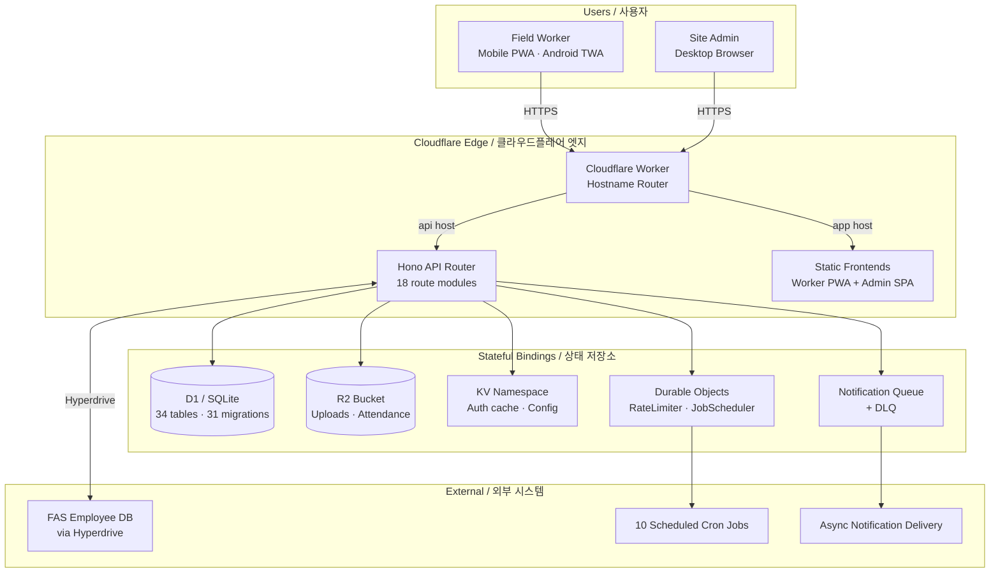

# SafetyWallet

> 건설 현장 안전 관리 플랫폼  
> Construction Site Safety Management Platform

## Badges / 배지

`License: MIT` · `Node.js: >=20.0.0` · `packageManager: npm@10.8.2` · `TypeScript 5.x` · `Next.js 15` · `Cloudflare Workers` · `D1 (SQLite)` · `Hono` · `Drizzle ORM` · `Turborepo` · `Vitest` · `Playwright` · `Trusted Web Activity (Android)` · `i18n: ko · en · vi · zh`

---

## Overview / 개요

SafetyWallet은(는) 건설 현장의 작업자와 관리자 모두를 위한 안전 관리 플랫폼입니다. 작업자는 모바일 PWA를 통해 위험 요소를 신고하고, 출석을 기록하며, 안전 교육과 포인트 기반 워크플로우에 참여합니다. 관리자는 전용 대시보드를 통해 현장 운영, 리뷰, 정산, 규정 준수 상태를 관리합니다.

SafetyWallet is a construction-site safety management platform built for both field workers and site administrators. Workers use a mobile PWA to report hazards, log attendance, participate in safety education, and interact with point-based workflows. Site admins manage reviews, settlements, and compliance workflows through a dedicated dashboard.

이 저장소는 npm workspaces와 Turborepo로 관리되는 TypeScript 모노레포이며, 단일 Cloudflare Worker가 Hono API와 두 개의 정적-export Next.js 프런트엔드(`worker`, `admin`)를 호스트네임 라우팅으로 동시에 서빙합니다.

This repository is a TypeScript-based monorepo managed with npm workspaces and Turborepo. A single Cloudflare Worker serves the Hono API and both statically-exported Next.js frontends via hostname routing.

### Workspaces / 워크스페이스

| Path | Role | Port / Output |
| --- | --- | --- |
| `apps/api` | Cloudflare Worker API (Hono + Drizzle + D1) | wrangler / Worker |
| `apps/admin` | Next.js 15 admin dashboard, static export | 3001 → `dist/admin/` |
| `apps/worker` | Next.js 15 worker PWA, static export + Android TWA | 3000 → `dist/` |
| `packages/types` | Shared TS types, enums, DTOs, i18n translation data | lib build |
| `packages/ui` | Shared shadcn/ui components + Tailwind v4 theme tokens | lib build |

> Snapshot only ships `apps/worker/` (and its `android/` TWA subtree) on disk. `apps/api/`, `apps/admin/`, `packages/types/`, `packages/ui/`, `docs/`, `scripts/`, `e2e/`, `.github/workflows/` are documented from `AGENTS.md` / `ARCHITECTURE.md`.

---

## Features / 주요 기능

### Product Features / 제품 기능

- **Mobile worker PWA / 모바일 작업자 PWA** — Hazard reporting, attendance logging, safety education, point-based engagement. Installable PWA bundled as an Android **Trusted Web Activity** for Play Store distribution.
- **Admin dashboard / 관리자 대시보드** — Attendance, posts, votes, education, settlements, compliance. Statically exported SPA, served by the same Worker.
- **Three-tier permissions / 3단 권한** — `WORKER` → `SITE_ADMIN` → `SUPER_ADMIN` → `SYSTEM` with site-specific membership and field-level flags (`canAwardPoints`, `canReview`, `canExportData`).
- **JWT auth with KST same-day expiry / KST 자정 만료 JWT** — Triple-layer validation: JWT decode → KST date check → KV cache lookup → D1 fallback.
- **Custom runtime i18n / 자체 i18n 런타임** — Korean, English, Vietnamese, Simplified Chinese.
- **R2 media + attendance assets / R2 미디어 + 출석 자산** — User-uploaded images/videos and attendance-related assets.
- **Notification pipeline with DLQ / 알림 파이프라인 + DLQ** — Cloudflare Queue + dead-letter queue, processed asynchronously.
- **Durable Object rate limiter & job scheduler / Durable Object 기반 제한·스케줄러** — `RateLimiter`, `JobScheduler` DOs host 10 cron jobs.

### Engineering Features / 엔지니어링 기능

- **Single Worker, hostname routing / 단일 Worker + 호스트네임 라우팅** — One deployment serves the API, the worker PWA, and the admin SPA.
- **Turborepo pipeline (types → ui → apps) / Turborepo 파이프라인** — Build order enforced; `npm run build` produces `dist/` with both frontends.
- **Strict TS, ESLint, Prettier, naming lint, anti-pattern check / 정적 분석 다층** — `lint`, `lint:naming`, `check:wrangler-sync`, `git:preflight`, `verify`.
- **Vitest unit + Playwright E2E (6 projects) / 단위·E2E 테스트** — `op run` secrets-injected E2E via `.env.e2e`.

---

## Architecture / 아키텍처



### Cloudflare Bindings / 클라우드플레어 바인딩

| Binding | Type | Purpose |
| --- | --- | --- |
| `DB` | D1 | Primary database — 34 tables, SQLite via Drizzle |
| `FAS_HYPERDRIVE` | Hyperdrive | External FAS employee database |
| `ASSETS` | Workers Static Assets | Static frontend files (worker + admin SPAs) |
| `R2` | R2 | User-uploaded images and videos |
| `ACETIME_BUCKET` | R2 | Attendance-related assets |
| `KV` | KV | Auth cache, system status, config |
| `NOTIFICATION_QUEUE` / `NOTIFICATION_DLQ` | Queue | Notification delivery pipeline |
| `RATE_LIMITER` | Durable Object | Per-key rate limiting |
| `JOB_SCHEDULER` | Durable Object | Cron-triggered background jobs |

### Auth Flow / 인증 흐름

```text
Login → JWT (KST same-day midnight expiry) → Zustand store
  → Triple-layer validation: decode → KST date check → KV cache → D1 fallback
  → 401 refresh mutex
```

### TWA (Trusted Web Activity) / TWA 래퍼

`apps/worker/android/` ships a Bubblewrap-style TWA wrapper (`Application.java`, `DelegationService.java`, `LauncherActivity.java`) that re-hosts the PWA inside a native Android shell for Play Store distribution. The `twa-manifest.json` and asset set live next to the Gradle project root.

---

## Repository Structure / 저장소 구조

```text
.
├── apps/
│   ├── api/                # Cloudflare Worker API (Hono + Drizzle + D1)
│   │   ├── src/routes/     # 18 API route modules (admin/ nested)
│   │   ├── src/lib/        # Auth, helpers, FAS integration, R2
│   │   ├── src/middleware/ # CORS, logging, analytics, security headers
│   │   ├── src/db/         # Drizzle schema (34 tables), seed, helpers
│   │   ├── src/durable-objects/ # RateLimiter, JobScheduler DOs
│   │   ├── src/jobs/       # 10 scheduled cron jobs
│   │   ├── src/validators/ # Zod request schemas
│   │   └── migrations/     # 31 D1 SQL migrations
│   ├── admin/              # Next.js 15 admin dashboard (port 3001, static export)
│   │   └── src/app/        # App Router: attendance, posts, votes, education
│   └── worker/             # Next.js 15 worker PWA (port 3000, static export)
│       ├── src/            # App Router: login, posts, attendance, education
│       ├── src/i18n/       # Custom i18n runtime (ko, en, vi, zh)
│       ├── src/components/ # Worker-specific UI components
│       └── android/        # Trusted Web Activity wrapper (TWA)
│           ├── app/        # Android app module
│           └── gradle/     # Gradle wrapper
├── packages/
│   ├── types/              # Shared TS types, enums, DTOs, i18n data
│   └── ui/                 # Shared shadcn/ui components + Tailwind v4 tokens
├── docs/                   # PRD, requirements specs, ops runbooks
├── scripts/                # Go/JS tooling (verify, naming lint, preflight)
├── e2e/                    # Playwright E2E tests (auth, admin, worker flows)
├── .github/workflows/      # 16 GitHub Actions workflows (see below)
├── AGENTS.md               # Project knowledge base (60 AGENTS.md files)
├── ARCHITECTURE.md         # Architecture documentation
├── CODE_STYLE.md           # Coding standards
├── CONTRIBUTING.md         # Contribution guidelines
├── LICENSE                 # MIT
├── package.json            # Root workspace manifest
├── playwright.config.ts    # 6 Playwright projects
├── turbo.json              # Turborepo pipeline
├── vitest.config.ts        # Vitest configuration
└── wrangler.toml           # Cloudflare Worker bindings
```

---

## Automation Inventory / 자동화 인벤토리

이 저장소는 **16개의 GitHub Actions 워크플로우**로 PR 라이프사이클, 이슈 분류, 릴리스, CI 자가 치유, 다운스트림 헬스 체크를 자동화합니다. Go 기반 자동화 도구는 의도적으로 **0개**이며, 모든 자동화 로직은 워크플로우 + `scripts/` 도구(naming lint, preflight, verify, anti-pattern check)로 표현됩니다.

This repository automates the full PR lifecycle, issue triage, release, CI self-healing, and downstream health via **16 GitHub Actions workflows**. Go-based automation tools are intentionally **zero** — every automation concern is expressed as a workflow or a `scripts/` tool.

### Workflows by Category / 카테고리별 워크플로우

#### 1. PR Core / PR 코어

| File | Purpose |
| --- | --- |
| `ci.yml` | Main CI: lint → typecheck → guards → test → build → migrate, runs on every PR. |
| `10_pr-review.yml` | AI PR review via [qodo-ai/pr-agent](https://github.com/qodo-ai/pr-agent). |
| `11_security-pr-review.yml` | Security-focused PR review (vulnerability + secret scan on the diff). |
| `12_dependabot-auto-merge.yml` | Auto-merge dependabot PRs that pass CI. |
| `13_pr-auto-merge.yml` | Auto-merge qualifying PRs (label-gated). |
| `14_bot-auto-fix.yml` | Bot applies common fixes (formatting, lint) to PRs. |
| `15_merged-pr-cleanup.yml` | Branch and stale label cleanup after merge. |

#### 2. Branch ↔ Issue / 브랜치 ↔ 이슈

| File | Purpose |
| --- | --- |
| `01_branch-to-pr.yml` | Convert a long-lived branch into a pull request. |
| `02_issue-to-branch.yml` | Auto-create a branch from a new issue. |
| `19_issue-backfill.yml` | Backfill missing labels/milestones on legacy issues. |
| `91_issue-classification.yml` | AI-based issue classification (area, severity, type). |

#### 3. CI Self-Heal / CI 자가 치유

| File | Purpose |
| --- | --- |
| `37_ci-failure-issues.yml` | Open a tracking issue when CI fails on `master`. |
| `60_ci-auto-heal.yml` | Auto-apply safe fixes for common CI failures. |

#### 4. Release / 릴리스

| File | Purpose |
| --- | --- |
| `24_release-notes.yml` | Generate release notes from merged PRs. |
| `25_release-publish.yml` | Publish the release (tag + assets). |

#### 5. Health / 헬스 체크

| File | Purpose |
| --- | --- |
| `29_downstream-health-check.yml` | Probe downstream services / API health on a schedule. |

### Automation Toolchain (Go) / 자동화 도구체인 (Go)

> **0 Go automation tools** — there are no `cmd/`-style Go executables. The `scripts/` directory contains **helper Go programs invoked via `go run`** (pre-commit / CI hooks only, not standalone CLIs):

- `scripts/verify.go` — invoked by `npm run verify` for a full release-readiness check.
- `scripts/git-preflight.go` — invoked by `npm run git:preflight` before push.
- `scripts/check-anti-patterns.go` — invoked by `lint-staged` for staged TS/TSX.

### npm Scripts as Automation Surface / 자동화 표면으로서의 npm 스크립트

`package.json` exposes the automation surface as composable npm scripts (see [Commands Reference](#commands-reference--명령어-레퍼런스)).

---

## CI/CD Pipeline Overview / CI/CD 파이프라인 개요

```text
PR opened
  └─ ci.yml            → lint · typecheck · guards · test · build · migrate
  └─ 10_pr-review.yml  → AI code review (qodo-ai/pr-agent)
  └─ 11_security-pr-review.yml → security diff scan
  └─ 12_dependabot-auto-merge.yml (Dependabot only) → auto-merge on green
  └─ 13_pr-auto-merge.yml → auto-merge on label
  └─ 14_bot-auto-fix.yml → bot applies safe fixes

On merge to master
  └─ 60_ci-auto-heal.yml → auto-fix CI fallout
  └─ 37_ci-failure-issues.yml → open issue on failure
  └─ 15_merged-pr-cleanup.yml → branch cleanup
  └─ 24_release-notes.yml → draft release notes
  └─ 25_release-publish.yml → publish release
  └─ 29_downstream-health-check.yml → smoke downstream

On issue opened
  └─ 02_issue-to-branch.yml → create branch
  └─ 91_issue-classification.yml → classify (area, severity)
  └─ 19_issue-backfill.yml → backfill labels on legacy issues
```

> Manual API deploys are disabled: `npm run deploy:api` exits non-zero. Deploys are Git-ref driven via CI on `master`.

---

## Quick Start / 빠른 시작

### Prerequisites / 사전 요구사항

- **Node.js** `>=20.0.0`
- **npm** `10.8.2` (matches `packageManager` in `package.json`)
- **Wrangler** for the Worker API (`npx wrangler`)
- **1Password CLI** (`op`) for E2E secret injection — optional unless running Playwright
- **Java/Gradle** (only for the TWA subtree under `apps/worker/android/`)

### Clone & Install / 클론 및 설치

```bash
git clone <repo-url> safetywallet
cd safetywallet
npm install
```

### Configure / 설정

```bash
# 1. Prepare 1Password env file (E2E only)
cp .env.e2e.example .env.e2e   # fill in values, or use `op` to inject at run time

# 2. Verify Cloudflare bindings stay in sync
npm run check:wrangler-sync

# 3. Pre-flight check (Go)
npm run git:preflight
```

### Run Dev / 개발 서버 실행

```bash
# All workspaces (Turborepo fan-out)
npm run dev

# Or a single workspace
npx turbo run dev --filter=@safetywallet/api
npx turbo run dev --filter=@safetywallet/admin
npx turbo run dev --filter=@safetywallet/worker
```

Default ports:

| App | Port |
| --- | --- |
| `apps/worker` | 3000 |
| `apps/admin` | 3001 |
| `apps/api` | served by `wrangler dev` |

---

## Local Development / 로컬 개발

### Build a Single Worker API / API 단독 빌드

```bash
npm run build:one-worker    # builds packages/types + apps/api only
```

### Full Static Build (Worker PWA + Admin SPA) / 정적 빌드

```bash
npm run build               # turbo build + static assemble
ls dist/                    # worker PWA
ls dist/admin/              # admin SPA
```

> `npm run build:static` removes `dist/`, then copies `apps/worker/out/*` → `dist/` and `apps/admin/out/*` → `dist/admin/`. The Cloudflare Worker then serves both via `ASSETS`.

### Database Migrations / DB 마이그레이션

```bash
# Generate Drizzle schema
npm run db:generate --workspace=apps/api

# Apply migrations (managed by CI on master)
npx wrangler d1 migrations apply DB --remote
```

### Unit & E2E Tests / 단위·E2E 테스트

```bash
# Unit (Vitest, all workspaces)
npm test
npm run test:coverage

# E2E (Playwright, 6 projects) — requires 1Password CLI
npm run e2e
npm run e2e:headed
npm run e2e:ui
```

### Code Quality / 코드 품질

```bash
npm run lint               # ESLint via Turbo
npm run lint:naming        # naming convention guard
npm run typecheck          # tsc --noEmit
npm run format             # Prettier write
npm run format:check       # Prettier check
npm run verify             # Go-based release-readiness check
```

### Pre-commit Hooks (Husky + lint-staged) / 커밋 훅

`npm install` triggers `prepare` → `husky`, which wires `lint-staged`:

- `*.{ts,tsx}` → `go run scripts/check-anti-patterns.go` + `prettier --write`
- `*.{js,jsx,json,md}` → `prettier --write`

---

## Commands Reference / 명령어 레퍼런스

All scripts are defined in the root `package.json` and fan out via Turborepo to each workspace.

| Command | Description |
| --- | --- |
| `npm run build` | `turbo run build` + assemble static `dist/` (worker PWA + admin SPA). |
| `npm run build:api` | Build `packages/types` then `apps/api` only. |
| `npm run build:static` | Re-pack `dist/` and `dist/admin/` from `apps/*/out/`. |
| `npm run build:one-worker` | Alias of `build:api` — API-only build. |
| `npm run dev` | `turbo run dev` across all workspaces. |
| `npm run deploy:api` | **Disabled** — exits non-zero. Deploys are CI-driven on `master`. |
| `npm run lint` | `turbo run lint` (ESLint). |
| `npm run lint:naming` | `node scripts/lint-naming.js` — naming-convention guard. |
| `npm test` | `turbo run test` (Vitest). |
| `npm run test:coverage` | Vitest with `--coverage`. |
| `npm run typecheck` | `turbo run typecheck` (tsc --noEmit). |
| `npm run check:wrangler-sync` | `node scripts/check-wrangler-sync.js` — keep `wrangler.toml` in sync. |
| `npm run git:preflight` | `go run scripts/git-preflight.go` — pre-push safety check. |
| `npm run verify` | `go run scripts/verify.go` — release-readiness verifier. |
| `npm run format` | Prettier write across `**/*.{ts,tsx,js,jsx,json,md}`. |
| `npm run format:check` | Prettier check (CI-friendly). |
| `npm run clean` | `turbo run clean` + remove `node_modules/`. |
| `npm run db:generate` | Generate Drizzle migrations in `apps/api`. |
| `npm run prepare` | `husky` install (auto-runs on `npm install`). |
| `npm run e2e` | Playwright E2E with 1Password-injected secrets. |
| `npm run e2e:headed` | Playwright E2E, headed. |
| `npm run e2e:ui` | Playwright E2E, interactive UI mode. |

---

## Contribution Guide / 기여 가이드

### Branching & PRs / 브랜치와 PR

1. **Issue first** — open or pick an issue. `02_issue-to-branch.yml` will create a matching branch automatically.
2. **Branch off `master`** — keep branches short-lived; `01_branch-to-pr.yml` converts stale branches into PRs.
3. **PR title** — Conventional Commits style (e.g. `feat(worker): add hazard photo upload`).
4. **CI must be green** — `ci.yml` runs lint → typecheck → guards → test → build → migrate.
5. **PR review** — `10_pr-review.yml` posts an AI review. Address comments or request re-run.
6. **Security review** — `11_security-pr-review.yml` flags secrets / vulnerable deps.
7. **Auto-merge** — label the PR (and pass CI) to be picked up by `13_pr-auto-merge.yml`. Dependabot PRs use `12_dependabot-auto-merge.yml`.
8. **Post-merge cleanup** — `15_merged-pr-cleanup.yml` removes the branch.

### Coding Standards / 코딩 표준

See `CODE_STYLE.md` for the canonical rules. Highlights:

- **TypeScript strict** — no `any` in shared code (`packages/types`).
- **Zod validators** — every API route validates request bodies via `apps/api/src/validators/`.
- **Naming** — enforced by `npm run lint:naming`.
- **Anti-pattern check** — `scripts/check-anti-patterns.go` runs on every staged TS/TSX.
- **Prettier** — `npm run format` before commit (also auto-runs in `lint-staged`).

### Commit Messages / 커밋 메시지

- Imperative mood, present tense (`Add …`, not `Added …`).
- Scope by workspace when useful: `feat(api): …`, `fix(worker-pwa): …`, `chore(ci): …`.
- Reference the issue: `(#123)`.

### Project Knowledge / 프로젝트 지식 베이스

- `AGENTS.md` (root) — Project knowledge base; 60 nested `AGENTS.md` files encode module-level context for AI agents and human contributors.
- `ARCHITECTURE.md` — Long-form architecture notes.
- `docs/` — PRD, requirements, ops runbooks.

### TWA (Android) / Android TWA

The TWA wrapper under `apps/worker/android/` is a Gradle project. Build it only when the worker PWA needs to ship via Play Store; CI does not build it on every PR.

```bash
cd apps/worker/android
./gradlew assembleRelease
```

---

## License / 라이선스

MIT — see [`LICENSE`](./LICENSE).