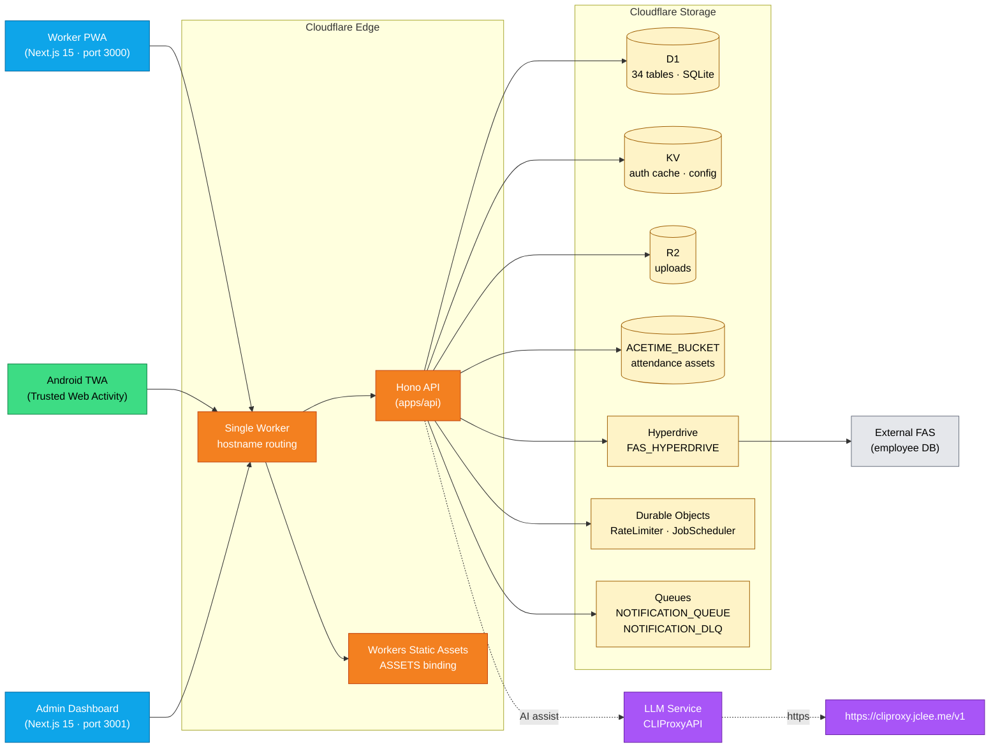
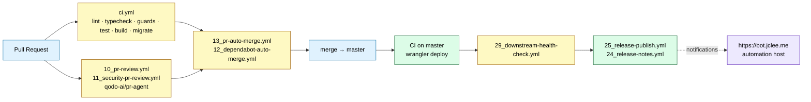

# SafetyWallet

> **건설 현장 안전 관리 플랫폼**  
> **Construction Site Safety Management Platform**

[](#license)
[](https://nodejs.org)
[](https://www.typescriptlang.org)
[](https://nextjs.org)
[](https://workers.cloudflare.com)
[](https://developers.cloudflare.com/d1)
[](https://hono.dev)
[](https://orm.drizzle.team)
[](https://turbo.build)
[](https://vitest.dev)
[](https://playwright.dev)
[](#android-trusted-web-activity)
[](#internationalization)

---

## Table of Contents / 목차

- [Overview / 개요](#overview--개요)
- [Features / 주요 기능](#features--주요-기능)
- [Architecture / 아키텍처](#architecture--아키텍처)
- [Repository Structure / 저장소 구조](#repository-structure--저장소-구조)
- [Automation Inventory / 자동화 인벤토리](#automation-inventory--자동화-인벤토리)
- [Quick Start / 빠른 시작](#quick-start--빠른-시작)
- [Local Development / 로컬 개발](#local-development--로컬-개발)
- [Commands Reference / 명령어 레퍼런스](#commands-reference--명령어-레퍼런스)
- [Internationalization / 다국어](#internationalization--다국어)
- [Android TWA / 안드로이드 TWA](#android-twa--안드로이드-twa)
- [CI/CD & Deploy / CI/CD 및 배포](#cicd--deploy--cicd-및-배포)
- [Contributing / 기여하기](#contributing--기여하기)
- [License / 라이선스](#license--라이선스)

---

## Overview / 개요

**SafetyWallet**은(는) 건설 현장의 **작업자(Worker)**와 **관리자(Admin)** 모두를 위한 안전 관리 플랫폼입니다. 작업자는 모바일 PWA(및 Android TWA)를 통해 위험 요소를 신고하고, 출석을 기록하며, 안전 교육을 이수하고 포인트 기반 워크플로우에 참여합니다. 관리자는 전용 대시보드에서 현장 운영·리뷰·정산·규정 준수 상태를 관리합니다.

**SafetyWallet** is a construction-site safety management platform for both field workers and site administrators. Workers use a mobile PWA to report hazards, log attendance, complete safety training, and participate in a points-based workflow. Site administrators manage field operations, reviews, settlements, and compliance from a dedicated dashboard.

A single **Cloudflare Worker** serves the Hono API plus two statically-exported **Next.js 15** frontends via hostname routing, backed by **D1 (SQLite via Drizzle)**, **R2**, **KV**, **Hyperdrive**, **Queues**, and **Durable Objects**.

---

## Features / 주요 기능

### Worker (Field) / 작업자
- 📋 **Hazard Reporting / 위험 요소 신고** — 사진·동영상 첨부, R2 업로드
- 🕒 **Attendance Logging / 출석 기록** — KST 자정 기준 일일 체크인
- 🎓 **Safety Education / 안전 교육** — 이수 처리 및 진도 추적
- 🪙 **Points & Wallet / 포인트 & 지갑** — 인센티브 정산 워크플로우
- 🌐 **Multilingual UI / 다국어 UI** — 한국어, 영어, 베트남어, 중국어

### Admin / 관리자
- 📊 **Operations Dashboard / 운영 대시보드** — 현장 단위 집계 및 KPI
- ✅ **Review Queue / 리뷰 큐** — 신고/출석/교육 승인 워크플로우
- 💰 **Settlement / 정산** — 포인트 정산 및 이력 추적
- 🛡️ **Compliance / 규정 준수** — 현장 멤버십, 권한 플래그, 감사 로그
- 📤 **Data Export / 데이터 내보내기** — CSV/XLSX 다운로드

### Platform / 플랫폼
- 🔐 **JWT + KV Auth / JWT + KV 인증** — KST 자정 만료, 3단 검증(JWT decode → KST date → KV → D1)
- 🧱 **Triple-layer RBAC / 3단 권한** — Role → Site Membership → Field-level flags
- ⚡ **Edge-native / 엣지 네이티브** — Cloudflare Workers, Zero cold start
- 🔄 **Offline-tolerant PWA / 오프라인 대응 PWA** — Service Worker 캐시
- 🤖 **AI PR Review / AI 코드 리뷰** — [qodo-ai/pr-agent](https://github.com/qodo-ai/pr-agent) 기반 자동 리뷰

---

## Architecture / 아키텍처



### Authentication Flow / 인증 흐름

1. **Login** → server issues JWT with **KST same-day midnight expiry**
2. Client stores JWT in **Zustand** persisted store (`safetywallet-auth` / `safetywallet-admin-auth`)
3. Request validation chain: **JWT decode → KST date check → KV cache lookup → D1 fallback**
4. Three-tier permissions: **Role** (`WORKER` / `SITE_ADMIN` / `SUPER_ADMIN` / `SYSTEM`) → **Site membership** → **Field-level flags** (`canAwardPoints`, `canReview`, `canExportData`)

### Cloudflare Bindings / Cloudflare 바인딩

| Binding | Type | Purpose / 용도 |
| --- | --- | --- |
| `DB` | D1 | Primary database (34 tables, SQLite via Drizzle) |
| `FAS_HYPERDRIVE` | Hyperdrive | External FAS employee database |
| `ASSETS` | Workers Static Assets | Static frontend files (worker + admin SPAs) |
| `R2` | R2 | User-uploaded images and videos |
| `ACETIME_BUCKET` | R2 | Attendance-related assets |
| `KV` | KV | Auth cache, system status, config |
| `NOTIFICATION_QUEUE` / `NOTIFICATION_DLQ` | Queue | Notification delivery pipeline |
| `RATE_LIMITER` | Durable Object | Per-IP / per-user rate limiting |
| `JOB_SCHEDULER` | Durable Object | Cron-triggered job orchestration |

---

## Repository Structure / 저장소 구조

```text
.
├── apps/
│   ├── api/                 # Cloudflare Worker API (Hono + Drizzle + D1)
│   ├── admin/               # Next.js 15 admin dashboard (port 3001, static export)
│   └── worker/              # Next.js 15 worker PWA (port 3000, static export)
│       └── android/         # Android TWA wrapper (gradle project)
├── packages/
│   ├── types/               # Shared TS types, enums, DTOs, i18n data
│   └── ui/                  # Shared shadcn/ui components + Tailwind v4 tokens
├── docs/                    # PRD, requirements specs, ops runbooks
├── scripts/                 # Go/JS tooling (verify, naming lint, anti-pattern checks)
├── e2e/                     # Playwright E2E tests (auth setup, admin, worker flows)
├── .github/workflows/       # 14 GitHub Actions workflows
├── wrangler.toml            # Root CF Worker config + all bindings
├── turbo.json               # Turborepo pipeline (types → ui → apps)
└── playwright.config.ts     # 6 Playwright projects
```

> **Note / 참고:** `_bot-scripts/` is **not** a real directory in this repo. It only ever appears as a transient CI checkout path and is never committed to the tree.

---

## Automation Inventory / 자동화 인벤토리

### GitHub Actions Workflows (14) / GitHub Actions 워크플로우

| File | Name | Purpose / 용도 |
| --- | --- | --- |
| `01_branch-to-pr.yml` | Branch → PR | Draft PR automation from feature branches |
| `02_issue-to-branch.yml` | Issue → Branch | Auto-create branch from issue label |
| `10_pr-review.yml` | PR Review | AI PR review via [qodo-ai/pr-agent](https://github.com/qodo-ai/pr-agent) |
| `11_security-pr-review.yml` | Security PR Review | Security-focused AI review (SAST hints) |
| `12_dependabot-auto-merge.yml` | Dependabot Auto-merge | Auto-merge patch/minor Dependabot PRs |
| `13_pr-auto-merge.yml` | PR Auto-merge | Auto-merge approved + CI-green PRs |
| `14_bot-auto-fix.yml` | Bot Auto-fix | Apply bot-suggested trivial fixes |
| `15_merged-pr-cleanup.yml` | Merged PR Cleanup | Delete merged feature branches |
| `19_issue-backfill.yml` | Issue Backfill | Backfill missing issue templates / labels |
| `24_release-notes.yml` | Release Notes | Generate release notes from merged PRs |
| `25_release-publish.yml` | Release Publish | Tag + publish GitHub Release |
| `29_downstream-health-check.yml` | Downstream Health Check | Probe post-deploy endpoints |
| `37_ci-failure-issues.yml` | CI Failure Issues | Auto-file issue on repeated CI failure |
| `ci.yml` | CI | Lint → typecheck → guards → test → build → migrate |

### Local Automation Scripts / 로컬 자동화 스크립트

| Script | Engine | Purpose / 용도 |
| --- | --- | --- |
| `scripts/verify.go` | Go | Whole-repo preflight (types, ui, apps build order) |
| `scripts/git-preflight.go` | Go | Branch / commit / push safety checks |
| `scripts/check-anti-patterns.go` | Go | Block forbidden imports / patterns in `*.ts` / `*.tsx` |
| `scripts/check-wrangler-sync.js` | Node | Validate `wrangler.toml` ↔ bindings consistency |
| `scripts/lint-naming.js` | Node | Enforce file & symbol naming conventions |

> Hooks are wired by `husky` (`prepare` script); staged files run `check-anti-patterns.go` + `prettier --write` on `*.{ts,tsx,js,jsx,json,md}`.

---

## Quick Start / 빠른 시작

### Prerequisites / 사전 요구사항

- **Node.js** ≥ 20.0.0
- **npm** ≥ 10.8.2 (matches `packageManager` field)
- **Go** ≥ 1.22 (for `scripts/*.go` tooling)
- **Wrangler** (Cloudflare) — installed transitively
- **1Password CLI (`op`)** — for E2E secret injection

### Install / 설치

```bash
git clone <repo-url> safetywallet
cd safetywallet
npm install
```

### First-time Setup / 최초 설정

```bash
# Run preflight verifier (types → ui → apps build order)
npm run verify

# Generate Drizzle client + run migrations locally
npm run db:generate

# Sanity check wrangler bindings vs code
npm run check:wrangler-sync
```

---

## Local Development / 로컬 개발

### Start the full stack / 전체 스택 실행

```bash
npm run dev
```

This boots the **Turborepo** pipeline:

- `packages/types` — emits shared TS types
- `packages/ui` — builds shared components
- `apps/worker` (Next.js 15, **port 3000**) — worker PWA
- `apps/admin` (Next.js 15, **port 3001**) — admin dashboard
- `apps/api` (Hono on Wrangler) — local Workers runtime

### Run a single app in isolation / 단일 앱 실행

```bash
npm run dev --workspace=apps/worker
npm run dev --workspace=apps/admin
npm run dev --workspace=apps/api
```

### Run E2E tests (Playwright) / E2E 테스트

```bash
# Headless (requires 1Password CLI + .env.e2e vault)
npm run e2e

# Headed (for debugging)
npm run e2e:headed

# Playwright UI mode
npm run e2e:ui
```

> **Note / 참고:** The `--env-file=.env.e2e` is loaded via `op run`, so secrets never touch disk.

---

## Commands Reference / 명령어 레퍼런스

| Command | Description / 설명 |
| --- | --- |
| `npm run build` | Full prod build + static export into `dist/` |
| `npm run build:api` | Build `packages/types` + `apps/api` only |
| `npm run build:one-worker` | Alias for `build:api` |
| `npm run build:static` | Bundle static frontends into `dist/{,admin/}` |
| `npm run dev` | Boot all workspaces via Turborepo |
| `npm run lint` | Lint all workspaces |
| `npm run lint:naming` | Run naming convention linter |
| `npm run typecheck` | TypeScript type-check all workspaces |
| `npm run test` | Run Vitest across workspaces |
| `npm run test:coverage` | Vitest with coverage |
| `npm run format` | Prettier write across `*.{ts,tsx,js,jsx,json,md}` |
| `npm run format:check` | Prettier check (CI mode) |
| `npm run check:wrangler-sync` | Validate `wrangler.toml` ↔ code bindings |
| `npm run git:preflight` | Go-based branch / commit / push checks |
| `npm run verify` | Full repo preflight (Go) |
| `npm run db:generate` | Generate Drizzle client (`apps/api`) |
| `npm run e2e` / `e2e:headed` / `e2e:ui` | Playwright variants |
| `npm run clean` | Turbo clean + remove `node_modules` |

> **Manual deploy is intentionally disabled.** Deploys are Git-ref driven via CI on `master`:
> `npm run deploy:api` exits non-zero by design.

---

## Internationalization / 다국어

SafetyWallet ships a **custom i18n runtime** (not `next-intl` / `react-i18next`) implemented in `apps/worker/src/i18n/`. Translations live in `packages/types` and cover four locales:

| Locale | Code | Status |
| --- | --- | --- |
| 한국어 | `ko` | Default / 기본 |
| English | `en` | ✅ |
| Tiếng Việt | `vi` | ✅ |
| 中文 | `zh` | ✅ |

Locale detection chain: **`URL` → `Accept-Language` → cookie → default `ko`**. See `apps/worker/I18N_IMPLEMENTATION.md` for the full runtime contract.

---

## Android TWA / 안드로이드 TWA

The Android wrapper under `apps/worker/android/` packages the worker PWA as a **Trusted Web Activity**:

- `twa-manifest.json` — declares the PWA origin & scope
- `manifest-checksum.txt` — asset integrity for Digital Asset Links
- `app/src/main/java/me/jclee/safetywallet/twa/`
  - `Application.java` — Bubblewrap application class
  - `LauncherActivity.java` — launcher + splash
  - `DelegationService.java` — TWA → Web delegation
- App shortcuts defined in `res/xml/shortcuts.xml`
- Notification icon + splash across `mipmap-*` and `drawable-*` densities

Build & install (requires Android SDK + JDK 17):

```bash
cd apps/worker/android
./gradlew assembleDebug          # APK
./gradlew installDebug           # install to attached device
```

---

## CI/CD & Deploy / CI/CD 및 배포



### Branch protection expectations / 브랜치 보호 기대치

- ✅ `ci.yml` must pass
- ✅ `10_pr-review.yml` (or `11_security-pr-review.yml`) must post at least one review
- ✅ Required reviewers per CODEOWNERS
- ✅ Linear history (squash or rebase)

---

## Contributing / 기여하기

Please read the contributor docs **before** opening a PR:

- 📘 [CONTRIBUTING.md](./CONTRIBUTING.md) — branch / commit / PR conventions
- 🏛️ [ARCHITECTURE.md](./ARCHITECTURE.md) — module boundaries, layering rules
- 🎨 [CODE_STYLE.md](./CODE_STYLE.md) — TypeScript + formatting rules
- 🤖 [AGENTS.md](./AGENTS.md) — project knowledge base (60 sub-AGENTS.md files)

### Conventional workflow / 표준 워크플로

1. Create an issue (or pick an existing one).
2. `02_issue-to-branch.yml` auto-opens a branch (or create one: `feat/<scope>-<short-desc>`).
3. Push commits — `scripts/git-preflight.go` validates branch & commit format.
4. Open a PR — `10_pr-review.yml` posts AI review via [qodo-ai/pr-agent](https://github.com/qodo-ai/pr-agent).
5. Iterate until CI is green and reviewers approve.
6. `13_pr-auto-merge.yml` squashes & merges automatically.
7. `15_merged-pr-cleanup.yml` removes the feature branch.

### Commit format / 커밋 형식

```
<type>(<scope>): <subject>  # ko|en
```

Common types: `feat`, `fix`, `refactor`, `docs`, `test`, `chore`, `perf`, `build`, `ci`.

---

## License / 라이선스

Released under the **MIT License**. See [LICENSE](./LICENSE) for the full text.

---

### Links / 관련 링크

- 🤖 AI PR reviews — [qodo-ai/pr-agent](https://github.com/qodo-ai/pr-agent)
- 🌐 LLM proxy endpoint — <https://cliproxy.jclee.me/v1>
- 🛠️ Automation host — <https://bot.jclee.me>
- 📦 Monorepo — [Turborepo](https://turbo.build) · [Next.js 15](https://nextjs.org) · [Hono](https://hono.dev) · [Drizzle](https://orm.drizzle.team)