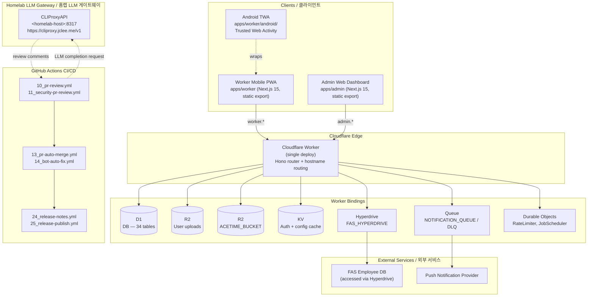

# SafetyWallet

> 건설 현장 안전 관리 플랫폼  
> Construction Site Safety Management Platform

## Badges / 배지

`License: MIT` · `Node.js: >=20.0.0` · `npm: 10.8.2` · `TypeScript` · `Next.js 15` · `Cloudflare Workers` · `D1 (SQLite)` · `Hono` · `Drizzle ORM` · `Turborepo` · `Vitest` · `Playwright` · `Trusted Web Activity (Android)`

## Overview / 개요

SafetyWallet은 건설 현장의 작업자와 관리자 모두를 위한 안전 관리 플랫폼입니다. 작업자는 모바일 PWA를 통해 위험 요소를 신고하고, 출석을 기록하며, 안전 교육 및 포인트 기반 워크플로우에 참여할 수 있습니다. 관리자는 전용 대시보드를 통해 현장 운영, 리뷰, 정산, 규정 준수 상태를 관리합니다.

SafetyWallet is a construction-site safety management platform built for both field workers and site administrators. Workers use a mobile PWA to report hazards, log attendance, participate in safety education, and interact with point-based workflows. Site admins manage reviews, settlements, and compliance workflows through a dedicated dashboard.

이 저장소는 npm workspaces와 Turborepo로 관리되는 TypeScript 모노레포이며, 단일 Cloudflare Worker가 Hono API와 두 개의 정적-export Next.js 프런트엔드를 호스트네임 라우팅으로 동시에 서빙합니다.

This repository is a TypeScript-based monorepo managed with npm workspaces and Turborepo. A single Cloudflare Worker serves the Hono API and both statically-exported Next.js frontends via hostname routing.

### Workspaces / 워크스페이스

| Path | Role |
| --- | --- |
| `apps/api` | Cloudflare Worker API (Hono + Drizzle + D1) |
| `apps/admin` | Next.js 15 admin dashboard, static export (port 3001) |
| `apps/worker` | Next.js 15 worker PWA, static export (port 3000) + Android TWA |
| `packages/types` | Shared TS types, enums, DTOs, i18n translation data |
| `packages/ui` | Shared shadcn/ui components + Tailwind v4 theme tokens |

> Provided snapshot ships `apps/worker` (and its `android/` TWA subtree) on disk; the rest of the layout is documented from `AGENTS.md` / `ARCHITECTURE.md`.

## Features / 주요 기능

### Product Features / 제품 기능

- **Mobile worker PWA / 모바일 작업자 PWA** — Hazard reporting, attendance logging, safety education, point-based engagement.
- **Admin dashboard / 관리자 대시보드** — Attendance review, posts, votes, education management, settlements, and compliance oversight.
- **Android TWA / 안드로이드 TWA** — `apps/worker/android/` wraps the worker PWA as an installable Trusted Web Activity for low-friction field deployment.
- **Multi-locale i18n / 다국어 지원** — Custom i18n runtime covering `ko`, `en`, `vi`, `zh` (translation data lives in `packages/types`).

### Platform Features / 플랫폼 기능

- **Single-Worker deploy / 단일 Worker 배포** — One Cloudflare Worker routes by hostname: `worker.*` → worker SPA, `admin.*` → admin SPA, `api.*` (or path prefix) → Hono API.
- **D1 + Drizzle ORM** — 34 SQLite tables managed by Drizzle, with 31 SQL migrations and codegen-driven types.
- **Triple-layer auth / 3중 인증 검증** — JWT decode → KST same-day midnight expiry check → KV cache lookup → D1 fallback. Tokens are stored in a Zustand persisted store with a 401 refresh mutex.
- **Three-tier authorization / 3단계 인가** — Role (`WORKER`, `SITE_ADMIN`, `SUPER_ADMIN`, `SYSTEM`) → site-specific membership → field-level flags (`canAwardPoints`, `canReview`, `canExportData`).
- **Durable Objects + Cron jobs / Durable Objects + Cron 작업** — `RateLimiter` and `JobScheduler` DOs coordinate 10 scheduled cron jobs (attendance rollup, point expiry, notifications, etc.).
- **Async notification pipeline / 비동기 알림 파이프라인** — `NOTIFICATION_QUEUE` with `NOTIFICATION_DLQ` for reliable push delivery.
- **End-to-end test matrix / E2E 테스트 매트릭스** — 6 Playwright projects covering auth setup, admin flows, and worker flows, gated on `1Password CLI` secrets.

## Architecture / 아키텍처

### High-level request flow / 요청 흐름



### Cloudflare Bindings / Cloudflare 바인딩

| Binding | Type | Purpose / 용도 |
| --- | --- | --- |
| `DB` | D1 | Primary database — 34 tables, SQLite via Drizzle |
| `FAS_HYPERDRIVE` | Hyperdrive | Connection pool to the external FAS employee database |
| `ASSETS` | Workers Static Assets | Served static frontend files (worker + admin SPAs) |
| `R2` | R2 | User-uploaded images and videos |
| `ACETIME_BUCKET` | R2 | Attendance-related assets (signatures, photos) |
| `KV` | KV | Auth cache, system status, runtime config |
| `NOTIFICATION_QUEUE` / `NOTIFICATION_DLQ` | Queue | Async notification delivery with dead-letter handling |
| `RATE_LIMITER` | Durable Object | Per-IP / per-user rate limiting |
| `JOB_SCHEDULER` | Durable Object | Coordinates 10 scheduled cron jobs |

### Authentication & Authorization / 인증 및 인가

- **Login → JWT** — JWT is issued with KST same-day midnight expiry and stored in a Zustand persisted store. Worker key: `safetywallet-auth`; admin key: `safetywallet-admin-auth`.
- **Triple-layer validation / 3중 검증** — JWT decode → KST date check → KV cache lookup → D1 fallback.
- **Three-tier authorization / 3단계 인가** — Role-based gate → site-specific membership → field-level flags (`canAwardPoints`, `canReview`, `canExportData`).
- **Repo guidance / 저장소 가이드** — Per-module conventions are documented in 60 `AGENTS.md` files distributed across the codebase. Start at the root `AGENTS.md` and follow `AGENTS.md` links down into each app.

## Automation Inventory / 자동화 인벤토리

### GitHub Actions Workflows / GitHub Actions 워크플로우 (16)

| File | Trigger / 트리거 | Purpose / 목적 |
| --- | --- | --- |
| `ci.yml` | push, PR | Main CI pipeline — lint → typecheck → guards → test → build → migrate |
| `01_branch-to-pr.yml` | push to non-default branch | Convert a pushed branch into a draft pull request |
| `02_issue-to-branch.yml` | labeled issue | Auto-create a branch + draft PR from an issue template |
| `10_pr-review.yml` | PR open/sync | LLM-based PR review using `qodo-ai/pr-agent` against the homelab CLIProxyAPI endpoint |
| `11_security-pr-review.yml` | PR open/sync | Security-focused PR review pass (SAST-style diff analysis) |
| `12_dependabot-auto-merge.yml` | Dependabot PR | Auto-merge patch/minor Dependabot PRs after CI passes |
| `13_pr-auto-merge.yml` | PR labeled `auto-merge` | Auto-merge approved PRs that satisfy all required checks |
| `14_bot-auto-fix.yml` | bot review comment | Apply bot-suggested fixes in a follow-up commit on the same branch |
| `15_merged-pr-cleanup.yml` | PR closed/merged | Delete the source branch and any stale remote refs |
| `19_issue-backfill.yml` | schedule / manual | Backfill missing fields on legacy issues (labels, milestones, projects) |
| `24_release-notes.yml` | tag push | Generate categorized release notes from PRs / commits |
| `25_release-publish.yml` | tag push | Build, publish, and attach release artifacts (Worker + SPAs) |
| `29_downstream-health-check.yml` | schedule | Smoke-test downstream services (FAS via Hyperdrive, push provider) |
| `37_ci-failure-issues.yml` | CI workflow failure | Open a triage issue when a required CI workflow fails on `master` |
| `60_ci-auto-heal.yml` | CI workflow failure | Attempt deterministic auto-heal actions (cache purge, retry, lock reset) |
| `91_issue-classification.yml` | new/edited issue | Classify incoming issues (label + project + assignee suggestion) |

### Internal Tooling / 내부 도구

These are developer-facing scripts invoked via `npm` (or directly). They are not standalone GitHub-Action tools; they run in CI, in `lint-staged`, and locally.

| Tool | Type | Purpose / 용도 |
| --- | --- | --- |
| `scripts/verify.go` | Go | `npm run verify` — full pre-push gate (lint, typecheck, naming, wrangler sync, tests) |
| `scripts/git-preflight.go` | Go | `npm run git:preflight` — branch / commit-message / WIP guard before push |
| `scripts/check-anti-patterns.go` | Go | `lint-staged` hook — blocks anti-patterns in staged `*.{ts,tsx}` |
| `scripts/lint-naming.js` | Node | `npm run lint:naming` — enforces file/folder naming conventions |
| `scripts/check-wrangler-sync.js` | Node | `npm run check:wrangler-sync` — verifies root `wrangler.toml` matches workspace configs |
| `husky` pre-commit | Hook | Runs `lint-staged` (Go anti-pattern check + Prettier) on staged files |
| `playwright.config.ts` | Config | 6 Playwright projects driving `npm run e2e` (secrets via 1Password CLI) |

> External LLM gateway used by `10_pr-review.yml` and `11_security-pr-review.yml`: the homelab **CLIProxyAPI** at `https://cliproxy.jclee.me/v1` (reachable on the LAN as `&lt;homelab-host&gt;:8317`). Review actions are posted by `qodo-ai/pr-agent`.

## Quick Start / 빠른 시작

### Prerequisites / 사전 요구 사항

- Node.js `>=20.0.0` (see `engines` in `package.json`)
- npm `10.8.2` (pinned via `packageManager`)
- Wrangler CLI authenticated against your Cloudflare account
- A populated `.dev.vars` for local Worker secrets
- 1Password CLI (`op`) signed in, for E2E secrets (`E2E_*`)

### Install / 설치

```bash
npm install
cp .dev.vars.example .dev.vars   # then fill in D1, R2, KV, JWT secret, etc.
```

### First build / 첫 빌드

```bash
npm run build                # turbo build + assemble dist/
npm run db:generate          # Drizzle codegen for types
```

### Run the dev loop / 개발 서버 실행

```bash
npm run dev                  # turbo-pipelined dev: api (wrangler) + admin (3001) + worker (3000)
```

Open:

- Worker PWA: <http://localhost:3000>
- Admin dashboard: <http://localhost:3001>
- Worker API: <http://localhost:8787> (Wrangler default)

## Local Development / 로컬 개발

### Workspace layout / 워크스페이스 구조

```text
.
├── apps/
│   ├── api/                 # Cloudflare Worker API (Hono + Drizzle + D1)
│   │   ├── src/routes/      # 18 API route modules (admin/ nested)
│   │   ├── src/lib/         # Auth, helpers, FAS integration, R2
│   │   ├── src/middleware/  # CORS, logging, analytics, security headers
│   │   ├── src/db/          # Drizzle schema (34 tables), seed, helpers
│   │   ├── src/durable-objects/ # RateLimiter, JobScheduler DOs
│   │   ├── src/jobs/        # 10 scheduled cron jobs
│   │   ├── src/validators/  # Zod request schemas
│   │   └── migrations/      # 31 D1 SQL migrations
│   ├── admin/               # Next.js 15 admin dashboard (port 3001, static export)
│   │   └── src/app/         # App Router: attendance, posts, votes, education
│   └── worker/              # Next.js 15 worker PWA (port 3000, static export)
│       ├── android/         # Trusted Web Activity wrapper for Android
│       ├── src/app/         # App Router: login, posts, attendance, education
│       ├── src/i18n/        # Custom i18n runtime (ko, en, vi, zh)
│       └── src/components/  # Worker-specific UI components
├── packages/
│   ├── types/               # Shared TS types, enums, DTOs, i18n data
│   └── ui/                  # Shared shadcn/ui + Tailwind v4 theme tokens
├── docs/                    # PRD, requirements specs, ops runbooks
├── scripts/                 # Go/JS tooling (verify, naming, anti-patterns, wrangler sync)
├── e2e/                     # Playwright E2E tests (auth setup, admin, worker flows)
├── .github/workflows/       # 16 CI/CD workflows (see Automation Inventory)
├── wrangler.toml            # Root CF Worker config + all bindings
├── turbo.json               # Turborepo pipeline (types → ui → apps)
└── playwright.config.ts     # 6 Playwright projects
```

### Pre-commit / Pre-push hooks / 훅

- **Husky pre-commit** runs `lint-staged`:
  - `*.{ts,tsx}` → `go run scripts/check-anti-patterns.go` + `prettier --write`
  - `*.{js,jsx,json,md}` → `prettier --write`
- **`npm run git:preflight`** — run before push; rejects WIP commits and enforces branch naming.
- **`npm run verify`** — full gate (lint, typecheck, naming, wrangler sync, tests); run before opening a PR.

### Database / 데이터베이스

```bash
npm run db:generate          # Drizzle codegen after schema edits
npx wrangler d1 migrations apply DB --local   # apply locally
npx wrangler d1 migrations apply DB --remote  # apply to production
```

## Commands Reference / 명령어 레퍼런스

| Command | Scope | Description |
| --- | --- | --- |
| `npm run dev` | root | Start all workspaces (api/admin/worker) via Turborepo |
| `npm run build` | root | Full production build (`turbo run build`) + assemble `dist/` |
| `npm run build:api` | root | Build `packages/types` + `apps/api` only |
| `npm run build:static` | root | Assemble static-export SPAs into `dist/` and `dist/admin/` |
| `npm run build:one-worker` | root | Alias for `build:api` (deploy only the Worker) |
| `npm run deploy:api` | root | **Disabled by design.** Manual deploys are rejected; deploys are Git-ref driven via CI on `master`. |
| `npm run lint` | root | Run lint across all workspaces |
| `npm run lint:naming` | root | Enforce file/folder naming conventions (`scripts/lint-naming.js`) |
| `npm run typecheck` | root | TypeScript type-check across all workspaces |
| `npm run test` | root | Run unit tests across all workspaces |
| `npm run test:coverage` | root | Run unit tests with coverage |
| `npm run e2e` | root | Playwright E2E (secrets injected via 1Password CLI) |
| `npm run e2e:headed` | root | Playwright in headed mode |
| `npm run e2e:ui` | root | Playwright in UI mode |
| `npm run format` | root | Prettier write across `**/*.{ts,tsx,js,jsx,json,md}` |
| `npm run format:check` | root | Prettier check (CI-safe) |
| `npm run check:wrangler-sync` | root | Verify root `wrangler.toml` is in sync with workspace configs |
| `npm run git:preflight` | root | Branch / WIP / commit-message guard (Go) |
| `npm run verify` | root | Full pre-push gate (Go) |
| `npm run clean` | root | Clean Turbo outputs and `node_modules` |
| `npm run db:generate` | `apps/api` | Drizzle codegen |

## Contributing / 기여 가이드

### Workflow / 작업 흐름

1. Pick or open an issue. `02_issue-to-branch.yml` can scaffold a branch + draft PR from a labeled issue.
2. Branch off `master`. Naming convention is enforced by `scripts/lint-naming.js` and `scripts/git-preflight.go`.
3. Develop locally. The dev loop is `npm run dev` (api + admin + worker) with hot reload.
4. Before pushing, run:
   ```bash
   npm run lint
   npm run typecheck
   npm run check:wrangler-sync
   npm run verify
   ```
5. Push. `01_branch-to-pr.yml` converts the push into a draft PR. Husky's pre-commit runs the Go anti-pattern check and Prettier on staged files.
6. PR is reviewed by `10_pr-review.yml` (LLM review via `qodo-ai/pr-agent`) and `11_security-pr-review.yml` (security pass). Bot suggestions are applied by `14_bot-auto-fix.yml` as follow-up commits on the same branch.
7. Add the `auto-merge` label once reviews and CI are green. `13_pr-auto-merge.yml` will merge once all required checks pass. `12_dependabot-auto-merge.yml` handles Dependabot PRs separately.
8. After merge, `15_merged-pr-cleanup.yml` deletes the source branch.

### Coding standards / 코딩 표준

- **Conventions** — see `CODE_STYLE.md` and per-module `AGENTS.md` files (60 of them across the codebase).
- **Types** — extend the shared DTOs/enums in `packages/types` rather than duplicating types in apps.
- **UI** — reuse components from `packages/ui` (shadcn/ui + Tailwind v4 theme tokens) before adding app-local components.
- **API** — every route module in `apps/api/src/routes/` has a matching Zod schema in `src/validators/`. Never accept unvalidated input at the route boundary.
- **Migrations** — Drizzle schema changes require a new SQL file in `apps/api/migrations/` and a regenerated client (`npm run db:generate`).
- **i18n** — UI strings live in `packages/types` translation data; never hard-code user-facing copy in components.

### Release process / 릴리스 프로세스

- `24_release-notes.yml` and `25_release-publish.yml` run on tag push. They generate categorized release notes from PRs/commits, then build and publish the Worker + SPA artifacts.
- After publish, `29_downstream-health-check.yml` smoke-tests the deployed Worker against FAS (via Hyperdrive) and the push provider.

### Operational guardrails / 운영 가드

- `37_ci-failure-issues.yml` opens a triage issue when any required CI workflow fails on `master`.
- `60_ci-auto-heal.yml` attempts deterministic auto-heal (cache purge, retry, lock reset) before a human is paged.
- `91_issue-classification.yml` labels, projects, and suggests assignees for new issues so the backlog stays organized.
- For the on-prem LLM stack, the home gateway runs on `&lt;homelab-host&gt;:8317` (public alias `https://cliproxy.jclee.me/v1`) and is consumed by the review workflows above.

## License / 라이선스

MIT — see `LICENSE`.