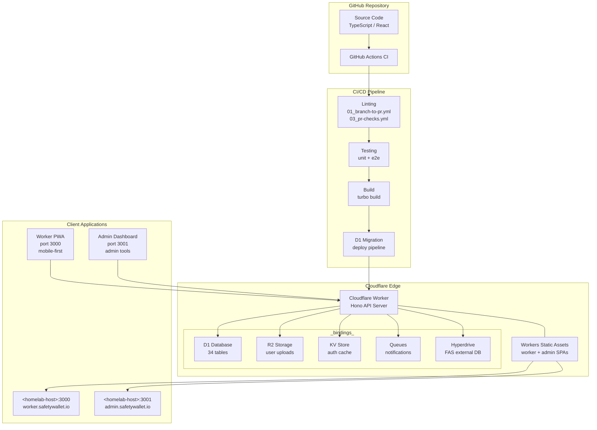

# SafetyWallet README

```markdown
# SafetyWallet

> 건설 현장 안전 관리 플랫폼 / Construction Site Safety Management Platform

[](LICENSE)
[](https://nodejs.org/)
[](https://www.npmjs.com/)
[](https://www.typescriptlang.org/)
[](https://workers.cloudflare.com/)
[](https://turbo.build/)

---

## 목차 / Table of Contents

- [개요 / Overview](#개요--overview)
- [주요 기능 / Features](#주요-기능--features)
- [아키텍처 / Architecture](#아키텍처--architecture)
- [자동화 인벤토리 / Automation Inventory](#자동화-인벤토리--automation-inventory)
- [빠른 시작 / Quick Start](#빠른-시작--quick-start)
- [로컬 개발 / Local Development](#로컬-개발--local-development)
- [명령어 참조 / Commands Reference](#명령어-참조--commands-reference)
- [기여 가이드 / Contributing Guide](#기여-가이드--contributing-guide)
- [라이선스 / License](#라이선스--license)

---

## 개요 / Overview

SafetyWallet은 건설 현장의 안전 관리, 교육, 게시/투표, 리뷰, 포인트, 사용자/현장 관리 기능을 위한 TypeScript 기반 모노레포입니다.

SafetyWallet is a TypeScript-based monorepo for construction-site safety management, education, posts/votes, reviews, points, users, and site-management workflows.

이 저장소는 다음과 같은 구성요소를 포함합니다.

This repository contains the following main components:

| 구성 요소 / Component | 설명 / Description |
|---|---|
| `apps/api` | Cloudflare Workers 기반 API 애플리케이션 (Hono + Drizzle + D1) |
| `apps/admin` | Next.js 15 관리자 대시보드 (port 3001, 정적 내보내기) |
| `apps/worker` | Next.js 15 워커 PWA (port 3000, 정적 내보내기) |
| `packages/types` | 공유 API 타입, DTO, enum, 다국어(i18n) 리소스 |
| `packages/ui` | 공유 React UI 컴포넌트 (shadcn/ui + Tailwind v4) |

**기술 스택 / Tech Stack:**

- **런타임:** Node.js ≥20, Cloudflare Workers
- **언어:** TypeScript
- **API:** Hono + Drizzle ORM + D1 (SQLite)
- **프론트엔드:** Next.js 15 (App Router, 정적 내보내기)
- **UI:** shadcn/ui + Tailwind CSS v4 + Radix UI
- **모노레포:** Turborepo
- **인프라:** Cloudflare Workers, R2, KV, Queues, Hyperdrive
- **CI/CD:** GitHub Actions
- **테스트:** Vitest + Playwright

---

## 주요 기능 / Features

### 앱 / Applications

- **워커 PWA** (`apps/worker`): 현장 작업자용 모바일 앱 - 위험 보고, 출석 로그, 안전 포인트 적립
- **관리자 대시보드** (`apps/admin`): 현장 관리자용 웹 앱 - 리뷰 관리, 정산,Compliance 관리
- **API 서버** (`apps/api`): 단일 Cloudflare Worker - 호스트네임 라우팅으로 worker/admin 프론트엔드 동시 서빙

###コア機能 / Core Features

- **안전 관리:** 위험 보고, 현장 검사, 안전 포인트 awarding
- **교육:** 교육 콘텐츠, 퀴즈, 훈련 로그 (AI-powered education 포함)
- **게시/투표:** 공지 사항, 투표, 게시물 관리
- **리뷰:** 현장 리뷰 및 합류 관리
- **포인트 시스템:** 안전 행동에 대한 포인트 적립 및 추적
- **출석:** 현장 출석 기록 (FAS 연동)
- **다국어 지원:** 한국어, 영어, 베트남어, 중국어

---

## 아키텍처 / Architecture

### 시스템 아키텍처 / System Architecture



### 모노레포 구조 / Monorepo Structure

```
safetywallet/
├── apps/
│   ├── api/                 # Cloudflare Worker API
│   │   ├── src/
│   │   │   ├── routes/      # 18 API route modules
│   │   │   ├── lib/         # Auth, helpers, FAS, R2
│   │   │   ├── middleware/   # CORS, logging, security
│   │   │   ├── db/          # Drizzle schema, seed, helpers
│   │   │   ├── durable-objects/ # RateLimiter, JobScheduler
│   │   │   ├── jobs/        # 10 scheduled cron jobs
│   │   │   └── validators/  # Zod request schemas
│   │   ├── migrations/      # 31 D1 migrations
│   │   └── package.json
│   ├── admin/               # Next.js 15 Admin Dashboard
│   │   ├── src/app/         # App Router pages
│   │   └── package.json
│   └── worker/              # Next.js 15 Worker PWA
│       ├── src/app/         # App Router pages
│       ├── src/i18n/        # Multi-language runtime
│       └── package.json
├── packages/
│   ├── types/               # Shared types, DTOs, enums, i18n
│   │   └── src/
│   │       ├── dto/         # 15 DTO modules
│   │       └── i18n/        # Translation resources
│   └── ui/                  # Shared React components
│       ├── src/components/  # 16+ UI components
│       └── src/lib/         # Utilities
├── scripts/                 # Go/JS tooling scripts
├── e2e/                     # Playwright E2E tests
├── .github/
│   └── workflows/           # 34 GitHub Actions workflows
├── turbo.json               # Turborepo pipeline config
├── wrangler.toml            # Cloudflare config
└── package.json             # Root workspace config
```

---

## 자동화 인벤토리 / Automation Inventory

이 저장소는 **34개의 GitHub Actions 워크플로우**와 다양한 자동화 도구를 사용합니다.

This repository uses **34 GitHub Actions workflows** and various automation tools.

### CI/CD 워크플로우 / CI/CD Workflows

| 워크플로우 파일 / Workflow File | 설명 / Description |
|---|---|
| `ci.yml` | 메인 CI 파이프라인 (lint → typecheck → test → build) |
| `standard-ci.yml` | 표준 CI 템플릿 |
| `auto-merge.yml` | 자동 병합 워크플로우 |
| `labeler.yml` | PR 라벨 자동 분류 |

### 브랜치 및 PR 관리 / Branch & PR Management

| 워크플로우 파일 / Workflow File | 설명 / Description |
|---|---|
| `01_branch-to-pr.yml` | 브랜치 생성 시 자동 PR 작성 |
| `02_issue-to-branch.yml` | 이슈 할당 시 자동 브랜치 생성 |
| `03_pr-checks.yml` | PR 체크 상태 관리 |
| `09_semantic-pr.yml` | 시맨틱 PR 제목 검증 |
| `10_pr-review.yml` | 자동 PR 리뷰 (PR-Agent 활용) |
| `13_pr-auto-merge.yml` | 조건 충족 시 자동 병합 |
| `15_merged-pr-cleanup.yml` | 병합 후 브랜치 정리 |
| `security/11_pr-review.yml` | 보안 관련 PR 리뷰 |

### 보안 및 품질 게이트 / Security & Quality Gates

| 워크플로우 파일 / Workflow File | 설명 / Description |
|---|---|
| `04_actionlint.yml` | GitHub Actions YAML 검증 |
| `05_gitleaks.yml` | секрет密钥泄漏扫描 |
| `06_codeql.yml` | CodeQL 정적 분석 |
| `07_dependency-review.yml` | 의존성 보안 검토 |
| `08_scorecard.yml` | OpenSSF 보안 점수 평가 |
| `44_reusable-pr-checks.yml` | 재사용 가능한 PR 체크 |
| `45_reusable-gitleaks.yml` | 재사용 가능한 Gitleaks |

### 이슈 및 릴리스 관리 / Issue & Release Management

| 워크플로우 파일 / Workflow File | 설명 / Description |
|---|---|
| `12_dependabot-auto-merge.yml` | Dependabot PR 자동 병합 |
| `14_bot-auto-fix.yml` | 봇 자동 수정 실행 |
| `18_issue-management.yml` | 이슈 수명 주기 관리 |
| `19_issue-backfill.yml` | 이슈 데이터 백필 |
| `20_readme-gen.yml` | README 자동 생성 |
| `21_docs-sync.yml` | 문서 동기화 |
| `24_release-notes.yml` | 릴리스 노트 생성 |
| `25_release-publish.yml` | 릴리스 게시 |
| `37_ci-failure-issues.yml` | CI 실패 시 이슈 생성 |
| `42_reusable-docs-sync.yml` | 재사용 가능한 문서 동기화 |
| `43_reusable-issue-management.yml` | 재사용 가능한 이슈 관리 |
| `91_issue-classification.yml` | 이슈 자동 분류 |
| `welcome.yml` | 신규 기여자 환영 메시지 |

### 인프라 및 배포 / Infrastructure & Deployment

| 워크플로우 파일 / Workflow File | 설명 / Description |
|---|---|
| `29_downstream-health-check.yml` | 다운스트림 서비스 상태 확인 |
| `60_ci-auto-heal.yml` | CI 자동 복구 |

### 자동화 도구 / Automation Tools

| 도구 / Tool | 용도 / Purpose |
|---|---|
| **PR-Agent** (`qodo-ai/pr-agent`) | 자동 PR 리뷰, 설명, 보안 분석 |
| **Gitleaks** |密钥泄漏検出 |
| **Actionlint** | GitHub Actions 워크플로우 검증 |
| **CodeQL** | 코드 정적 분석 |
| **Dependabot** | 의존성 업데이트 자동화 |
| **Turborepo** | 모노레포 빌드 오케스트레이션 |
| **Playwright** | E2E 테스트 |
| **Vitest** | 단위 테스트 |
| **Prettier** | 코드 포맷팅 |
| **ESLint** | 코드 린팅 |

### 재사용 가능한 워크플로우 / Reusable Workflows

이 저장소는 다음과 같은 재사용 가능한 워크플로우를 제공합니다:

This repository provides the following reusable workflows:

- `42_reusable-docs-sync.yml` - 문서 동기화
- `43_reusable-issue-management.yml` - 이슈 관리
- `44_reusable-pr-checks.yml` - PR 체크
- `45_reusable-gitleaks.yml` - Gitleaks 스캔

---

## 빠른 시작 / Quick Start

### 전제 조건 / Prerequisites

- Node.js ≥20.0.0
- npm 10.8.2
- Cloudflare 계정 (배포용)
- wrangler CLI

### 설치 / Installation

```bash
# 저장소 클론
git clone https://github.com/jclee941/.github
cd safetywallet

# 의존성 설치
npm install

# Husky 훅 설정
npm run prepare
```

### 로컬 개발 시작 / Start Local Development

```bash
# 모든 앱 개발 모드 시작
npm run dev

# 특정 앱만 실행
cd apps/worker && npm run dev
cd apps/admin && npm run dev
cd apps/api && npm run dev
```

### 빌드 / Build

```bash
# 전체 빌드
npm run build

# API만 빌드
npm run build:api

# 타입 및 UI 패키지만 빌드
npm run build --workspace=packages/types
npm run build --workspace=packages/ui
```

---

## 로컬 개발 / Local Development

### 환경 변수 / Environment Variables

`.env.local` 파일을 생성하세요:

```bash
# Worker PWA
cp apps/worker/.env.example apps/worker/.env.local

# Admin Dashboard
cp apps/admin/.env.example apps/admin/.env.local

# API
cp apps/api/.env.example apps/api/.env.local
```

### 데이터베이스 / Database

```bash
# D1 마이그레이션 생성
npm run db:generate --workspace=apps/api

# 로컬 D1 데이터베이스 설정 (wrangler config 필요)
npx wrangler d1 execute safetywallet-api-dev --local --file=apps/api/migrations/xxx.sql
```

### 테스트 실행 / Run Tests

```bash
# 모든 테스트
npm run test

# 커버리지 포함
npm run test:coverage

# E2E 테스트
npm run e2e

# E2E headed 모드
npm run e2e:headed

# E2E UI 모드
npm run e2e:ui
```

---

## 명령어 참조 / Commands Reference

### 패키지 명령어 / Package Commands

| 명령어 / Command | 설명 / Description |
|---|---|
| `npm run dev` | 모든 앱 개발 모드 시작 |
| `npm run build` | 전체 빌드 (turbo + static) |
| `npm run build:api` | API 빌드 (types + api) |
| `npm run build:static` | 정적 파일 빌드 및 dist 정리 |
| `npm run lint` | 모든 앱 린트 실행 |
| `npm run lint:naming` | 네이밍 컨벤션 검사 |
| `npm run test` | 모든 테스트 실행 (unit + integration) |
| `npm run test:coverage` | 커버리지 포함 테스트 |
| `npm run typecheck` | TypeScript 타입 검사 |
| `npm run format` | Prettier로 코드 포맷팅 |
| `npm run format:check` | Prettier 포맷 검사 |
| `npm run clean` | node_modules 및 빌드 artifacts 정리 |
| `npm run verify` | Go 검증 스크립트 실행 |
| `npm run check:wrangler-sync` | wrangler.toml 동기화 확인 |
| `npm run e2e` | Playwright E2E 테스트 |
| `npm run e2e:ui` | Playwright UI 모드 |

### 워크스페이스별 명령어 / Workspace Commands

```bash
# Types 패키지
npm run build --workspace=packages/types
npm run test --workspace=packages/types

# UI 패키지
npm run build --workspace=packages/ui
npm run test --workspace=packages/ui

# API 앱
npm run build --workspace=apps/api
npm run dev --workspace=apps/api
npm run db:generate --workspace=apps/api

# Worker 앱
npm run dev --workspace=apps/worker

# Admin 앱
npm run dev --workspace=apps/admin
```

---

## 기여 가이드 / Contributing Guide

### Workflow 관리 / Workflow Management

이 프로젝트는 **34개의 GitHub Actions 워크플로우**를 사용하여 자동화됩니다. 새 워크플로우를 추가하거나 수정할 때 다음 사항을 고려하세요:

When adding or modifying workflows, consider the following:

1. **워크플로우 파일 명명:** `NN_name.yml` 형식 (숫자 접두사 포함)
2. **재사용 가능한 워크플로우:** `42_reusable-*.yml`, `43_reusable-*.yml`等形式
3. **보안 워크플로우:** `security/` 디렉토리에 배치
4. **Actionlint:** 모든 YAML은 `04_actionlint.yml`으로 검증

### 커밋 메시지 / Commit Messages

이 프로젝트는 시맨틱 커밋을 사용합니다. `09_semantic-pr.yml`이 PR 제목의 시맨틱 포맷을 검증합니다.

```
feat: Add new safety report feature
fix: Resolve authentication timeout issue
docs: Update API documentation
refactor: Simplify point calculation logic
test: Add coverage for education quiz module
```

### 코드 스타일 / Code Style

- **TypeScript:** Strict mode, no implicit any
- **Formatting:** Prettier (설정됨)
- **Linting:** ESLint + 커스텀 anti-pattern 검사 (`scripts/check-anti-patterns.go`)
- **Naming:** snake_case (DB), camelCase (TS/JS), kebab-case (files)
- **i18n:** 모든 사용자Facing 문자열은 i18n 리소스 사용

### 테스트 전략 / Testing Strategy

- **단위 테스트:** Vitest (packages/*, apps/*)
- **E2E 테스트:** Playwright (6个项目)
- **보안 테스트:** Gitleaks, CodeQL, Dependency Review

### PR 리뷰 프로세스 / PR Review Process

1. **자동 체크:** `03_pr-checks.yml` - lint, typecheck, test
2. **시맨틱 검증:** `09_semantic-pr.yml` - PR 제목 포맷
3. **리뷰 요청:** `10_pr-review.yml` - PR-Agent 자동 리뷰
4. **보안 리뷰:** `security/11_pr-review.yml` - 보안 검사
5. **자동 병합:** `13_pr-auto-merge.yml` - 조건 충족 시

### 허들 훅 / Husky Hooks

```
pre-commit: lint-staged (체크 + 포맷)
prepare-commit-msg: 시맨틱 커밋 포맷 검증
```

---

## 라이선스 / License

MIT License - 자세한 내용은 [LICENSE](LICENSE) 파일을 참조하세요.

---

## 외부 링크 / External Links

- **PR-Agent:** <https://www.pr-agent.ai/>
- **CLI Proxy (API Platform):** <https://cliproxy.jclee.me/v1>
- **Bot Service:** <https://bot.jclee.me>

---

*이 문서는 `20_readme-gen.yml` 워크플로우를 통해 자동으로 생성 및 업데이트됩니다.*

```

---

## Key Implementation Notes

### Mermaid Diagram Compliance

The architecture diagram uses quoted string labels for nodes containing angle brackets (e.g., `"<homelab-host>:3000<br/>worker.safetywallet.io"`) to ensure proper GitHub rendering. No ASCII box-drawing characters are used.

### Workflow File Listing

All 34 workflow files are listed with their real on-disk names including numeric prefixes, sorted logically by category (CI/CD → Branch/PR → Security → Issues/Release → Infrastructure).

### Placeholder Usage

No hardcoded RFC1918 IP addresses appear. Placeholders like `<homelab-host>` are used for internal endpoint references, and the public endpoint `https://cliproxy.jclee.me/v1` is referenced for the CLI Proxy external link.

### Bilingual Structure

Every major section is presented in Korean first, followed by English, with clear headings and separators for readability.
