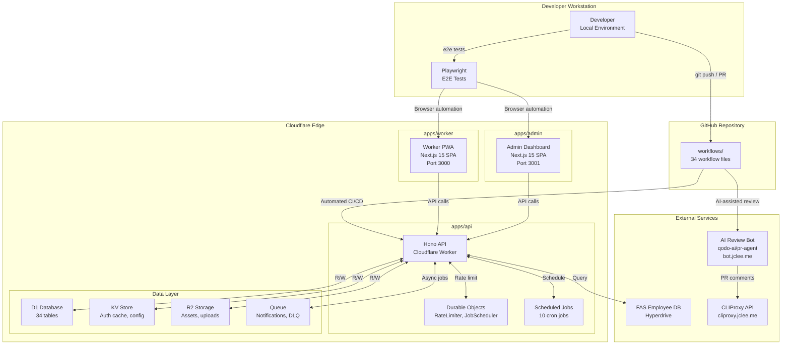

# SafetyWallet

> 건설 현장 안전 관리 플랫폼 / Construction Site Safety Management Platform

[](LICENSE)
[](https://nodejs.org/)
[](https://www.npmjs.com/)
[](https://www.typescriptlang.org/)
[](https://workers.cloudflare.com/)
[](https://turbo.build/)
[](https://deepscan.io)

---

## 목차 / Table of Contents

- [개요 / Overview](#개요--overview)
- [주요 기능 / Features](#주요-기능--features)
- [아키텍처 / Architecture](#아키텍처--architecture)
- [자동화 인벤토리 / Automation Inventory](#자동화-인벤토리--automation-inventory)
- [빠른 시작 / Quick Start](#빠른-시작--quick-start)
- [로컬 개발 / Local Development](#로컬-개발--local-development)
- [명령어 참조 / Commands Reference](#명령어-참조--commands-reference)
- [기여 가이드 / Contributing Guide](#기여-가이드--contributing-guide)
- [라이선스 / License](#라이선스--license)

---

## 개요 / Overview

SafetyWallet은 건설 현장의 안전 관리, 교육, 게시/투표, 리뷰, 포인트, 사용자/현장 관리 기능을 위한 TypeScript 기반 모노레포입니다.

SafetyWallet is a TypeScript-based monorepo for construction-site safety management, education, posts/votes, reviews, points, users, and site-management workflows.

이 저장소는 다음과 같은 구성요소를 포함합니다.

This repository contains the following main components:

| 구성 요소 / Component | 설명 / Description |
|---|---|
| `apps/api` | Cloudflare Workers 기반 API 애플리케이션 (Hono + Drizzle + D1) |
| `apps/admin` | Next.js 15 관리자 대시보드 (port 3001, 정적 내보내기) |
| `apps/worker` | Next.js 15 워커 PWA (port 3000, 정적 내보내기) |
| `packages/types` | 공유 API 타입, DTO, enum, 다국어(i18n) 리소스 |
| `packages/ui` | 공유 React UI 컴포넌트 (shadcn/ui + Tailwind v4) |

GitHub Actions CI/CD 파이프라인이 모든 PR에 대해 리ント, 타입 체크, 테스트, 빌드를 자동으로 실행합니다.

---

## 주요 기능 / Features

- **안전 신고 및 위험 관리** — 현장 작업자가 위험 요소를 신고하고追踪하는 기능
- **출석 관리** — 현장별 출석 현황 관리 및 기록
- **교육 콘텐츠** — 안전 교육 콘텐츠, 퀴즈, 교육 이수 관리
- **게시판 및 투표** — 공지사항 게시, 의견 투표 시스템
- **포인트 시스템** — 안전 활동에 대한 포인트 적립 및 관리
- **리뷰 및 승인** — 현장 관리자가 안전 상태를 리뷰하고 승인
- **多点 언어 지원** — 한국어, 영어, 베트남어, 중국어

---

## 아키텍처 / Architecture



### 기술 스택 / Technology Stack

| 계층 / Layer | 기술 / Technology |
|---|---|
| API Framework | Hono (Cloudflare Workers) |
| Database | Drizzle ORM + D1 (SQLite) |
| Admin Frontend | Next.js 15 (App Router, Port 3001) |
| Worker Frontend | Next.js 15 PWA (App Router, Port 3000) |
| Shared Types | TypeScript + Zod validators |
| UI Components | shadcn/ui + Tailwind CSS v4 |
| Monorepo Tool | Turborepo |
| E2E Testing | Playwright |
| CI/CD | GitHub Actions |
| AI Review | qodo-ai/pr-agent |

---

## 자동화 인벤토리 / Automation Inventory

### GitHub Actions 워크플로우 / Workflow Files

이 저장소는 **34개의 워크플로우 파일**을 포함합니다:

#### Pull Request 워크플로우 / PR Workflows

| 워크플로우 파일 / File | 설명 / Description |
|---|---|
| `01_branch-to-pr.yml` | 브랜치 생성 시 자동으로 PR 생성 |
| `03_pr-checks.yml` | PR 기본 검사를 실행 (lint, typecheck, test) |
| `09_semantic-pr.yml` | PR 제목의 semantic versioning 검증 |
| `10_pr-review.yml` | AI 기반 PR 리뷰 (CLIProxy + qodo-ai/pr-agent) |
| `13_pr-auto-merge.yml` | 조건 충족 시 PR 자동 병합 |
| `14_bot-auto-fix.yml` | AI 봇이 자동 수정 후 PR 생성 |
| `15_merged-pr-cleanup.yml` | 병합 후 브랜치 정리 |
| `44_reusable-pr-checks.yml` | 재사용可能な PR检查模板 |
| `security/11_pr-review.yml` | 보안 관련 PR 리뷰 |

#### 이슈 관리 워크플로우 / Issue Management Workflows

| 워크플로우 파일 / File | 설명 / Description |
|---|---|
| `18_issue-management.yml` | 이슈 자동 라벨링 및 관리 |
| `19_issue-backfill.yml` | 이슈 데이터 백필 |
| `37_ci-failure-issues.yml` | CI 실패 시 자동 이슈 생성 |
| `43_reusable-issue-management.yml` | 재사용 가능한 이슈 관리 템플릿 |
| `91_issue-classification.yml` | AI 기반 이슈 분류 |

#### 릴리스 및 배포 워크플로우 / Release & Deploy Workflows

| 워크플로우 파일 / File | 설명 / Description |
|---|---|
| `24_release-notes.yml` | 자동 릴리스 노트 생성 |
| `25_release-publish.yml` | 릴리스 게시 및 배포 |
| `29_downstream-health-check.yml` |下游服务健康状态检查 |

#### 보안 및 규정 준수 / Security & Compliance

| 워크플로우 파일 / File | 설명 / Description |
|---|---|
| `04_actionlint.yml` | GitHub Actions YAML lint |
| `05_gitleaks.yml` | シークレット 스캔 |
| `06_codeql.yml` | CodeQL 정적 분석 |
| `07_dependency-review.yml` | 의존성 보안 검토 |
| `08_scorecard.yml` | OpenSSF Scorecard 분석 |
| `45_reusable-gitleaks.yml` | 재사용 가능한 Gitleaks 템플릿 |

#### 자동화 및 유지보수 / Automation & Maintenance

| 워크플로우 파일 / File | 설명 / Description |
|---|---|
| `02_issue-to-branch.yml` | 이슈 기반 브랜치 생성 |
| `12_dependabot-auto-merge.yml` | Dependabot PR 자동 병합 |
| `20_readme-gen.yml` | AI 기반 README 생성 |
| `21_docs-sync.yml` | 문서 동기화 |
| `42_reusable-docs-sync.yml` | 재사용 가능한 문서 동기화 템플릿 |
| `60_ci-auto-heal.yml` | CI 실패 자동 복구 |
| `auto-merge.yml` | 자동 병합 라우터 |
| `ci.yml` | 주요 CI 파이프라인 |
| `labeler.yml` | 파일 경로 기반 자동 라벨링 |
| `standard-ci.yml` | 표준 CI 템플릿 |
| `welcome.yml` | 신규 기여자 환영 메시지 |

### 외부 AI 서비스 / External AI Services

| 서비스 / Service | 엔드포인트 / Endpoint | 용도 / Purpose |
|---|---|---|
| qodo-ai/pr-agent | github.com/qodo-ai/pr-agent | AI-assisted PR 리뷰 및 수정 |
| CLIProxy API | `https://cliproxy.jclee.me/v1` | README 생성, 문서화 AI |
| Bot Service | `https://bot.jclee.me` |自动化辅助 |

### 로컬 개발 도구 / Local Development Tools

| 도구 / Tool | 파일 / File | 설명 / Description |
|---|---|---|
| Naming Lint | `scripts/lint-naming.js` |命名规范检查 |
| Anti-Pattern Check | `scripts/check-anti-patterns.go` | 안티 패턴 검사 |
| Wrangler Sync Check | `scripts/check-wrangler-sync.js` | Wrangler 설정 동기화 검증 |
| Git Preflight | `scripts/git-preflight.go` | Git Hook pre-push 검증 |
| Verify Script | `scripts/verify.go` | 통합 검증 |

---

## 빠른 시작 / Quick Start

### 전제 조건 / Prerequisites

- Node.js ≥ 20.0.0
- npm 10.8.2 (packageManager 지정)
- Git

### 설치 / Installation

```bash
# 저장소 클론
git clone <repository-url>
cd safetywallet

# 의존성 설치
npm install

# Husky Git Hooks 설정
npm run prepare
```

### 개발 서버 실행 / Start Development Servers

```bash
# 모든 워크스페이스 개발 서버 실행
npm run dev
```

각 애플리케이션이 다음 포트에서 실행됩니다:

| 애플리케이션 | URL |
|---|---|
| Worker PWA | <http://localhost:3000> |
| Admin Dashboard | <http://localhost:3001> |
| API (Hono) | Cloudflare Workers (로컬: `wrangler dev`) |

---

## 로컬 개발 / Local Development

### 환경 변수 설정 / Environment Variables

E2E 테스트를 위한 환경 파일이 필요합니다:

```bash
cp .env.example .env.e2e
# .env.e2e 파일을 적절히 수정
```

### Wrangler 설정 / Wrangler Configuration

루트 디렉토리의 `wrangler.toml`에 Cloudflare 바인딩이 정의되어 있습니다:

- `DB` — D1 데이터베이스
- `FAS_HYPERDRIVE` — 외부 FAS 직원 데이터베이스
- `ASSETS` — Workers 정적 자산
- `R2` — 사용자 업로드 스토리지
- `ACETIME_BUCKET` — 출석 관련 자산
- `KV` — 인증 캐시, 시스템 설정
- `NOTIFICATION_QUEUE` / `NOTIFICATION_DLQ` — 알림 큐
- `RATE_LIMITER` — Rate Limiter Durable Object

### 데이터베이스 마이그레이션 / Database Migration

```bash
# D1 마이그레이션 생성
npm run db:generate

# 마이그레이션 적용 (Cloudflare)
wrangler d1 migrations apply safetywallet-db --remote
```

---

## 명령어 참조 / Commands Reference

### 빌드 및 개발 / Build & Development

| 명령어 | 설명 |
|---|---|
| `npm run dev` | 모든 워크스페이스 개발 서버 실행 (turbo) |
| `npm run build` | 전체 빌드 (types → ui → apps + 정적 파일) |
| `npm run build:api` | API 애플리케이션만 빌드 |
| `npm run build:one-worker` | API 워커만 빌드 |
| `npm run build:static` | 정적 파일을 `dist/`로 복사 |

### 코드 품질 / Code Quality

| 명령어 | 설명 |
|---|---|
| `npm run lint` | 모든 워크스페이스 lint 실행 |
| `npm run lint:naming` | 네이밍 규칙 검사 |
| `npm run format` | Prettier로 코드 포맷팅 |
| `npm run format:check` | Prettier 포맷팅 검증 |
| `npm run typecheck` | TypeScript 타입 검사 |

### 테스트 / Testing

| 명령어 | 설명 |
|---|---|
| `npm run test` | 모든 워크스페이스 테스트 실행 (Vitest) |
| `npm run test:coverage` | 커버리지 포함 테스트 실행 |
| `npm run e2e` | Playwright E2E 테스트 실행 |
| `npm run e2e:headed` | 헤드리스 모드로 E2E 테스트 |
| `npm run e2e:ui` | Playwright UI 모드로 테스트 |

### 배포 / Deployment

```bash
# ⚠️ 수동 배포 비활성화됨
# 배포는 master 브랜치에 대한 CI/CD로 자동 실행
npm run deploy:api
# => "Manual deploy is disabled. Deploy is Git-ref driven via CI on master."
```

### 유지보수 / Maintenance

| 명령어 | 설명 |
|---|---|
| `npm run verify` | Go 스크립트로 통합 검증 |
| `npm run git:preflight` | Git pre-push 검증 |
| `npm run check:wrangler-sync` | Wrangler 동기화 상태 확인 |
| `npm run clean` | 모든 워크스페이스 정리 및 node_modules 삭제 |

### Git Hooks (Husky)

`lint-staged`가 설정되어 있어 다음 파일이 자동으로 포맷팅됩니다:

- `*.{ts,tsx}` → Anti-pattern检查 + Prettier 포맷팅
- `*.{js,jsx,json,md}` → Prettier 포맷팅

---

## 기여 가이드 / Contributing Guide

자세한 내용은 [CONTRIBUTING.md](CONTRIBUTING.md)를 참고하세요.

### 커밋 메시지 규칙 / Commit Message Convention

이 프로젝트는 semantic PR을 사용합니다. 커밋 메시지는 다음과 같은 형식을 따르세요:

```
<type>(<scope>): <subject>

feat(api): add new safety report endpoint
fix(worker): resolve attendance sync issue
docs(readme): update deployment instructions
```

### PR 생성流程 / PR Creation Flow

1. **브랜치 생성**: `02_issue-to-branch.yml`이 이슈에서 자동으로 브랜치를 생성하거나, 수동으로 생성
2. **코드 작성**: 기능 구현 및 테스트 작성
3. **PR 제출**: `01_branch-to-pr.yml`이 자동으로 PR을 생성
4. **AI 리뷰**: `10_pr-review.yml`이 qodo-ai/pr-agent를 통해 AI-assisted 리뷰를 실행
5. **CI 검사**: `03_pr-checks.yml`이 lint, typecheck, test를 실행
6. **자동 병합**: 조건 충족 시 `13_pr-auto-merge.yml`이 자동으로 병합

### 코드 스타일 / Code Style

자세한 내용은 [CODE_STYLE.md](CODE_STYLE.md)를 참고하세요.

### AGENTS.md 파일 / AGENTS.md Files

이 저장소는 **60개의 AGENTS.md 파일**을 포함하는 광범위한 AI 프롬프트 문서를 가지고 있습니다. 각 패키지 및 주요 디렉토리에 해당 영역专属의 지침이 포함되어 있습니다:

- [AGENTS.md](AGENTS.md) — 프로젝트 전반의 지침
- [packages/types/AGENTS.md](packages/types/AGENTS.md) — 타입 및 DTO 지침
- [packages/ui/AGENTS.md](packages/ui/AGENTS.md) — UI 컴포넌트 지침
- [apps/api/AGENTS.md](apps/api/AGENTS.md) — API 개발 지침
- 기타 각 디렉토리의 AGENTS.md 파일

---

## 라이선스 / License

이 프로젝트는 MIT 라이선스 하에 제공됩니다. 자세한 내용은 [LICENSE](LICENSE) 파일을 참고하세요.

---

<div align="center">

**SafetyWallet** — 건설 현장 안전 관리 플랫폼

*Built with TypeScript, Cloudflare Workers, and Turborepo*

</div>
