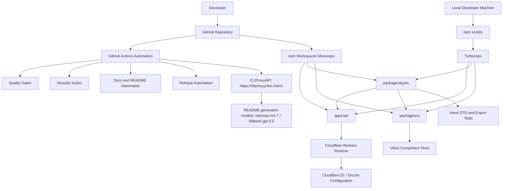

# SafetyWallet

> 건설 현장 안전 관리 플랫폼 / Construction Site Safety Management Platform


---

## 목차 / Table of Contents

- [개요 / Overview](#개요--overview)
- [주요 기능 / Features](#주요-기능--features)
- [아키텍처 / Architecture](#아키텍처--architecture)
- [자동화 인벤토리 / Automation Inventory](#자동화-인벤토리--automation-inventory)
- [빠른 시작 / Quick Start](#빠른-시작--quick-start)
- [로컬 개발 / Local Development](#로컬-개발--local-development)
- [명령어 참조 / Commands Reference](#명령어-참조--commands-reference)
- [기여 가이드 / Contributing Guide](#기여-가이드--contributing-guide)
- [라이선스 / License](#라이선스--license)

---

## 개요 / Overview

SafetyWallet은 건설 현장의 안전 관리, 교육, 게시/투표, 리뷰, 포인트, 사용자/현장 관리 기능을 위한 TypeScript 기반 모노레포입니다.

SafetyWallet is a TypeScript-based monorepo for construction-site safety management, education, posts/votes, reviews, points, users, and site-management workflows.

이 저장소는 다음과 같은 구성요소를 포함합니다.

This repository contains the following main components:

- `apps/api`: Cloudflare Workers 기반 API 애플리케이션 영역
- `packages/types`: 공유 API 타입, DTO, enum, 다국어 리소스
- `packages/ui`: 공유 React UI 컴포넌트와 테스트
- GitHub Actions 기반 자동화: PR 검사, 보안 스캔, 리뷰 자동화, 릴리스, 문서 동기화, 이슈 관리, 자동 복구 등
- npm workspaces + Turborepo 기반 빌드/테스트/타입체크 파이프라인

### 기술 스택 / Technology Stack

| 영역 / Area | 기술 / Technology |
|---|---|
| 언어 / Language | TypeScript |
| 런타임 / Runtime | Node.js `>=20.0.0` |
| 패키지 매니저 / Package Manager | npm `10.8.2` |
| 모노레포 / Monorepo | npm workspaces, Turborepo |
| API | Cloudflare Workers, Hono 계열 API 구조 |
| 데이터 계층 / Data Layer | Drizzle 설정, Cloudflare D1 계열 구성 |
| UI | React, shared component package |
| 테스트 / Testing | Vitest, Playwright |
| 배포 대상 / Deployment Target | Cloudflare Workers |
| 자동화 / Automation | GitHub Actions, actionlint, Gitleaks, CodeQL, Scorecard, dependency review, PR Agent 계열 리뷰 자동화 |

---

## 주요 기능 / Features

### 한국어

- 건설 현장 안전 관리 도메인을 위한 공유 DTO 및 enum 제공
- 게시글, 리뷰, 투표, 포인트, 사용자, 현장, 교육 관련 타입 모델 제공
- `packages/ui`를 통한 재사용 가능한 React UI 컴포넌트 제공
- `apps/api`를 통한 API 애플리케이션 패키지 분리
- Vitest 기반 단위 테스트 및 DTO shape 검증
- Playwright 기반 E2E 테스트 명령 제공
- Turborepo 기반 모노레포 태스크 실행
- GitHub Actions 기반 PR 품질 게이트, 보안 검사, 자동 리뷰, 자동 병합, 릴리스 자동화
- README 생성 및 문서 동기화 자동화
- CI 실패 이슈 생성 및 자동 복구 워크플로우 제공

### English

- Shared DTOs and enums for construction-site safety-management domains
- Typed models for posts, reviews, votes, points, users, sites, education, analytics, announcements, and authentication
- Reusable React UI components through `packages/ui`
- Isolated API application package under `apps/api`
- Unit tests and DTO shape validation with Vitest
- E2E command support with Playwright
- Monorepo task orchestration with Turborepo
- GitHub Actions quality gates, security scanning, automated review, auto-merge, and release automation
- README generation and documentation synchronization workflows
- CI failure issue creation and CI auto-healing workflows

---

## 아키텍처 / Architecture

### 시스템 개요 / System Overview



### 저장소 구조 / Repository Structure

아래 구조는 제공된 실제 최상위 레이아웃을 기준으로 합니다.

The following tree reflects the actual top-level layout provided for this repository.

```text
/
├── AGENTS.md
├── ARCHITECTURE.md
├── CODE_STYLE.md
├── CONTRIBUTING.md
├── LICENSE
├── README.md
├── package-lock.json
├── package.json
├── playwright.config.ts
├── turbo.json
├── vitest.config.ts
├── wrangler.toml
├── packages/
│   ├── ui/
│   │   ├── AGENTS.md
│   │   ├── package-lock.json
│   │   ├── package.json
│   │   ├── tsconfig.json
│   │   ├── vitest.config.ts
│   │   └── src/
│   │       ├── globals.css
│   │       ├── index.ts
│   │       ├── lib/
│   │       ├── components/
│   │       └── __tests__/
│   └── types/
│       ├── AGENTS.md
│       ├── i18n.md
│       ├── package-lock.json
│       ├── package.json
│       ├── tsconfig.json
│       ├── vitest.config.ts
│       └── src/
│           ├── api.ts
│           ├── enums.ts
│           ├── index.ts
│           ├── dto/
│           ├── i18n/
│           └── __tests__/
└── apps/
    └── api/
        ├── AGENTS.md
        ├── drizzle.config.ts
        ├── package.json
        ├── seed.sql
        ├── tsconfig.json
        └── vitest.config.ts
```

### 패키지 설명 / Package Responsibilities

| 경로 / Path | 역할 / Responsibility |
|---|---|
| `apps/api` | API 애플리케이션 패키지, Drizzle 설정, seed SQL, API용 TypeScript/Vitest 설정 |
| `packages/types` | 공유 API 타입, enum, DTO, i18n 리소스 및 관련 테스트 |
| `packages/ui` | 공유 UI 컴포넌트, 스타일, 유틸리티, 컴포넌트 테스트 |
| `wrangler.toml` | Cloudflare Workers 관련 루트 설정 |
| `turbo.json` | 모노레포 태스크 파이프라인 설정 |
| `playwright.config.ts` | Playwright E2E 테스트 설정 |
| `vitest.config.ts` | 루트 Vitest 설정 |
| `AGENTS.md` | 자동화 에이전트 및 프로젝트 지식 베이스 |
| `ARCHITECTURE.md` | 아키텍처 문서 |
| `CODE_STYLE.md` | 코드 스타일 문서 |
| `CONTRIBUTING.md` | 기여 가이드 |

---

## 자동화 인벤토리 / Automation Inventory

이 저장소는 GitHub Actions 중심의 자동화를 포함합니다. 총 33개의 workflow 파일이 제공되었습니다.

This repository includes GitHub Actions-centered automation. A total of 33 workflow files were provided.

### GitHub Actions Workflows

| 파일 / File | 목적 / Purpose |
|---|---|
| `01_branch-to-pr.yml` | 브랜치에서 PR 생성 또는 PR 전환 자동화 / Branch-to-PR automation |
| `02_issue-to-branch.yml` | 이슈 기반 브랜치 생성 자동화 / Issue-to-branch automation |
| `03_pr-checks.yml` | PR 품질 검사 / PR quality checks |
| `04_actionlint.yml` | GitHub Actions workflow lint 검사 / GitHub Actions workflow linting |
| `05_gitleaks.yml` | secret 누출 검사 / Secret leak scanning |
| `06_codeql.yml` | CodeQL 보안 분석 / CodeQL security analysis |
| `07_dependency-review.yml` | dependency review 검사 / Dependency review checks |
| `08_scorecard.yml` | OpenSSF Scorecard 계열 보안/공급망 검사 / Scorecard-style security and supply-chain checks |
| `09_semantic-pr.yml` | PR 제목/본문 semantic 규칙 검사 / Semantic PR validation |
| `10_pr-review.yml` | PR 자동 리뷰 / Automated PR review |
| `12_dependabot-auto-merge.yml` | Dependabot PR 자동 병합 / Dependabot auto-merge |
| `13_pr-auto-merge.yml` | 일반 PR 자동 병합 조건 처리 / PR auto-merge handling |
| `14_bot-auto-fix.yml` | 봇 기반 자동 수정 / Bot-driven auto-fix |
| `15_merged-pr-cleanup.yml` | 병합된 PR 후처리 및 정리 / Post-merge PR cleanup |
| `18_issue-management.yml` | 이슈 관리 자동화 / Issue management automation |
| `19_issue-backfill.yml` | 이슈 백필 자동화 / Issue backfill automation |
| `20_readme-gen.yml` | README 생성 자동화 / README generation automation |
| `21_docs-sync.yml` | 문서 동기화 / Documentation synchronization |
| `24_release-notes.yml` | 릴리스 노트 생성 / Release notes generation |
| `25_release-publish.yml` | 릴리스 게시 / Release publishing |
| `29_downstream-health-check.yml` | 다운스트림 상태 점검 / Downstream health checks |
| `37_ci-failure-issues.yml` | CI 실패 이슈 생성 / CI failure issue creation |
| `42_reusable-docs-sync.yml` | 재사용 가능한 문서 동기화 workflow / Reusable docs sync workflow |
| `43_reusable-issue-management.yml` | 재사용 가능한 이슈 관리 workflow / Reusable issue management workflow |
| `44_reusable-pr-checks.yml` | 재사용 가능한 PR 검사 workflow / Reusable PR checks workflow |
| `45_reusable-gitleaks.yml` | 재사용 가능한 Gitleaks workflow / Reusable Gitleaks workflow |
| `60_ci-auto-heal.yml` | CI 자동 복구 / CI auto-healing |
| `auto-merge.yml` | 자동 병합 workflow / Auto-merge workflow |
| `ci.yml` | 기본 CI workflow / Main CI workflow |
| `labeler.yml` | 라벨 자동 적용 / Automatic labeling |
| `standard-ci.yml` | 표준 CI workflow / Standard CI workflow |
| `welcome.yml` | 신규 기여자 또는 이슈/PR 환영 메시지 / Welcome automation |
| `security/11_pr-review.yml` | 보안 영역 PR 리뷰 / Security-scoped PR review |

### 자동화 도구 / Automation Tools

| 도구 / Tool | 사용 영역 / Usage |
|---|---|
| GitHub Actions | CI, PR checks, security scanning, documentation, release automation |
| actionlint | GitHub Actions workflow linting |
| Gitleaks | Secret scanning |
| CodeQL | Static security analysis |
| Dependency Review | Dependency and supply-chain review |
| Scorecard | Repository security posture checks |
| Qodo PR Agent | Automated PR review assistance; see `qodo-ai/pr-agent` |
| CLIProxyAPI | Model gateway endpoint for README generation: `https://cliproxy.jclee.me/v1` |
| bot.jclee.me | Bot service endpoint/reference: `bot.jclee.me` |
| minimax-m2.7 | Current primary README generation model via CLIProxyAPI |
| gpt-5.5 | Current fallback README generation model via CLIProxyAPI |
| npm | Workspace package management and scripts |
| Turborepo | Monorepo task orchestration |
| Vitest | Unit and package tests |
| Playwright | E2E tests |
| Wrangler | Cloudflare Workers configuration/deployment tooling |
| Prettier | Code formatting |
| Husky | Git hook setup |
| lint-staged | Staged-file formatting and checks |
| Drizzle | Database schema/configuration tooling |

### Go Automation Tools

현재 제공된 자동화 인벤토리 기준 Go 자동화 도구는 없습니다.

No Go automation tools are listed in the provided automation inventory.

> 참고 / Note: 루트 `package.json`의 일부 npm scripts는 `go run scripts/...` 형태의 명령을 참조합니다. 제공된 프로젝트 구조에는 `scripts/` 디렉터리가 포함되어 있지 않으므로, 해당 명령을 사용하려면 실제 저장소에서 파일 존재 여부를 먼저 확인하세요.

---

## 빠른 시작 / Quick Start

### 요구사항 / Requirements

- Node.js `>=20.0.0`
- npm `10.8.2`
- Cloudflare Workers 개발 시 Wrangler 설정
- E2E 테스트 실행 시 Playwright 브라우저 설치
- `e2e` 명령 사용 시 1Password CLI `op` 및 `.env.e2e` 구성

### 설치 / Installation

```bash
npm install
```

### 전체 검증 / Full Verification

```bash
npm run typecheck
npm run lint
npm test
npm run build
```

### 개발 서버 / Development

```bash
npm run dev
```

### 테스트 / Testing

```bash
npm test
```

커버리지 포함 테스트:

```bash
npm run test:coverage
```

### 포맷팅 / Formatting

```bash
npm run format
```

포맷 검사만 수행:

```bash
npm run format:check
```

---

## 로컬 개발 / Local Development

### 1. 저장소 준비 / Prepare the Repository

```bash
npm install
```

### 2. 타입 검사 / Type Checking

```bash
npm run typecheck
```

### 3. 린트 / Lint

```bash
npm run lint
```

### 4. 테스트 / Test

```bash
npm test
```

### 5. 빌드 / Build

```bash
npm run build
```

### 6. API 빌드 / Build API

```bash
npm run build:api
```

### 7. E2E 테스트 / E2E Tests

Playwright 기반 E2E 명령은 1Password CLI를 통해 `.env.e2e` 환경 파일을 로드하도록 구성되어 있습니다.

The Playwright E2E commands are configured to load `.env.e2e` through the 1Password CLI.

```bash
npm run e2e
```

headed 모드:

```bash
npm run e2e:headed
```

UI 모드:

```bash
npm run e2e:ui
```

### 8. Cloudflare / Wrangler

루트에 `wrangler.toml`이 포함되어 있습니다. Cloudflare Workers 관련 로컬 실행 또는 배포를 수행하기 전, 환경 변수와 바인딩이 안전하게 설정되어 있는지 확인하세요.

The repository contains `wrangler.toml`. Before running or deploying Cloudflare Workers locally, ensure that environment variables and bindings are configured safely.

수동 API 배포 명령은 의도적으로 비활성화되어 있습니다.

Manual API deployment is intentionally disabled:

```bash
npm run deploy:api
```

이 명령은 실패하도록 구성되어 있으며, 배포는 `master` Git ref 기반 CI를 통해 수행되도록 설계되어 있습니다.

This command is configured to fail. Deployment is designed to be Git-ref driven via CI on `master`.

---

## 명령어 참조 / Commands Reference

루트 `package.json` 기준 명령입니다.

Commands based on the root `package.json`.

| 명령 / Command | 설명 / Description |
|---|---|
| `npm run build` | Turborepo build 실행 후 static build 처리 |
| `npm run build:api` | `packages/types` 빌드 후 `apps/api` 빌드 |
| `npm run build:static` | `dist` 디렉터리 재생성 및 static asset 복사 |
| `npm run build:one-worker` | API 빌드 실행 |
| `npm run dev` | Turborepo dev pipeline 실행 |
| `npm run deploy:api` | 수동 배포 차단. CI 기반 배포만 허용 |
| `npm run lint` | Turborepo lint pipeline 실행 |
| `npm run lint:naming` | naming lint 스크립트 실행 |
| `npm test` | Turborepo test pipeline 실행 |
| `npm run test:coverage` | coverage 옵션으로 test pipeline 실행 |
| `npm run typecheck` | Turborepo typecheck pipeline 실행 |
| `npm run check:wrangler-sync` | Wrangler 설정 동기화 검사 |
| `npm run git:preflight` | Git preflight 검사 명령 실행 |
| `npm run verify` | 저장소 검증 명령 실행 |
| `npm run format` | TS/JS/JSON/Markdown 파일 Prettier write |
| `npm run format:check` | TS/JS/JSON/Markdown 파일 Prettier check |
| `npm run clean` | Turborepo clean 후 `node_modules` 제거 |
| `npm run db:generate` | `apps/api` workspace의 DB generate 실행 |
| `npm run prepare` | Husky 초기화 |
| `npm run e2e` | `.env.e2e`를 사용해 Playwright E2E 테스트 실행 |
| `npm run e2e:headed` | headed 모드로 Playwright E2E 테스트 실행 |
| `npm run e2e:ui` | Playwright UI 모드 실행 |

### Workspace Scripts

개별 workspace에도 `package.json`, `tsconfig.json`, `vitest.config.ts`가 존재합니다.

Individual workspaces also contain their own `package.json`, `tsconfig.json`, and `vitest.config.ts`.

```bash
npm run <script> --workspace=packages/types
npm run <script> --workspace=packages/ui
npm run <script> --workspace=apps/api
```

예시:

```bash
npm run test --workspace=packages/types
npm run test --workspace=packages/ui
```

---

## 기여 가이드 / Contributing Guide

기여 전 `CONTRIBUTING.md`, `CODE_STYLE.md`, `ARCHITECTURE.md`, `AGENTS.md`를 확인하세요.

Before contributing, review `CONTRIBUTING.md`, `CODE_STYLE.md`, `ARCHITECTURE.md`, and `AGENTS.md`.

### 브랜치 및 PR 흐름 / Branch and PR Flow

1. 이슈를 생성하거나 기존 이슈를 선택합니다.
2. `02_issue-to-branch.yml` 자동화를 통해 이슈 기반 브랜치 생성을 사용할 수 있습니다.
3. 변경사항을 커밋합니다.
4. PR을 생성합니다. `01_branch-to-pr.yml` 또는 GitHub UI를 사용할 수 있습니다.
5. PR 생성 후 다음 자동화가 실행될 수 있습니다.
   - `03_pr-checks.yml`
   - `04_actionlint.yml`
   - `05_gitleaks.yml`
   - `06_codeql.yml`
   - `07_dependency-review.yml`
   - `08_scorecard.yml`
   - `09_semantic-pr.yml`
   - `10_pr-review.yml`
   - `security/11_pr-review.yml`
6. CI가 통과하고 리뷰 조건이 충족되면 자동 병합 workflow가 동작할 수 있습니다.
   - `12_dependabot-auto-merge.yml`
   - `13_pr-auto-merge.yml`
   - `auto-merge.yml`

### 커밋 전 체크리스트 / Pre-Commit Checklist

```bash
npm run format:check
npm run typecheck
npm run lint
npm test
```

필요 시 자동 포맷:

```bash
npm run format
```

### PR 체크리스트 / Pull Request Checklist

- 변경 범위가 명확한가?
- 테스트가 추가 또는 업데이트되었는가?
- DTO, enum, UI 컴포넌트 변경 시 관련 export/test가 갱신되었는가?
- 문서 변경이 필요한 경우 `README.md`, `ARCHITECTURE.md`, `CODE_STYLE.md`, `CONTRIBUTING.md` 중 관련 문서가 갱신되었는가?
- secret, token, 내부 주소, 개인 정보가 포함되지 않았는가?
- GitHub Actions workflow 변경 시 actionlint 기준을 만족하는가?
- Cloudflare 설정 변경 시 `wrangler.toml`과 관련 검증 명령을 확인했는가?

### 코드 스타일 / Code Style

- TypeScript 타입을 명확하게 유지합니다.
- 공유 타입은 가능한 `packages/types`에 배치합니다.
- 재사용 UI는 가능한 `packages/ui`에 배치합니다.
- Prettier 포맷을 준수합니다.
- DTO shape 변경 시 테스트를 함께 갱신합니다.
- workflow 파일명은 실제 on-disk 이름을 그대로 사용합니다. 예: `03_pr-checks.yml`, `10_pr-review.yml`

### 보안 / Security

- secret은 커밋하지 않습니다.
- 내부 IP 주소, 개인 토큰, 운영 credential은 문서나 코드에 하드코딩하지 않습니다.
- 필요한 경우 `<homelab-host>`, `<homelab-elk>` 같은 placeholder를 사용합니다.
- 모델 gateway endpoint는 다음 public endpoint를 사용합니다: `https://cliproxy.jclee.me/v1`
- PR에서는 Gitleaks, CodeQL, Dependency Review, Scorecard 계열 검사를 통과해야 합니다.

---

## 라이선스 / License

이 프로젝트는 `LICENSE` 파일에 명시된 MIT 라이선스를 따릅니다.

This project is licensed under the MIT License as described in the `LICENSE` file.
