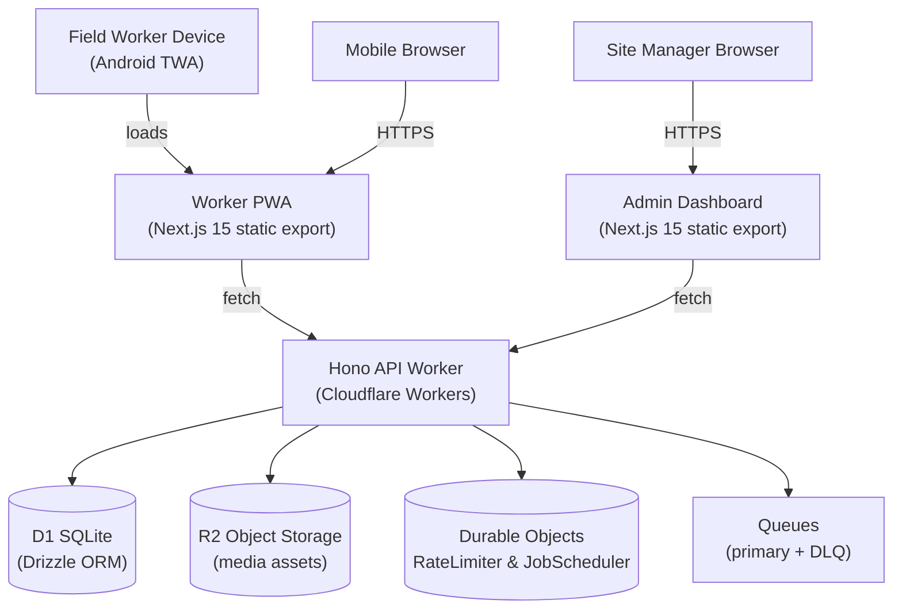

# SafetyWallet / 안전지갑

> Mobile-first PWA for construction-site safety reporting, attendance, and safety-point incentive management.
> 건설 현장의 안전 보고 · 출퇴근 · 안전 포인트 인센티브를 관리하는 모바일 우선 PWA.


## Overview / 개요

SafetyWallet is a field-worker safety platform organized as a **Turborepo monorepo** and deployed entirely on the **Cloudflare** edge. It targets construction sites where workers need a low-friction, installable mobile experience and site managers need a dashboard to triage reports, attendance, and incentive accrual.

SafetyWallet은 **Cloudflare** 엣지에 전량 배포되는 **Turborepo 모노레포** 기반의 현장 작업자 안전 플랫폼입니다. 작업자가 현장에서 마찰 없이 설치 가능한 모바일 환경을 사용하고, 현장 관리자가 보고 · 출퇴근 · 인센티브 적립을 심사할 수 있는 대시보드를 제공합니다.

The product surface is composed of:

- A **Cloudflare Worker** that hosts a **Hono** HTTP API on top of a **Drizzle / D1** data layer (`apps/api`, workspace referenced in `package.json`).
- A statically-exported **Next.js 15** *Worker PWA* (`apps/worker`) — the field-worker experience.
- A statically-exported **Next.js 15** *Admin Dashboard* (`apps/admin`, workspace referenced in `package.json`) — served from the same Worker via hostname routing.
- An **Android Trusted Web Activity (TWA)** wrapper (`apps/worker/android`) that packages the Worker PWA as a native-installable APK and verifies the hosted origin through a `manifest-checksum.txt` asset.
- A scheduled-job system backed by **Durable Objects** (`RateLimiter`, `JobScheduler`) with notification delivery through **R2** and **Queues** (primary + DLQ).
- A **Go**-based development-tooling layer (`scripts/`) that enforces lint, naming, anti-pattern, and preflight invariants at commit and push time.
- A shared **TypeScript** type package (`packages/types`, workspace referenced in `package.json`).

## Key Features / 주요 기능

- **Hazard reporting** with image / video attachments uploaded to **R2**.
- **Attendance check-in / check-out** optimized for low-bandwidth on-site use.
- **Safety-point incentive accrual** with a transparent ledger and redemption flow.
- **Admin dashboard** for triage, approvals, user management, and reporting.
- **Push notifications** delivered through Cloudflare Queues with a dead-letter queue for failed deliveries.
- **Per-IP and per-user rate limiting** via a `RateLimiter` Durable Object.
- **Scheduled jobs** (notifications, ledger sweeps, retention) orchestrated by a `JobScheduler` Durable Object.
- **Android TWA** packaging so the PWA is installable from the Play Store and integrates with the system launcher, shortcuts, and notifications.
- **Go-enforced developer invariants** — anti-pattern checks, naming conventions, and a `verify` pipeline that must pass before code is allowed to land.

## Architecture / 아키텍처



### Request path / 요청 경로

1. The **Android TWA** (`me.jclee.safetywallet.twa`) launches `LauncherActivity`, which delegates to `DelegationService` and ultimately loads the Worker PWA from its verified origin.
2. The **Worker PWA** and **Admin Dashboard** are static exports served by the same Cloudflare Worker; routing between them is performed at the edge using the incoming `Host` header.
3. The same Worker dispatches `/api/*` requests to the **Hono** router, which talks to **D1** through **Drizzle**, writes media to **R2**, and enqueues background work on **Queues**.
4. **Durable Objects** coordinate rate limiting (`RateLimiter`) and scheduled work (`JobScheduler`). Failed queue messages are routed to a **DLQ** for inspection and replay.
5. The **Worker PWA** is a Next.js 15 app that is statically exported to `apps/worker/out/` and bundled into `dist/` by the top-level `build:static` script alongside `apps/admin/out/` under `dist/admin/`.

## Repository Layout / 저장소 구조

The monorepo is laid out as follows. Workspaces declared in the root `package.json` extend the layout beyond the directories listed here — `apps/api`, `apps/admin`, and `packages/types` are referenced by build scripts even though they are not shown in this listing.

모노레포는 아래와 같이 구성됩니다. 루트 `package.json`의 `workspaces` 선언은 아래 목록을 넘어서는 디렉터리를 포함합니다. `apps/api`, `apps/admin`, `packages/types`는 빌드 스크립트에서 참조되지만 본 목록에는 포함되어 있지 않습니다.

```text
/
├── AGENTS.md                # Agent / contributor guidance (root)
├── ARCHITECTURE.md          # Deeper architecture notes
├── CODE_STYLE.md            # Coding conventions
├── CONTRIBUTING.md          # Contribution workflow
├── LICENSE                  # License terms
├── README.md                # This document
├── package.json             # Root workspace, Turbo orchestration
├── package-lock.json
├── turbo.json               # Turbo pipeline configuration
├── vitest.config.ts         # Shared Vitest config
├── playwright.config.ts     # Shared Playwright (E2E) config
├── wrangler.toml            # Cloudflare Worker / bindings config
├── apps/
│   └── worker/              # Worker PWA (Next.js 15) + Android TWA
│       ├── AGENTS.md
│       ├── I18N_IMPLEMENTATION.md
│       ├── next.config.mjs
│       ├── next-env.d.ts
│       ├── package.json
│       ├── postcss.config.cjs
│       ├── tailwind.config.js
│       ├── tsconfig.json
│       ├── vitest.config.ts
│       ├── android/         # TWA Gradle project
│       │   ├── build.gradle
│       │   ├── gradle.properties
│       │   ├── gradlew / gradlew.bat
│       │   ├── manifest-checksum.txt
│       │   ├── settings.gradle
│       │   ├── store_icon.png
│       │   ├── twa-manifest.json
│       │   ├── app/
│       │   │   ├── build.gradle
│       │   │   └── src/main/
│       │   │       ├── AndroidManifest.xml
│       │   │       ├── java/me/jclee/safetywallet/twa/
│       │   │       │   ├── Application.java
│       │   │       │   ├── DelegationService.java
│       │   │       │   └── LauncherActivity.java
│       │   │       └── res/  # icons, splash, manifest, strings
│       │   └── gradle/wrapper/
│       └── src/
│           └── app/         # Next.js App Router entry
│               ├── AGENTS.md
│               ├── error.tsx
│               ├── globals.css
│               ├── layout.tsx
│               └── page.tsx
└── scripts/                 # Repo-tooling (Go + Node)
    ├── lint-naming.js
    ├── check-wrangler-sync.js
    ├── check-anti-patterns.go
    ├── git-preflight.go
    └── verify.go
```

> The `scripts/` directory is referenced by `package.json` (`lint:naming`, `check:wrangler-sync`, `git:preflight`, `verify`) and by `lint-staged` (`check-anti-patterns.go`). It is intentionally simple Go and Node code that enforces repository-wide invariants.

## Quick Start / 빠른 시작

### Prerequisites / 사전 준비

- **Node.js** `>= 20.0.0`
- **npm** `10.8.2` (pinned via `packageManager`)
- **Go** (latest stable) — required for the `git:preflight`, `verify`, and `check-anti-patterns` scripts
- **Wrangler** — `npm i -g wrangler` for local Cloudflare emulation
- **1Password CLI (`op`)** — required for `e2e` runs that pull secrets from `.env.e2e`
- **Java / Android SDK** — only required if you intend to rebuild the TWA APK in `apps/worker/android/`

### Install / 설치

```bash
npm install
```

This installs the root toolchain and all workspace dependencies declared by Turbo.

### Run the dev pipeline / 개발 파이프라인 실행

```bash
npm run dev
```

`turbo run dev` boots every workspace in parallel: the Hono API, the Worker PWA, and the Admin Dashboard.

### Build for production / 프로덕션 빌드

```bash
npm run build
```

This runs `turbo run build` for every workspace and then `build:static`, which assembles the final `dist/` directory:

```text
dist/
├── (worker PWA static export from apps/worker/out)
└── admin/
    └── (admin dashboard static export from apps/admin/out)
```

### Deploy / 배포

Deployment is **Git-ref driven** and runs from CI on the `master` branch. Manual deploys are intentionally disabled:

```bash
npm run deploy:api
# -> Error: Manual deploy is disabled. Deploy is Git-ref driven via CI on master.
```

To cut a release, push a semver tag or merge into `master`; CI handles the rest.

## Configuration / 설정

### Cloudflare bindings / Cloudflare 바인딩

`wrangler.toml` at the repository root declares the Cloudflare bindings used by the Worker:

- **D1** database binding (consumed through Drizzle in `apps/api`).
- **R2** bucket binding for hazard-report attachments.
- **Queues** producer / consumer bindings, including a **DLQ** for failed deliveries.
- **Durable Object** bindings for `RateLimiter` and `JobScheduler`.

The `check:wrangler-sync` script verifies that the bindings referenced from source code match what is declared in `wrangler.toml`. Run it after editing either side:

```bash
npm run check:wrangler-sync
```

### Secrets / 비밀값

- **E2E secrets** are loaded from `.env.e2e` via `op run --env-file=.env.e2e`. The `.env.e2e` file is **not** committed; obtain it from 1Password.
- **Runtime secrets** (API keys, signing keys) are configured as encrypted Cloudflare Worker secrets and are not part of the repository.

### TypeScript / ESLint / Prettier

- Shared formatting and lint rules are inherited from the root `package.json` `overrides` and from each workspace.
- `npm run format` applies Prettier; `npm run format:check` validates formatting in CI.
- `npm run lint` runs ESLint across every workspace.

## Commands Reference / 명령어 레퍼런스

| Command / 명령어 | Description / 설명 |
| --- | --- |
| `npm run dev` | Start every workspace in dev mode (Turbo parallel). |
| `npm run build` | Build every workspace and assemble the static `dist/` artifact. |
| `npm run build:api` | Build only the API workspace chain (`packages/types` → `apps/api`). |
| `npm run build:static` | Re-assemble `dist/` from existing `out/` directories. |
| `npm run build:one-worker` | Convenience alias for `build:api` when iterating on the Worker only. |
| `npm run typecheck` | Run `tsc --noEmit` across every workspace. |
| `npm run lint` | Run ESLint across every workspace. |
| `npm run lint:naming` | Enforce naming conventions via `scripts/lint-naming.js`. |
| `npm run check:wrangler-sync` | Verify Cloudflare bindings stay in sync with `wrangler.toml`. |
| `npm run git:preflight` | Run the Go preflight checks before push. |
| `npm run verify` | Full Go-driven verification pipeline. |
| `npm run test` | Run Vitest in every workspace. |
| `npm run test:coverage` | Run Vitest with coverage reporting. |
| `npm run e2e` | Run Playwright E2E tests with secrets loaded from 1Password. |
| `npm run e2e:headed` | Same as `e2e` but with a visible browser. |
| `npm run e2e:ui` | Launch the Playwright UI mode. |
| `npm run db:generate` | Generate Drizzle migrations / typed schema in `apps/api`. |
| `npm run format` / `format:check` | Apply or verify Prettier formatting. |
| `npm run clean` | Wipe build outputs and `node_modules`. |
| `npm run deploy:api` | Intentionally disabled — exits non-zero. |

## Local Development / 로컬 개발

### Day-to-day workflow / 일상 워크플로

1. Branch from `master` and create a feature branch.
2. Run `npm install` if you have not pulled the latest lockfile.
3. `npm run dev` and iterate on the PWA, dashboard, and API together.
4. Before pushing, run:
   - `npm run lint`
   - `npm run typecheck`
   - `npm run test`
   - `npm run verify` (the Go verification pipeline)
   - `npm run check:wrangler-sync` if you touched Worker bindings or `wrangler.toml`
5. Husky hooks installed by `prepare` run `go run scripts/check-anti-patterns.go` and `prettier --write` on staged files via `lint-staged`.

### Working on the Worker PWA / Worker PWA 작업

The Next.js 15 app lives in `apps/worker/src/app/`. Static export is configured in `apps/worker/next.config.mjs`, and the output is consumed by `build:static`. Tailwind / PostCSS configs are colocated with the workspace.

### Working on the Android TWA / Android TWA 작업

The TWA project is a standard Gradle build under `apps/worker/android/`. Notable files:

- `twa-manifest.json` — Bubblewrap-style manifest describing the hosted PWA origin.
- `manifest-checksum.txt` — SHA-256 checksum the TWA uses to verify the hosted origin at runtime.
- `app/src/main/AndroidManifest.xml` — Declares `me.jclee.safetywallet.twa` as the application id and registers the launcher activity, file provider, and shortcuts.
- `app/src/main/java/me/jclee/safetywallet/twa/` — `Application`, `DelegationService`, and `LauncherActivity` implementations.
- `app/src/main/res/` — Launcher icons, maskable icons, splash screens, notification icon, and the bundled `web_app_manifest.json`.

To rebuild the APK:

```bash
cd apps/worker/android
./gradlew assembleRelease
```

### Working on scheduled jobs / 스케줄 작업

- Define jobs in the API workspace and register them with the `JobScheduler` Durable Object.
- Use `RateLimiter` to protect any external endpoint that may be abused (e.g., hazard-report submission).
- All queue producers must have a paired DLQ consumer; the verifier in `scripts/verify.go` enforces this.

## Testing / 테스트

### Unit tests / 단위 테스트

Vitest is configured at the root (`vitest.config.ts`) and per workspace (`apps/worker/vitest.config.ts`).

```bash
npm run test              # run all unit tests
npm run test:coverage     # run all unit tests with coverage
```

### End-to-end tests / E2E 테스트

Playwright is configured at the root (`playwright.config.ts`). E2E runs **require** 1Password CLI access to load secrets:

```bash
npm run e2e         # headless
npm run e2e:headed  # visible browser
npm run e2e:ui      # Playwright UI mode
```

If `op` is not available, the runs will fail fast with a clear error — by design, to prevent committing test-only secrets to the repository.

### Static analysis / 정적 분석

- `npm run lint` — ESLint.
- `npm run typecheck` — TypeScript project references.
- `npm run verify` — Go-driven checks that complement the JS toolchain (cross-workspace invariants, schema sanity, anti-patterns).

## Contributing / 기여 가이드

1. Read `CONTRIBUTING.md`, `CODE_STYLE.md`, `ARCHITECTURE.md`, and the per-app `AGENTS.md` notes before opening a pull request.
2. Create a feature branch from `master` using the naming convention enforced by `npm run lint:naming`.
3. Make focused commits. Husky + `lint-staged` will run `go run scripts/check-anti-patterns.go` and Prettier on staged files automatically.
4. Before pushing, run `npm run git:preflight`. The push hook re-runs the same checks at the branch level.
5. Open a pull request against `master`. CI will run `lint`, `typecheck`, `test`, `e2e` (against a staging environment), and `verify`.
6. Deployment is automatic once the PR is merged to `master` — there is no manual deploy step.

### Coding conventions / 코딩 규약

- TypeScript strict mode is on; avoid `any`, prefer narrow types from `packages/types`.
- Keep Cloudflare bindings declarative — never hardcode IDs in source. Use `wrangler.toml` as the single source of truth.
- Server logic lives in `apps/api` (Hono routes + Drizzle). Frontends in `apps/worker` and `apps/admin` are presentation-only and must not embed secrets.
- The TWA wrapper must keep `manifest-checksum.txt` in sync with the deployed PWA origin. CI will fail a release if the checksum drifts.

## License / 라이선스

This repository is distributed under the terms described in [`LICENSE`](./LICENSE). It is a private project unless explicitly relicensed.

이 저장소는 [`LICENSE`](./LICENSE)에 명시된 조건 하에 배포됩니다. 명시적으로 재라이선스되지 않는 한 비공개 프로젝트입니다.