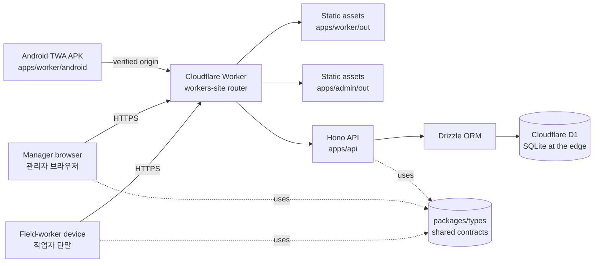

# SafetyWallet / 안전지갑

> Mobile-first PWA for construction-site safety reporting, attendance, and safety-point incentive management.
> 건설 현장의 안전 보고 · 출퇴근 · 안전 포인트 인센티브를 관리하는 모바일 우선 PWA.


---

## Overview / 개요

SafetyWallet is a field-worker safety platform organized as a **Turborepo monorepo** and deployed entirely on the **Cloudflare** edge. It targets construction sites where workers need a low-friction, installable mobile experience and site managers need a dashboard to triage reports, attendance, and incentive accrual.

SafetyWallet은 **Cloudflare** 엣지에 전량 배포되는 **Turborepo 모노레포** 기반의 현장 작업자 안전 플랫폼입니다. 작업자가 현장에서 마찰 없이 설치 가능한 모바일 환경을 사용하고, 현장 관리자가 보고 · 출퇴근 · 인센티브 적립을 심사할 수 있는 대시보드를 제공합니다.

### Product Surfaces / 제품 구성

| Surface / 표면 | Path | Purpose / 용도 |
| --- | --- | --- |
| Field-worker PWA / 작업자 PWA | `apps/worker` | Statically exported Next.js 15 application. The primary mobile experience installed on devices. / 현장 작업자가 설치하여 사용하는 정적 배포 Next.js 15 앱 |
| Admin Dashboard / 관리자 대시보드 | `apps/admin` | Statically exported Next.js 15 dashboard served from the same Worker via hostname routing. / 동일 Worker에서 호스트명 라우팅으로 제공되는 관리자 대시보드 |
| API Worker / API Worker | `apps/api` | Cloudflare Worker hosting the **Hono** HTTP API on a **Drizzle / D1** data layer. / **Hono** HTTP API와 **Drizzle / D1** 데이터 계층을 호스팅하는 Cloudflare Worker |
| Android TWA / Android 신뢰 웹 활동 | `apps/worker/android` | Native-installable APK wrapping the Worker PWA, with origin verification through a `manifest-checksum.txt` asset. / Worker PWA를 네이티브 APK로 래핑한 신뢰 웹 활동. `manifest-checksum.txt` 자산으로 출처(origin) 검증 |
| Shared types / 공유 타입 | `packages/types` | Workspace-shared TypeScript contracts used by the API, the PWA, and the dashboard. / API · PWA · 대시보드가 공유하는 TypeScript 계약 |

---

## Features / 주요 기능

- **Mobile-first PWA / 모바일 우선 PWA** — Installable, low-bandwidth UI for workers in the field. 작업자 현장 사용을 위한 설치 가능 · 저대역폭 UI.
- **Safety reporting / 안전 보고** — Submit and triage incidents, near-misses, and observations. 사고 · 아차사고 · 관찰 사항을 접수하고 심사합니다.
- **Attendance tracking / 출퇴근 관리** — On-site check-in/out with audit trail. 현장 출퇴근 기록과 감사 추적.
- **Safety-point incentives / 안전 포인트 인센티브** — Points accrue from approved reports and attendance, redeemable by the worker. 승인된 보고와 출퇴근 기반으로 포인트가 적립되어 작업자가 사용합니다.
- **Admin dashboard / 관리자 대시보드** — Triages reports, reviews attendance, and audits point ledger entries. 보고 심사, 출퇴근 검토, 포인트 원장 감사.
- **Android TWA / Android 신뢰 웹 활동** — Distribute the same PWA as an installable APK with verified origin. 동일한 PWA를 출처가 검증된 설치형 APK로 배포.
- **Edge-native deployment / 엣지 네이티브 배포** — All runtime is on Cloudflare Workers, with D1 for persistence. 모든 런타임이 Cloudflare Workers에 배포되며 D1로 데이터를 보관.

---

## Architecture / 아키텍처

The runtime is split between static assets (PWA, admin) and an edge API, both served from the same Cloudflare deployment. The PWA and admin builds are produced by Next.js 15 with `output: "export"` and uploaded as Workers static assets. The API is a Hono application bound to a D1 database via Drizzle ORM. The Android TWA wraps the PWA origin, enforcing integrity with `manifest-checksum.txt`.

런타임은 정적 자산(PWA · 관리자)과 엣지 API로 분리되어 동일 Cloudflare 배포에서 제공됩니다. PWA와 관리자는 Next.js 15의 `output: "export"`로 빌드되어 Workers 정적 자산으로 업로드됩니다. API는 D1 데이터베이스에 Drizzle ORM으로 바인딩된 Hono 애플리케이션입니다. Android TWA는 PWA 출처를 래핑하며 `manifest-checksum.txt`로 무결성을 강제합니다.



### Key Architectural Decisions / 핵심 설계 결정

- **Single Worker, hostname routing / 단일 Worker, 호스트명 라우팅** — One Worker handles both the PWA and admin origins and the `/api/*` routes. PWA · 관리자 오리진과 `/api/*` 라우트를 하나의 Worker가 처리합니다.
- **Static export / 정적 내보내기** — `output: "export"` keeps the PWA free of a Node.js server and lets the edge serve it as assets. `output: "export"`로 PWA를 자산화하여 엣지에서 직접 제공합니다.
- **Type sharing / 타입 공유** — `packages/types` is the single source of truth for request/response shapes, consumed by API, PWA, and admin. `packages/types`가 요청/응답 형태의 단일 출처이며 API · PWA · 관리자가 모두 참조합니다.
- **D1 + Drizzle / D1과 Drizzle** — SQLite at the edge with a typed schema and migration story. 엣지에서 동작하는 SQLite 위에 타입이 있는 스키마와 마이그레이션 도구를 사용합니다.
- **TWA integrity / TWA 무결성** — `manifest-checksum.txt` is generated and verified so the Android shell cannot be repointed. `manifest-checksum.txt`로 Android 셸이 다른 출처로 변조되지 않도록 검증합니다.

---

## Repository Layout / 저장소 구조

```text
safetywallet/
├── apps/
│   ├── worker/                # Field-worker PWA (Next.js 15, static export)
│   │   ├── src/app/           # App Router entry: layout, page, error, globals.css
│   │   └── android/           # TWA Gradle project wrapping the PWA
│   ├── admin/                 # Admin dashboard (Next.js 15, static export)
│   └── api/                   # Cloudflare Worker hosting the Hono API
├── packages/
│   └── types/                 # Shared TypeScript contracts across surfaces
├── scripts/                   # Repository-level tooling (lint, verify, preflight)
├── AGENTS.md                  # Agent operating instructions
├── ARCHITECTURE.md            # Detailed architecture notes
├── CODE_STYLE.md              # Coding conventions
├── CONTRIBUTING.md            # Contribution guide
├── playwright.config.ts       # E2E test configuration
├── turbo.json                 # Turborepo pipeline configuration
├── vitest.config.ts           # Unit test configuration
├── wrangler.toml              # Cloudflare Workers configuration
├── package.json               # Root workspaces, scripts, dev tooling
└── package-lock.json          # Locked dependency graph
```

---

## Quick Start / 빠른 시작

### Prerequisites / 사전 요구 사항

- **Node.js** ≥ 20.0.0
- **npm** 10.8.2 (matches `packageManager` in the root `package.json`)
- **Wrangler** (installed per workspace) for local Workers development
- **1Password CLI (`op`)** for E2E secret injection into Playwright runs

### Install / 설치

```bash
npm install
```

### Develop / 개발

```bash
npm run dev
```

This starts every workspace declared in `turbo.json` concurrently — the API, the worker PWA, and the admin dashboard. Use a single Turborepo filter when you only want one surface:

전체 워크스페이스를 동시에 실행합니다. 한 표면만 필요하면 Turborepo 필터를 사용하세요.

```bash
npx turbo run dev --filter=apps/api
npx turbo run dev --filter=apps/worker
npx turbo run dev --filter=apps/admin
```

### Build / 빌드

```bash
npm run build
```

The pipeline runs every workspace build, then assembles `dist/` with the worker PWA at the root and the admin app under `dist/admin/`.

루트 파이프라인은 각 워크스페이스 빌드를 실행한 다음 `dist/`에 작업자 PWA를 루트로, 관리자 앱을 `dist/admin/` 아래에 모읍니다.

```bash
npm run build:api          # Build the API worker only / API Worker만 빌드
npm run build:static       # Re-assemble dist/ from existing out/ folders
npm run build:one-worker   # API + types only, for fast iteration / 빠른 반복용
```

---

## Configuration / 설정

| File / 파일 | Purpose / 용도 |
| --- | --- |
| `wrangler.toml` | Cloudflare Worker bindings, routes, and environment names. / Cloudflare Worker 바인딩 · 라우트 · 환경 이름 |
| `turbo.json` | Turborepo pipeline (build, dev, lint, test, typecheck) and task dependencies. / Turborepo 파이프라인과 의존 관계 |
| `vitest.config.ts` | Root-level Vitest configuration. / 루트 Vitest 설정 |
| `playwright.config.ts` | Playwright E2E test configuration. / Playwright E2E 설정 |
| `apps/worker/twa-manifest.json` | TWA manifest driving `manifest-checksum.txt` and Android packaging. / `manifest-checksum.txt` 및 Android 패키징에 사용되는 TWA 매니페스트 |
| `apps/worker/android/manifest-checksum.txt` | Integrity artifact verified by the Android shell. / Android 셸이 검증하는 무결성 자산 |
| `.env.e2e` | Local-only E2E secret file consumed via `op run`. / `op run`으로 주입되는 E2E 비밀 파일 |

### Environment Variables / 환경 변수

Set these in `wrangler.toml` (per environment) or in `.env.e2e` for local Playwright runs:

`wrangler.toml`의 환경별 섹션 또는 로컬 Playwright 실행용 `.env.e2e`에 설정합니다.

- `DB` — D1 binding name (default: `DB`). / D1 바인딩 이름
- `ENVIRONMENT` — `development` | `staging` | `production`. / 실행 환경
- `JWT_SECRET` — Token signing secret for the API. / API 토큰 서명 비밀
- `TWA_ORIGIN` — The HTTPS origin the Android shell is allowed to load. / Android 셸이 로드할 수 있는 HTTPS 출처

---

## Commands Reference / 명령어 참조

| Command / 명령 | Description / 설명 |
| --- | --- |
| `npm run dev` | Run all workspace dev servers via Turborepo. / 모든 워크스페이스 개발 서버 실행 |
| `npm run build` | Build all workspaces, then assemble `dist/`. / 모든 워크스페이스 빌드 후 `dist/` 조립 |
| `npm run build:api` | Build the API surface only. / API 표면만 빌드 |
| `npm run build:static` | Rebuild `dist/` from existing `out/` folders. / 기존 `out/`에서 `dist/` 재조립 |
| `npm run lint` | Run lint across all workspaces. / 모든 워크스페이스 린트 |
| `npm run lint:naming` | Run the custom naming linter. / 명명 규칙 커스텀 린터 실행 |
| `npm run typecheck` | Run TypeScript checks across workspaces. / 워크스페이스 전체 타입 검사 |
| `npm run test` | Run Vitest in every workspace. / 모든 워크스페이스에서 Vitest 실행 |
| `npm run test:coverage` | Run Vitest with coverage. / 커버리지 포함 Vitest 실행 |
| `npm run check:wrangler-sync` | Verify `wrangler.toml` matches the expected schema. / `wrangler.toml` 동기화 검증 |
| `npm run git:preflight` | Repository pre-commit checks via Go script. / Go 스크립트로 사전 커밋 점검 |
| `npm run verify` | End-to-end repository verification. / 저장소 통합 검증 |
| `npm run format` | Format with Prettier. / Prettier 포맷 |
| `npm run format:check` | Verify formatting only. / 포맷만 검사 |
| `npm run clean` | Remove build outputs and `node_modules`. / 빌드 산출물과 `node_modules` 제거 |
| `npm run db:generate` | Generate Drizzle artifacts inside `apps/api`. / `apps/api` 내부 Drizzle 산출물 생성 |
| `npm run e2e` | Playwright run with secrets from `op`. / `op`로 비밀을 주입한 Playwright 실행 |
| `npm run e2e:headed` | Headed Playwright run. / 헤드 모드 Playwright 실행 |
| `npm run e2e:ui` | Playwright UI mode. / Playwright UI 모드 |
| `npm run deploy:api` | Refuses manual deploys — API deploys are Git-ref driven via CI on `master`. / 수동 배포 거부 — `master` CI가 Git-ref 기반으로 배포 |

---

## Local Development / 로컬 개발

### Per-surface workflow / 표면별 워크플로우

- **API (`apps/api`)** — Use `wrangler dev` for a faithful edge runtime, or `npm run dev` from the root for a coordinated run. / `wrangler dev`로 엣지 런타임을 충실히 재현하거나 루트의 `npm run dev`로 통합 실행합니다.
- **Worker PWA (`apps/worker`)** — Next.js dev server with hot reload. Configure the API base URL via the shared types package. / 핫 리로드가 가능한 Next.js 개발 서버. API 기본 URL은 공유 타입 패키지에서 설정합니다.
- **Admin (`apps/admin`)** — Same as the worker PWA, but uses the admin hostname for local routing. / 작업자 PWA와 동일하지만 로컬 라우팅에서 관리자 호스트명을 사용합니다.
- **Android TWA (`apps/worker/android`)** — Build the PWA first, then run Gradle to package the APK. The `manifest-checksum.txt` is generated from the production build. / PWA를 먼저 빌드한 다음 Gradle로 APK를 패키징합니다. `manifest-checksum.txt`는 프로덕션 빌드에서 생성됩니다.

### Database / 데이터베이스

D1 migrations and Drizzle schema live in `apps/api`. Generate Drizzle artifacts before running migrations:

D1 마이그레이션과 Drizzle 스키마는 `apps/api`에 있습니다. 마이그레이션 실행 전 Drizzle 산출물을 생성하세요.

```bash
npm run db:generate --workspace=apps/api
```

For local D1 iteration use `wrangler d1 execute` against a local database file.

로컬 D1은 `wrangler d1 execute`로 로컬 데이터베이스 파일에 대해 실행합니다.

---

## Testing / 테스트

- **Unit tests / 단위 테스트** — Vitest, configured at the root and in each workspace. Run via `npm run test` or `npm run test:coverage`. / 루트와 각 워크스페이스에 설정된 Vitest. `npm run test` 또는 `npm run test:coverage`로 실행합니다.
- **End-to-end tests / E2E 테스트** — Playwright, run with secrets injected by 1Password CLI. / Playwright는 1Password CLI로 비밀을 주입하여 실행합니다.

  ```bash
  npm run e2e
  npm run e2e:headed
  npm run e2e:ui
  ```

- **Naming lint / 명명 린트** — Custom JavaScript linter enforcing naming conventions. / 명명 규칙을 강제하는 커스텀 JavaScript 린터.

  ```bash
  npm run lint:naming
  ```

- **Pre-commit / 커밋 전 검사** — `husky` runs the `lint-staged` pipeline (custom Go anti-pattern check, Prettier) on staged files. / `husky`가 staged 파일에 대해 커스텀 Go 안티패턴 검사와 Prettier를 실행합니다.

---

## Contribution Guide / 기여 가이드

- Read `CONTRIBUTING.md`, `CODE_STYLE.md`, and `ARCHITECTURE.md` before opening a pull request. / PR을 열기 전 `CONTRIBUTING.md` · `CODE_STYLE.md` · `ARCHITECTURE.md`를 읽어 주세요.
- Follow the workspace layout in `turbo.json`; new surfaces should declare their own `build`, `dev`, `lint`, `test`, and `typecheck` tasks. / `turbo.json`의 워크스페이스 구조를 따르세요. 새로운 표면은 자체 `build` · `dev` · `lint` · `test` · `typecheck` 작업을 선언해야 합니다.
- Database changes go through Drizzle: generate the artifacts, commit the migration, and update `packages/types` if contracts change. / 데이터베이스 변경은 Drizzle로 진행합니다. 산출물을 생성하고 마이그레이션을 커밋하며, 계약이 바뀌면 `packages/types`를 갱신하세요.
- Keep PRs scoped to a single workspace when possible. / 가능하면 PR을 단일 워크스페이스 범위로 한정하세요.
- All checks — `lint`, `typecheck`, `test`, `format:check`, `lint:naming`, and `check:wrangler-sync` — must pass before review. / 리뷰 전 `lint` · `typecheck` · `test` · `format:check` · `lint:naming` · `check:wrangler-sync`가 모두 통과해야 합니다.
- The API is deployed automatically by CI on `master`; manual deploy is intentionally disabled. / API는 `master` CI가 자동으로 배포하며 수동 배포는 의도적으로 비활성화되어 있습니다.

---

## License / 라이선스

This repository is private. All rights reserved. See `LICENSE` for the full notice.

이 저장소는 비공개입니다. 모든 권리를 보유합니다. 전문은 `LICENSE`를 참고하세요.