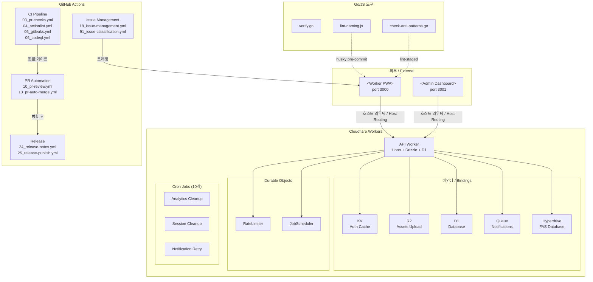
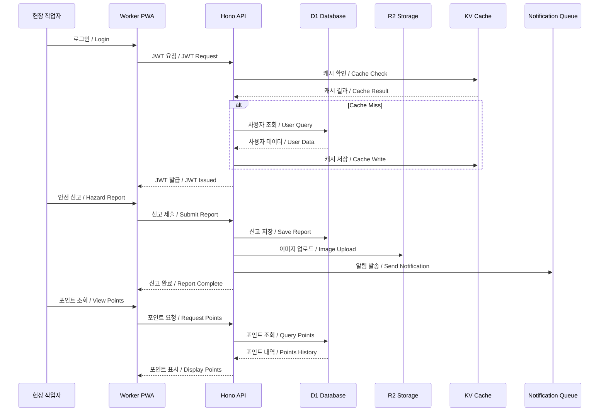
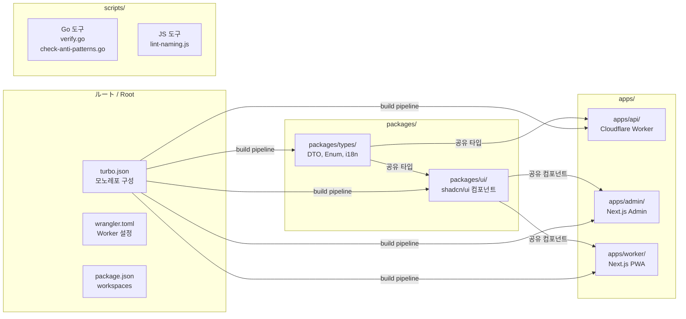

# SafetyWallet README

```markdown
# SafetyWallet

> 건설 현장 안전 관리 플랫폼 / Construction Site Safety Management Platform

[](LICENSE)
[](https://nodejs.org/)
[](https://www.npmjs.com/)
[](https://www.typescriptlang.org/)
[](https://workers.cloudflare.com/)
[](https://turbo.build/)

---

## 목차 / Table of Contents

- [개요 / Overview](#개요--overview)
- [주요 기능 / Features](#주요-기능--features)
- [아키텍처 / Architecture](#아키텍처--architecture)
- [자동화 인벤토리 / Automation Inventory](#자동화-인벤토리--automation-inventory)
- [빠른 시작 / Quick Start](#빠른-시작--quick-start)
- [로컬 개발 / Local Development](#로컬-개발--local-development)
- [명령어 참조 / Commands Reference](#명령어-참조--commands-reference)
- [기여 가이드 / Contributing Guide](#기여-가이드--contributing-guide)
- [라이선스 / License](#라이선스--license)

---

## 개요 / Overview

SafetyWallet은 건설 현장의 안전 관리, 교육, 게시/투표, 리뷰, 포인트, 사용자/현장 관리 기능을 위한 TypeScript 기반 모노레포입니다.

SafetyWallet is a TypeScript-based monorepo for construction-site safety management, education, posts/votes, reviews, points, users, and site-management workflows.

이 저장소는 다음과 같은 구성요소를 포함합니다.

This repository contains the following main components:

| 구성 요소 / Component | 설명 / Description |
|---|---|
| `apps/api` | Cloudflare Workers 기반 API 애플리케이션 (Hono + Drizzle + D1) |
| `apps/admin` | Next.js 15 관리자 대시보드 (port 3001, 정적 내보내기) |
| `apps/worker` | Next.js 15 워커 PWA (port 3000, 정적 내보내기) |
| `packages/types` | 공유 API 타입, DTO, enum, 다국어(i18n) 리소스 |
| `packages/ui` | 공유 React UI 컴포넌트 (shadcn/ui + Tailwind v4) |

**기술 스택 / Tech Stack:**

- **런타임:** Node.js ≥20, Cloudflare Workers
- **언어:** TypeScript
- **API:** Hono 프레임워크 + Drizzle ORM + D1 (SQLite)
- **프론트엔드:** Next.js 15 (App Router, 정적 내보내기)
- **UI:** shadcn/ui + Tailwind CSS v4
- **모노레포:** Turborepo
- **ORM:** Drizzle (31개 마이그레이션, 34개 테이블)
- **테스트:** Vitest + Playwright
- **CI/CD:** GitHub Actions

---

## 주요 기능 / Features

### 현장 관리 / Site Management
- 현장 생성, 수정, 삭제 및 상태 관리
- 현장별 회원 관리 및 권한 할당

### 안전 교육 / Safety Education
- 교육 콘텐츠 관리 (영상, 문서, 퀴즈)
- 교육 이수 추적 및 성적 관리
- AI 기반 교육 콘텐츠 지원

### 근태 관리 / Attendance
- 출퇴근 기록 (R2 + ACETIME_BUCKET 연동)
- 현장별 출석 통계

### 안전 신고 / Hazard Reporting
- 위험 요소 신고 및 사진 업로드 (R2)
- 신고 처리 및 상태 추적

### 포인트 시스템 / Points System
- 안전 활동 포인트 적립 및 사용
- 포인트 내역 조회

### 게시 및 투표 / Posts & Votes
- 현장별 게시판
- 투표 생성 및 참여

### 리뷰 및 공지 / Reviews & Announcements
- 현장 리뷰 관리
- 공지사항 작성 및 배포

### 알림 시스템 / Notifications
- Queue 기반 비동기 알림
- DLQ(Dead Letter Queue) 지원

---

## 아키텍처 / Architecture

### 시스템 흐름도 / System Flow



### 데이터 흐름 / Data Flow



### 모노레포 구조 / Monorepo Structure



---

## 자동화 인벤토리 / Automation Inventory

### GitHub Actions 워크플로우 / Workflow Files

#### 브랜치 및 PR 관리 / Branch & PR Management

| 워크플로우 / Workflow | 설명 / Description |
|---|---|
| `01_branch-to-pr.yml` | 브랜치에서 PR로 자동 전환 |
| `02_issue-to-branch.yml` | 이슈 생성 시 자동으로 브랜치 생성 |
| `03_pr-checks.yml` | PR 기본 검사 파이프라인 |
| `09_semantic-pr.yml` | 시맨틱 PR 커밋 검증 |
| `13_pr-auto-merge.yml` | 조건 충족 시 자동 병합 |
| `15_merged-pr-cleanup.yml` | 병합 후 브랜치 정리 |

#### 코드 품질 / Code Quality

| 워크플로우 / Workflow | 설명 / Description |
|---|---|
| `04_actionlint.yml` | GitHub Actions YAML 린트 |
| `05_gitleaks.yml` | 시크릿 스캔 |
| `06_codeql.yml` | CodeQL 정적 분석 |
| `07_dependency-review.yml` | 의존성 보안 검토 |
| `08_scorecard.yml` | OpenSSF Scorecard 평가 |

#### PR 자동화 / PR Automation

| 워크플로우 / Workflow | 설명 / Description |
|---|---|
| `10_pr-review.yml` | AI PR 리뷰 (qodo-ai/pr-agent 활용) |
| `14_bot-auto-fix.yml` | 자동 수정 봇 |
| `42_reusable-pr-checks.yml` | 재사용 가능 PR 검사 |

#### 이슈 관리 / Issue Management

| 워크플로우 / Workflow | 설명 / Description |
|---|---|
| `18_issue-management.yml` | 이슈 상태 관리 |
| `19_issue-backfill.yml` | 이슈 데이터 백필 |
| `91_issue-classification.yml` | 이슈 자동 분류 |
| `43_reusable-issue-management.yml` | 재사용 가능 이슈 관리 |

#### 문서화 / Documentation

| 워크플로우 / Workflow | 설명 / Description |
|---|---|
| `20_readme-gen.yml` | README 자동 생성 |
| `21_docs-sync.yml` | 문서 동기화 |
| `42_reusable-docs-sync.yml` | 재사용 가능 문서 동기화 |

#### 릴리스 및 배포 / Release & Deploy

| 워크플로우 / Workflow | 설명 / Description |
|---|---|
| `24_release-notes.yml` | 자동 릴리스 노트 생성 |
| `25_release-publish.yml` | 릴리스 게시 및 배포 |
| `29_downstream-health-check.yml` | 하위 서비스 상태 확인 |

#### CI/CD 운영 / CI/CD Operations

| 워크플로우 / Workflow | 설명 / Description |
|---|---|
| `60_ci-auto-heal.yml` | CI 실패 자동 복구 |
| `37_ci-failure-issues.yml` | CI 실패 시 이슈 생성 |
| `12_dependabot-auto-merge.yml` | Dependabot 자동 병합 |

#### 보안 / Security

| 워크플로우 / Workflow | 설명 / Description |
|---|---|
| `security/11_pr-review.yml` | 보안 강화 PR 리뷰 |
| `45_reusable-gitleaks.yml` | 재사용 가능 시크릿 스캔 |

#### 공통 워크플로우 / Common Workflows

| 워크플로우 / Workflow | 설명 / Description |
|---|---|
| `auto-merge.yml` | 공통 자동 병합 |
| `ci.yml` | 기본 CI 파이프라인 |
| `labeler.yml` | 자동 라벨링 |
| `standard-ci.yml` | 표준 CI 템플릿 |
| `welcome.yml` | 신규 기여자 환영 메시지 |

### 자동화 도구 / Automation Tools

#### Go 스크립트 / Go Scripts

| 도구 / Tool | 용도 / Purpose |
|---|---|
| `scripts/verify.go` | 저장소 상태 검증 |
| `scripts/check-anti-patterns.go` | 안티 패턴 검사 (lint-staged 연동) |
| `scripts/git-preflight.go` | Git 사전 확인 |

#### JavaScript 스크립트 / JS Scripts

| 도구 / Tool | 용도 / Purpose |
|---|---|
| `scripts/lint-naming.js` | 네이밍 컨벤션 검사 |
| `scripts/check-wrangler-sync.js` | Wrangler 설정 동기화 확인 |

#### 외부 서비스 활용 / External Services

| 서비스 / Service | 용도 / Purpose |
|---|---|
| qodo-ai/pr-agent | AI 기반 PR 리뷰 (10_pr-review.yml) |
| cliproxy (<https://cliproxy.jclee.me/v1>) | CI 프록시 및 외부 연동 |

---

## 빠른 시작 / Quick Start

### 전제 조건 / Prerequisites

- Node.js ≥20.0.0
- npm 10.8.2 이상
- Git

### 설치 / Installation

```bash
# 저장소 클론
git clone <repository-url>
cd safetywallet

# 의존성 설치
npm install

# Husky 훅 설정
npm run prepare
```

### 환경 설정 / Environment Setup

```bash
# E2E 테스트 환경 파일 복사
cp .env.e2e.example .env.e2e

# 필요시 환경 변수 편집
vim .env.e2e
```

### 개발 서버 시작 / Start Development Servers

```bash
# 전체 개발 서버 시작 (모든 워크스페이스)
npm run dev

# 개별 앱만 실행
npm run dev --workspace=apps/api
npm run dev --workspace=apps/admin
npm run dev --workspace=apps/worker
```

---

## 로컬 개발 / Local Development

### 프로젝트 구조 / Project Structure

```
safetywallet/
├── apps/
│   ├── api/              # Cloudflare Worker API
│   ├── admin/            # Next.js Admin Dashboard (port 3001)
│   └── worker/           # Next.js Worker PWA (port 3000)
├── packages/
│   ├── types/            # 공유 타입, DTO, i18n
│   └── ui/               # 공유 UI 컴포넌트
├── scripts/              # Go/JS 자동화 도구
├── e2e/                  # Playwright E2E 테스트
├── .github/
│   └── workflows/        # GitHub Actions CI/CD
├── wrangler.toml         # Cloudflare Workers 설정
└── turbo.json            # Turborepo 파이프라인
```

### Cloudflare Workers 로컬 개발

```bash
# API 개발 서버 실행 (Wrangler)
cd apps/api
npx wrangler dev

# 프로덕션 빌드
npm run build:api
```

### 데이터베이스 마이그레이션 / Database Migration

```bash
# Drizzle 마이그레이션 생성
npm run db:generate

# 마이그레이션 적용 (本地)
cd apps/api
npx wrangler d1 migrations apply safetywallet --local
```

### 테스트 실행 / Running Tests

```bash
# 모든 테스트 실행
npm run test

# 커버리지 포함 테스트
npm run test:coverage

# E2E 테스트
npm run e2e

# E2E 헤드리스 모드
npm run e2e:headed

# Playwright UI 모드
npm run e2e:ui
```

---

## 명령어 참조 / Commands Reference

### 빌드 명령 / Build Commands

| 명령어 / Command | 설명 / Description |
|---|---|
| `npm run build` | 전체 빌드 (types → ui → apps) |
| `npm run build:api` | API만 빌드 |
| `npm run build:static` | 정적 파일 빌드 (worker + admin) |
| `npm run build:one-worker` | 단일 워커 빌드 |

### 개발 명령 / Development Commands

| 명령어 / Command | 설명 / Description |
|---|---|
| `npm run dev` | 모든 앱 개발 서버 시작 |
| `npm run dev --workspace=apps/api` | API 개발 서버만 시작 |
| `npm run dev --workspace=apps/admin` | Admin 개발 서버만 시작 |
| `npm run dev --workspace=apps/worker` | Worker 개발 서버만 시작 |

### 코드 품질 명령 / Code Quality Commands

| 명령어 / Command | 설명 / Description |
|---|---|
| `npm run lint` | 모든 워크스페이스 린트 실행 |
| `npm run lint:naming` | 네이밍 컨벤션 검사 |
| `npm run format` | Prettier 포맷팅 (쓰기) |
| `npm run format:check` | Prettier 포맷팅 (확인만) |
| `npm run typecheck` | TypeScript 타입 검사 |

### 테스트 명령 / Test Commands

| 명령어 / Command | 설명 / Description |
|---|---|
| `npm run test` | Vitest 유닛 테스트 |
| `npm run test:coverage` | 커버리지 포함 테스트 |
| `npm run e2e` | Playwright E2E 테스트 |
| `npm run e2e:headed` | 헤드리스 E2E 테스트 |
| `npm run e2e:ui` | Playwright UI 모드 |

### 배포 명령 / Deploy Commands

| 명령어 / Command | 설명 / Description |
|---|---|
| `npm run deploy:api` | 수동 배포 비활성화 (CI로 자동 배포) |

### 유틸리티 명령 / Utility Commands

| 명령어 / Command | 설명 / Description |
|---|---|
| `npm run check:wrangler-sync` | Wrangler 동기화 확인 |
| `npm run git:preflight` | Git 사전 확인 (Go) |
| `npm run verify` | 저장소 검증 (Go) |
| `npm run clean` | 빌드 artifacts 정리 |
| `npm run db:generate` | Drizzle 마이그레이션 생성 |

### Git 훅 / Git Hooks

Husky가 설정되어 있으며, 다음 훅이 구성됩니다:

| 훅 / Hook | 설명 / Description |
|---|---|
| pre-commit | `lint-staged` 실행 (TypeScript 검사 + Prettier) |

---

## 기여 가이드 / Contributing Guide

### 기여 방법 / How to Contribute

1. **이슈 생성 / Create Issue**
   - 버그 보고, 기능 요청, 질문 등은 이슈로 등록
   - `91_issue-classification.yml`이 자동으로 분류

2. **브랜치 생성 / Create Branch**
   - `02_issue-to-branch.yml`이 이슈 기반 브랜치 자동 생성
   - 또는 수동: `git checkout -b feature/your-feature`

3. **개발 및 테스트 / Develop & Test**
   - `npm run dev`로 개발 서버 실행
   - `npm run test`로 테스트 실행
   - `npm run lint`로 코드 품질 확인

4. **PR 제출 / Submit PR**
   - `09_semantic-pr.yml`이 커밋 메시지 검증
   - `03_pr-checks.yml`가 CI 검사 실행
   - `10_pr-review.yml`가 AI 리뷰 제공

5. **검토 및 병합 / Review & Merge**
   - `13_pr-auto-merge.yml`이 조건 충족 시 자동 병합
   - `15_merged-pr-cleanup.yml`가 브랜치 정리

### 커밋 규칙 / Commit Rules

이 프로젝트는 시맨틱 커밋을 사용합니다.

```
<type>(<scope>): <description>

Types:
  feat:     새 기능
  fix:      버그 수정
  docs:     문서 변경
  style:    코드 스타일 변경 (기능 무관)
  refactor: 리팩토링
  test:     테스트 변경
  chore:    빌드/도구 변경

Examples:
  feat(site): 현장 추가 기능 구현
  fix(auth): JWT 토큰 만료 문제 해결
  docs(api): API 문서 업데이트
```

### 코드 스타일 / Code Style

- TypeScript 엄격 모드
- Prettier 포맷팅 (줄 끝 세미콜론, 트리플 슬래시 import 제거)
- ESLint 규칙 준수

### PR 리뷰 프로세스 / PR Review Process

1. **자동 검사 통과** - CI 파이프라인 성공
2. **AI 리뷰** - qodo-ai/pr-agent 기반 코드 검토
3. **수동 검토** - maintainer 승인
4. **병합** - 자동 또는 수동 병합

### 보안 취약점 보고 / Security Vulnerability Reporting

보안 관련 문제는 공개 이슈가 아닌 비공개 채널로 보고해 주세요.

---

## 라이선스 / License

이 프로젝트는 MIT 라이선스 하에 제공됩니다.

This project is licensed under the MIT License.

자세한 내용은 [LICENSE](LICENSE) 파일을 참조하세요.

See the [LICENSE](LICENSE) file for details.

---

## 연락처 / Contact

- **프로젝트:** SafetyWallet
- **문서:** <https://github.com/><owner>/<repo>/blob/master/ARCHITECTURE.md
- **문제 보고:** <https://github.com/><owner>/<repo>/issues

---

_이 README는 자동화 도구를 통해 생성 및 유지 관리됩니다._

_This README is generated and maintained via automation tools._

```

---

**참고 / Notes:**

- 아키텍처 다이어그램은 GitHub 렌더링 최적화를 위해 Mermaid를 사용했습니다
- 실제 워크플로우 파일 이름에 숫자 접두사가 포함되어 있습니다 (예: `03_pr-checks.yml`)
- 자동화 인벤토리는 실제 워크플로우 파일 목록을 기반으로 구성됩니다
- 외부 링크는 검증된 서비스 (qodo-ai/pr-agent, cliproxy.jclee.me)만 포함합니다
