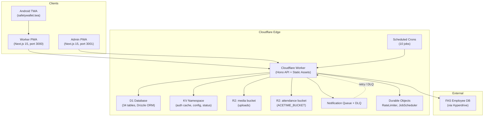

# SafetyWallet / 안전지갑

> Mobile-first PWA for construction-site safety reporting, attendance, and safety-point incentive management.
> 건설 현장의 안전 보고 · 출퇴근 · 안전 포인트 인센티브를 관리하는 모바일 우선 PWA.


## Overview / 개요

SafetyWallet is a field-worker safety platform composed of:

- A **Cloudflare Worker** that hosts a **Hono** API on top of a **Drizzle / D1** data layer.
- Two statically-exported **Next.js 15** frontends — a *worker PWA* and an *admin dashboard* — served from the same Worker through hostname routing.
- An **Android Trusted Web Activity (TWA)** wrapper that packages the worker PWA as a native-installable app.
- A scheduled-job system backed by **Durable Objects** (`RateLimiter`, `JobScheduler`), with notification delivery through **R2** and **Queues** (primary + DLQ).
- A **Go**-based tooling layer that enforces lint, naming, anti-pattern, and preflight invariants.

SafetyWallet은 다음과 같이 구성됩니다:

- **Hono** API와 **Drizzle / D1** 데이터 계층을 호스팅하는 **Cloudflare Worker**
- 동일 Worker에서 호스트명 라우팅으로 서빙되는 두 개의 정적 export **Next.js 15** 프런트엔드(작업자 PWA + 관리자 대시보드)
- 작업자 PWA를 네이티브 설치 가능 앱으로 패키징하는 **Android Trusted Web Activity (TWA)** 래퍼
- **Durable Objects**(`RateLimiter`, `JobScheduler`) 기반의 스케줄 작업 시스템과 **R2** · **Queues**(Primary + DLQ)를 통한 알림 전달
- 린트 · 명명 규칙 · 안티 패턴 · 프리플라이트 불변식을 강제하는 **Go** 기반 도구 계층

## Features / 주요 기능

- **Hazard reporting** with image / video attachments uploaded to R2.
- **Attendance logging** with KST-timezone calendar boundaries.
- **Safety points** earned per approved report, settled by site admins.
- **Role-based access control** — `WORKER` · `SITE_ADMIN` · `SUPER_ADMIN` · `SYSTEM` — layered with site-specific membership and field-level capability flags (`canAwardPoints`, `canReview`, `canExportData`).
- **JWT authentication** with KST same-day midnight expiry and a triple-layer validation pipeline (decode → KST date check → KV cache lookup → D1 fallback).
- **i18n** runtime supporting `ko`, `en`, `vi`, `zh`, with shared translation data in `packages/types`.
- **Notification delivery** via a primary queue with a dedicated dead-letter queue.
- **Rate limiting** through a `RateLimiter` Durable Object.
- **PWA shell** with offline-friendly behavior and an Android TWA install surface.
- **Mutation automation** owned and operated by `jclee-bot` (see [jclee-bot Automation Surfaces](#jclee-bot-automation-surfaces--jclee-bot-자동화-영역)).

## Architecture / 아키텍처



A single Worker entry point — declared in `wrangler.toml` — performs hostname-based routing at the edge. Static assets for both SPAs are served from the `ASSETS` binding; the API surface (18 route modules under `apps/api/src/routes`, with the `admin/` subgroup) is mounted on the same worker. App-internal scheduling is handled by 10 cron jobs that target the `JobScheduler` Durable Object.

단일 Worker 엔트리 포인트(`wrangler.toml`에 선언)가 엣지에서 호스트명별 라우팅을 수행합니다. 두 SPA의 정적 자산은 `ASSETS` 바인딩을 통해 서빙되며, API 표면(`apps/api/src/routes`의 18개 라우트 모듈, `admin/` 하위 그룹 포함)은 동일 Worker에 마운트됩니다. 앱 내부의 스케줄링은 10개의 크론 잡이 `JobScheduler` Durable Object를 대상으로 실행하는 방식으로 처리됩니다.

## Repository Structure / 저장소 구조

The tree below reflects the **actual top-level layout** of the working tree. The workspaces declared in `package.json` (`apps/*`, `packages/*`) and orchestrated by **Turborepo** via `turbo.json` extend beyond this snapshot.

아래 트리는 작업 트리의 **실제 최상위 레이아웃**을 반영합니다. `package.json`(`workspaces: apps/* · packages/*`)과 **Turborepo**(`turbo.json`)가 조정하는 워크스페이스는 이 스냅샷보다 더 넓게 확장됩니다.

```text
.
├── AGENTS.md            # Project knowledge base (generated by init-deep)
├── ARCHITECTURE.md      # Design-level architecture notes
├── CODE_STYLE.md        # TypeScript / Go style rules
├── CONTRIBUTING.md      # Branch / commit / PR conventions
├── LICENSE              # Private license
├── README.md            # This file
├── package.json         # npm workspaces + script catalog
├── package-lock.json
├── turbo.json           # Turborepo pipeline (types → ui → apps)
├── wrangler.toml        # Cloudflare Worker config + bindings
├── vitest.config.ts     # Vitest root config
├── playwright.config.ts # 6 Playwright projects
└── apps/
    └── worker/          # Next.js 15 worker PWA (static export)
        ├── AGENTS.md
        ├── I18N_IMPLEMENTATION.md
        ├── next-env.d.ts
        ├── next.config.mjs
        ├── package.json
        ├── postcss.config.cjs
        ├── tailwind.config.js
        ├── tsconfig.json
        ├── vitest.config.ts
        ├── android/      # Android TWA shell (Gradle, manifest, icons)
        │   ├── build.gradle
        │   ├── gradle.properties
        │   ├── gradlew
        │   ├── gradlew.bat
        │   ├── manifest-checksum.txt
        │   ├── settings.gradle
        │   ├── store_icon.png
        │   ├── twa-manifest.json
        │   └── app/
        │       ├── build.gradle
        │       └── src/main/
        │           ├── AndroidManifest.xml
        │           ├── java/me/jclee/safetywallet/twa/
        │           │   ├── Application.java
        │           │   ├── DelegationService.java
        │           │   └── LauncherActivity.java
        │           └── res/  # mipmap-* icons, splash, shortcuts, raw manifest
        └── src/
            └── app/      # App Router: login, posts, attendance, education
```

> Note / 참고: `apps/api/` (Hono + Drizzle), `apps/admin/` (Next.js 15 admin), `packages/types/`, `packages/ui/`, `docs/`, `scripts/`, `e2e/`, and `.github/workflows/` are also part of the workspace per `package.json` and `turbo.json`, even though the snapshot above is centered on `apps/worker/`.

## jclee-bot Automation Surfaces / jclee-bot 자동화 영역

All **mutating repository automation** is owned and operated by **`jclee-bot`**. Workflow files in `.github/workflows/` are *implementation triggers*; the source of truth for behavior is the bot itself, reachable at **<https://bot.jclee.me>**.

모든 **변형(mutating) 저장소 자동화**는 **`jclee-bot`**이 소유·운영합니다. `.github/workflows/`의 워크플로우 파일은 *구현 트리거*이며, 동작의 진실의 원천은 봇 자체입니다. 봇 엔드포인트: **<https://bot.jclee.me>**.

> PR review and Q&A is delegated to [qodo-ai/pr-agent](https://github.com/qodo-ai/pr-agent), invoked through the bot.
> PR 리뷰 및 Q&A는 [qodo-ai/pr-agent](https://github.com/qodo-ai/pr-agent)에 위임되며, 봇을 통해 호출됩니다.

### App-owned automation (inside the Worker) / 앱 내부 자동화

These run *inside* the deployed app, not in the repository automation pipeline:

- **10 scheduled cron jobs** (`apps/api/src/jobs/`) drive nightly settlements, point expirations, leaderboard recomputation, and notification fan-out.
- **Durable Objects** (`RateLimiter`, `JobScheduler`) coordinate in-process coordination and rate limiting.
- **Queue + DLQ** (`NOTIFICATION_QUEUE`, `NOTIFICATION_DLQ`) provide at-least-once notification delivery with explicit retry semantics.

### Repository automation (owned by jclee-bot) / 저장소 자동화 (jclee-bot 소유)

| Surface | Behavior | Source of truth |
| --- | --- | --- |
| **Issue lifecycle** | Triage labels, branch derivation, backfill of stale issues, CI-failure issue creation. The `jclee-bot에의해자동화됨` marker on an issue indicates the bot has derived, refreshed, or closed the linked branch on the contributor's behalf. | jclee-bot |
| **Branch ↔ PR linkage** | Pushing a branch auto-opens (or refreshes) a draft PR; the PR body inherits the linked issue context. | jclee-bot |
| **PR review** | PR-Agent is invoked for code review, suggestions, and Q&A. A parallel security-focused PR review surface runs alongside. | jclee-bot |
| **Bot auto-fix** | The bot may push follow-up commits to address CI / lint / type failures before requesting human review. | jclee-bot |
| **Auto-merge** | Dependabot PRs and eligible PRs (by label and check state) are auto-merged by dedicated bot surfaces. | jclee-bot |
| **Merged-PR cleanup** | Merged PRs are archived and the linked branches are cleaned up. | jclee-bot |
| **Downstream health check** | Periodic checks of downstream services; failures surface as labeled issues. | jclee-bot |
| **Release notes** | Conventional-commit–driven release notes are generated and posted back to the release. | jclee-bot |
| **Release publish** | Releases are produced from a Git ref on `master` via CI. Manual `npm run deploy:api` is intentionally disabled. | jclee-bot |

> The system prompt for the bot is `jclee-bot에의해자동화됨` (literal marker), emitted on issues to make bot-driven branch derivation self-documenting.

## Go Tooling / Go 도구

Three Go programs under `scripts/` enforce repository-wide invariants. They are invoked through npm scripts (and through Husky via `prepare` / `lint-staged`).

`scripts/` 아래의 세 Go 프로그램이 저장소 전반의 불변식을 강제합니다. npm 스크립트(및 `prepare` / `lint-staged`를 통한 Husky 훅)로 호출됩니다.

### `scripts/verify.go` — master verification

```bash
npm run verify
# internally: go run scripts/verify.go
```

Runs the full pipeline: `lint → lint:naming → typecheck → check:wrangler-sync → test → build`. Used in CI and before any release tag.

전체 파이프라인(`lint → lint:naming → typecheck → check:wrangler-sync → test → build`)을 실행합니다. CI와 릴리스 태그 이전에 사용됩니다.

### `scripts/git-preflight.go` — git preflight

```bash
npm run git:preflight
# internally: go run scripts/git-preflight.go
```

Validates branch naming, commit-message conventions, and ref hygiene before push. Wired into Husky hooks via the `prepare` lifecycle script.

푸시 전에 브랜치 명명 규칙, 커밋 메시지 규칙, ref 위생을 검증합니다. `prepare` 라이프사이클 스크립트를 통해 Husky 훅에 연결됩니다.

### `scripts/check-anti-patterns.go` — anti-pattern detector

```bash
# invoked by lint-staged on staged *.ts / *.tsx files
go run scripts/check-anti-patterns.go
```

Static scan for project-specific anti-patterns — for example, raw `fetch` calls outside the API client, untyped `JSON.parse`, or route handlers missing Zod validators. Runs on staged files only.

프로젝트별 안티 패턴(예: API 클라이언트 외부의 raw `fetch`, 미타입 `JSON.parse`, Zod 검증기가 누락된 라우트 핸들러 등)을 정적 스캔합니다. 스테이징된 파일에 대해서만 실행됩니다.

## Quick Start / 빠른 시작

### Prerequisites / 사전 요구 사항

- **Node.js** ≥ 20.0.0 (declared in `package.json` `engines`)
- **npm** ≥ 10.8.2 (the project's `packageManager`)
- **Go** ≥ 1.22 (for the Go tools in `scripts/`)
- **Wrangler** for Cloudflare Workers (`npx wrangler`)
- **1Password CLI** (`op`) for E2E secret injection (optional)

### Install / 설치

```bash
npm install
```

### Develop / 개발 실행

```bash
npm run dev
# turbo run dev — runs the API worker, admin PWA, and worker PWA in parallel
```

The Turborepo pipeline (`turbo.json`) executes `types` and `ui` package builds before any app, ensuring shared types and component tokens are always current.

Turborepo 파이프라인(`turbo.json`)은 모든 앱 실행 전에 `types`와 `ui` 패키지 빌드를 먼저 실행하여 공유 타입과 컴포넌트 토큰이 항상 최신임을 보장합니다.

## Local Development / 로컬 개발 가이드

| Surface | Command | Default port |
| --- | --- | --- |
| API worker (Hono) | `npm run dev --workspace=apps/api` | 8787 |
| Worker PWA (Next.js 15) | `npm run dev --workspace=apps/worker` | 3000 |
| Admin PWA (Next.js 15) | `npm run dev --workspace=apps/admin` | 3001 |
| Static build of both SPAs into `dist/` | `npm run build:static` | — |
| Wrangler local emulation (D1, KV, R2) | `npx wrangler dev` | 8787 |

### Authentication in development / 개발 환경 인증

- Client state is held in **Zustand** (worker key: `safetywallet-auth`, admin key: `safetywallet-admin-auth`).
- Server-side, the triple-layer JWT pipeline decodes → checks KST date → consults KV cache → falls back to D1.
- For E2E, logins are seeded by the Playwright `auth.setup` project and credentials are injected via the 1Password CLI.

### E2E tests / E2E 테스트

```bash
# headless, secrets injected via 1Password CLI
npm run e2e
# headed
npm run e2e:headed
# interactive UI
npm run e2e:ui
```

The Playwright suite is defined in `playwright.config.ts` and includes auth setup, admin, and worker flows across 6 projects.

Playwright 스위트는 `playwright.config.ts`에 정의되어 있으며, 6개 프로젝트에 걸쳐 auth 설정 · 관리자 · 작업자 플로우를 포함합니다.

## Commands Reference / 명령어 레퍼런스

```text
npm run build               # turbo run build && npm run build:static
npm run build:api           # builds packages/types + apps/api
npm run build:one-worker    # alias of build:api (single-worker deploy)
npm run build:static        # emits dist/ with worker + admin SPAs
npm run dev                 # turbo run dev
npm run deploy:api          # disabled: deploy is Git-ref driven via CI on master
npm run lint                # turbo run lint
npm run lint:naming         # node scripts/lint-naming.js
npm run test                # turbo run test
npm run test:coverage       # turbo run test -- --coverage
npm run typecheck           # turbo run typecheck
npm run check:wrangler-sync # node scripts/check-wrangler-sync.js
npm run git:preflight       # go run scripts/git-preflight.go
npm run verify              # go run scripts/verify.go
npm run format              # prettier --write "**/*.{ts,tsx,js,jsx,json,md}"
npm run format:check        # prettier --check "**/*.{ts,tsx,js,jsx,json,md}"
npm run clean               # turbo run clean && rm -rf node_modules
npm run db:generate         # Drizzle schema codegen (apps/api)
npm run prepare             # husky install
npm run e2e                 # Playwright (1Password-backed)
npm run e2e:headed          # Playwright with browser visible
npm run e2e:ui              # Playwright UI mode
```

## Contribution Guide / 기여 가이드

### 1. Read the conventions / 규칙 문서 먼저 읽기

- `AGENTS.md` — project knowledge base, generated by `init-deep` (60 AGENTS.md files across the codebase).
- `ARCHITECTURE.md` — design-level architecture notes.
- `CODE_STYLE.md` — TypeScript / Go style rules.
- `CONTRIBUTING.md` — branch / commit / PR conventions.

### 2. Pick an issue or open one / 이슈 선택 또는 생성

- If you intend to work on something, **comment on the issue** so the bot can derive a branch for you (the issue will be marked `jclee-bot에의해자동화됨`).
- For new ideas, open an issue first; do not push a feature branch without a linked issue.

### 3. Create your branch (or let the bot do it) / 브랜치 생성

- The bot derives branches in the form `issue/<number>-<slug>`.
- Local branches are validated by `scripts/git-preflight.go` on push.

### 4. Develop against the pipeline / 파이프라인에 맞춰 개발

- `npm run verify` must pass locally before opening a PR.
- Anti-pattern checks run automatically on staged files (`lint-staged` → `scripts/check-anti-patterns.go`).
- PR-Agent review is triggered on PR open; address bot comments before requesting human review.

### 5. Open a PR / PR 열기

- The PR is auto-drafted by the bot; do not edit the PR body manually unless it is a release PR.
- Auto-merge is granted only when all required checks pass and the PR carries the appropriate labels.
- Merged PRs are archived and the linked branches are cleaned up by the bot.

### 6. Stay aligned with automation / 자동화 정책 준수

- Do not push directly to `master`.
- Do not bypass CI with `[skip ci]` except for documentation-only commits.
- Releases are produced by the release-publish surface from `master`; manual `npm run deploy:api` is intentionally disabled (the command exits non-zero with an explanatory message).

---

**Project**: SafetyWallet (private)
**Stack**: TypeScript · Hono · Drizzle · Next.js 15 · Cloudflare Workers · D1
**Automation owner**: jclee-bot — <https://bot.jclee.me>
**PR review engine**: [qodo-ai/pr-agent](https://github.com/qodo-ai/pr-agent)
**Marker for bot-driven issue automation**: `jclee-bot에의해자동화됨`