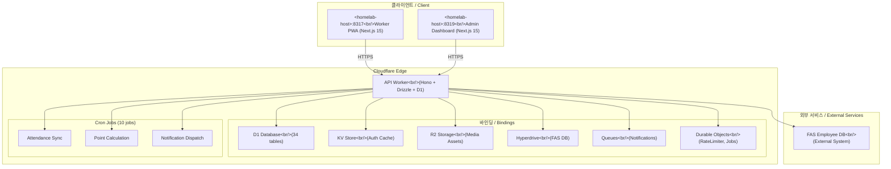

# SafetyWallet

> 건설 현장 안전 관리 플랫폼 / Construction Site Safety Management Platform

[](LICENSE)
[](https://nodejs.org/)
[](https://www.npmjs.com/)
[](https://www.typescriptlang.org/)
[](https://workers.cloudflare.com/)
[](https://turbo.build/)

---

## 목차 / Table of Contents

- [개요 / Overview](#개요--overview)
- [주요 기능 / Features](#주요-기능--features)
- [아키텍처 / Architecture](#아키텍처--architecture)
- [자동화 인벤토리 / Automation Inventory](#자동화-인벤토리--automation-inventory)
- [빠른 시작 / Quick Start](#빠른-시작--quick-start)
- [로컬 개발 / Local Development](#로컬-개발--local-development)
- [명령어 참조 / Commands Reference](#명령어-참조--commands-reference)
- [기여 가이드 / Contributing Guide](#기여-가이드--contributing-guide)
- [라이선스 / License](#라이선스--license)

---

## 개요 / Overview

SafetyWallet은 건설 현장의 안전 관리, 교육, 게시/투표, 리뷰, 포인트, 사용자/현장 관리 기능을 위한 TypeScript 기반 모노레포입니다.

SafetyWallet is a TypeScript-based monorepo for construction-site safety management, education, posts/votes, reviews, points, users, and site-management workflows.

이 저장소는 다음과 같은 구성요소를 포함합니다.

This repository contains the following main components:

| 구성 요소 / Component | 설명 / Description |
|---|---|
| `apps/api` | Cloudflare Workers 기반 API 애플리케이션 (Hono + Drizzle + D1) |
| `apps/admin` | Next.js 15 관리자 대시보드 (port 3001, 정적 내보내기) |
| `apps/worker` | Next.js 15 워커 PWA (port 3000, 정적 내보내기) |
| `packages/types` | 공유 API 타입, DTO, enum, 다국어(i18n) 리소스 |
| `packages/ui` | 공유 React UI 컴포넌트 (shadcn/ui + Tailwind v4) |

---

## 주요 기능 / Features

### 안전 관리 / Safety Management

- 위험 신고 및 현장 안전 점검이
- 안전 포인트 부여 및 추적
- 안전 교육 이수 관리

### 교육 시스템 / Education System

- 교육 콘텐츠 관리 (동영상, 문서, 퀴즈)
- 교육进程的 추적 및 관리
- AI 기반 교육 추천

### 게시 및 투표 / Posts & Voting

- 현장별 게시판 운영
- 투표 생성 및 참여
- 공지사항 관리

### 리뷰 및 평점 / Reviews & Ratings

- 현장 안전 리뷰
- 관리자 승인 프로세스

### 근태 관리 / Attendance

- 출석 체크 (워커 PWA)
- 관리자 대시보드에서 근태 현황 조회
- R2 기반 근태 관련 자료 저장

---

## 아키텍처 / Architecture

### 시스템 아키텍처 / System Architecture



### 모노레포 구조 / Monorepo Structure

```
safetywallet/
├── apps/
│   ├── api/                    # Cloudflare Worker API
│   │   ├── src/
│   │   │   ├── routes/         # 18 API 라우트 모듈
│   │   │   ├── lib/            # Auth, helpers, FAS integration
│   │   │   ├── middleware/      # CORS, logging, security
│   │   │   ├── db/             # Drizzle schema (34 tables)
│   │   │   ├── durable-objects/ # RateLimiter, JobScheduler DOs
│   │   │   ├── jobs/           # Cron job handlers
│   │   │   └── validators/     # Zod 스키마
│   │   ├── migrations/         # 31 D1 마이그레이션
│   │   └── package.json
│   ├── admin/                  # Next.js Admin Dashboard
│   │   └── src/app/            # App Router
│   └── worker/                 # Next.js Worker PWA
│       └── src/app/            # App Router
├── packages/
│   ├── types/                  # 공유 타입, DTO, i18n
│   │   └── src/
│   │       ├── dto/            # 14 DTO 모듈
│   │       └── i18n/           # 다국어 지원 (ko, en, vi, zh)
│   └── ui/                     # 공유 React 컴포넌트
│       └── src/components/     # 14개 컴포넌트
├── scripts/                    # Go/JS tooling
├── e2e/                        # Playwright E2E 테스트
├── .github/
│   └── workflows/              # 34개 GitHub Actions 워크플로우
├── turbo.json                  # Turborepo 파이프라인
├── wrangler.toml               # Cloudflare Workers 설정
└── playwright.config.ts        # 6 Playwright 프로젝트
```

---

## 자동화 인벤토리 / Automation Inventory

### GitHub Actions 워크플로우 / Workflows

#### 브랜치 및 PR 관리 / Branch & PR Management

| 워크플로우 파일 / Workflow File | 설명 / Description |
|---|---|
| `01_branch-to-pr.yml` | 브랜치에서 PR로 자동 전환 |
| `02_issue-to-branch.yml` | 이슈에서 브랜치 생성 |
| `03_pr-checks.yml` | PR 체크 실행 (lint, typecheck, test) |
| `13_pr-auto-merge.yml` | 자동 병합 |
| `15_merged-pr-cleanup.yml` | 병합 후 정리 작업 |

#### 코드 보안 / Security

| 워크플로우 파일 / Workflow File | 설명 / Description |
|---|---|
| `05_gitleaks.yml` | 시크릿 스캐닝 |
| `06_codeql.yml` | CodeQL 정적 분석 |
| `07_dependency-review.yml` | 의존성 보안 검토 |
| `08_scorecard.yml` | OpenSSF Scorecard |
| `45_reusable-gitleaks.yml` | 재사용可能な Gitleaks 액션 |
| `security/11_pr-review.yml` | 보안 코드 리뷰 |

#### PR 리뷰 자동화 / PR Review Automation

| 워크플로우 파일 / Workflow File | 설명 / Description |
|---|---|
| `10_pr-review.yml` | AI 기반 PR 리뷰 (qodo-ai/pr-agent) |
| `14_bot-auto-fix.yml` | 자동 수정 봇 |

#### 릴리스 및 배포 / Release & Deploy

| 워크플로우 파일 / Workflow File | 설명 / Description |
|---|---|
| `24_release-notes.yml` | 자동 릴리스 노트 생성 |
| `25_release-publish.yml` | 릴리스 게시 |
| `44_reusable-pr-checks.yml` | 재사용 가능한 PR 체크 |

#### 문서화 / Documentation

| 워크플로우 파일 / Workflow File | 설명 / Description |
|---|---|
| `20_readme-gen.yml` | README 자동 생성 |
| `21_docs-sync.yml` | 문서 동기화 |
| `42_reusable-docs-sync.yml` | 재사용 가능한 문서 동기화 |

#### 이슈 관리 / Issue Management

| 워크플로우 파일 / Workflow File | 설명 / Description |
|---|---|
| `18_issue-management.yml` | 이슈 자동 라벨링/관리 |
| `19_issue-backfill.yml` | 이슈 백필 |
| `43_reusable-issue-management.yml` | 재사용 가능한 이슈 관리 |
| `91_issue-classification.yml` | 이슈 분류 |

#### CI/CD / CI/CD

| 워크플로우 파일 / Workflow File | 설명 / Description |
|---|---|
| `ci.yml` | 주요 CI 파이프라인 |
| `standard-ci.yml` | 표준 CI 템플릿 |
| `auto-merge.yml` | 자동 병합 설정 |
| `labeler.yml` | 라벨 자동화 |
| `welcome.yml` | 환영 메시지 |

#### 유지보수 / Maintenance

| 워크플로우 파일 / Workflow File | 설명 / Description |
|---|---|
| `04_actionlint.yml` | 워크플로우 lint |
| `09_semantic-pr.yml` | 시맨틱 PR 검증 |
| `12_dependabot-auto-merge.yml` | Dependabot 자동 병합 |
| `29_downstream-health-check.yml` | 하위 서비스 상태 확인 |
| `37_ci-failure-issues.yml` | CI 실패 시 이슈 생성 |
| `60_ci-auto-heal.yml` | CI 자동 복구 |

### 외부 통합 / External Integrations

| 서비스 / Service | 용도 / Purpose |
|---|---|
| [qodo-ai/pr-agent](https://qodo-ai/pr-agent) | AI 기반 코드 리뷰 및 자동 수정 |
| [cliproxy.jclee.me](https://cliproxy.jclee.me/v1) | README 생성 API |
| [bot.jclee.me](https://bot.jclee.me) | 봇 서비스 |

---

## 빠른 시작 / Quick Start

### 전제 조건 / Prerequisites

- Node.js >= 20.0.0
- npm 10.8.2
- Git
- Wrangler CLI (`npm install -g wrangler`)
- Playwright (`npm install -g playwright`)

### 설치 / Installation

```bash
# 저장소 복제
git clone https://github.com/jclee941/.github
cd SafetyWallet

# 의존성 설치
npm install

# Husky 훅 설정
npm run prepare
```

### 개발 서버 실행 / Running Development Servers

```bash
# 모든 앱 개발 모드 실행
npm run dev

# 개별 앱 실행
npm run dev --workspace=apps/worker    # Worker PWA: http://localhost:3000
npm run dev --workspace=apps/admin      # Admin Dashboard: http://localhost:3001
npm run dev --workspace=apps/api        # API: http://localhost:8787
```

### 빌드 / Build

```bash
# 전체 빌드 (타입 → UI → 앱)
npm run build

# API만 빌드
npm run build:api
```

---

## 로컬 개발 / Local Development

### 환경 변수 / Environment Variables

`.env` 파일을 생성하여 필요한 환경 변수를 설정하세요.

Create a `.env` file with the following variables:

```env
# Cloudflare Workers
CLOUDFLARE_ACCOUNT_ID=your_account_id
CLOUDFLARE_API_TOKEN=your_api_token

# Database
D1_DATABASE_ID=your_d1_database_id

# External Services
FAS_API_URL=https://fas.example.com/api
FAS_API_KEY=your_fas_api_key

# Auth
JWT_SECRET=your_jwt_secret
```

### 로컬 데이터베이스 마이그레이션 / Local Database Migration

```bash
# D1 마이그레이션 생성
npx wrangler d1 migrations create safetywallet "migration_name"

# 마이그레이션 실행
npx wrangler d1 execute safetywallet --local --file="./drizzle/migrations/xxxx_migration.sql"

# 스키마에서 타입 생성
npm run db:generate --workspace=apps/api
```

### 테스트 실행 / Running Tests

```bash
# 모든 테스트
npm run test

# 커버리지 포함 테스트
npm run test:coverage

# E2E 테스트
npm run e2e

# E2E UI 모드
npm run e2e:ui

# 헤드리스 E2E
npm run e2e:headed
```

### 코드 품질 / Code Quality

```bash
# 포맷팅
npm run format

# 포맷팅 체크
npm run format:check

# 린트
npm run lint

# 타입 체크
npm run typecheck

# 네이밍 컨벤션 체크
npm run lint:naming
```

---

## 명령어 참조 / Commands Reference

### 패키지 명령어 / Package Commands

| 명령어 / Command | 설명 / Description |
|---|---|
| `npm run dev` | 모든 앱 개발 서버 실행 |
| `npm run build` | 전체 빌드 (turbo + static) |
| `npm run build:api` | API 패키지만 빌드 |
| `npm run build:one-worker` | Worker만 빌드 |
| `npm run test` | 모든 워크스페이스 테스트 실행 |
| `npm run test:coverage` | 커버리지 포함 테스트 |
| `npm run lint` | 모든 워크스페이스 린트 실행 |
| `npm run typecheck` | 모든 워크스페이스 타입 체크 |
| `npm run format` | Prettier 포맷팅 (쓰기) |
| `npm run format:check` | Prettier 포맷팅 (체크) |
| `npm run e2e` | Playwright E2E 테스트 |
| `npm run e2e:ui` | Playwright UI 모드 |
| `npm run e2e:headed` | Playwright 헤드리스 모드 |
| `npm run clean` | node_modules 및 빌드 artifacts 정리 |
| `npm run db:generate` | Drizzle 스키마에서 타입 생성 |
| `npm run verify` | Git 및 코드 검증 스크립트 실행 |
| `npm run check:wrangler-sync` | Wrangler 설정 동기화 확인 |
| `npm run deploy:api` | API 배포 (비활성화 - Git ref로 배포) |

### 워크스페이스 명령어 / Workspace Commands

```bash
# apps/api
npm run dev --workspace=apps/api
npm run build --workspace=apps/api

# apps/admin
npm run dev --workspace=apps/admin

# apps/worker
npm run dev --workspace=apps/worker

# packages/types
npm run build --workspace=packages/types
npm run test --workspace=packages/types

# packages/ui
npm run build --workspace=packages/ui
npm run test --workspace=packages/ui
```

### Husky 훅 / Husky Hooks

| 훅 / Hook | 설명 / Description |
|---|---|
| `pre-commit` | lint-staged 실행 (TypeScript, JavaScript, JSON, Markdown 포맷팅) |

---

## 기여 가이드 / Contributing Guide

### 기여 방법 / How to Contribute

1. **이슈 생성 / Create Issue**
   - 버그 리포트, 기능 요청, 문서 개선 등
   - 적절한 라벨 선택

2. **브랜치 생성 / Create Branch**
   - `02_issue-to-branch.yml` 워크플로우 활용
   - 네이밍 컨벤션: `feature/`, `fix/`, `docs/`, `refactor/`

3. **개발 및 테스트 / Develop & Test**
   - 코드 작성
   - 테스트 작성 및 실행
   -lint-staged 자동화 활용

4. **PR 생성 / Create Pull Request**
   - `01_branch-to-pr.yml` 활용
   - 시맨틱 커밋 메시지 작성
   -自动化 CI 체크 통과

5. **리뷰 및 병합 / Review & Merge**
   - AI 리뷰 (`10_pr-review.yml`)
   - 자동 수정 (`14_bot-auto-fix.yml`)
   - 관리자 승인 후 병합

### 커밋 메시지 규칙 / Commit Message Rules

시맨틱 버전을 준수하세요. `09_semantic-pr.yml` 워크플로우가 자동으로 검증합니다.

```
feat: 새로운 기능 추가
fix: 버그 수정
docs: 문서 변경
style: 코드 스타일 변경 (기능 변경 없음)
refactor: 코드 리팩토링
test: 테스트 추가/수정
chore: 빌드 프로세스 또는 보조 도구 변경
```

### 코드 스타일 / Code Style

- TypeScript strict 모드
- ESLint + Prettier
-React 컴포넌트: 함수형 + Hooks
-Tailwind CSS for styling

자세한 내용은 [CODE_STYLE.md](./CODE_STYLE.md)를 참조하세요.

### 테스트 커버리지 / Test Coverage

새로운 기능에는 반드시 테스트를 작성하세요:

```bash
# 유닛 테스트
npm run test --workspace=packages/types
npm run test --workspace=packages/ui

# E2E 테스트
npm run e2e
```

### 문서화 / Documentation

- 코드 내 주석은 한국어와 영어 혼용 가능
-公共 API는 JSDoc 주석 필수
- README, AGENTS.md 파일은 자동 생성 (`20_readme-gen.yml`)

---

## 라이선스 / License

MIT License - 자세한 내용은 [LICENSE](./LICENSE) 파일을 참조하세요.

---

## 지원 / Support

- 이슈 생성: [GitHub Issues](https://github.com/jclee941/.github/issues)
- 문서: [ARCHITURE.md](./ARCHITECTURE.md)
- 내부 문서: `docs/` 디렉토리

---

*Last generated via CLIProxy API (README-gen model)*
