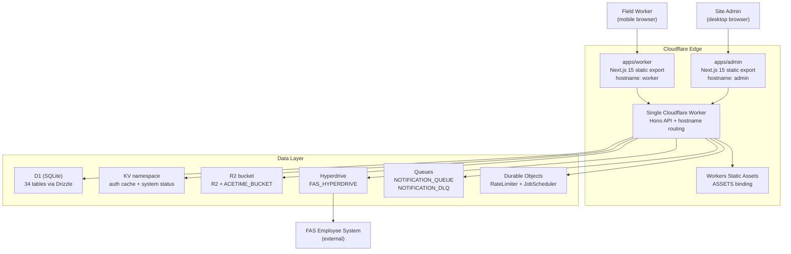

# SafetyWallet

> 건설 현장 안전 관리 플랫폼  
> Construction Site Safety Management Platform

## Badges / 배지

`License: MIT` · `Node.js: >=20.0.0` · `npm: 10.8.2` · `TypeScript` · `Next.js 15` · `Cloudflare Workers` · `D1 (SQLite)` · `Hono` · `Drizzle ORM` · `Turborepo` · `Vitest` · `Playwright`

## Overview / 개요

SafetyWallet은 건설 현장의 작업자와 관리자 모두를 위한 안전 관리 플랫폼입니다. 작업자는 모바일 PWA를 통해 위험 요소를 신고하고, 출석을 기록하며, 안전 교육 및 포인트 기반 워크플로우에 참여할 수 있습니다. 관리자는 전용 대시보드를 통해 현장 운영, 리뷰, 정산, 규정 준수 상태를 관리합니다.

SafetyWallet is a construction-site safety management platform built for both field workers and site administrators. Workers use a mobile PWA to report hazards, log attendance, participate in safety education, and interact with point-based workflows. Site admins manage reviews, settlements, and compliance workflows through a dedicated dashboard.

이 저장소는 npm workspaces와 Turborepo로 관리되는 TypeScript 모노레포이며, 단일 Cloudflare Worker가 Hono API와 두 개의 정적-export Next.js 프런트엔드를 호스트네임 라우팅으로 동시에 서빙합니다.

This repository is a TypeScript-based monorepo managed with npm workspaces and Turborepo. A single Cloudflare Worker serves the Hono API and both statically-exported Next.js frontends via hostname routing.

### Workspaces / 워크스페이스

| Path | Role |
| --- | --- |
| `apps/api` | Cloudflare Worker API (Hono + Drizzle + D1) |
| `apps/admin` | Next.js 15 admin dashboard, static export (port 3001) |
| `apps/worker` | Next.js 15 worker PWA, static export (port 3000) + Android TWA |
| `packages/types` | Shared TS types, enums, DTOs, i18n translation data |
| `packages/ui` | Shared shadcn/ui components + Tailwind v4 theme tokens |

> Provided snapshot ships `apps/worker` (and its `android/` TWA subtree) on disk; the rest of the layout is documented from `AGENTS.md` / `ARCHITECTURE.md`.

## Features / 주요 기능

### Product Features / 제품 기능

- **Mobile worker PWA / 모바일 작업자 PWA** — Hazard reporting, attendance logging, safety education, point-based engagement.
- **Admin dashboard / 관리자 대시보드** — Attendance review, posts, votes, education management.
- **Runtime i18n / 런타임 다국어** — `ko`, `en`, `vi`, `zh` translation bundles (see `apps/worker/I18N_IMPLEMENTATION.md`).
- **Android TWA packaging / Android TWA 패키징** — Bubblewrap-generated Trusted Web Activity with launcher icons, splash screens, and shortcut assets.
- **PWA manifest / PWA 매니페스트** — `web_app_manifest.json` shipped as a raw resource under `res/raw/`.

### Engineering Features / 엔지니어링 기능

- **Monorepo / 모노레포** — npm workspaces orchestrated by Turborepo (`turbo run build`).
- **Single Worker router / 단일 Worker 라우터** — One Cloudflare Worker serves Hono API and both static SPAs via hostname routing.
- **34-table D1 schema / 34 테이블 D1 스키마** — Drizzle ORM with 31 SQL migrations.
- **Triple-layer auth / 3중 인증 검증** — JWT decode → KST date check → KV cache → D1 fallback.
- **Three-tier permissions / 3단계 권한 모델** — Role → site membership → field-level flags (`canAwardPoints`, `canReview`, `canExportData`).
- **Hyperdrive to external FAS / 외부 FAS 연결** — `FAS_HYPERDRIVE` binding for the employee system.
- **Durable Objects / Durable Objects** — `RateLimiter`, `JobScheduler`.
- **10 scheduled cron jobs / 10개 스케줄 크론 잡** — Embedded inside the API Worker.
- **Queues + DLQ / 큐와 DLQ** — `NOTIFICATION_QUEUE` / `NOTIFICATION_DLQ` for async notifications.
- **R2 storage / R2 스토리지** — `R2` for user uploads, `ACETIME_BUCKET` for attendance assets.
- **E2E coverage / E2E 테스트** — 6 Playwright projects with auth setup.
- **Pre-commit hooks / 커밋 전 훅** — Husky + lint-staged with Go-based anti-pattern checks.
- **Living docs / 살아 있는 문서** — 60 `AGENTS.md` files generated via `init-deep` across the codebase.

## Architecture / 아키텍처



### Authentication flow / 인증 흐름

1. Login form → credentials POSTed to the Worker API.
2. API issues a JWT whose `exp` is KST same-day midnight.
3. JWT is stored in a Zustand-persisted client store:
   - Worker key: `safetywallet-auth`
   - Admin key: `safetywallet-admin-auth`
4. Every protected request is validated through three layers: decode → KST expiry check → KV cache → D1 fallback.
5. A 401 triggers a refresh-mutex replay on the client.

### Cloudflare bindings / Cloudflare 바인딩

| Binding | Type | Purpose |
| --- | --- | --- |
| `DB` | D1 | Primary database (34 tables, Drizzle ORM) |
| `FAS_HYPERDRIVE` | Hyperdrive | Connection pool to external FAS employee DB |
| `ASSETS` | Workers Static Assets | Static frontend bundles (worker + admin SPAs) |
| `R2` | R2 | User-uploaded images and videos |
| `ACETIME_BUCKET` | R2 | Attendance-related assets |
| `KV` | KV | Auth cache, system status, runtime config |
| `NOTIFICATION_QUEUE` | Queue | Async notification delivery |
| `NOTIFICATION_DLQ` | Queue | Notification dead-letter |
| `RATE_LIMITER` | Durable Object | Request throttling |
| `JOB_SCHEDULER` | Durable Object | 10 scheduled cron jobs |

## Automation Inventory / 자동화 인벤토리

### GitHub Actions workflows (16) / GitHub Actions 워크플로 (16)

| File | Trigger | Purpose |
| --- | --- | --- |
| `01_branch-to-pr.yml` | push to non-default branch | Convert a pushed branch into a pull request with a body template. |
| `02_issue-to-branch.yml` | issue opened / labeled | Materialize an issue into a draft branch + PR scaffold. |
| `10_pr-review.yml` | PR open / synchronize | Run [qodo-ai/pr-agent](https://github.com/qodo-ai/pr-agent) code review on the diff. |
| `11_security-pr-review.yml` | PR open / synchronize | Run a security-focused PR review pass (SAST/SCA hints). |
| `12_dependabot-auto-merge.yml` | Dependabot PR | Auto-merge routine dependency bumps once checks are green. |
| `13_pr-auto-merge.yml` | PR labeled `auto-merge` | Auto-merge approved PRs after CI is green. |
| `14_bot-auto-fix.yml` | PR comment `/fix` | Bot applies review suggestions and pushes commits. |
| `15_merged-pr-cleanup.yml` | PR closed / merged | Delete merged feature branches. |
| `19_issue-backfill.yml` | schedule | Backfill missing labels / milestones on stale issues. |
| `24_release-notes.yml` | tag pushed | Generate release notes from merged PRs. |
| `25_release-publish.yml` | release published | Publish artifacts and notify downstream. |
| `29_downstream-health-check.yml` | schedule + dispatch | Probe downstream services (FAS Hyperdrive, etc.) for regressions. |
| `37_ci-failure-issues.yml` | CI failure on `master` | Open / refresh an issue when CI fails. |
| `60_ci-auto-heal.yml` | CI failure | Apply bot-generated fix PRs to recover from CI failures. |
| `91_issue-classification.yml` | issue opened | Auto-classify and label incoming issues. |
| `ci.yml` | push / PR | Primary CI: install → lint → typecheck → guard checks → test → build. |

### Go automation tools (0) / Go 자동화 도구 (0)

The repository currently ships zero standalone Go automation binaries. All Go-based checks referenced from `package.json` (`scripts/git-preflight.go`, `scripts/verify.go`, `scripts/check-anti-patterns.go`) live inside `scripts/` and are invoked via `go run`. JS-based companions (`scripts/lint-naming.js`, `scripts/check-wrangler-sync.js`) cover naming and wrangler-sync checks respectively.

### Bot auto-fix loop / 봇 자동 수정 루프

```text
review (10_pr-review.yml / 11_security-pr-review.yml)
  → comment /fix on the PR
  → 14_bot-auto-fix.yml commits a suggested patch
  → ci.yml re-runs the gate
  → 13_pr-auto-merge.yml merges when green
  → 15_merged-pr-cleanup.yml deletes the branch
  → 24_release-notes.yml folds the change into the next release
```

## Quick Start / 빠른 시작

### Prerequisites / 사전 요구 사항

- Node.js **>= 20.0.0** (enforced by `package.json` `engines`)
- npm **10.8.2** (enforced by `packageManager`)
- A Cloudflare account with D1, R2, KV, Queues, and Hyperdrive enabled
- Wrangler authenticated (`npx wrangler login`)

### Install / 설치

```bash
npm install
```

### Build everything / 전체 빌드

```bash
npm run build           # turbo build + bundle static SPA into ./dist
```

### Run the dev server / 개발 서버 실행

```bash
npm run dev             # turbo run dev across all workspaces
```

Default ports: `3000` (worker PWA) and `3001` (admin dashboard). The Worker API runs locally via `wrangler dev`.

## Local Development / 로컬 개발

### Per-workspace dev commands / 워크스페이스별 실행

| Workspace | Command | Notes |
| --- | --- | --- |
| `apps/worker` | `npm run dev --workspace=apps/worker` | Next.js dev server on port 3000 |
| `apps/admin` | `npm run dev --workspace=apps/admin` | Next.js dev server on port 3001 |
| `apps/api` | `npx wrangler dev --config apps/api/wrangler.toml` | Cloudflare Worker locally |
| `packages/types` | `npm run build --workspace=packages/types` | Must build first (consumed by all apps) |
| `packages/ui` | `npm run build --workspace=packages/ui` | Component library consumed by both SPAs |

### Database / 데이터베이스

```bash
# Apply migrations to remote D1
npx wrangler d1 migrations apply DB --remote

# Apply migrations to local D1 (wrangler dev)
npx wrangler d1 migrations apply DB --local

# Regenerate Drizzle schema artifacts
npm run db:generate
```

### E2E tests / E2E 테스트

E2E tests require a `.env.e2e` file managed by `op` (1Password CLI):

```bash
npm run e2e            # headless
npm run e2e:headed     # headed
npm run e2e:ui         # Playwright UI mode
```

### Pre-commit hooks / 커밋 전 훅

Husky runs `lint-staged`, which for `*.ts` / `*.tsx` files applies:

1. `go run scripts/check-anti-patterns.go` — bans unsafe TS / React patterns.
2. `prettier --write` — formatter.

For `*.{js,jsx,json,md}` files, only Prettier is applied.

### Android TWA build / Android TWA 빌드

```bash
cd apps/worker/android
./gradlew assembleRelease          # build signed AAB
./gradlew installDebug             # sideload on a connected device
```

## Commands Reference / 명령어 레퍼런스

| Command | Description / 설명 |
| --- | --- |
| `npm run build` | Build all workspaces and assemble the static bundle in `dist/`. |
| `npm run build:api` | Build the API Worker only (after building `packages/types`). |
| `npm run build:static` | Export and merge the two Next.js SPAs into `dist/` and `dist/admin/`. |
| `npm run build:one-worker` | Convenience alias for `build:api`. |
| `npm run dev` | Run all workspace dev servers in parallel via Turborepo. |
| `npm run deploy:api` | Refuses to run locally — deploys are Git-ref driven via CI on `master`. |
| `npm run lint` | Run `turbo run lint` across workspaces. |
| `npm run lint:naming` | Run the file / identifier naming lint (`scripts/lint-naming.js`). |
| `npm run test` | Run Vitest in every workspace. |
| `npm run test:coverage` | Run Vitest with coverage. |
| `npm run typecheck` | Run `tsc --noEmit` across workspaces. |
| `npm run check:wrangler-sync` | Verify `wrangler.toml` matches the expected bindings. |
| `npm run git:preflight` | Go-based git hygiene check before commit. |
| `npm run verify` | Go-based verification of repo invariants. |
| `npm run format` | Format all source files with Prettier. |
| `npm run format:check` | Verify formatting without writing. |
| `npm run clean` | Remove build outputs and `node_modules`. |
| `npm run db:generate` | Regenerate Drizzle artifacts. |
| `npm run e2e` | Run Playwright E2E suite (1Password-encrypted env). |

## Project Layout / 프로젝트 구성

```text
.
├── apps/
│   ├── api/                    # Cloudflare Worker API (Hono + Drizzle + D1)
│   │   ├── src/routes/         # 18 API route modules (admin/ nested)
│   │   ├── src/lib/            # Auth, helpers, FAS integration, R2
│   │   ├── src/middleware/     # CORS, logging, analytics, security headers
│   │   ├── src/db/             # Drizzle schema (34 tables), seed, helpers
│   │   ├── src/durable-objects/# RateLimiter, JobScheduler DOs
│   │   ├── src/jobs/           # 10 scheduled cron jobs
│   │   ├── src/validators/     # Zod request schemas
│   │   └── migrations/         # 31 D1 SQL migrations
│   ├── admin/                  # Next.js 15 admin dashboard (port 3001, static export)
│   │   └── src/app/            # App Router: attendance, posts, votes, education
│   └── worker/                 # Next.js 15 worker PWA (port 3000, static export)
│       ├── src/app/            # App Router: login, posts, attendance, education
│       ├── src/i18n/           # Custom i18n runtime (ko, en, vi, zh)
│       ├── src/components/     # Worker-specific UI components
│       └── android/            # Bubblewrap-generated TWA project
├── packages/
│   ├── types/                  # Shared TS types, enums, DTOs, i18n data
│   └── ui/                     # Shared shadcn/ui + Tailwind v4 theme tokens
├── docs/                       # PRD, requirements specs, ops runbooks
├── scripts/                    # Go/JS tooling (verify, naming lint, anti-patterns)
├── e2e/                        # Playwright E2E tests (auth setup, admin, worker flows)
├── .github/workflows/          # 16 GitHub Actions workflows
├── wrangler.toml               # Root CF Worker config + all bindings
├── turbo.json                  # Turborepo pipeline (types → ui → apps)
└── playwright.config.ts        # 6 Playwright projects
```

> Provided snapshot only shows `apps/worker` (with its `android/` subtree) on disk; the rest is documented from `AGENTS.md` / `ARCHITECTURE.md`.

## Contribution Guide / 기여 가이드

1. **Read the docs / 문서를 먼저 읽어 주세요** — `CONTRIBUTING.md`, `ARCHITECTURE.md`, `CODE_STYLE.md`, and the per-app `AGENTS.md` files are authoritative.
2. **Branch from an issue / 이슈에서 분기** — `02_issue-to-branch.yml` scaffolds a branch and PR when an issue is labeled appropriately.
3. **Conventional commits / 컨벤셔널 커밋** — Required for `24_release-notes.yml` to group changes correctly.
4. **Pass the gate / 품질 게이트 통과** — Locally: `npm run lint && npm run typecheck && npm run test && npm run format:check`. CI re-runs the same checks via `ci.yml`.
5. **Address review-bot findings / 봇 리뷰 결과 반영** — `10_pr-review.yml` and `11_security-pr-review.yml` leave inline comments; address them or trigger `/fix` for `14_bot-auto-fix.yml`.
6. **Auto-merge path / 자동 머지 경로** — Add the `auto-merge` label once approvals and checks are green; `13_pr-auto-merge.yml` takes over from there.
7. **No force pushes to protected branches / 보호 브랜치에 강제 푸시 금지** — `npm run git:preflight` blocks them locally; CI rejects them.

## License / 라이선스

MIT — see [`LICENSE`](./LICENSE).