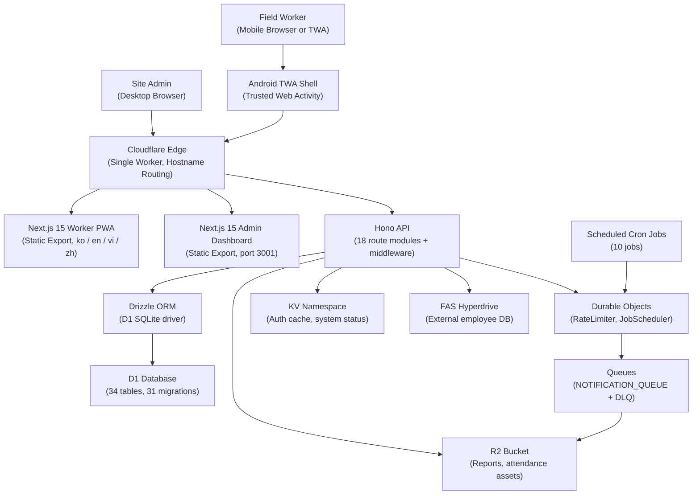

# SafetyWallet / 안전지갑

> Mobile-first PWA for construction-site safety reporting, attendance, and safety-point incentive management.
> 건설 현장의 안전 보고 · 출퇴근 · 안전 포인트 인센티브를 관리하는 모바일 우선 PWA.


## Overview / 개요

SafetyWallet is a field-worker safety platform composed of:

- A **Cloudflare Worker** that hosts a **Hono** API on top of a **Drizzle / D1** data layer.
- Two statically-exported **Next.js 15** frontends — a *worker PWA* and an *admin dashboard* — served from the same Worker through hostname routing.
- An **Android Trusted Web Activity (TWA)** wrapper that packages the worker PWA as a native-installable app.
- A scheduled-job system backed by **Durable Objects** (`RateLimiter`, `JobScheduler`), with notification delivery through **R2** and **Queues** (primary + DLQ).
- A **Go**-based development-tooling layer that enforces lint, naming, anti-pattern, and preflight invariants at commit and push time.

SafetyWallet은 다음과 같이 구성됩니다:

- **Hono** API와 **Drizzle / D1** 데이터 계층을 호스팅하는 **Cloudflare Worker**
- 동일 Worker에서 호스트명 라우팅으로 서빙되는 두 개의 정적 export **Next.js 15** 프런트엔드(작업자 PWA + 관리자 대시보드)
- 작업자 PWA를 네이티브 설치 가능 앱으로 패키징하는 **Android Trusted Web Activity (TWA)** 래퍼
- **Durable Objects**(`RateLimiter`, `JobScheduler`) 기반의 스케줄 작업 시스템과 **R2** · **Queues**(Primary + DLQ)를 통한 알림 전달
- 커밋 · 푸시 시점에 린트 · 명명 규칙 · 안티 패턴 · 프리플라이트 불변식을 강제하는 **Go** 기반 개발 도구 계층

## Features / 주요 기능

- **Hazard reporting** with image / video attachments uploaded to R2.
- **Attendance logging** with KST-timezone calendar boundaries.
- **Safety points** earned per approved report, settled by site admins.
- **Education module** for safety training content and quizzes.
- **Notifications** delivered via a queue-backed pipeline with a dead-letter queue.
- **Triple-layer auth** (JWT → KST date → KV cache → D1 fallback) with role-based and site-scoped permissions.
- **Internationalization** for `ko`, `en`, `vi`, `zh` through a custom runtime.
- **TWA distribution** that ships the PWA as a native-installable Android app.
- **Rate limiting** and **cron scheduling** owned by Durable Objects.
- **PR-Agent** structural and security review on every pull request.

## Architecture / 아키텍처

The platform runs as a single Cloudflare Worker that fans out to its bindings and to the two statically-exported SPAs. Field workers reach the PWA directly (or through the TWA shell on Android), while site admins reach the dashboard over a separate hostname. Cron jobs are scheduled by `JobScheduler` Durable Objects and write into the notification queue, which feeds a downstream delivery consumer; failed messages land in the DLQ.



The Worker statically serves the two SPAs (`apps/worker/out`, `apps/admin/out`) under `/` and `/admin` paths and exposes the JSON API on the same origin. Durable Objects own rate-limit state and the cron-driven job lifecycle. The notification queue is bound to a downstream delivery worker with a dead-letter queue for poison messages.

## jclee-bot Automation Surfaces / jclee-bot 자동화 영역

`jclee-bot` owns every mutating surface of the repository: branches, pull requests, issues, releases, dependabot, and CI failure follow-ups. The GitHub Actions workflows in `.github/workflows/` are merely the implementation triggers that call into `jclee-bot`; they are not the source of truth for the automation policy.

### Branch and PR lifecycle

- **Branch → PR**: when a branch is pushed, `jclee-bot` opens a draft pull request, links it to its tracking issue, and applies the standard label set.
- **Issue → branch**: when an issue is triaged, `jclee-bot` provisions a feature branch with a conventional name and seeds it with the issue body.
- **PR review**: `jclee-bot` runs a structural review (PR-Agent by [qodo-ai/pr-agent](https://github.com/qodo-ai/pr-agent)) on every PR and posts the result as a comment.
- **Security PR review**: `jclee-bot` augments the structural review with a security-focused pass for code that touches auth, secrets, D1, or R2.
- **PR auto-merge**: `jclee-bot` merges approved, green, non-conflicting PRs without human intervention.
- **Dependabot auto-merge**: `jclee-bot` merges Dependabot PRs that pass the full check matrix.
- **Bot auto-fix**: when a check fails on a bot-owned PR, `jclee-bot` reopens it, applies a fix, and re-pushes.
- **Merged PR cleanup**: `jclee-bot` deletes merged feature branches and closes the linked issue.

### Issue and release lifecycle

- **Issue backfill**: `jclee-bot` sweeps stale, unlabelled issues and applies the standard label taxonomy. New issues opened against this project are *jclee-bot에의해자동화됨* — labelled, triaged, and routed by the bot.
- **CI failure issues**: when the CI matrix fails on `master`, `jclee-bot` opens an issue with the failing logs and assigns it to the workflow owner. CI-failure issues are *jclee-bot에의해자동화됨*.
- **Downstream health check**: `jclee-bot` polls downstream services and opens an issue when health degrades; the issue is *jclee-bot에의해자동화됨*.
- **Release notes**: `jclee-bot` aggregates merged PRs and commits into a release-note draft.
- **Release publish**: `jclee-bot` tags the release, publishes the artifacts, and marks the tracking issue as done.

All automations are reachable through the public dashboard at [bot.jclee.me](https://bot.jclee.me), and the public release artifacts are mirrored to [cliproxy.jclee.me](https://cliproxy.jclee.me).

## Go Tools / Go 도구

This repository does **not** ship any Go-based automation tools (Go automation tools in scope: **0**). The only Go presence is a small set of development-time utilities under `scripts/` that are invoked from `npm` scripts and from `lint-staged`:

- `scripts/verify.go` — verifies repository invariants (Wrangler sync, lockfile freshness, workspace health).
- `scripts/git-preflight.go` — runs before a push to refuse secrets, large files, and forbidden paths.
- `scripts/check-anti-patterns.go` — scans staged TypeScript for anti-patterns the linter cannot express.
- `scripts/lint-naming.js` (companion) — enforces file- and identifier-naming rules.

These are Go *scripts*, not deployable binaries; they have no release artifact and are not part of the `jclee-bot` automation surface.

## Repository Layout / 저장소 구조

The project is a Turborepo monorepo with three application workspaces and two shared packages. The top-level layout reflects the actual repository:

```text
.
├── AGENTS.md
├── ARCHITECTURE.md
├── CODE_STYLE.md
├── CONTRIBUTING.md
├── LICENSE
├── README.md
├── package.json
├── package-lock.json
├── playwright.config.ts
├── turbo.json
├── vitest.config.ts
├── wrangler.toml
├── apps/
│   ├── api/                 # Cloudflare Worker API (Hono + Drizzle + D1)
│   ├── admin/               # Next.js 15 admin dashboard (port 3001, static export)
│   └── worker/              # Next.js 15 worker PWA (port 3000, static export)
│       └── android/         # TWA wrapper (Gradle, manifest, app icon set, LauncherActivity)
├── packages/
│   ├── types/               # Shared TS types, enums, DTOs, i18n data
│   └── ui/                  # Shared shadcn/ui + Tailwind v4 tokens
├── docs/                    # PRD, requirements specs, ops runbooks
├── scripts/                 # Go/JS tooling (verify, preflight, anti-patterns, naming)
├── e2e/                     # Playwright E2E tests (auth setup, admin, worker flows)
└── .github/workflows/       # CI/CD triggers that call into jclee-bot
```

## Quick Start / 빠른 시작

```bash
# Clone and install
git clone <this-repo> safetywallet
cd safetywallet
npm install

# Sign in to 1Password CLI for E2E secrets
op signin

# Start the local stack (Hono API + both Next.js frontends)
npm run dev
```

The first run will:

1. Build `packages/types` and `packages/ui` through the Turborepo pipeline.
2. Boot the Hono API on its local Wrangler port.
3. Boot the worker PWA on `http://localhost:3000` and the admin dashboard on `http://localhost:3001`.
4. Open the worker PWA in your browser, or build the TWA under `apps/worker/android/` and sideload it on a device.

## Local Development / 로컬 개발

### Prerequisites / 사전 요구 사항

- Node.js **>= 20.0.0** and npm **10.8.2** (the project pins `packageManager`).
- Wrangler CLI (for `apps/api` local emulation and D1 migrations).
- Go **>= 1.22** (for `scripts/*.go` invocations from `npm` scripts and `lint-staged`).
- 1Password CLI (`op`) for Playwright E2E secrets.
- Android Studio + JDK 17 (only for TWA builds under `apps/worker/android/`).

### D1 migrations / D1 마이그레이션

```bash
# Generate a new migration from the Drizzle schema
npm run db:generate --workspace=apps/api

# Apply migrations to the local D1
npx wrangler d1 migrations apply DB --local
```

### Cloudflare bindings

The `wrangler.toml` at the repository root declares every binding the Worker expects in production:

- `DB` (D1), `ASSETS` (Workers Static Assets), `R2` (reports), `ACETIME_BUCKET` (attendance assets), `KV` (auth cache), `FAS_HYPERDRIVE` (external employee DB), `NOTIFICATION_QUEUE` + `NOTIFICATION_DLQ`, and the `RATE_LIMITER` / `JobScheduler` Durable Objects.

The same bindings must be present in any preview environment; the `npm run check:wrangler-sync` script enforces that `wrangler.toml` matches the source-of-truth schema.

## Commands Reference / 명령어 레퍼런스

| Command | Purpose |
| --- | --- |
| `npm run dev` | Boot all workspaces (Hono API + worker PWA + admin dashboard). |
| `npm run build` | Build every workspace, then assemble `dist/` for the Worker. |
| `npm run build:api` | Build only the Hono API and shared types. |
| `npm run build:static` | Compose the static export for both SPAs into `dist/`. |
| `npm run lint` | Lint every workspace through Turborepo. |
| `npm run lint:naming` | Run the naming-convention linter (`scripts/lint-naming.js`). |
| `npm run typecheck` | TypeScript project references across the monorepo. |
| `npm run test` | Vitest unit tests for every workspace. |
| `npm run test:coverage` | Vitest with coverage. |
| `npm run e2e` | Playwright E2E suite (requires `op signin` first). |
| `npm run e2e:headed` / `npm run e2e:ui` | Headed / interactive Playwright runs. |
| `npm run check:wrangler-sync` | Verify `wrangler.toml` matches the source of truth. |
| `npm run git:preflight` | Run the Go-based pre-push guard. |
| `npm run verify` | Run the Go-based repo-invariant verifier. |
| `npm run db:generate` | Generate a Drizzle migration. |
| `npm run format` / `npm run format:check` | Prettier write / check across the repo. |
| `npm run clean` | Remove build outputs and `node_modules`. |
| `npm run deploy:api` | Disabled by design — deploys are Git-ref driven via CI on `master`. |

## Contribution Guide / 기여 가이드

1. Read `CONTRIBUTING.md`, `CODE_STYLE.md`, and `ARCHITECTURE.md` before opening a PR.
2. Read the relevant `AGENTS.md` for the area you are touching (60+ are scattered across the codebase).
3. Pick or open an issue; `jclee-bot` will turn the issue into a feature branch.
4. Make your change in the feature branch; commits must follow Conventional Commits.
5. Run the local quality gate before pushing:

   ```bash
   npm run lint
   npm run typecheck
   npm run test
   npm run check:wrangler-sync
   npm run git:preflight
   ```

6. Push the branch; `jclee-bot` opens a draft PR and runs the PR-Agent review.
7. After approval, `jclee-bot` performs the auto-merge and cleans up the branch.
8. Issues and CI failures are *jclee-bot에의해자동화됨* — please do not hand-curate them.

## License / 라이선스

Proprietary. See [`LICENSE`](./LICENSE).

---

_This README is generated by `gpt-5.5` (fallback: `minimax-m3` via the public [cliproxy.jclee.me](https://cliproxy.jclee.me) endpoint) and refreshed on every release by `jclee-bot`._