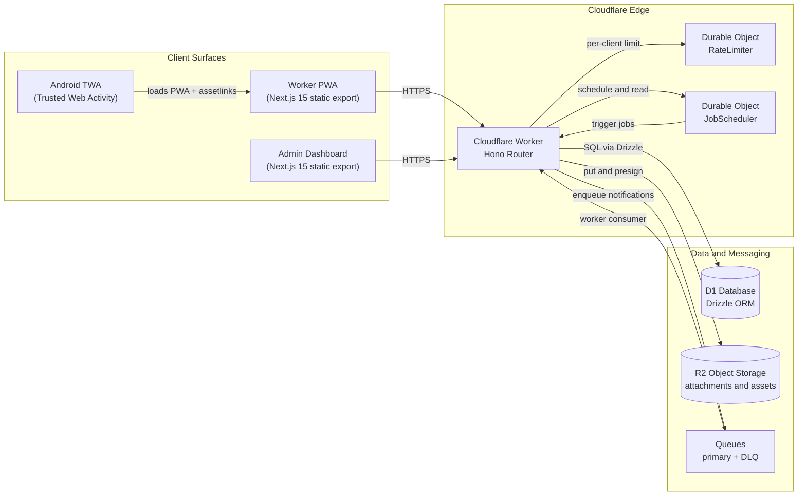

# SafetyWallet / 안전지갑

> Mobile-first PWA for construction-site safety reporting, attendance, and safety-point incentive management.
> 건설 현장의 안전 보고 · 출퇴근 · 안전 포인트 인센티브를 관리하는 모바일 우선 PWA.


## Overview / 개요

SafetyWallet is a field-worker safety platform organized as a **Turborepo monorepo** and deployed entirely on the **Cloudflare** edge. It targets construction sites where workers need a low-friction, installable mobile experience and site managers need a dashboard to triage reports, attendance, and incentive accrual.

SafetyWallet은 **Cloudflare** 엣지에 전량 배포되는 **Turborepo 모노레포** 기반의 현장 작업자 안전 플랫폼입니다. 작업자가 현장에서 마찰 없이 설치 가능한 모바일 환경을 사용하고, 현장 관리자가 보고 · 출퇴근 · 인센티브 적립을 심사할 수 있는 대시보드를 제공합니다.

### Product Surfaces / 제품 구성

| Surface / 표면 | Path | Purpose / 용도 |
| --- | --- | --- |
| Field-worker PWA / 작업자 PWA | `apps/worker` | Statically exported Next.js 15 application. The primary mobile experience installed on devices. / 현장 작업자가 설치하여 사용하는 정적 배포 Next.js 15 앱 |
| Admin Dashboard / 관리자 대시보드 | `apps/admin` | Statically exported Next.js 15 dashboard served from the same Worker via hostname routing. / 동일 Worker에서 호스트명 라우팅으로 제공되는 관리자 대시보드 |
| API Worker / API Worker | `apps/api` | Cloudflare Worker hosting the **Hono** HTTP API on a **Drizzle / D1** data layer. / **Hono** HTTP API와 **Drizzle / D1** 데이터 계층을 호스팅하는 Cloudflare Worker |
| Android TWA / Android 신뢰 웹 활동 | `apps/worker/android` | Native-installable APK wrapping the Worker PWA, with origin verification through a `manifest-checksum.txt` asset. / Worker PWA를 네이티브 설치 가능 APK로 래핑하고 `manifest-checksum.txt` 자산으로 출처를 검증 |
| Shared Types / 공용 타입 | `packages/types` | Cross-package TypeScript contracts shared by API, Worker, and Admin. / API · Worker · Admin이 공유하는 TypeScript 계약 |

### Backend Building Blocks / 백엔드 구성 요소

- **Hono** HTTP framework on Cloudflare Workers.
- **Drizzle ORM** schema mapped to **Cloudflare D1** (SQLite at the edge).
- **Durable Objects** for `RateLimiter` and `JobScheduler`.
- **R2** for object storage (notification payloads, attachments).
- **Queues** with a primary queue and a Dead-Letter Queue (DLQ) for notification delivery.
- **Trusted Web Activity** packaging with digital-asset-link integrity checks.

## Key Features / 주요 기능

- **Mobile-first safety reporting / 모바일 우선 안전 보고** — workers file hazard observations, near-misses, and incident reports from the PWA.
- **Attendance check-in / 출퇴근 체크인** — site-bound attendance tied to GPS and shift windows.
- **Safety-point incentives / 안전 포인트 인센티브** — point accrual, redemption, and leaderboard tracking.
- **Admin triage dashboard / 관리자 심사 대시보드** — review queue, status changes, and export of records.
- **Installable Android shell / 설치 가능한 Android 셸** — TWA wrapper for distribution where PWAs are not first-class.
- **Background jobs / 백그라운드 작업** — Durable-Object-driven scheduling with retry and DLQ semantics.
- **Rate limiting / 속도 제한** — Durable-Object-backed rate limiting per client identity.
- **Bilingual UI / 이중 언어 UI** — Korean and English copy with shared translation sources (see `apps/worker/I18N_IMPLEMENTATION.md`).

## Architecture / 아키텍처



### Request Flow / 요청 흐름

1. A **Client Surface** (PWA, Admin Dashboard, or TWA-loaded PWA) issues an HTTPS request to the Worker hostname.
2. The **Cloudflare Worker** dispatches the request through a **Hono** router that resolves the API surface (`apps/api`) and serves the appropriate static bundle (Worker PWA or Admin Dashboard) based on hostname.
3. **Hono** handlers consult **D1** via **Drizzle**, enforce per-client **RateLimiter** checks through a Durable Object, and enqueue notification work onto **Queues**.
4. A **JobScheduler** Durable Object triggers scheduled jobs (rollovers, accrual, digest delivery) which the Worker drains by reading from **R2** and writing back to **D1**.
5. Failed jobs are routed to the DLQ for inspection.

## Repository Structure / 저장소 구조

The monorepo top-level layout (only directories visible at the repository root are shown here):

```
/
├── AGENTS.md                  # AI agent operating instructions (not a product feature)
├── ARCHITECTURE.md            # Extended architecture notes
├── CODE_STYLE.md              # Code-style conventions
├── CONTRIBUTING.md            # Contribution guide
├── LICENSE                    # License file
├── README.md                  # This document
├── package.json               # npm workspaces + root scripts
├── package-lock.json          # Locked dependency graph
├── turbo.json                 # Turborepo task graph
├── vitest.config.ts           # Shared Vitest config
├── playwright.config.ts       # Shared Playwright config
├── wrangler.toml              # Cloudflare Worker configuration
└── apps/
    └── worker/
        ├── AGENTS.md
        ├── I18N_IMPLEMENTATION.md
        ├── next-env.d.ts
        ├── next.config.mjs
        ├── package.json
        ├── postcss.config.cjs
        ├── tailwind.config.js
        ├── tsconfig.json
        ├── vitest.config.ts
        ├── android/
        │   ├── build.gradle
        │   ├── gradle.properties
        │   ├── gradlew
        │   ├── gradlew.bat
        │   ├── manifest-checksum.txt
        │   ├── settings.gradle
        │   ├── store_icon.png
        │   ├── twa-manifest.json
        │   ├── app/
        │   │   ├── build.gradle
        │   │   └── src/
        │   │       └── main/
        │   │           ├── AndroidManifest.xml
        │   │           ├── java/me/jclee/safetywallet/twa/
        │   │           │   ├── Application.java
        │   │           │   ├── DelegationService.java
        │   │           │   └── LauncherActivity.java
        │   │           └── res/
        │   └── gradle/wrapper/
        └── src/
            └── app/
                ├── AGENTS.md
                ├── error.tsx
                ├── globals.css
                ├── layout.tsx
                └── page.tsx
```

The full monorepo also contains `apps/api`, `apps/admin`, `packages/types`, and a `scripts/` directory used by the root npm scripts (see **Commands Reference**).

## Quick Start / 빠른 시작

### Prerequisites / 사전 요구 사항

- **Node.js ≥ 20.0.0** (enforced by `engines` in `package.json`).
- **npm 10.8.2** (pinned via `packageManager`).
- **Wrangler** for local Worker emulation and deployment.
- **Go** ≥ 1.21 to run the developer-tooling scripts (`scripts/*.go`).
- **1Password CLI (`op`)** for E2E secrets loading (used by the `e2e*` scripts).
- **Android SDK + JDK 17** only if you intend to build the TWA APK locally.

### First-time Setup / 최초 설정

```bash
# 1. Install dependencies (npm workspaces)
npm install

# 2. Install Husky git hooks
npm run prepare

# 3. Build shared types so downstream packages can typecheck
npm run build:api

# 4. Start the full dev stack (Worker, API, Admin, packages)
npm run dev
```

The `dev` script is a Turborepo fan-out — every workspace with a `dev` script runs in parallel. The Worker PWA and Admin Dashboard hot-reload through Next.js; the API Worker reloads through Wrangler.

## Configuration / 설정

### Environment / 환경 변수

Local secrets are **not** committed. The project expects secrets to be supplied through:

- A `.dev.vars` file for Wrangler local emulation (ignored by version control).
- A `.env.e2e` file referenced by 1Password CLI for Playwright runs.

Common variables you should expect to provide for full local parity:

| Variable | Used by | Purpose |
| --- | --- | --- |
| `D1_BINDING` / `D1_DATABASE_ID` | `apps/api` | Bind to the local or remote D1 database |
| `R2_BINDING` / `R2_BUCKET` | `apps/api` | Bind to the R2 bucket |
| `QUEUE_BINDING` | `apps/api` | Bind to the notification queue |
| `RATE_LIMITER_BINDING` | `apps/api` | Bind to the Durable Object namespace |
| `JOB_SCHEDULER_BINDING` | `apps/api` | Bind to the Durable Object namespace |
| `TWA_ASSET_STATEMENT` | `apps/worker/android` | Digital-asset-link JSON for TWA origin verification |
| `E2E_BASE_URL` | Playwright | Base URL of the deployed or locally hosted Worker |

### Wrangler / Wrangler 설정

`wrangler.toml` at the repository root declares the Worker entrypoint, bindings (D1, R2, Queues, Durable Object namespaces), and per-environment overrides. The npm script `npm run check:wrangler-sync` verifies that the checked-in config matches the bindings actually consumed in code.

### Tailwind & PostCSS / Tailwind 및 PostCSS

`apps/worker` ships its own `tailwind.config.js` and `postcss.config.cjs`. The Admin Dashboard uses an equivalent setup. Global styles for the Worker PWA live in `apps/worker/src/app/globals.css`.

## Commands Reference / 명령어 레퍼런스

All commands run from the repository root unless noted.

### Build / 빌드

| Command | Description |
| --- | --- |
| `npm run build` | Turborepo build across the workspace, then assemble `dist/` with Worker and Admin static exports. |
| `npm run build:api` | Builds `packages/types` then `apps/api`. |
| `npm run build:static` | Re-assembles `dist/` by copying `apps/worker/out` and `apps/admin/out`. |
| `npm run build:one-worker` | Alias for `build:api`. |

### Develop / 개발

| Command | Description |
| --- | --- |
| `npm run dev` | Turborepo-driven parallel `dev` for every workspace. |
| `npm run e2e` | Loads `.env.e2e` via 1Password CLI and runs Playwright. |
| `npm run e2e:headed` | Same as `e2e`, but with a headed browser. |
| `npm run e2e:ui` | Same as `e2e`, but with the Playwright UI mode. |

### Quality / 품질

| Command | Description |
| --- | --- |
| `npm run lint` | Turborepo-driven ESLint across the workspace. |
| `npm run lint:naming` | Runs `scripts/lint-naming.js` to enforce naming conventions. |
| `npm run typecheck` | Turborepo TypeScript checks. |
| `npm run test` | Turborepo unit tests (Vitest). |
| `npm run test:coverage` | Same as `test` with coverage reporting. |
| `npm run format` | Prettier write across `**/*.{ts,tsx,js,jsx,json,md}`. |
| `npm run format:check` | Prettier check (read-only). |
| `npm run check:wrangler-sync` | Verifies `wrangler.toml` bindings match code usage. |
| `npm run git:preflight` | `go run scripts/git-preflight.go` — pre-push / pre-merge checks. |
| `npm run verify` | `go run scripts/verify.go` — full pre-deploy verification. |

### Database / 데이터베이스

| Command | Description |
| --- | --- |
| `npm run db:generate` | Generates Drizzle migration artifacts inside `apps/api`. |

### Deploy / 배포

Deployment is **Git-ref driven via CI on `master`**. The local `deploy:api` script is intentionally disabled and exits with an explanatory error so manual deploys cannot drift from CI.

```bash
npm run deploy:api
# -> "Manual deploy is disabled. Deploy is Git-ref driven via CI on master."
```

### Clean / 정리

| Command | Description |
| --- | --- |
| `npm run clean` | Turborepo `clean` plus removal of root `node_modules`. |

## Local Development / 로컬 개발

### Running the API Worker Locally / API Worker 로컬 실행

```bash
# Build types first so the API has correct contract types
npm run build --workspace=packages/types

# From apps/api (or via Turborepo `npm run dev`)
npx wrangler dev --local
```

### Running the Worker PWA / Worker PWA 실행

```bash
cd apps/worker
npm run dev
```

The Worker PWA exports statically. To produce a production bundle:

```bash
cd apps/worker
npm run build
# Static output written to apps/worker/out, copied into dist/ by the root build.
```

### Building the Android TWA / Android TWA 빌드

```bash
cd apps/worker/android
./gradlew assembleRelease
```

The build uses `twa-manifest.json` and the `manifest-checksum.txt` asset to bind the APK to a specific hosted origin. Update the manifest and re-generate the checksum whenever the PWA origin changes.

### Pre-commit Hooks / Pre-commit 훅

Husky is installed via `npm run prepare`. The pre-commit stage invokes:

1. `go run scripts/check-anti-patterns.go` on staged `*.{ts,tsx}` files.
2. `prettier --write` on staged `*.{ts,tsx,js,jsx,json,md}` files.

## Testing / 테스트

### Unit Tests / 단위 테스트

Each workspace declares its own Vitest config; the root `vitest.config.ts` provides defaults. Run them all via:

```bash
npm run test
npm run test --workspace=apps/api
```

### Coverage / 커버리지

```bash
npm run test:coverage
```

### End-to-End Tests / E2E 테스트

E2E tests run through Playwright and require the test environment to be reachable. Secrets are loaded by 1Password CLI from `.env.e2e`:

```bash
# Configure 1Password CLI to access the project vault, then:
npm run e2e
npm run e2e:headed   # Watch a real browser session
npm run e2e:ui       # Open the Playwright UI
```

> Do **not** check in `.env.e2e`. Provision it locally and grant your 1Password account access to the project vault.

## Contribution Guide / 기여 가이드

1. Read `CODE_STYLE.md` for formatting, naming, and TypeScript conventions.
2. Read `ARCHITECTURE.md` for the broader system model and data flow assumptions.
3. Read `apps/worker/I18N_IMPLEMENTATION.md` before touching translation sources.
4. Create a feature branch from `master`.
5. Make changes, ensuring:
   - `npm run lint` passes.
   - `npm run typecheck` passes.
   - `npm run test` passes.
   - `npm run git:preflight` passes for non-trivial branches.
6. For any binding or environment change, run `npm run check:wrangler-sync`.
7. Open a merge request and ensure CI is green. Deploy is automatic on merge to `master`.

Commit messages follow Conventional Commits. PR descriptions should call out schema changes, Durable Object API changes, and queue topology changes explicitly.

## License / 라이선스

This repository is **Private** — see `LICENSE` for full terms. Internal use only; redistribution is not permitted without explicit written consent.

---

### Maintainer Notes / 유지보수 메모

- **Schema changes** require regenerating Drizzle artifacts (`npm run db:generate`) and re-running migrations in non-prod before merging.
- **Durable Object class renames** must be coordinated with `wrangler.toml` migrations; the Worker cannot live-migrate a renamed class.
- **Queue topology changes** require the DLQ to be drained manually after the first deploy to confirm there are no orphaned failures.

###TASK_COMPLETED###