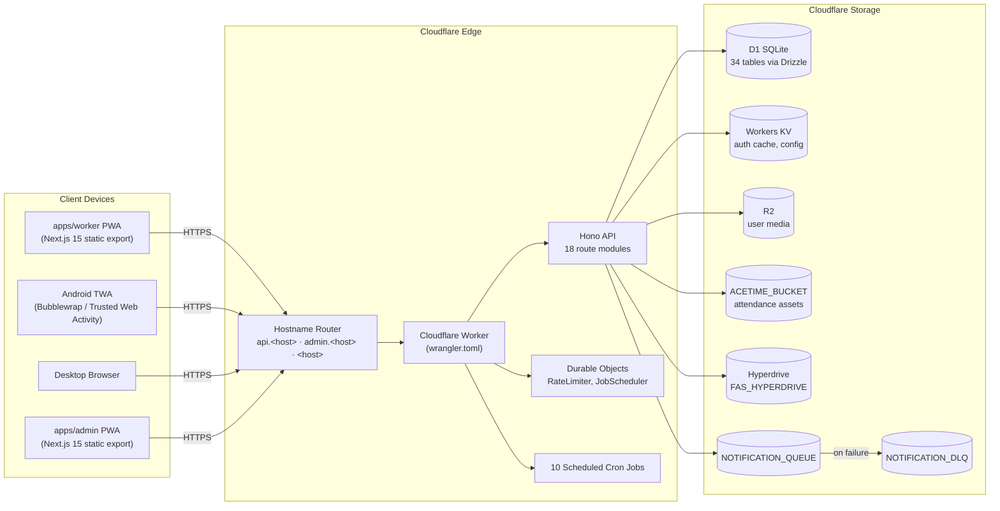

# SafetyWallet / 안전지갑

> Mobile-first PWA for construction-site safety reporting, attendance, and safety-point incentive management — deployed end-to-end on the Cloudflare edge.
> 건설 현장의 안전 보고 · 출퇴근 · 안전 포인트 인센티브를 관리하는 모바일 우선 PWA. **Cloudflare** 엣지에 전량 배포됩니다.


---

## Table of Contents / 목차

- [Overview / 개요](#overview--개요)
- [Key Features / 주요 기능](#key-features--주요-기능)
- [Architecture / 아키텍처](#architecture--아키텍처)
- [Tech Stack / 기술 스택](#tech-stack--기술-스택)
- [Repository Layout / 저장소 구조](#repository-layout--저장소-구조)
- [Quick Start / 빠른 시작](#quick-start--빠른-시작)
- [Configuration / 설정](#configuration--설정)
- [Commands Reference / 명령어 레퍼런스](#commands-reference--명령어-레퍼런스)
- [Local Development / 로컬 개발](#local-development--로컬-개발)
- [Testing / 테스트](#testing--테스트)
- [Android TWA Build / Android TWA 빌드](#android-twa-build--android-twa-빌드)
- [Internationalization / 국제화](#international화)
- [Contribution Guide / 기여 가이드](#contribution-guide--기여-가이드)
- [License / 라이선스](#license--라이선스)

---

## Overview / 개요

**SafetyWallet** is a field-worker safety platform organized as a **Turborepo monorepo** and deployed end-to-end on **Cloudflare**. It targets construction sites where workers need a low-friction, installable mobile experience and site managers need a dashboard to triage safety reports, attendance, and incentive accrual.

**SafetyWallet**은 **Cloudflare** 엣지에 전량 배포되는 **Turborepo 모노레포** 기반 현장 작업자 안전 플랫폼입니다. 작업자가 현장에서 마찰 없이 설치 가능한 모바일 환경을 사용하고, 현장 관리자가 안전 보고 · 출퇴근 · 인센티브 적립을 심사할 수 있도록 설계되었습니다.

The platform consists of three coordinated workspaces:

- **`apps/worker`** — Mobile-first Next.js 15 PWA used by field workers for hazard reports, attendance check-in, and education. Shipped as a static export, served from a TWA wrapper on Android.
- **`apps/admin`** — Next.js 15 dashboard for site admins and super admins to review posts, settle points, export data, and run compliance.
- **`apps/api`** — Cloudflare Worker hosting the Hono API, Drizzle ORM, D1 schema, scheduled cron jobs, Durable Objects, and R2 asset access.

A single Cloudflare Worker routes the two SPAs by hostname, the API endpoints by path prefix, and binds the entire edge (D1, R2, KV, Hyperdrive, Queues, Durable Objects) declared in `wrangler.toml`.

---

## Key Features / 주요 기능

### For Workers / 작업자용

- **PWA install on Android & iOS** — Manifest, service worker, and offline-friendly static export.
- **Hazard & safety reports** — Photo/video uploads to R2, geolocation, category tagging.
- **Attendance check-in/out** — Geofenced with photo proof, logged to `ACETIME_BUCKET`.
- **Safety-point ledger** — Earn and review accrued points; spend on benefits.
- **Education library** — On-site safety training content (videos, quizzes).
- **Multilingual UI** — Korean, English, Vietnamese, Chinese at runtime.

### For Site Admins / 현장 관리자용

- **Triage dashboard** — Pending posts, attendance review, vote resolution.
- **Point settlement** — Approve / reject worker submissions, manage settlement cycles.
- **Compliance exports** — CSV / PDF for incidents and attendance.
- **Site-scoped permissions** — Membership + role + capability flags.

### For Platform Operators / 운영자용

- **Cron-driven jobs** — Ten scheduled jobs (settlements, retention, cleanup) backed by `JobScheduler` Durable Object.
- **Notification pipeline** — `NOTIFICATION_QUEUE` with dead-letter handling on `NOTIFICATION_DLQ`.
- **Rate limiting** — Per-route via `RATE_LIMITER` Durable Object.
- **CI/CD on Git refs** — `master` is the production source of truth; manual deploys are disabled by policy.

---

## Architecture / 아키텍처



### Request flow / 요청 흐름

1. The browser or TWA shell loads the statically-exported SPA from the Worker `ASSETS` binding.
2. SPA calls `/api/*` on the same host; the Worker routes by hostname and path.
3. `JWT` cookie is validated against KV (cache) → D1 (source of truth) with KST same-day midnight expiry.
4. Three-tier authorization: role → site membership → field-level capability flags.
5. Mutations write to D1; media uploads write to R2; long-running tasks queue to `NOTIFICATION_QUEUE`.

---

## Tech Stack / 기술 스택

| Layer / 계층          | Choice / 선택                                | Notes / 비고                                              |
| --------------------- | -------------------------------------------- | --------------------------------------------------------- |
| Language              | TypeScript 5                                 | Strict mode across all workspaces                         |
| Runtime               | Cloudflare Workers (V8 isolates)             | Edge runtime, no Node APIs                                |
| API framework         | Hono                                         | Lightweight, typed routes                                 |
| ORM                   | Drizzle ORM                                  | 34 tables, 31 migrations                                  |
| Database              | Cloudflare D1 (SQLite)                       | Primary persistence                                       |
| Caching               | Cloudflare KV                                | Auth cache, system status, config                         |
| Object storage        | Cloudflare R2                                | User media, attendance assets                             |
| External data         | Hyperdrive → FAS                             | Employee / personnel database                             |
| Async / scheduling    | Queues + Durable Objects (`JobScheduler`)    | Notifications + 10 cron jobs                              |
| Frontend              | Next.js 15 (App Router, static export)       | Two SPAs: worker (3000), admin (3001)                     |
| Styling               | Tailwind CSS v4                              | Theme tokens in `packages/ui`                             |
| Component library     | shadcn/ui (workspace)                        | Shared in `packages/ui`                                   |
| State management      | Zustand (persisted)                          | Auth keys: `safetywallet-auth`, `safetywallet-admin-auth` |
| Forms / validation    | Zod                                          | Request schemas in `apps/api/src/validators`              |
| Build orchestration   | Turborepo                                    | `types → ui → apps` pipeline                              |
| Mobile shell          | Bubblewrap / TWA                             | `apps/worker/android`                                     |
| Testing               | Vitest (unit), Playwright (E2E, 6 projects)  | Playwright config at repo root                            |
| Lint / format         | ESLint 8 + Prettier                          | Husky pre-commit hooks                                    |
| Secrets               | 1Password CLI (`op run`)                     | E2E env via `.env.e2e`                                    |

---

## Repository Layout / 저장소 구조

The full monorepo layout (the slice visible from the repository root) is:

```text
.
├── AGENTS.md                       # Agent knowledge base (project overview)
├── ARCHITECTURE.md                 # Long-form architecture document
├── CODE_STYLE.md                   # Style guide
├── CONTRIBUTING.md                 # Contribution policy
├── LICENSE
├── README.md                       # This document
├── package.json                    # Root workspace + scripts
├── package-lock.json
├── turbo.json                      # Turborepo pipeline (types → ui → apps)
├── wrangler.toml                   # Cloudflare Worker config + bindings
├── vitest.config.ts
├── playwright.config.ts            # 6 Playwright projects
├── apps/
│   ├── worker/                     # Worker PWA (Next.js 15, static export, TWA shell)
│   │   ├── next.config.mjs
│   │   ├── tailwind.config.js
│   │   ├── tsconfig.json
│   │   ├── vitest.config.ts
│   │   ├── src/app/                # App Router entrypoints
│   │   │   ├── layout.tsx
│   │   │   ├── page.tsx
│   │   │   ├── error.tsx
│   │   │   └── globals.css
│   │   └── android/                # Bubblewrap TWA project
│   │       ├── build.gradle
│   │       ├── settings.gradle
│   │       ├── twa-manifest.json
│   │       ├── store_icon.png
│   │       ├── app/
│   │       │   ├── build.gradle
│   │       │   └── src/main/       # Android resources + Java sources
│   │       └── gradle/
│   ├── admin/                      # Admin dashboard (described in AGENTS.md)
│   └── api/                        # Hono API Worker (described in AGENTS.md)
├── packages/
│   ├── types/                      # Shared TS types, enums, DTOs, i18n data
│   └── ui/                         # Shared shadcn/ui + Tailwind v4 tokens
├── docs/                           # PRD, requirements specs, ops runbooks
├── scripts/                        # Go/JS tooling (verify, naming lint, anti-pattern)
└── e2e/                            # Playwright E2E tests
```

---

## Quick Start / 빠른 시작

### Prerequisites / 사전 요구사항

- **Node.js** ≥ 20.0.0
- **npm** 10.8.2 (the repository pins `packageManager` via Corepack)
- **Wrangler** (`npm i -g wrangler`) for Cloudflare local emulation
- **Go** ≥ 1.22 — required for `scripts/*.go` tooling (verify, preflight, anti-pattern checks)
- **Java 17 + Android SDK** — only required for TWA builds
- **1Password CLI (`op`)** — only required for E2E secrets

### Install / 설치

```bash
npm install
```

### Run the full monorepo in dev / 개발 모드 실행

```bash
npm run dev
```

This invokes `turbo run dev`, which boots all three workspaces in dependency order:

| Workspace | URL                | Purpose                       |
| --------- | ------------------ | ----------------------------- |
| `api`     | `http://localhost:8787` | Hono API on Wrangler dev  |
| `worker`  | `http://localhost:3000` | Worker PWA                  |
| `admin`   | `http://localhost:3001` | Admin dashboard             |

### Build a production bundle / 프로덕션 번들 생성

```bash
npm run build
```

`build` runs the full Turborepo pipeline then copies the static exports into `dist/`:

```text
dist/
├── ...worker PWA files...
└── admin/
    └── ...admin PWA files...
```

`build:api` builds only the API Worker, useful for back-end-only iterations. `build:static` re-stages the static assets without rebuilding the bundles.

---

## Configuration / 설정

### Cloudflare bindings / Cloudflare 바인딩

All bindings live in the root `wrangler.toml`. Verify with:

```bash
npm run check:wrangler-sync
```

| Binding                   | Type                  | Purpose                                          |
| ------------------------- | --------------------- | ------------------------------------------------ |
| `DB`                      | D1                    | Primary database (34 tables via Drizzle)         |
| `FAS_HYPERDRIVE`          | Hyperdrive            | External FAS employee database                   |
| `ASSETS`                  | Workers Static Assets | Static frontend bundles (worker + admin)         |
| `R2`                      | R2                    | User-uploaded images and videos                  |
| `ACETIME_BUCKET`          | R2                    | Attendance-related assets                        |
| `KV`                      | KV                    | Auth cache, system status, config                |
| `NOTIFICATION_QUEUE`      | Queue                 | Notification delivery pipeline                   |
| `NOTIFICATION_DLQ`        | Queue                 | Dead-letter queue for failed deliveries          |
| `RATE_LIMITER`            | Durable Object        | Per-route rate limiting                          |
| `JOB_SCHEDULER`           | Durable Object        | Cron job orchestration                           |

### Environment variables / 환경 변수

Secrets are **not** committed. Local development uses `.dev.vars` (Wrangler) and `.env.e2e` (1Password). Examples:

```bash
# .dev.vars (for apps/api via Wrangler)
JWT_SECRET=...
D1_DATABASE_ID=...
FAS_HYPERDRIVE_ID=...
R2_BUCKET=...
KV_NAMESPACE_ID=...
```

### Authentication / 인증

- Login endpoint issues a JWT with **KST same-day midnight** expiry.
- Triple-layer validation: JWT decode → KST date check → KV cache → D1 fallback.
- Three-tier permissions: `WORKER` · `SITE_ADMIN` · `SUPER_ADMIN` · `SYSTEM`, layered with site membership and field-level flags (`canAwardPoints`, `canReview`, `canExportData`).
- Client state is held in Zustand with persisted storage; 401 responses trigger a single-flight refresh.

---

## Commands Reference / 명령어 레퍼런스

| Command / 명령어             | Description / 설명                                                                 |
| ---------------------------- | ----------------------------------------------------------------------------------- |
| `npm run dev`                | Run all workspaces in dev mode via Turbo.                                           |
| `npm run build`              | Build all apps, then copy static exports into `dist/`.                              |
| `npm run build:api`          | Build only the API Worker (`packages/types` → `apps/api`).                          |
| `npm run build:one-worker`   | Alias for `build:api`.                                                              |
| `npm run build:static`       | Re-stage `dist/` from existing `apps/*/out/` folders without rebuilding.            |
| `npm run lint`               | Run ESLint across all workspaces via Turbo.                                         |
| `npm run lint:naming`        | Run naming-convention lint (`scripts/lint-naming.js`).                              |
| `npm run typecheck`          | Run `tsc --noEmit` across all workspaces.                                           |
| `npm run test`               | Run Vitest across all workspaces.                                                   |
| `npm run test:coverage`      | Run Vitest with coverage.                                                           |
| `npm run e2e`                | Run Playwright E2E with secrets from 1Password (`op run`).                          |
| `npm run e2e:headed`         | Same as above in headed mode.                                                       |
| `npm run e2e:ui`             | Same as above with the Playwright UI.                                               |
| `npm run format`             | Format TS/TSX/JS/JSX/JSON/MD with Prettier.                                         |
| `npm run format:check`       | Check formatting without writing.                                                   |
| `npm run db:generate`        | Generate Drizzle migrations for the API.                                            |
| `npm run check:wrangler-sync`| Verify `wrangler.toml` matches the documented bindings.                            |
| `npm run git:preflight`      | Run `scripts/git-preflight.go` before commit.                                       |
| `npm run verify`             | Run `scripts/verify.go` for repository-level checks.                                |
| `npm run clean`              | Remove `node_modules` and `dist/` across workspaces.                                |
| `npm run deploy:api`         | **Disabled by policy.** Manual deploys exit non-zero; CI on `master` is the source of truth. |

---

## Local Development / 로컬 개발

### Backend iteration (API only) / API만 빠르게 반복

```bash
npm run build:api
cd apps/api && npx wrangler dev
```

Wrangler binds `DB` to a local D1 emulation and serves on `http://localhost:8787`.

### Frontend iteration (Worker PWA) / 워커 PWA만 반복

```bash
cd apps/worker && npm run dev
```

### Frontend iteration (Admin) / 어드민만 반복

```bash
cd apps/admin && npm run dev
```

### Pre-commit hooks / 커밋 훅

Husky installs via `prepare`. On staged TS/TSX files:

1. `go run scripts/check-anti-patterns.go` rejects known anti-patterns.
2. Prettier formats the file.

JSON / JS / MD files are formatted only.

---

## Testing / 테스트

### Unit tests / 단위 테스트

Vitest is configured at the repo root (`vitest.config.ts`) and in each workspace.

```bash
npm run test
npm run test:coverage
```

### End-to-end tests / E2E 테스트

Playwright runs across **6 projects** declared in `playwright.config.ts`. Secrets come from 1Password; `.env.e2e` is referenced by `op run`.

```bash
npm run e2e          # headless
npm run e2e:headed   # headed
npm run e2e:ui       # UI mode
```

The E2E suite covers auth, admin flows, and worker flows.

### Continuous integration / CI

GitHub Actions run in order: `lint` → `typecheck` → guard checks (`check:wrangler-sync`, `lint:naming`, anti-pattern, git preflight) → `test` → `build` → `migrate`. Production deploys are gated on merges to `master`.

---

## Android TWA Build / Android TWA 빌드

The worker PWA is shipped as a Trusted Web Activity so workers get a real app icon, splash screen, and Play Store listing without a native rewrite.

The TWA project lives under `apps/worker/android/`. Key files:

- `twa-manifest.json` — Bubblewrap manifest driving the build.
- `app/build.gradle` — App module config.
- `app/src/main/AndroidManifest.xml` — TWA host declaration.
- `app/src/main/java/me/jclee/safetywallet/twa/`
  - `Application.java`
  - `DelegationService.java`
  - `LauncherActivity.java`
- `app/src/main/res/raw/web_app_manifest.json` — Embedded PWA manifest reference.
- `app/src/main/res/xml/{filepaths,shortcuts}.xml`
- Mipmap + drawable resources across `mdpi` → `xxxhdpi`.

### Build the TWA / TWA 빌드

```bash
cd apps/worker/android
./gradlew assembleRelease
```

The signed APK / AAB lands in `app/build/outputs/apk/release/` and `app/build/outputs/bundle/release/`.

> **Note / 참고:** The Bubblewrap build directory `apps/worker/android/` contains transient artifacts. `app/build/` and `app/release/` are typically `.gitignore`d after generation.

---

## Internationalization / 국제화

The worker PWA ships a custom runtime i18n (`apps/worker/src/i18n/`) supporting:

- `ko` — 한국어 (default)
- `en` — English
- `vi` — Tiếng Việt
- `zh` — 中文

Translation source data lives in `packages/types` so admin and worker share vocabulary. Server messages return localized strings keyed by the same identifiers.

See `apps/worker/I18N_IMPLEMENTATION.md` for runtime details, fallback chains, and how locale is negotiated.

---

## Contribution Guide / 기여 가이드

1. Read `CONTRIBUTING.md`, `CODE_STYLE.md`, and `ARCHITECTURE.md` first.
2. Branch from `master` with the convention `<type>/<short-kebab-summary>`.
3. Use Conventional Commits (`feat:`, `fix:`, `chore:`, `refactor:` …).
4. Before opening a PR, ensure locally:

   ```bash
   npm run lint
   npm run typecheck
   npm run test
   npm run format:check
   npm run check:wrangler-sync
   npm run lint:naming
   ```

5. Husky pre-commit runs `scripts/check-anti-patterns.go` and Prettier on staged files.
6. Open a PR; CI must be green. Manual `npm run deploy:api` is intentionally disabled — production deployments are Git-ref driven via CI on `master`.
7. For schema changes, attach the generated migration under `apps/api/migrations/` and call it out in the PR description.

---

## License / 라이선스

This repository is released under the terms described in [`LICENSE`](./LICENSE).

---

###TASK_COMPLETED###