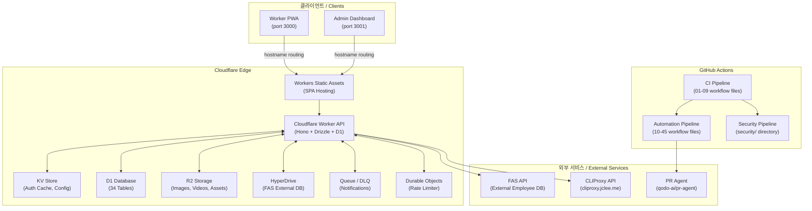

# SafetyWallet

> 건설 현장 안전 관리 플랫폼 / Construction Site Safety Management Platform

[](LICENSE)
[](https://nodejs.org/)
[](https://www.npmjs.com/)
[](https://www.typescriptlang.org/)
[](https://workers.cloudflare.com/)
[](https://turbo.build/)
[](https://deepscan.io)

---

## 목차 / Table of Contents

- [개요 / Overview](#개요--overview)
- [주요 기능 / Features](#주요-기능--features)
- [아키텍처 / Architecture](#아키텍처--architecture)
- [자동화 인벤토리 / Automation Inventory](#자동화-인벤토리--automation-inventory)
- [빠른 시작 / Quick Start](#빠른-시작--quick-start)
- [로컬 개발 / Local Development](#로컬-개발--local-development)
- [명령어 참조 / Commands Reference](#명령어-참조--commands-reference)
- [기여 가이드 / Contributing Guide](#기여-가이드--contributing-guide)
- [라이선스 / License](#라이선스--license)

---

## 개요 / Overview

SafetyWallet은 건설 현장의 안전 관리, 교육, 게시/투표, 리뷰, 포인트, 사용자/현장 관리 기능을 위한 TypeScript 기반 모노레포입니다.

SafetyWallet is a TypeScript-based monorepo for construction-site safety management, education, posts/votes, reviews, points, users, and site-management workflows.

이 저장소는 다음과 같은 구성요소를 포함합니다.

This repository contains the following main components:

| 구성 요소 / Component | 설명 / Description |
|---|---|
| `apps/api` | Cloudflare Workers 기반 API 애플리케이션 (Hono + Drizzle + D1) |
| `apps/admin` | Next.js 15 관리자 대시보드 (port 3001, 정적 내보내기) |
| `apps/worker` | Next.js 15 워커 PWA (port 3000, 정적 내보내기) |
| `packages/types` | 공유 API 타입, DTO, enum, 다국어(i18n) 리소스 |
| `packages/ui` | 공유 React UI 컴포넌트 (shadcn/ui + Tailwind v4) |

GitHub Actions 기반 자동화: PR 검사, 보안 스캔, 자동 리뷰, 릴리스, 문서 동기화, 이슈 관리, 자동 복구 등

### 기술 스택 / Technology Stack

| 영역 / Area | 기술 / Technology |
|---|---|
| 언어 / Language | TypeScript |
| 런타임 / Runtime | Node.js `>=20.0.0` |
| 패키지 매니저 / Package Manager | npm `10.8.2` |
| 모노레포 / Monorepo | npm workspaces, Turborepo |
| API | Cloudflare Workers, Hono |
| 데이터 계층 / Data Layer | Drizzle ORM, Cloudflare D1 |
| 프론트엔드 / Frontend | Next.js 15 (App Router), React 18.3.1 |
| UI 컴포넌트 / UI Components | shadcn/ui, Tailwind CSS v4 |
| 테스트 / Testing | Vitest, Playwright |
| 스토리지 / Storage | Cloudflare R2, D1, KV |

---

## 주요 기능 / Features

### 안전 관리 / Safety Management

- 위험 요소 보고 (Hazard Reporting)
- 출석 기록 및 관리 (Attendance Logging)
- 안전 포인트 적립 및 조회 (Safety Points System)

### 교육 / Education

- 교육 콘텐츠 관리 (Education Content Management)
- 교육 퀴즈 시스템 (Education Quiz System)
- 교육 이수 트래킹 (Training Progress Tracking)

### 커뮤니티 / Community

- 게시글 작성 및 조회 (Posts)
- 투표 시스템 (Voting System)
- 리뷰 및 평가 (Reviews)

### 관리 / Administration

- 현장 관리자 대시보드 (Site Admin Dashboard)
- 시스템 관리자 패널 (Super Admin Panel)
- 데이터 내보내기 (Data Export)

---

## 아키텍처 / Architecture



### 호스트명 기반 라우팅 / Hostname-Based Routing

Single Cloudflare Worker가 요청 호스트명에 따라 세 개의 엔드포인트를 제공합니다.

| 호스트명 / Hostname | 대상 / Target |
|---|---|
| `worker.safetywallet.example` | Worker PWA (`/apps/worker`) |
| `admin.safetywallet.example` | Admin Dashboard (`/apps/admin`) |
| 기본 / Default | API (`/apps/api`) |

### 인증 흐름 / Authentication Flow

1. 로그인 시 JWT 발급 (KST 자정 만료)
2. Triple-layer 검증: JWT decode → KST 날짜 확인 → KV 캐시 조회 → D1 폴백
3. Zustand 기반 클라이언트 인증 스토어
4. 401 응답 시 refresh 뮤텍스

### 권한 체계 / Permission Model

| 역할 / Role | 설명 / Description |
|---|---|
| `WORKER` | 현장 작업자 |
| `SITE_ADMIN` | 현장 관리자 |
| `SUPER_ADMIN` | 시스템 관리자 |
| `SYSTEM` | 시스템 서비스 계정 |

역할 기반 권한 + 현장별 멤버십 + 필드 수준 플래그 (`canAwardPoints`, `canReview`, `canExportData`)

---

## 자동화 인벤토리 / Automation Inventory

### CI/CD 워크플로우 / CI/CD Workflows

| 파일명 / Filename | 설명 / Description |
|---|---|
| `ci.yml` | 기본 CI 파이프라인 |
| `standard-ci.yml` | 표준 CI 구성 |
| `auto-merge.yml` | 자동 병합 설정 |
| `labeler.yml` | PR 라벨 관리 |

### PR 관련 워크플로우 / Pull Request Workflows

| 파일명 / Filename | 설명 / Description |
|---|---|
| `01_branch-to-pr.yml` | 브랜치 → PR 변환 |
| `03_pr-checks.yml` | PR 체크 실행 |
| `09_semantic-pr.yml` | Semantic PR 검증 |
| `10_pr-review.yml` | PR 자동 리뷰 |
| `13_pr-auto-merge.yml` | PR 자동 병합 |
| `14_bot-auto-fix.yml` | 봇 자동 수정 |
| `15_merged-pr-cleanup.yml` | 병합 후 정리 |
| `security/11_pr-review.yml` | 보안 리뷰 (security/) |

### 이슈 관리 워크플로우 / Issue Management Workflows

| 파일명 / Filename | 설명 / Description |
|---|---|
| `18_issue-management.yml` | 이슈 관리 |
| `19_issue-backfill.yml` | 이슈 백필 |
| `37_ci-failure-issues.yml` | CI 실패 → 이슈 생성 |
| `43_reusable-issue-management.yml` | 재사용 가능한 이슈 관리 |

### 보안 워크플로우 / Security Workflows

| 파일명 / Filename | 설명 / Description |
|---|---|
| `04_actionlint.yml` | GitHub Actions lint |
| `05_gitleaks.yml` | 시크릿 스캔 |
| `06_codeql.yml` | CodeQL 분석 |
| `07_dependency-review.yml` | 의존성 검토 |
| `08_scorecard.yml` | OpenSSF Scorecard |
| `45_reusable-gitleaks.yml` | 재사용 가능한 Gitleaks |

### 릴리스 워크플로우 / Release Workflows

| 파일명 / Filename | 설명 / Description |
|---|---|
| `24_release-notes.yml` | 릴리스 노트 생성 |
| `25_release-publish.yml` | 릴리스 게시 |

### 문서 동기화 워크플로우 / Documentation Sync Workflows

| 파일명 / Filename | 설명 / Description |
|---|---|
| `20_readme-gen.yml` | README 생성 |
| `21_docs-sync.yml` | 문서 동기화 |
| `42_reusable-docs-sync.yml` | 재사용 가능한 문서 동기화 |

### 자동화 도구 / Automation Tools

| 도구 / Tool | 용도 / Purpose |
|---|---|
| `PR Agent` (qodo-ai/pr-agent) | PR 자동 리뷰 및 수정 |
| `CLIProxy API` (cliproxy.jclee.me) | AI 모델 라우팅 |
| `DeepScan` | 코드 품질 분석 |

### Downstream 워크플로우 / Downstream Workflows

| 파일명 / Filename | 설명 / Description |
|---|---|
| `29_downstream-health-check.yml` | 다운스트림 헬스 체크 |

### 자동 복구 워크플로우 / Auto-Heal Workflows

| 파일명 / Filename | 설명 / Description |
|---|---|
| `60_ci-auto-heal.yml` | CI 자동 복구 |

### 기타 워크플로우 / Other Workflows

| 파일명 / Filename | 설명 / Description |
|---|---|
| `02_issue-to-branch.yml` | 이슈 → 브랜치 생성 |
| `12_dependabot-auto-merge.yml` | Dependabot 자동 병합 |
| `44_reusable-pr-checks.yml` | 재사용 가능한 PR 체크 |

---

## 빠른 시작 / Quick Start

### 전제 조건 / Prerequisites

- Node.js `>=20.0.0`
- npm `10.8.2`
- Git

### 1.克隆 저장소 / Clone Repository

```bash
git clone https://github.com/<owner>/safetywallet.git
cd safetywallet
```

### 2.의존성 설치 / Install Dependencies

```bash
npm install
```

### 3.환경 변수 설정 / Environment Variables

```bash
cp .env.example .env.local
```

> 참고 / Note: `.env.example` 파일을 참조하여 필수 환경 변수를 설정하세요.

### 4.개발 서버 시작 / Start Development Server

```bash
npm run dev
```

| 서비스 / Service | URL |
|---|---|
| Worker PWA | <http://localhost:3000> |
| Admin Dashboard | <http://localhost:3001> |
| API | <http://localhost:3002> |

---

## 로컬 개발 / Local Development

### 패키지 작업 / Working with Packages

#### packages/types 빌드 / Build Types Package

```bash
npm run build --workspace=packages/types
```

#### packages/ui 빌드 / Build UI Package

```bash
npm run build --workspace=packages/ui
```

#### apps/api 빌드 / Build API

```bash
npm run build:api
```

### 데이터베이스 마이그레이션 / Database Migration

```bash
npm run db:generate --workspace=apps/api
```

### 테스트 실행 / Run Tests

#### 유닛 테스트 / Unit Tests

```bash
npm run test
```

#### 커버리지 포함 테스트 / Tests with Coverage

```bash
npm run test:coverage
```

#### E2E 테스트 / E2E Tests

```bash
npm run e2e
```

#### E2E 테스트 (헤드리스) / E2E Tests (Headed)

```bash
npm run e2e:headed
```

#### E2E 테스트 (UI 모드) / E2E Tests (UI Mode)

```bash
npm run e2e:ui
```

### 코드 품질 검사 / Code Quality

```bash
# 모든 린트 검사
npm run lint

# 타입 검사
npm run typecheck

# 포맷팅 확인
npm run format:check

# 네이밍 컨벤션 검사
npm run lint:naming
```

---

## 명령어 참조 / Commands Reference

### 빌드 명령어 / Build Commands

| 명령어 / Command | 설명 / Description |
|---|---|
| `npm run build` | 전체 프로젝트 빌드 |
| `npm run build:api` | API 패키지 빌드 |
| `npm run build:static` | 정적 파일 빌드 |
| `npm run build:one-worker` | 단일 워커 빌드 |

### 개발 명령어 / Development Commands

| 명령어 / Command | 설명 / Description |
|---|---|
| `npm run dev` | 개발 서버 시작 (전체 모노레포) |
| `npm run lint` | 린트 검사 실행 |
| `npm run typecheck` | TypeScript 타입 검사 |

### 테스트 명령어 / Test Commands

| 명령어 / Command | 설명 / Description |
|---|---|
| `npm run test` | Vitest 유닛 테스트 실행 |
| `npm run test:coverage` | 커버리지 포함 테스트 |
| `npm run e2e` | Playwright E2E 테스트 |
| `npm run e2e:headed` | 헤드리스 E2E 테스트 |
| `npm run e2e:ui` | Playwright UI 모드 |

### 데이터베이스 명령어 / Database Commands

| 명령어 / Command | 설명 / Description |
|---|---|
| `npm run db:generate` | Drizzle 마이그레이션 생성 |

### 코드 품질 명령어 / Code Quality Commands

| 명령어 / Command | 설명 / Description |
|---|---|
| `npm run lint` | Turborepo 린트 실행 |
| `npm run lint:naming` | 네이밍 컨벤션 검사 |
| `npm run format` | Prettier 포맷팅 적용 |
| `npm run format:check` | Prettier 포맷팅 확인 |
| `npm run check:wrangler-sync` | Wrangler 설정 동기화 확인 |

### 배포 명령어 / Deployment Commands

| 명령어 / Command | 설명 / Description |
|---|---|
| `npm run deploy:api` | 수동 배포 비활성화 (CI 자동 배포) |

### 정리 명령어 / Cleanup Commands

| 명령어 / Command | 설명 / Description |
|---|---|
| `npm run clean` | 빌드 결과물 및 node_modules 삭제 |

---

## 저장소 구조 / Repository Structure

```
safetywallet/
├── .github/
│   └── workflows/              # GitHub Actions 워크플로우
│       ├── 01_branch-to-pr.yml
│       ├── 02_issue-to-branch.yml
│       ├── 03_pr-checks.yml
│       ├── 04_actionlint.yml
│       ├── 05_gitleaks.yml
│       ├── 06_codeql.yml
│       ├── 07_dependency-review.yml
│       ├── 08_scorecard.yml
│       ├── 09_semantic-pr.yml
│       ├── 10_pr-review.yml
│       ├── 12_dependabot-auto-merge.yml
│       ├── 13_pr-auto-merge.yml
│       ├── 14_bot-auto-fix.yml
│       ├── 15_merged-pr-cleanup.yml
│       ├── 18_issue-management.yml
│       ├── 19_issue-backfill.yml
│       ├── 20_readme-gen.yml
│       ├── 21_docs-sync.yml
│       ├── 24_release-notes.yml
│       ├── 25_release-publish.yml
│       ├── 29_downstream-health-check.yml
│       ├── 37_ci-failure-issues.yml
│       ├── 42_reusable-docs-sync.yml
│       ├── 43_reusable-issue-management.yml
│       ├── 44_reusable-pr-checks.yml
│       ├── 45_reusable-gitleaks.yml
│       ├── 60_ci-auto-heal.yml
│       ├── auto-merge.yml
│       ├── ci.yml
│       ├── labeler.yml
│       ├── standard-ci.yml
│       ├── welcome.yml
│       └── security/
│           └── 11_pr-review.yml
├── apps/
│   ├── api/                    # Cloudflare Worker API
│   │   ├── src/
│   │   │   ├── routes/         # 18 API 라우트 모듈
│   │   │   ├── lib/           # Auth, helpers, FAS, R2
│   │   │   ├── middleware/    # CORS, logging, analytics
│   │   │   ├── db/            # Drizzle 스키마 (34 테이블)
│   │   │   ├── durable-objects/  # RateLimiter, JobScheduler
│   │   │   ├── jobs/          # 10 스케줄 크론 작업
│   │   │   └── validators/    # Zod 스키마
│   │   ├── migrations/        # 31 D1 SQL 마이그레이션
│   │   └── package.json
│   ├── admin/                 # Next.js 15 Admin Dashboard
│   │   └── src/app/           # App Router: attendance, posts, votes, education
│   └── worker/                # Next.js 15 Worker PWA
│       └── src/app/           # App Router: login, posts, attendance, education
├── packages/
│   ├── types/                 # 공유 타입, DTO, enum, i18n
│   │   ├── src/
│   │   │   ├── dto/           # Data Transfer Objects
│   │   │   └── i18n/          # 다국어 리소스 (ko, en, vi, zh)
│   │   └── package.json
│   └── ui/                    # 공유 React 컴포넌트
│       ├── src/
│       │   ├── components/    # shadcn/ui 기반 컴포넌트
│       │   ├── lib/           # 유틸리티
│       │   └── __tests__/    # 컴포넌트 테스트
│       └── package.json
├── docs/                      # PRD, 요구사항 문서, ops runbook
├── scripts/                   # Go/JS 도구 (verify, lint, anti-patterns)
├── e2e/                       # Playwright E2E 테스트
├── wrangler.toml              # Cloudflare Worker 설정
├── turbo.json                 # Turborepo 파이프라인
├── playwright.config.ts       # Playwright 설정
├── package.json               # 루트 패키지 설정
├── vitest.config.ts           # Vitest 설정
└── README.md
```

---

## 기여 가이드 / Contributing Guide

저장소를 기여하기 전에 CONTRIBUTING.md의 가이드라인을 읽어주세요.

Please read the guidelines in CONTRIBUTING.md before contributing to the repository.

### 커밋 메시지 규칙 / Commit Message Convention

이 프로젝트는 Semantic PR 커밋 메시지 규칙을 사용합니다.

| 타입 / Type | 설명 / Description |
|---|---|
| `feat` | 새로운 기능 |
| `fix` | 버그 수정 |
| `docs` | 문서 변경 |
| `style` | 코드 포맷팅 |
| `refactor` | 코드 리팩토링 |
| `perf` | 성능 개선 |
| `test` | 테스트 추가/수정 |
| `chore` | 빌드/도구 변경 |

### 브랜치命名规则 / Branch Naming Convention

```
<type>/<issue-number>-<description>
```

예시 / Examples:

- `feat/123-add-hazard-reporting`
- `fix/456-attendance-bug`
- `docs/789-update-api-docs`

### PR 생성 / Creating Pull Requests

1. 최신 `master` 브랜치에서 새 브랜치를 생성하세요.
2. 변경 사항을 구현하세요.
3. 테스트를 실행하세요: `npm run test`
4. lint를 통과하세요: `npm run lint`
5. PR을 생성하고 적절한 라벨을 지정하세요.

### 코드 스타일 / Code Style

| 규칙 / Rule | 도구 / Tool |
|---|---|
| 포맷팅 / Formatting | Prettier |
| 린트 / Linting | ESLint |
| 타입 검사 / Type Checking | TypeScript |
| 커밋 검증 / Commit Validation | go/verify |

자세한 내용은 CODE_STYLE.md를 참조하세요.

---

## 라이선스 / License

이 프로젝트는 MIT 라이선스 하에 공개되어 있습니다. 자세한 내용은 [LICENSE](LICENSE) 파일을 참조하세요.

This project is published under the MIT License. See the [LICENSE](LICENSE) file for details.

---

## 관련 문서 / Related Documentation

| 문서 / Document | 설명 / Description |
|---|---|
| [ARCHITECTURE.md](ARCHITECTURE.md) | 상세 아키텍처 문서 |
| [AGENTS.md](AGENTS.md) | AI 에이전트 활용 가이드 |
| [CODE_STYLE.md](CODE_STYLE.md) | 코드 스타일 가이드 |
| [CONTRIBUTING.md](CONTRIBUTING.md) | 기여 가이드라인 |

---

## 외부 링크 / External Links

| 서비스 / Service | URL |
|---|---|
| CLIProxy API | <https://cliproxy.jclee.me/v1> |
| PR Agent | <https://github.com/qodo-ai/pr-agent> |
