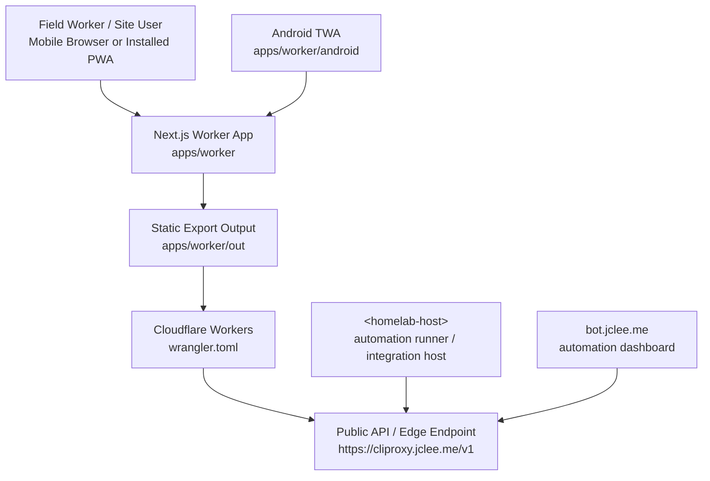
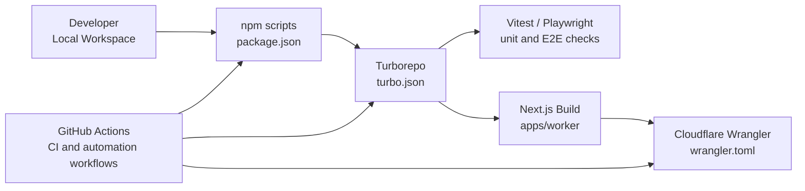

# SafetyWallet

건설 현장 안전 관리 플랫폼 / Construction Site Safety Management Platform

## Badges / 배지

`License: MIT` `Node.js: >=20.0.0` `npm: 10.8.2` `TypeScript` `Next.js` `Cloudflare Workers` `Turborepo` `Vitest` `Playwright`

## Overview / 개요

SafetyWallet은 건설 현장의 작업자와 관리자 모두를 위한 안전 관리 플랫폼입니다. 작업자는 모바일 PWA를 통해 위험 요소를 신고하고, 출석을 기록하며, 안전 교육 및 포인트 기반 활동에 참여할 수 있습니다. 관리자는 현장 운영, 리뷰, 정산, 규정 준수 상태를 관리할 수 있습니다.

SafetyWallet is a construction-site safety management platform for both field workers and site administrators. Workers use a mobile PWA to report hazards, record attendance, participate in safety education, and interact with point-based workflows. Administrators manage site operations, reviews, settlements, and compliance workflows.

이 저장소는 TypeScript 기반 모노레포로 구성되어 있으며, 현재 제공된 프로젝트 스냅샷 기준으로 `apps/worker` 애플리케이션과 Android TWA 관련 구성이 포함되어 있습니다.

This repository is a TypeScript-based monorepo. Based on the provided project snapshot, it currently includes the `apps/worker` application and Android Trusted Web Activity configuration.

## Features / 주요 기능

### Product Features / 제품 기능

- 모바일 작업자 PWA / Mobile worker PWA
- 건설 현장 안전 활동 지원 / Construction-site safety workflow support
- Next.js 기반 정적 프론트엔드 / Next.js static frontend
- Android TWA 패키징 구성 / Android Trusted Web Activity packaging
- 다국어 구현 문서 포함 / Internationalization implementation documentation included
- Cloudflare Workers 배포 구성을 위한 `wrangler.toml` 포함 / `wrangler.toml` for Cloudflare Workers deployment configuration

### Engineering Features / 엔지니어링 기능

- npm workspaces 기반 모노레포 구성 / npm workspaces monorepo layout
- Turborepo 기반 빌드 및 태스크 오케스트레이션 / Turborepo-based build and task orchestration
- TypeScript 개발 환경 / TypeScript development environment
- Vitest 테스트 구성 / Vitest test configuration
- Playwright E2E 테스트 구성 / Playwright E2E test configuration
- Prettier 포맷팅 / Prettier formatting
- Husky 및 lint-staged 기반 커밋 전 검증 / Husky and lint-staged pre-commit validation
- GitHub Actions 기반 CI, 보안 검사, PR 자동화 / GitHub Actions-based CI, security checks, and PR automation
- README 자동 생성 워크플로 / README generation workflow

## Architecture / 아키텍처

### Runtime Architecture / 런타임 아키텍처



### Repository Layout / 저장소 구조

현재 제공된 프로젝트 구조 기준의 최상위 레이아웃입니다.

The following tree reflects the provided top-level project layout.

```text
.
├── AGENTS.md
├── ARCHITECTURE.md
├── CODE_STYLE.md
├── CONTRIBUTING.md
├── LICENSE
├── README.md
├── package-lock.json
├── package.json
├── playwright.config.ts
├── turbo.json
├── vitest.config.ts
├── wrangler.toml
└── apps/
    └── worker/
        ├── AGENTS.md
        ├── I18N_IMPLEMENTATION.md
        ├── next-env.d.ts
        ├── next.config.mjs
        ├── package.json
        ├── postcss.config.cjs
        ├── tailwind.config.js
        ├── tsconfig.json
        ├── vitest.config.ts
        ├── android/
        │   ├── build.gradle
        │   ├── gradle.properties
        │   ├── gradlew
        │   ├── gradlew.bat
        │   ├── manifest-checksum.txt
        │   ├── settings.gradle
        │   ├── store_icon.png
        │   ├── twa-manifest.json
        │   └── app/
        │       ├── build.gradle
        │       └── src/
        │           └── main/
        │               ├── AndroidManifest.xml
        │               ├── java/
        │               └── res/
        └── src/
            └── app/
                ├── AGENTS.md
                ├── error.tsx
                ├── globals.css
                ├── layout.tsx
                └── page.tsx
```

### Build and Delivery Flow / 빌드 및 배포 흐름



## Automation Inventory / 자동화 인벤토리

이 저장소에는 총 32개의 GitHub Actions 워크플로 파일이 제공됩니다.

This repository includes 32 GitHub Actions workflow files.

### GitHub Actions Workflows / GitHub Actions 워크플로

| File / 파일 | Purpose / 목적 |
|---|---|
| `01_branch-to-pr.yml` | 브랜치 기반 PR 생성 자동화 / Branch-to-PR automation |
| `02_issue-to-branch.yml` | 이슈 기반 브랜치 생성 자동화 / Issue-to-branch automation |
| `03_pr-checks.yml` | PR 검증 기본 파이프라인 / General PR checks |
| `04_actionlint.yml` | GitHub Actions 문법 및 정적 검증 / GitHub Actions linting |
| `05_gitleaks.yml` | 비밀정보 및 토큰 유출 검사 / Secret scanning with Gitleaks |
| `06_codeql.yml` | CodeQL 기반 정적 보안 분석 / CodeQL static security analysis |
| `07_dependency-review.yml` | 의존성 변경 및 취약점 리뷰 / Dependency review |
| `08_scorecard.yml` | 공급망 보안 점검 / Supply-chain security checks |
| `09_semantic-pr.yml` | PR 제목 및 커밋 의미 규칙 검증 / Semantic PR validation |
| `10_pr-review.yml` | AI 기반 PR 리뷰 자동화 / AI-assisted PR review |
| `11_security-pr-review.yml` | 보안 관점 PR 리뷰 자동화 / Security-focused PR review |
| `12_dependabot-auto-merge.yml` | Dependabot PR 자동 병합 / Dependabot auto-merge |
| `13_pr-auto-merge.yml` | 일반 PR 자동 병합 조건 처리 / PR auto-merge orchestration |
| `14_bot-auto-fix.yml` | 봇 기반 자동 수정 / Bot-driven auto-fix workflow |
| `15_merged-pr-cleanup.yml` | 병합된 PR 후속 정리 / Post-merge PR cleanup |
| `19_issue-backfill.yml` | 이슈 메타데이터 보강 / Issue metadata backfill |
| `20_readme-gen.yml` | README 자동 생성 / README generation |
| `21_docs-sync.yml` | 문서 동기화 / Documentation sync |
| `24_release-notes.yml` | 릴리스 노트 생성 / Release notes generation |
| `25_release-publish.yml` | 릴리스 게시 자동화 / Release publication |
| `29_downstream-health-check.yml` | 다운스트림 상태 점검 / Downstream health checks |
| `37_ci-failure-issues.yml` | CI 실패 이슈 생성 및 추적 / CI failure issue tracking |
| `42_reusable-docs-sync.yml` | 재사용 가능한 문서 동기화 워크플로 / Reusable docs sync workflow |
| `44_reusable-pr-checks.yml` | 재사용 가능한 PR 검증 워크플로 / Reusable PR checks workflow |
| `45_reusable-gitleaks.yml` | 재사용 가능한 Gitleaks 검사 / Reusable Gitleaks workflow |
| `60_ci-auto-heal.yml` | CI 자동 복구 시도 / CI auto-healing |
| `91_issue-classification.yml` | 이슈 자동 분류 / Issue classification |
| `auto-merge.yml` | 추가 자동 병합 워크플로 / Additional auto-merge workflow |
| `ci.yml` | 일반 CI 파이프라인 / General CI pipeline |
| `labeler.yml` | 라벨 자동 적용 / Automatic labeling |
| `standard-ci.yml` | 표준 CI 파이프라인 / Standard CI pipeline |
| `welcome.yml` | 신규 기여자 환영 메시지 / Welcome automation |

### Automation Tools / 자동화 도구

| Tool / 도구 | Usage / 사용 목적 |
|---|---|
| GitHub Actions | CI, PR automation, security checks, release automation |
| actionlint | GitHub Actions workflow validation |
| Gitleaks | Secret scanning |
| CodeQL | Static application security testing |
| Dependency Review | Dependency and vulnerability review |
| OSSF Scorecard | Supply-chain security posture checks |
| Dependabot | Dependency update automation |
| Qodo PR-Agent | AI-assisted pull request review and summarization |
| CLIProxyAPI | Internal automation API gateway via `https://cliproxy.jclee.me/v1` |
| README generator | Primary model: `gpt-5.5`; fallback: `minimax-m3` via CLIProxyAPI |
| Turborepo | Monorepo task orchestration |
| Vitest | Unit and component testing |
| Playwright | End-to-end testing |
| Prettier | Code formatting |
| Husky | Git hook management |
| lint-staged | Staged-file formatting and validation |
| Wrangler | Cloudflare Workers configuration and deployment tooling |

### Go Automation Tools / Go 자동화 도구

제공된 자동화 인벤토리 기준 Go 자동화 도구는 없습니다.

According to the provided automation inventory, there are no standalone Go automation tools.

| Category / 분류 | Count / 개수 |
|---|---:|
| Go automation tools | 0 |

참고: 루트 `package.json`에는 Go 명령을 호출하는 npm 스크립트가 선언되어 있습니다. 다만 제공된 프로젝트 구조 스냅샷에는 해당 Go 도구 파일이 포함되어 있지 않습니다.

Note: The root `package.json` declares npm scripts that invoke Go commands, but the provided project structure snapshot does not include those Go tool files.

## Quick Start / 빠른 시작

### Prerequisites / 사전 요구사항

- Node.js `>=20.0.0`
- npm `10.8.2`
- Git
- Cloudflare Wrangler access if deploying to Cloudflare Workers
- Playwright browser dependencies if running E2E tests

### Install / 설치

```bash
npm install
```

### Run Development Server / 개발 서버 실행

```bash
npm run dev
```

작업자 앱만 실행하려면 워크스페이스 스크립트를 사용할 수 있습니다.

To run only the worker app, use the workspace script when available:

```bash
npm run dev --workspace=apps/worker
```

### Build / 빌드

```bash
npm run build
```

### Test / 테스트

```bash
npm run test
```

### Type Check / 타입 검사

```bash
npm run typecheck
```

### Format / 포맷팅

```bash
npm run format
```

### End-to-End Tests / E2E 테스트

```bash
npm run e2e
```

`e2e` 스크립트는 `.env.e2e` 환경 파일과 1Password CLI의 `op run` 사용을 전제로 합니다.

The `e2e` script assumes an `.env.e2e` file and the use of `op run` from the 1Password CLI.

## Local Development / 로컬 개발

### Recommended Workflow / 권장 개발 흐름

1. 저장소를 클론합니다. / Clone the repository.
2. Node.js `>=20.0.0`을 사용합니다. / Use Node.js `>=20.0.0`.
3. 의존성을 설치합니다. / Install dependencies.
4. 개발 서버를 실행합니다. / Start the development server.
5. 변경 전후로 lint, test, typecheck를 실행합니다. / Run lint, test, and typecheck before and after changes.
6. PR을 생성하면 자동화 워크플로가 보안, 품질, 리뷰 검증을 수행합니다. / When a PR is opened, automation workflows run security, quality, and review checks.

```bash
npm install
npm run dev
npm run lint
npm run typecheck
npm run test
```

### Environment Configuration / 환경 설정

환경 변수는 로컬 개발, E2E 테스트, Cloudflare Workers 배포 단계에 따라 다르게 구성될 수 있습니다.

Environment variables may differ between local development, E2E testing, and Cloudflare Workers deployment.

권장 사항:

Recommendations:

- 비밀값은 저장소에 커밋하지 마세요. / Do not commit secrets to the repository.
- 로컬 전용 값은 `.env.local` 또는 도구별 환경 파일에 보관하세요. / Store local-only values in `.env.local` or tool-specific environment files.
- 내부 호스트는 문서에 직접 적지 말고 `<homelab-host>` 같은 플레이스홀더를 사용하세요. / Use placeholders such as `<homelab-host>` instead of documenting internal hosts directly.
- 공개 자동화 API가 필요한 경우 `https://cliproxy.jclee.me/v1` 엔드포인트를 사용하세요. / Use `https://cliproxy.jclee.me/v1` when a public automation API endpoint is needed.

### Worker App / Worker 앱

`apps/worker`는 Next.js 기반 작업자용 PWA입니다.

`apps/worker` is the Next.js-based worker PWA.

주요 파일:

Key files:

| Path / 경로 | Description / 설명 |
|---|---|
| `apps/worker/src/app/layout.tsx` | App Router root layout |
| `apps/worker/src/app/page.tsx` | Main page |
| `apps/worker/src/app/error.tsx` | Error boundary |
| `apps/worker/src/app/globals.css` | Global styles |
| `apps/worker/I18N_IMPLEMENTATION.md` | i18n implementation notes |
| `apps/worker/android/` | Android TWA project |

### Android TWA / Android TWA

Android 관련 구성은 `apps/worker/android` 아래에 있습니다.

Android-related configuration is under `apps/worker/android`.

```bash
cd apps/worker/android
./gradlew tasks
```

Windows 환경에서는 다음 명령을 사용할 수 있습니다.

On Windows, use:

```bash
cd apps/worker/android
gradlew.bat tasks
```

## Commands Reference / 명령어 참조

루트 `package.json`에 정의된 명령어입니다.

Commands declared in the root `package.json`.

| Command / 명령어 | Description / 설명 |
|---|---|
| `npm run build` | Run Turborepo build and then static build copy step |
| `npm run build:api` | Build `packages/types` and `apps/api` workspaces as declared |
| `npm run build:static` | Remove `dist`, create static output folders, and copy frontend exports |
| `npm run build:one-worker` | Alias for API build script as declared |
| `npm run dev` | Run development tasks through Turborepo |
| `npm run deploy:api` | Disabled manual deploy command; exits with error |
| `npm run lint` | Run lint tasks through Turborepo |
| `npm run lint:naming` | Run naming lint script |
| `npm run test` | Run tests through Turborepo |
| `npm run test:coverage` | Run tests with coverage through Turborepo |
| `npm run typecheck` | Run TypeScript type checks through Turborepo |
| `npm run check:wrangler-sync` | Check Wrangler configuration synchronization |
| `npm run git:preflight` | Run Git preflight script as declared |
| `npm run verify` | Run verification script as declared |
| `npm run format` | Format TypeScript, JavaScript, JSON, and Markdown files with Prettier |
| `npm run format:check` | Check formatting with Prettier |
| `npm run clean` | Run workspace clean tasks and remove `node_modules` |
| `npm run db:generate` | Run DB generation script in `apps/api` workspace as declared |
| `npm run prepare` | Initialize Husky |
| `npm run e2e` | Run Playwright tests with `.env.e2e` through `op run` |
| `npm run e2e:headed` | Run Playwright tests in headed mode |
| `npm run e2e:ui` | Run Playwright test UI |

### Formatting / 포맷팅

```bash
npm run format
npm run format:check
```

### Quality Gates / 품질 게이트

```bash
npm run lint
npm run typecheck
npm run test
```

### Playwright / Playwright

```bash
npm run e2e
npm run e2e:headed
npm run e2e:ui
```

## Contribution Guide / 기여 가이드

자세한 기여 규칙은 `CONTRIBUTING.md`, `CODE_STYLE.md`, `ARCHITECTURE.md`, `AGENTS.md`를 함께 참고하세요.

For detailed contribution rules, also read `CONTRIBUTING.md`, `CODE_STYLE.md`, `ARCHITECTURE.md`, and `AGENTS.md`.

### Branch and PR Flow / 브랜치 및 PR 흐름

1. 이슈를 생성하거나 기존 이슈를 선택합니다. / Create or select an issue.
2. 브랜치를 생성합니다. / Create a branch.
3. 변경 사항을 작게 유지합니다. / Keep changes small and focused.
4. 로컬에서 품질 검사를 실행합니다. / Run local quality checks.
5. PR을 생성합니다. / Open a pull request.
6. 자동화 결과를 확인합니다. / Review automation results.
7. 리뷰 피드백을 반영합니다. / Address review feedback.
8. 조건을 충족하면 자동 병합 워크플로가 처리할 수 있습니다. / If conditions are met, auto-merge workflows may process the PR.

### Before Opening a PR / PR 생성 전 확인 사항

```bash
npm run format:check
npm run lint
npm run typecheck
npm run test
```

E2E 변경이 포함된 경우:

If the change affects E2E behavior:

```bash
npm run e2e
```

### PR Automation Expectations / PR 자동화 기대 사항

PR 생성 시 다음 자동화가 실행될 수 있습니다.

The following automation may run when a PR is opened:

- `03_pr-checks.yml`
- `04_actionlint.yml`
- `05_gitleaks.yml`
- `06_codeql.yml`
- `07_dependency-review.yml`
- `08_scorecard.yml`
- `09_semantic-pr.yml`
- `10_pr-review.yml`
- `11_security-pr-review.yml`
- `13_pr-auto-merge.yml`
- `14_bot-auto-fix.yml`

### Commit and Style Guidelines / 커밋 및 스타일 가이드

- TypeScript 타입 안정성을 유지하세요. / Preserve TypeScript type safety.
- 포맷팅은 Prettier를 사용하세요. / Use Prettier for formatting.
- PR 제목은 semantic PR 규칙을 따르세요. / Follow semantic PR title rules.
- 비밀값, 토큰, 내부 네트워크 주소를 커밋하지 마세요. / Do not commit secrets, tokens, or internal network addresses.
- 문서에는 내부 호스트를 직접 쓰지 말고 `<homelab-host>`, `<homelab-elk>` 같은 플레이스홀더를 사용하세요. / Use placeholders such as `<homelab-host>` and `<homelab-elk>` instead of documenting internal hosts directly.

## Links / 링크

- Qodo PR-Agent: https://github.com/qodo-ai/pr-agent
- CLIProxy public endpoint: https://cliproxy.jclee.me/v1
- Automation dashboard: https://bot.jclee.me

## License / 라이선스

이 프로젝트는 `LICENSE` 파일에 명시된 MIT 라이선스를 따릅니다.

This project is licensed under the MIT License as described in the `LICENSE` file.