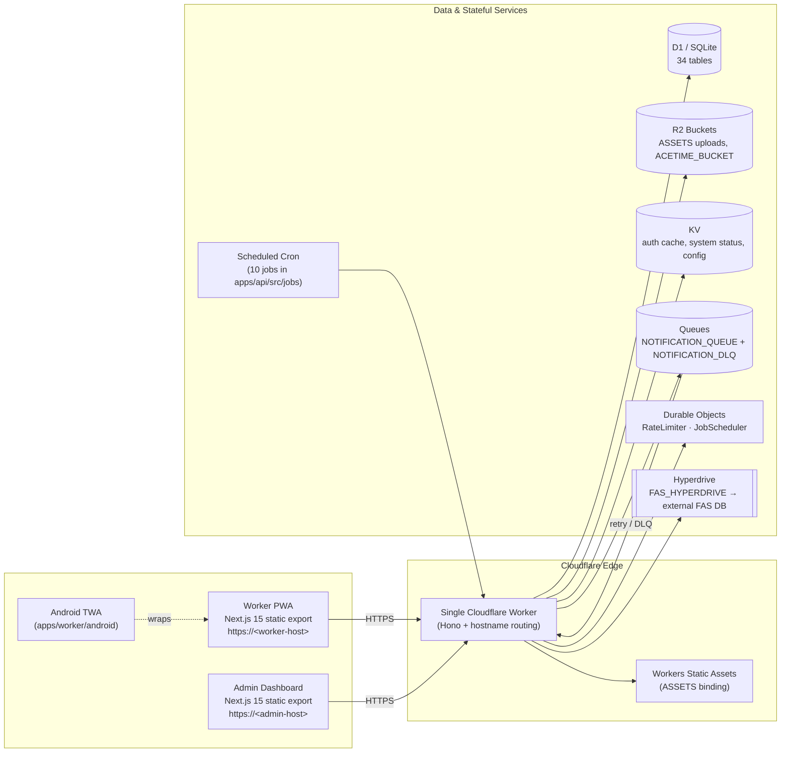

# SafetyWallet

> **건설 현장 안전 관리 플랫폼**  
> **Construction Site Safety Management Platform**

[](#license)
[](https://nodejs.org)
[](https://www.typescriptlang.org)
[](https://nextjs.org)
[](https://workers.cloudflare.com)
[](https://developers.cloudflare.com/d1)
[](https://hono.dev)
[](https://orm.drizzle.team)
[](https://turbo.build)
[](https://vitest.dev)
[](https://playwright.dev)
[](#android-trusted-web-activity)
[](#internationalization)

---

## Overview / 개요

SafetyWallet은(는) 건설 현장의 작업자(Worker)와 관리자(Admin) 모두를 위한 안전 관리 플랫폼입니다. 작업자는 모바일 PWA(및 Android TWA)를 통해 위험 요소를 신고하고, 출석을 기록하며, 안전 교육을 이수하고 포인트 기반 워크플로우에 참여합니다. 관리자는 전용 대시보드에서 현장 운영·리뷰·정산·규정 준수 상태를 관리합니다.

SafetyWallet is a construction-site safety management platform for both field workers and site administrators. Workers use a mobile PWA to report hazards, log attendance, complete safety education, and interact with point-based workflows. Administrators manage reviews, settlements, and compliance workflows through a dedicated dashboard.

이 저장소는 npm workspaces + Turborepo 기반의 TypeScript 모노레포이며, **단일 Cloudflare Worker** 가 Hono API 와 두 개의 정적-export Next.js 프런트엔드(`worker`, `admin`)를 호스트네임 라우팅으로 동시에 서빙합니다. 인증은 KST 자정 만료 JWT + KV 캐시 + D1 폴백의 3-중 검증으로 이루어지며, RBAC(역할) → 사이트 멤버십 → 필드 플래그의 3-단계 권한 모델을 따릅니다.

This repository is a TypeScript monorepo managed with npm workspaces and Turborepo. A single Cloudflare Worker serves the Hono API and both statically-exported Next.js frontends (`worker` PWA, `admin` dashboard) via hostname routing. Authentication is enforced by a triple-layer validation (JWT → KST date check → KV cache → D1 fallback), with a three-tier authorization model: role → site membership → field-level flags.

---

## Key Features / 주요 기능

| Area | Features |
| --- | --- |
| **모바일 작업자 PWA** / **Worker PWA** | Hazard reporting, attendance logging (GPS + selfie), safety education modules, point wallet, multi-language UI (ko · en · vi · zh), offline-friendly static export, installable as Android TWA. |
| **관리자 대시보드** / **Admin Dashboard** | Attendance review, post/vote moderation, education content authoring, settlements, compliance reports, RBAC-aware navigation, CSV/PDF export. |
| **API** / **Hono API** | REST endpoints under `apps/api/src/routes/`, 18 route modules, Zod request validators, CORS + security-headers middleware, analytics middleware, 10 scheduled cron jobs. |
| **데이터 계층** / **Data Layer** | Drizzle ORM over Cloudflare D1 (34 tables, 31 SQL migrations), R2 for media, KV for auth cache and system status, Hyperdrive for external FAS DB, Queues + DLQ for notifications. |
| **자동화** / **Automation** | 16 GitHub Actions workflows covering CI, PR review, dependabot, auto-merge, bot auto-fix, release, health checks, CI auto-heal, and issue classification. |
| **테스트** / **Testing** | Vitest unit tests per workspace, Playwright E2E (6 projects, `e2e/`), CI gate before build. |
| **국제화** / **i18n** | Custom runtime i18n in `apps/worker/src/i18n/`; shared translation data lives in `packages/types`. |
| **보안** / **Security** | Triple-layer auth, RBAC + site-scope + field flags, CSP/security headers, rate-limiter Durable Object, secrets injected via `wrangler.toml` bindings and 1Password CLI for E2E. |

---

## Architecture / 아키텍처



### Cloudflare Bindings / 바인딩

| Binding | Type | Purpose |
| --- | --- | --- |
| `DB` | D1 | Primary database — 34 tables, 31 SQL migrations. |
| `FAS_HYPERDRIVE` | Hyperdrive | External FAS employee database. |
| `ASSETS` | Workers Static Assets | Statically-exported `worker` and `admin` SPAs. |
| `R2` | R2 | User-uploaded images and videos. |
| `ACETIME_BUCKET` | R2 | Attendance-related assets. |
| `KV` | KV | Auth cache, system status, config. |
| `NOTIFICATION_QUEUE` / `NOTIFICATION_DLQ` | Queue | Notification delivery pipeline with DLQ. |
| `RATE_LIMITER` | Durable Object | Per-IP / per-user rate limiting. |
| `JOB_SCHEDULER` | Durable Object | Orchestrates scheduled cron jobs. |

### Authentication & Authorization

- **Auth flow / 인증 흐름**: Login → JWT issued with **KST same-day midnight expiry** → stored in client Zustand.
- **Triple-layer validation / 3-중 검증**: JWT decode → KST date check → KV cache lookup → D1 fallback.
- **Three-tier permissions / 3-단계 권한**: Role-based (`WORKER` · `SITE_ADMIN` · `SUPER_ADMIN` · `SYSTEM`) → site-specific membership → field-level flags (`canAwardPoints`, `canReview`, `canExportData`).
- **Client stores / 클라이언트 저장소**: `safetywallet-auth` (worker) · `safetywallet-admin-auth` (admin); Zustand-persisted with 401 refresh mutex.

---

## Tech Stack / 기술 스택

- **Language / 언어**: TypeScript 5.x (strict)
- **Runtime / 런타임**: Cloudflare Workers (V8 isolates)
- **Framework / 프레임워크**: Hono (API) · Next.js 15 App Router (frontends, `output: 'export'`)
- **Styling / 스타일링**: Tailwind v4 (theme tokens in `packages/ui`), shadcn/ui primitives
- **Data / 데이터**: Drizzle ORM · D1 (SQLite) · Drizzle Kit migrations
- **Validation / 검증**: Zod
- **State / 상태 관리**: Zustand (client), Durable Objects (server)
- **Build / 빌드**: Turborepo pipeline (`types → ui → apps`), Wrangler
- **Test / 테스트**: Vitest · Playwright (6 projects)
- **Tooling / 도구**: Husky, lint-staged, Prettier, ESLint, Go helper scripts (`scripts/`)
- **Mobile / 모바일**: Trusted Web Activity (TWA) — Bubblewrap-generated Android shell

---

## Repository Layout / 저장소 구조

> 현재 스냅샷은 `apps/worker/`(및 그 `android/` TWA 서브트리)와 루트 설정 파일들만 디스크에 포함합니다. `apps/api/`, `apps/admin/`, `packages/types/`, `packages/ui/`, `docs/`, `scripts/`, `e2e/`, `.github/workflows/`는 `AGENTS.md`(60개 분산 지식 베이스)와 `package.json` 워크스페이스에 의해 참조되며, 전체 토폴로지는 [`ARCHITECTURE.md`](./ARCHITECTURE.md) 및 [`AGENTS.md`](./AGENTS.md)에 문서화되어 있습니다.

```text
.
├── AGENTS.md                  # Project knowledge base (60 distributed AGENTS.md)
├── ARCHITECTURE.md            # System architecture
├── CODE_STYLE.md              # TypeScript / Drizzle / Hono conventions
├── CONTRIBUTING.md            # Contribution guide
├── LICENSE                    # MIT
├── README.md                  # You are here
├── package.json               # npm workspaces root
├── package-lock.json
├── turbo.json                 # Turborepo pipeline: types → ui → apps
├── wrangler.toml              # Root CF Worker config + all bindings
├── vitest.config.ts           # Vitest root config
├── playwright.config.ts       # 6 Playwright projects
└── apps/
    └── worker/                # Next.js 15 worker PWA (port 3000 → dist/)
        ├── AGENTS.md
        ├── I18N_IMPLEMENTATION.md
        ├── next.config.mjs
        ├── next-env.d.ts
        ├── package.json
        ├── postcss.config.cjs
        ├── tailwind.config.js
        ├── tsconfig.json
        ├── vitest.config.ts
        ├── android/           # TWA (Bubblewrap-generated Android shell)
        │   ├── build.gradle
        │   ├── gradle.properties
        │   ├── gradlew
        │   ├── gradlew.bat
        │   ├── manifest-checksum.txt
        │   ├── settings.gradle
        │   ├── store_icon.png
        │   ├── twa-manifest.json
        │   ├── app/
        │   │   ├── build.gradle
        │   │   └── src/main/
        │   │       ├── AndroidManifest.xml
        │   │       ├── res/  (values, drawable-*, mipmap-*, xml, raw)
        │   │       └── java/me/jclee/safetywallet/twa/
        │   │           ├── Application.java
        │   │           ├── DelegationService.java
        │   │           └── LauncherActivity.java
        │   └── gradle/wrapper/
        └── src/
            └── app/
                ├── AGENTS.md
                ├── error.tsx
                ├── globals.css
                ├── layout.tsx
                └── page.tsx
```

### Workspaces (declared in root `package.json`) / 워크스페이스

| Path | Role | Build output |
| --- | --- | --- |
| `apps/api` | Cloudflare Worker API (Hono + Drizzle + D1) | Wrangler Worker bundle |
| `apps/admin` | Next.js 15 admin dashboard (static export) | `dist/admin/` |
| `apps/worker` | Next.js 15 worker PWA (static export + Android TWA) | `dist/` |
| `packages/types` | Shared TS types, enums, DTOs, i18n translation data | lib build |
| `packages/ui` | Shared shadcn/ui components + Tailwind v4 theme tokens | lib build |

---

## Automation Inventory / 자동화 인벤토리

### GitHub Actions Workflows (16) / GitHub Actions 워크플로

All workflow files live under `.github/workflows/`. Names are listed with their real on-disk filename including the numeric prefix.

#### 1) Branch & PR Lifecycle / 브랜치·PR 수명주기

| File | Purpose |
| --- | --- |
| `01_branch-to-pr.yml` | Push a branch → automatically open a draft PR (if none exists) with a templated body. |
| `02_issue-to-branch.yml` | Issue labelled `branch` → create a prefilled branch and link it back to the issue. |
| `10_pr-review.yml` | AI-assisted PR review (powered by [qodo-ai/pr-agent](https://github.com/qodo-ai/pr-agent)). |
| `11_security-pr-review.yml` | Security-focused PR review (SAST-lens prompt, secret-leak heuristics). |
| `12_dependabot-auto-merge.yml` | Auto-merge low-risk Dependabot PRs (patch/minor, green CI, approved label). |
| `13_pr-auto-merge.yml` | Auto-merge PRs that meet `auto-merge` label + green CI + approvals. |
| `14_bot-auto-fix.yml` | Bot-triggered auto-fix commits for lint/format/naming issues raised in review. |
| `15_merged-pr-cleanup.yml` | Delete merged feature branches (local + remote) and close stale linked issues. |

#### 2) Issue Triage & Hygiene / 이슈 분류·위생

| File | Purpose |
| --- | --- |
| `19_issue-backfill.yml` | Backfill missing labels/milestones on legacy issues. |
| `37_ci-failure-issues.yml` | Open (or update) an issue when a CI run fails repeatedly. |
| `91_issue-classification.yml` | Auto-classify new issues via label rules and routing to the right project board. |

#### 3) Release & Distribution / 릴리스·배포

| File | Purpose |
| --- | --- |
| `24_release-notes.yml` | Generate release notes from merged PRs / conventional commits on tag push. |
| `25_release-publish.yml` | Publish release artifacts and update deployment manifests. |
| `29_downstream-health-check.yml` | Smoke-test downstream consumers after a release. |

#### 4) CI Core & Self-Healing / CI 코어·자가 치유

| File | Purpose |
| --- | --- |
| `ci.yml` | Primary CI pipeline: install → lint → typecheck → test → build → D1 migration dry-run. |
| `60_ci-auto-heal.yml` | Detect recurring CI failure patterns and apply remediation PRs (e.g. dependency bumps, cache busting). |

### Auxiliary Tooling / 보조 도구

- **Go scripts / Go 스크립트**: `scripts/git-preflight.go`, `scripts/verify.go`, `scripts/check-anti-patterns.go` (invoked via `npm run git:preflight`, `npm run verify`, and the pre-commit hook respectively).
- **JS scripts / JS 스크립트**: `scripts/lint-naming.js`, `scripts/check-wrangler-sync.js`.
- **Pre-commit / 커밋 훅**: Husky + lint-staged runs `check-anti-patterns.go` + Prettier on staged `*.{ts,tsx}` and Prettier only on `*.{js,jsx,json,md}`.

> The public AI endpoints used by the bot workflows (PR review, auto-fix) terminate at `https://cliproxy.jclee.me/v1` and the bot UI is served from `https://bot.jclee.me`. No private IP addresses, container IDs, or RFC1918 ranges are ever hard-coded in this repository.

---

## Quick Start / 빠른 시작

### Prerequisites / 사전 요구사항

- **Node.js** ≥ 20.0.0
- **npm** ≥ 10.8.2 (the repo pins `packageManager: npm@10.8.2`)
- **Wrangler** (`npx wrangler`) for Cloudflare Workers local emulation
- **Go** ≥ 1.22 (only if running `scripts/*.go` locally; CI installs it for you)
- **1Password CLI** (`op`) for E2E secrets — *only required for `npm run e2e*`*

### Install / 설치

```bash
npm install
```

### Run all workspaces in dev mode / 개발 모드로 워크스페이스 실행

```bash
npm run dev
```

This fans out to each app via Turborepo. By default:

- `apps/worker` → `http://localhost:3000` (worker PWA)
- `apps/admin`  → `http://localhost:3001` (admin dashboard)
- `apps/api`    → `http://localhost:8787` (Wrangler local Worker)

---

## Local Development / 로컬 개발

### Worker PWA (apps/worker) / 작업자 PWA

```bash
npm run dev --workspace=apps/worker
# or
cd apps/worker && npm run dev
```

### Admin Dashboard (apps/admin) / 관리자 대시보드

```bash
npm run dev --workspace=apps/admin
# or
cd apps/admin && npm run dev
```

### API Worker (apps/api) / API 워커

```bash
npm run dev --workspace=apps/api
# Wrangler will emulate D1, R2, KV, Queues, and Durable Objects locally
```

### Database Migrations / 데이터베이스 마이그레이션

```bash
# Generate a new migration from Drizzle schema
npm run db:generate

# Apply migrations to the local D1
npx wrangler d1 migrations apply DB --local

# Apply migrations to the remote D1
npx wrangler d1 migrations apply DB --remote
```

### Android TWA (apps/worker/android) / Android TWA

The TWA shell is regenerated from `twa-manifest.json` using Bubblewrap. To re-bundle or update store metadata:

```bash
cd apps/worker/android
./gradlew assembleRelease          # build APK
./gradlew bundleRelease            # build AAB
```

Refer to [`apps/worker/I18N_IMPLEMENTATION.md`](./apps/worker/I18N_IMPLEMENTATION.md) for runtime i18n details and to `apps/worker/android/manifest-checksum.txt` for the asset integrity manifest.

---

## Commands Reference / 명령어 레퍼런스

All commands are run from the repo root unless noted.

### Build / 빌드

| Command | Description |
| --- | --- |
| `npm run build` | Full build: `turbo run build` then `build:static` (assembles `dist/` and `dist/admin/`). |
| `npm run build:api` | Build shared `types` and `apps/api` only. |
| `npm run build:static` | Re-pack `dist/` from `apps/worker/out/*` and `dist/admin/` from `apps/admin/out/*`. |
| `npm run build:one-worker` | Alias of `build:api` — build a single API worker without frontends. |

### Lint, Format, Type-check / 린트·포맷·타입 검사

| Command | Description |
| --- | --- |
| `npm run lint` | Run ESLint across all workspaces. |
| `npm run lint:naming` | Naming-convention lint (`scripts/lint-naming.js`). |
| `npm run format` | Prettier write. |
| `npm run format:check` | Prettier check (CI mode). |
| `npm run typecheck` | `tsc --noEmit` across all workspaces. |

### Test / 테스트

| Command | Description |
| --- | --- |
| `npm run test` | Vitest unit/integration tests across all workspaces. |
| `npm run test:coverage` | Vitest with coverage. |
| `npm run e2e` | Playwright E2E (uses `op run --env-file=.env.e2e`). |
| `npm run e2e:headed` | Playwright in headed mode. |
| `npm run e2e:ui` | Playwright in UI mode. |

### Cloudflare & Deploy / Cloudflare·배포

| Command | Description |
| --- | --- |
| `npm run deploy:api` | **Disabled by design** — manual deploy is not allowed; production deploys are Git-ref driven via CI on `master`. The script exits non-zero to prevent accidental runs. |
| `npm run check:wrangler-sync` | Verify that `wrangler.toml` bindings match the TypeScript bindings type. |
| `npx wrangler tail` | Tail the deployed Worker logs. |
| `npx wrangler d1 execute DB --local --command "SELECT 1"` | Probe the local D1. |

### Git & Repo Hygiene / Git·저장소 위생

| Command | Description |
| --- | --- |
| `npm run git:preflight` | Run `scripts/git-preflight.go` before pushing (commit-message format, branch naming, signed-off-by). |
| `npm run verify` | Run `scripts/verify.go` — full local CI gate (lint + typecheck + tests + build). |
| `npm run clean` | `turbo run clean` + remove `node_modules`. |

---

## Internationalization / 국제화

The worker PWA ships with a custom i18n runtime in `apps/worker/src/i18n/` supporting:

- `ko` 한국어 (default)
- `en` English
- `vi` Tiếng Việt
- `zh` 中文

Translation data is sourced from `packages/types` and consumed by both the PWA and (selectively) the admin dashboard. Locale negotiation is performed client-side from `navigator.language` with a `localStorage` override. See [`apps/worker/I18N_IMPLEMENTATION.md`](./apps/worker/I18N_IMPLEMENTATION.md) for the full design.

---

## Testing Strategy / 테스트 전략

| Layer | Tool | What is verified |
| --- | --- | --- |
| Unit / Integration | Vitest | Pure logic, Zod validators, Drizzle query builders, Hono route handlers (with mocked bindings). |
| E2E | Playwright (6 projects) | Login flows, hazard reporting, attendance, admin review, settlements. |
| Type | `tsc --noEmit` | Type safety across the monorepo. |
| Lint | ESLint + custom Go checks | Code style, anti-patterns (see `scripts/check-anti-patterns.go`). |
| CI | GitHub Actions | `ci.yml` gates merges to `master`. |

E2E secrets are loaded from `.env.e2e` via 1Password CLI (`op run`). The file is **never** committed.

---

## Deployment / 배포

Deployments are **fully Git-ref driven**:

1. Open a PR → `ci.yml` runs (lint → typecheck → guards → test → build → migrate dry-run).
2. Merge to `master` → CI builds and deploys the API Worker and refreshes static assets.
3. A `deploy:api` invocation from a developer laptop is intentionally blocked — the script exits with code 1 and logs `Manual deploy is disabled. Deploy is Git-ref driven via CI on master.`

For local emulation against real bindings, use `wrangler dev` inside `apps/api`.

---

## Security / 보안

- **Secrets**: Worker secrets live in Cloudflare (set via `wrangler secret put`); E2E secrets live in 1Password. **No secrets are stored in this repository.**
- **Headers**: Hono middleware sets CSP, HSTS, X-Frame-Options, X-Content-Type-Options, Referrer-Policy.
- **Rate limiting**: `RATE_LIMITER` Durable Object gates per-IP and per-user traffic.
- **Auth caching**: Short-TTL KV cache on top of D1 for `users` lookups; refresh-mutex on the client prevents token-stampede 401s.
- **PR security review**: `11_security-pr-review.yml` runs on every PR.
- **Dependency hygiene**: `12_dependabot-auto-merge.yml` keeps patch/minor updates flowing without manual toil.

If you discover a vulnerability, please email `security@jclee.me` (or open a **private** security advisory) — do **not** file a public issue.

---

## Contributing / 기여 가이드

We welcome contributions. Please read [`CONTRIBUTING.md`](./CONTRIBUTING.md) and [`CODE_STYLE.md`](./CODE_STYLE.md) before opening a PR.

### Workflow / 워크플로

1. **Pick or file an issue / 이슈 선택 또는 작성** — `91_issue-classification.yml` will auto-label it.
2. **Create a branch / 브랜치 생성** — labelling the issue with `branch` lets `02_issue-to-branch.yml` create the branch for you, or run `git:preflight` first.
3. **Commit with Conventional Commits / 컨벤셔널 커밋** — enforced by `git:preflight`.
4. **Open a PR / PR 열기** — `01_branch-to-pr.yml` will keep the PR description in sync; `10_pr-review.yml` and `11_security-pr-review.yml` will review.
5. **Pass CI / CI 통과** — `ci.yml` must be green; `14_bot-auto-fix.yml` may push minor fixes.
6. **Auto-merge / 자동 병합** — apply the `auto-merge` label; `13_pr-auto-merge.yml` will handle it once CI is green and approvals are in.
7. **Cleanup / 정리** — `15_merged-pr-cleanup.yml` deletes the branch and updates the linked issue.

### Commit message format / 커밋 메시지 형식

```
<type>(<scope>): <subject>

<body>

<footer>
```

Allowed types: `feat`, `fix`, `chore`, `docs`, `refactor`, `test`, `perf`, `build`, `ci`, `revert`.

### Pre-commit checklist / 커밋 전 체크리스트

- [ ] `npm run lint` passes
- [ ] `npm run typecheck` passes
- [ ] `npm run test` passes (or skipped with justification)
- [ ] No new `console.log` left in production code
- [ ] Added/updated tests for behavior changes
- [ ] Updated `AGENTS.md` if you introduced a new module or pattern

---

## Repository Knowledge Base / 저장소 지식 베이스

This repository ships **60 distributed `AGENTS.md` files** that form a living knowledge base for both humans and AI agents. The top-level [`AGENTS.md`](./AGENTS.md) is regenerated via `init-deep` and indexes every other `AGENTS.md` under `apps/`, `packages/`, and per-route modules. When you change a module's structure, update the nearest `AGENTS.md` in the same commit.

---

## License / 라이선스

This project is licensed under the **MIT License** — see [`LICENSE`](./LICENSE) for the full text.

```
MIT License

Copyright (c) jclee

Permission is hereby granted, free of charge, to any person obtaining a copy
of this software and associated documentation files (the "Software"), to deal
in the Software without restriction, including without limitation the rights
to use, copy, modify, merge, publish, distribute, sublicense, and/or sell
copies of the Software, and to permit persons to whom the Software is
furnished to do so, subject to the following conditions:

The above copyright notice and this permission notice shall be included in
all copies or substantial portions of the Software.

THE SOFTWARE IS PROVIDED "AS IS", WITHOUT WARRANTY OF ANY KIND, EXPRESS OR
IMPLIED, INCLUDING BUT NOT LIMITED TO THE WARRANTIES OF MERCHANTABILITY,
FITNESS FOR A PARTICULAR PURPOSE AND NONINFRINGEMENT. IN NO EVENT SHALL THE
AUTHORS OR COPYRIGHT HOLDERS BE LIABLE FOR ANY CLAIM, DAMAGES OR OTHER
LIABILITY, WHETHER IN AN ACTION OF CONTRACT, TORT OR OTHERWISE, ARISING FROM,
OUT OF OR IN CONNECTION WITH THE SOFTWARE OR THE USE OR OTHER DEALINGS IN
THE SOFTWARE.
```

---

## Acknowledgements / 감사의 말

- Built on the shoulders of [Cloudflare Workers](https://workers.cloudflare.com), [Hono](https://hono.dev), [Drizzle ORM](https://orm.drizzle.team), and [Next.js](https://nextjs.org).
- PR review automation powered by [qodo-ai/pr-agent](https://github.com/qodo-ai/pr-agent) and routed through the public proxy at `https://cliproxy.jclee.me/v1` with a UI at `https://bot.jclee.me`.
- Thanks to every contributor who has filed an issue, opened a PR, or translated a string. 🦺