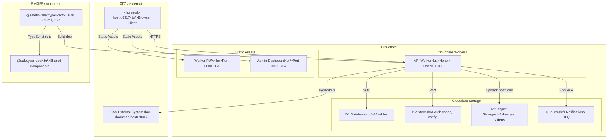
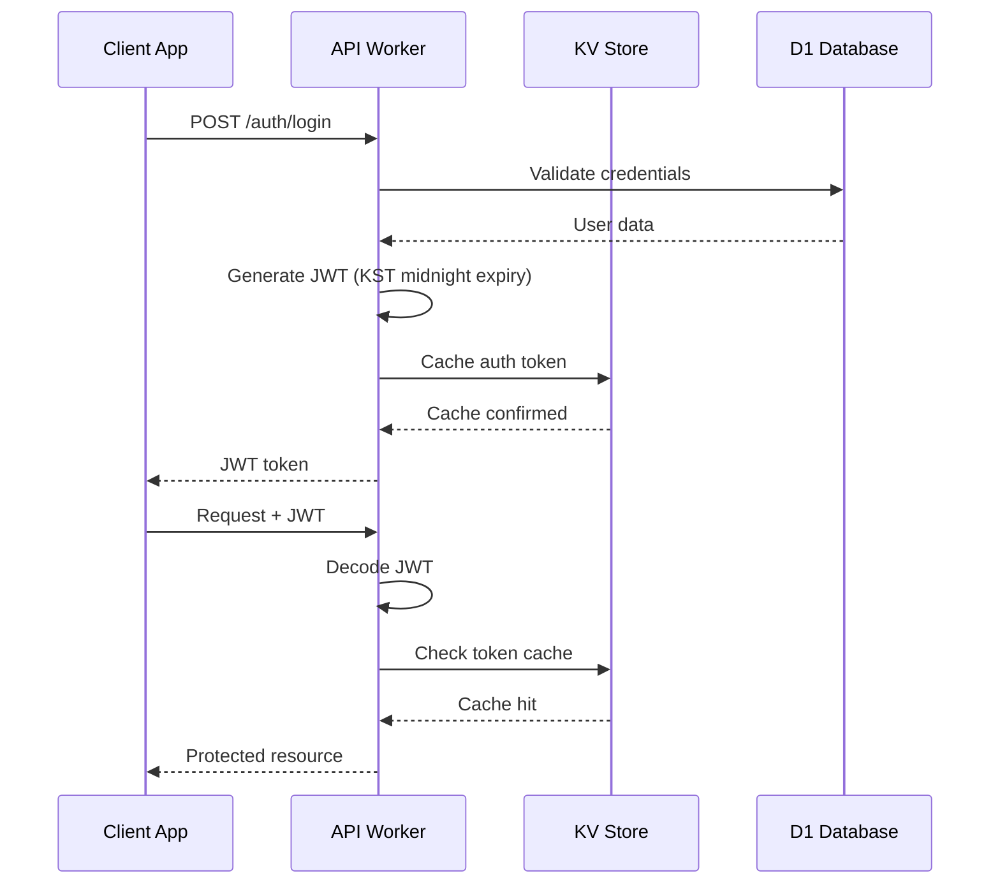

# SafetyWallet

<!-- jclee-bot-automation-status:start -->
## GitHub Automation Status / GitHub 자동화 현황

Current as of 2026-06-19.

- Primary PR review/checks and issue maintenance run through the `jclee-bot` GitHub App.
- Issue automation includes opened-issue labels, stale-label removal, stale issue sweep/close, and issue-summary upkeep.
- Existing `.github/workflows` files are compatibility GitOps surfaces managed from `jclee941/.github`; do not treat legacy per-repo workflow counts as the production bot rollout path.
- Source of truth: `jclee941/.github` (`config/repos.yaml`, `jclee_bot/`, and central workflows).

<!-- jclee-bot-automation-status:end -->


> 건설 현장 안전 관리 플랫폼 / Construction Site Safety Management Platform

[](LICENSE)
[](https://nodejs.org/)
[](https://www.npmjs.com/)
[](https://www.typescriptlang.org/)
[](https://workers.cloudflare.com/)
[](https://turbo.build/)

---

## 목차 / Table of Contents

- [개요 / Overview](#개요--overview)
- [주요 기능 / Features](#주요-기능--features)
- [아키텍처 / Architecture](#아키텍처--architecture)
- [자동화 인벤토리 / Automation Inventory](#자동화-인벤토리--automation-inventory)
- [빠른 시작 / Quick Start](#빠른-시작--quick-start)
- [로컬 개발 / Local Development](#로컬-개발--local-development)
- [명령어 참조 / Commands Reference](#명령어-참조--commands-reference)
- [기여 가이드 / Contributing Guide](#기여-가이드--contributing-guide)
- [라이선스 / License](#라이선스--license)

---

## 개요 / Overview

SafetyWallet은 건설 현장의 안전 관리, 교육, 게시/투표, 리뷰, 포인트, 사용자/현장 관리 기능을 위한 TypeScript 기반 모노레포입니다.

SafetyWallet is a TypeScript-based monorepo for construction-site safety management, education, posts/votes, reviews, points, users, and site-management workflows.

이 저장소는 다음과 같은 구성요소를 포함합니다.

This repository contains the following main components:

| 구성 요소 / Component | 설명 / Description |
|---|---|
| `apps/api` | Cloudflare Workers 기반 API 애플리케이션 (Hono + Drizzle + D1) |
| `apps/admin` | Next.js 15 관리자 대시보드 (port 3001, 정적 내보내기) |
| `apps/worker` | Next.js 15 워커 PWA (port 3000, 정적 내보내기) |
| `packages/types` | 공유 API 타입, DTO, enum, 다국어(i18n) 리소스 |
| `packages/ui` | 공유 React UI 컴포넌트 (shadcn/ui + Tailwind v4) |

**기술 스택 / Tech Stack:**

- **런타임:** Node.js ≥20, Cloudflare Workers
- **언어:** TypeScript
- **API:** Hono + Drizzle ORM + Cloudflare D1 (SQLite)
- **프론트엔드:** Next.js 15 (App Router, 정적 내보내기)
- **모노레포:** Turborepo + npm workspaces
- **스토리지:** Cloudflare R2, KV, D1
- **인증:** JWT (KST 기준 동일일 자정 만료)
- **배포:** Git-ref 기반 CI/CD (master 브랜치 병합 시 자동 배포)

---

## 주요 기능 / Features

### 앱 / Apps

- **SafetyWallet Worker PWA** (`apps/worker`)
  - 모바일 우선 반응형 PWA
  - 위험 요소 보고, 출석 체크, 안전 포인트 적립
  - 교육 콘텐츠 수강 및 퀴즈
  - 다국어 지원 (한국어, 영어, 베트남어, 중국어)
  - 포트: 3000

- **SafetyWallet Admin Dashboard** (`apps/admin`)
  - 현장 관리자용 관리 대시보드
  - 리뷰审核, 정산, 규정 준수 관리
  - 출석, 게시글, 투표, 교육 데이터 관리
  - 포트: 3001

- **SafetyWallet API** (`apps/api`)
  - Cloudflare Workers 기반 REST API
  - 18개 API 라우트 모듈 (admin/ 중첩 라우트 포함)
  - 34개 D1 테이블 (Drizzle ORM)
  - 10개 예약된 Cron 작업
  - RateLimiter, JobScheduler Durable Objects
  - R2 기반 파일 업로드 (이미지, 동영상)
  - FAS 외부 시스템 연동 (Hyperdrive)

### 패키지 / Packages

- **@safetywallet/types** (`packages/types`)
  - 공유 TypeScript 타입 및 DTO
  - API 응답/요청 스키마
  - Enum 정의
  - i18n 다국어 리소스 (ko, en, vi, zh)

- **@safetywallet/ui** (`packages/ui`)
  - shadcn/ui 기반 공유 React 컴포넌트
  - Tailwind CSS v4 테마 토큰
  - AlertDialog, Avatar, Badge, Button, Card, Dialog, Input, Select, Sheet, Skeleton, Switch, Toast 등

---

## 아키텍처 / Architecture



### 인증 흐름 / Authentication Flow



---

## 자동화 인벤토리 / Automation Inventory

### GitHub Actions 워크플로우 / Workflow Files

저장소의 `.github/workflows/` 디렉토리에 다음과 같은 워크플로우가 정의되어 있습니다.

The following workflows are defined in the repository's `.github/workflows/` directory:

#### Pull Request 워크플로우 / Pull Request Workflows

| 워크플로우 파일 / Workflow File | 설명 / Description |
|---|---|
| `01_branch-to-pr.yml` | 브랜치 생성 시 자동 PR 연결 / Auto-link PR on branch creation |
| `02_issue-to-branch.yml` | 이슈 내용으로 브랜치 생성 / Create branch from issue |
| `03_pr-checks.yml` | PR 체크 실행 (lint, typecheck, test) / Run PR checks |
| `04_actionlint.yml` | GitHub Actions YAML lint / Lint workflow files |
| `05_gitleaks.yml` | 시크릿 스캔 / Secret scanning |
| `06_codeql.yml` | CodeQL 보안 분석 / Security analysis |
| `07_dependency-review.yml` | 의존성 보안 검토 / Dependency vulnerability review |
| `08_scorecard.yml` | OpenSSF Scorecard 평가 / Security score assessment |
| `09_semantic-pr.yml` | Semantic PR 제목 검증 / Validate semantic PR titles |
| `10_pr-review.yml` | AI PR 리뷰 (qodo-ai/pr-agent) / AI-powered PR review |
| `12_dependabot-auto-merge.yml` | Dependabot PR 자동 병합 / Auto-merge Dependabot PRs |
| `13_pr-auto-merge.yml` | 자동 병합 라벨 적용 / Apply auto-merge labels |
| `14_bot-auto-fix.yml` | Bot 수정 사항 자동 적용 / Auto-apply bot fixes |
| `15_merged-pr-cleanup.yml` | 병합 후 브랜치 정리 / Cleanup branches after merge |
| `auto-merge.yml` | 자동 병合 라우팅 / Auto-merge routing |
| `ci.yml` | 주요 CI 파이프라인 / Main CI pipeline |
| `labeler.yml` | PR 라벨 자동 할당 / Auto-label PRs |
| `standard-ci.yml` | 표준 CI 체크리스트 / Standard CI checklist |
| `security/11_pr-review.yml` | 보안 집중 PR 리뷰 / Security-focused PR review |

#### 이슈 관리 워크플로우 / Issue Management Workflows

| 워크플로우 파일 / Workflow File | 설명 / Description |
|---|---|
| `jclee-bot App issue-management` | 이슈 자동 관리 / Automated issue management |
| `19_issue-backfill.yml` | 이슈 백필/동기화 / Issue backfill/sync |
| `37_ci-failure-issues.yml` | CI 실패 시 이슈 생성 / Create issue on CI failure |
| `jclee-bot App issue-management` | 재사용 가능한 이슈 관리 / Reusable issue management |
| `91_issue-classification.yml` | 이슈 자동 분류 / Auto-classify issues |

#### 문서 및 릴리스 워크플로우 / Documentation & Release Workflows

| 워크플로우 파일 / Workflow File | 설명 / Description |
|---|---|
| `20_readme-gen.yml` | README 자동 생성 / Auto-generate README |
| `21_docs-sync.yml` | 문서 동기화 / Synchronize documentation |
| `24_release-notes.yml` |.Release 노트 생성 / Generate release notes |
| `25_release-publish.yml` |Release 게시 / Publish releases |
| `42_reusable-docs-sync.yml` | 재사용 가능한 문서 동기화 / Reusable docs sync |

#### 배포 및 상태 확인 워크플로우 / Deploy & Health Check Workflows

| 워크플로우 파일 / Workflow File | 설명 / Description |
|---|---|
| `29_downstream-health-check.yml` |Downstream 서비스 상태 확인 / Check downstream health |
| `60_ci-auto-heal.yml` | CI 자동 복구 / Auto-heal CI failures |

#### 재사용 가능한 워크플로우 / Reusable Workflows

| 워크플로우 파일 / Workflow File | 설명 / Description |
|---|---|
| `44_reusable-pr-checks.yml` | PR 체크 템플릿 / PR checks template |
| `45_reusable-gitleaks.yml` | Gitleaks 스캔 템플릿 / Secret scan template |

#### 기타 워크플로우 / Other Workflows

| 워크플로우 파일 / Workflow File | 설명 / Description |
|---|---|
| `welcome.yml` |신규 기여자 환영 메시지 / Welcome new contributors |

### 자동화 도구 / Automation Tools

#### Node.js 스크립트 / Node.js Scripts

| 도구 / Tool | 경로 / Path | 설명 / Description |
|---|---|---|
| `verify.go` | `scripts/verify.go` | 빌드 및 검증 / Build verification |
| `git-preflight.go` | `scripts/git-preflight.go` | Git 사전 검사 / Pre-flight checks |
| `check-anti-patterns.go` | `scripts/check-anti-patterns.go` | 안티 패턴 검사 / Anti-pattern detection |
| `check-wrangler-sync.js` | `scripts/check-wrangler-sync.js` | Wrangler 설정 동기화 확인 / Verify Wrangler sync |
| `lint-naming.js` | `scripts/lint-naming.js` |命名 규칙 lint / Naming convention lint |

#### Husky Git Hooks

| Hook | 설명 / Description |
|---|---|
| `pre-commit` | lint-staged 실행 (Prettier, anti-pattern check) |
| `prepare` | Husky 설정 초기화 |

#### lint-staged

| 패턴 / Pattern | 실행 명령 / Command |
|---|---|
| `*.{ts,tsx}` | `go run scripts/check-anti-patterns.go` → `prettier --write` |
| `*.{js,jsx,json,md}` | `prettier --write` |

---

## 빠른 시작 / Quick Start

### 전제 조건 / Prerequisites

- Node.js ≥ 20.0.0
- npm 10.8.2
- Git
- Cloudflare Wrangler (API 배포용)

### 설치 / Installation

```bash
# 저장소 클론
git clone https://github.com/<owner>/safetywallet.git
cd safetywallet

# 의존성 설치
npm install

# Husky 훅 설정
npm run prepare
```

### 개발 서버 실행 / Run Development Servers

```bash
# 모든 앱 개발 서버 실행 (Turbo)
npm run dev

# 개별 앱만 실행
cd apps/api && npm run dev      # API (Hono dev server)
cd apps/admin && npm run dev    # Admin Dashboard (port 3001)
cd apps/worker && npm run dev   # Worker PWA (port 3000)
```

### 빌드 / Build

```bash
# 전체 빌드 (types → ui → apps → static assets)
npm run build

# API만 빌드
npm run build:api
```

### 테스트 / Test

```bash
# 모든 테스트 실행
npm run test

#Coverage 포함 테스트
npm run test:coverage

# E2E 테스트
npm run e2e
npm run e2e:headed    # headed 모드
npm run e2e:ui        # Playwright UI 모드
```

---

## 로컬 개발 / Local Development

### 환경 변수 / Environment Variables

E2E 테스트를 위한 환경 변수 파일이 필요합니다:

```bash
# .env.e2e 파일 생성 (1Password에서 가져오거나 수동 설정)
cp .env.example .env.e2e
```

### Cloudflare D1 로컬 개발

```bash
# D1 데이터베이스 생성 (로컬)
npx wrangler d1 create safetywallet-dev

# .wrangler/state 에서 로컬 DB 파일 확인
# apps/api/.wrangler/state/

# 마이그레이션 적용
npm run db:generate --workspace=apps/api

# 시드 데이터 삽입
sqlite3 apps/api/.wrangler/state/d1/*.sqlite < apps/api/seed.sql
```

### Turborepo 개발

```bash
# 특정 패키지만 빌드
npx turbo build --filter=@safetywallet/types

# 특정 앱만 테스트
npx turbo test --filter=safetywallet-api

# 캐시 무시하고 실행
npx turbo build --force
```

### 코드 포맷 / Code Formatting

```bash
# 코드 포맷팅 (모든 파일)
npm run format

# 포맷 확인만
npm run format:check
```

### 타입 체크 / Type Checking

```bash
npm run typecheck
```

---

## 명령어 참조 / Commands Reference

### 기본 명령어 / Core Commands

| 명령어 / Command | 설명 / Description |
|---|---|
| `npm install` | 의존성 설치 |
| `npm run dev` | 전체 개발 서버 실행 (Turbo) |
| `npm run build` | 전체 빌드 (turbo + static) |
| `npm run build:api` | API 빌드 (types → api) |
| `npm run build:static` | 정적 파일 빌드 (worker, admin) |
| `npm run test` | 모든 테스트 실행 |
| `npm run test:coverage` | 커버리지 포함 테스트 |
| `npm run typecheck` | TypeScript 타입 체크 |
| `npm run lint` | Lint 실행 |
| `npm run format` | Prettier 포맷팅 |
| `npm run clean` | 빌드 아티팩트 및 node_modules 삭제 |

### 데이터베이스 / Database

| 명령어 / Command | 설명 / Description |
|---|---|
| `npm run db:generate --workspace=apps/api` | Drizzle 마이그레이션 생성 |

### CI/CD

| 명령어 / Command | 설명 / Description |
|---|---|
| `npm run deploy:api` | API 배포 (비활성화 - Git-ref 기반 CI 사용) |
| `npm run check:wrangler-sync` | Wrangler 설정 동기화 확인 |
| `npm run git:preflight` | Git 사전 검사 |
| `npm run verify` | 전체 검증 실행 |
| `npm run lint:naming` | Naming 규칙 lint |

### E2E 테스트 / E2E Testing

| 명령어 / Command | 설명 / Description |
|---|---|
| `npm run e2e` | Playwright E2E 테스트 실행 |
| `npm run e2e:headed` | Headed 모드 E2E 테스트 |
| `npm run e2e:ui` | Playwright UI 모드 |

### Husky / Git Hooks

| 명령어 / Command | 설명 / Description |
|---|---|
| `npm run prepare` | Husky 훅 설치 |

---

## 기여 가이드 / Contributing Guide

 CONTRIBUTING.md` 파일을 참조하세요. 주요 가이드라인은 다음과 같습니다.

Please refer to the `CONTRIBUTING.md` file for detailed guidelines. Key guidelines include:

### 브랜치 전략 / Branch Strategy

- `main`: 프로덕션 코드 (보호됨)
- `feature/*`: 기능 개발 브랜치
- `fix/*`: 버그 수정 브랜치
- `refactor/*`: 리팩토링 브랜치

### 커밋 메시지 / Commit Messages

이 프로젝트는 **Semantic PR** 롤링을 사용합니다. 커밋 메시지는 다음과 같은 형식을 따르세요:

```
<type>(<scope>): <description>

feat(api): add new education endpoint
fix(ui): resolve toast animation issue
chore(deps): update dependencies
```

### PR 생성 / Creating PRs

1. 이슈 먼저 생성 (Bug, Feature, Refactor 등)
2. `02_issue-to-branch.yml` 워크플로우가 자동으로 브랜치 생성
3. PR 제목은 conventional commits 형식 준수 (语义 PR 확인 via `09_semantic-pr.yml`)
4. 필요한 체크리스트 완료:
   - `03_pr-checks.yml`: Lint, Typecheck, Test 통과
   - `05_gitleaks.yml`: 시크릿 스캔 통과
   - `06_codeql.yml`: 보안 분석 통과
   - `10_pr-review.yml` 또는 `security/11_pr-review.yml`: PR 리뷰 완료

### 코드 스타일 / Code Style

- TypeScript strict 모드
- Prettier 코드 포맷팅 (자동 적용 via Husky pre-commit)
- shadcn/ui 컴포넌트 규칙 준수
- `CODE_STYLE.md` 참조

### 테스트 / Testing

- 단위 테스트: Vitest (`*.test.tsx`, `*.test.ts`)
- E2E 테스트: Playwright (`e2e/` 디렉토리)
- 모든 PR에서 테스트 커버리지 확인

### 문서화 / Documentation

- 각 패키지/앱에는 `AGENTS.md` 파일 존재
- API 문서: `apps/api/AGENTS.md`
- UI 컴포넌트: `packages/ui/AGENTS.md`
- 타입 및 DTO: `packages/types/AGENTS.md`

---

## 라이선스 / License

이 프로젝트는 MIT 라이선스 하에 배포됩니다. 자세한 내용은 [LICENSE](LICENSE) 파일을 참조하세요.

This project is distributed under the MIT License. See [LICENSE](LICENSE) for more information.

---

**Generated by:** minimax-m2.7 (via CLIProxyAPI)  
**Last Updated:** 2026-04-15
