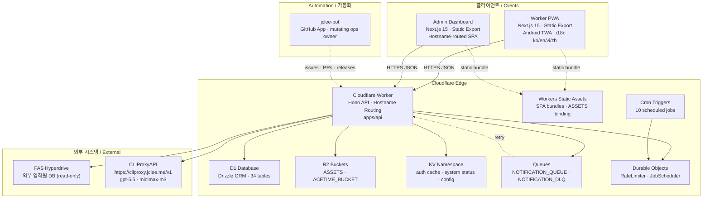

# SafetyWallet

> **건설 현장 안전 관리 플랫폼**
> **Construction Site Safety Management Platform**

[](#license--라이선스)
[](https://nodejs.org)
[](https://www.typescriptlang.org)
[](https://nextjs.org)
[](https://workers.cloudflare.com)
[](https://developers.cloudflare.com/d1)
[](https://hono.dev)
[](https://orm.drizzle.team)
[](https://turbo.build)
[](https://vitest.dev)
[](https://playwright.dev)
[](#android-trusted-web-activity-twa)
[](#internationalization--다국어)

---

## Table of Contents / 목차

- [Overview / 개요](#overview--개요)
- [Features / 주요 기능](#features--주요-기능)
- [Architecture / 아키텍처](#architecture--아키텍처)
- [Repository Structure / 저장소 구조](#repository-structure--저장소-구조)
- [Cloudflare Bindings / Cloudflare 바인딩](#cloudflare-bindings--cloudflare-바인딩)
- [Authentication & Authorization / 인증과 권한](#authentication--authorization--인증과-권한)
- [Internationalization / 다국어](#internationalization--다국어)
- [Android Trusted Web Activity (TWA)](#android-trusted-web-activity-twa)
- [jclee-bot Automation Surfaces / jclee-bot 자동화 표면](#jclee-bot-automation-surfaces--jclee-bot-자동화-표면)
- [Go Automation Tools / Go 자동화 도구](#go-automation-tools--go-자동화-도구)
- [Quick Start / 빠른 시작](#quick-start--빠른-시작)
- [Local Development / 로컬 개발](#local-development--로컬-개발)
- [Commands Reference / 명령어 레퍼런스](#commands-reference--명령어-레퍼런스)
- [Contributing / 기여](#contributing--기여)
- [Project Documentation / 프로젝트 문서](#project-documentation--프로젝트-문서)
- [License / 라이선스](#license--라이선스)

---

## Overview / 개요

**SafetyWallet** is a multi-tenant safety management platform for construction sites. 현장 작업자는 모바일 PWA로 위험 요소를 신고하고 출석을 기록하며 안전 포인트를 적립하고, 현장 관리자는 같은 시스템의 대시보드에서 검토·정산·컴플라이언스를 수행합니다. 단일 Cloudflare Worker가 Hono 기반 API와 두 개의 정적 익스포트 Next.js 프런트엔드를 호스트 이름 라우팅으로 제공합니다.

**SafetyWallet** is a multi-tenant safety management platform for construction sites. Field workers use a mobile PWA to report hazards, log attendance, and earn safety points; site administrators use a dashboard for reviews, settlements, and compliance. A single Cloudflare Worker serves the Hono API and two statically-exported Next.js frontends via hostname routing.

### Core Tenets / 핵심 원칙

- **Edge-first** — All logic runs on Cloudflare Workers; D1, R2, KV, Queues, Durable Objects, and Hyperdrive are bound at the edge.
- **Three apps, one repo** — `apps/api` (Worker), `apps/admin` (dashboard SPA), `apps/worker` (mobile PWA) orchestrated by Turborepo.
- **Bot-owned mutating workflow** — All automation that creates branches, opens PRs, publishes releases, or files issues is owned by **jclee-bot**.
- **Verification before merge** — `npm run verify` (Go) must pass; CI gates every green check.

---

## Features / 주요 기능

### For Field Workers / 현장 작업자용

- **Hazard Reporting / 위험 신고** — Photo/video evidence upload to R2, structured taxonomy, severity scoring.
- **Attendance / 출석 관리** — Geofenced clock-in, KST-normalized day boundary, R2 time-acme bucket integration.
- **Safety Points / 안전 포인트** — Earn points for verified reports, leaderboards, redemption flow.
- **Education / 안전 교육** — In-app micro-learning with progress tracking.
- **Push Notifications / 푸시 알림** — Queue-driven delivery (`NOTIFICATION_QUEUE` → DLQ fallback).
- **Offline-tolerant PWA / 오프라인 내성 PWA** — Service worker + static export.
- **Native Install (Android) / 네이티브 설치 (Android)** — TWA wrapper for Play Store distribution.

### For Site Administrators / 현장 관리자용

- **Review Queue / 검토 큐** — Triage worker submissions with audit trail.
- **Settlement / 정산** — Monthly points-to-cash calculation and export.
- **Compliance Reports / 컴플라이언스 보고서** — Auto-generated per-site and per-period.
- **Role-Based Access Control / 역할 기반 접근 제어** — `WORKER`, `SITE_ADMIN`, `SUPER_ADMIN`, `SYSTEM` with field-level flags.
- **Data Export / 데이터 내보내기** — CSV/XLSX downloads for payroll and audits.

### Platform Capabilities / 플랫폼 기능

- **i18n: ko · en · vi · zh** — Custom runtime, no runtime i18n library.
- **Triple-layer auth** — JWT decode → KST date check → KV cache → D1 fallback.
- **Hyperdrive to FAS** — Read-only external employee database join.
- **Durable Object rate limiting** — Per-user, per-route limits with sliding window.
- **Cron-driven jobs** — 10 scheduled jobs (settlement, leaderboard reset, retention, etc.).

---

## Architecture / 아키텍처



### Request Lifecycle / 요청 라이프사이클

1. **Edge ingress** — Cloudflare routes by hostname: `worker.<domain>` → Worker PWA bundle, `admin.<domain>` → Admin SPA bundle, `api.<domain>` (or root) → Hono API.
2. **Middleware chain** — CORS → security headers → analytics → logging → auth.
3. **Auth verification** — Triple-layer: JWT decode → KST same-day midnight expiry → KV cache → D1 fallback.
4. **Route handler** — Zod-validated request → service layer → Drizzle ORM → response.
5. **Side-effects** — R2 uploads, queue enqueues, Durable Object increments, FAS Hyperdrive reads.
6. **AI assist (optional)** — Non-PII summarization and translation via CLIProxyAPI at `https://cliproxy.jclee.me/v1`.

---

## Repository Structure / 저장소 구조

```text
.
├── AGENTS.md                 # Project knowledge base (architecture, conventions)
├── ARCHITECTURE.md           # Deep architecture decisions
├── CODE_STYLE.md             # Naming, formatting, anti-patterns
├── CONTRIBUTING.md           # Contribution rules
├── LICENSE                   # MIT
├── README.md                 # This file
├── package.json              # npm workspaces + scripts
├── package-lock.json
├── turbo.json                # Turborepo pipeline (types → ui → apps)
├── wrangler.toml             # Root CF Worker config + all bindings
├── vitest.config.ts          # Vitest workspace config
├── playwright.config.ts      # 6 Playwright projects
│
├── apps/
│   ├── api/                  # Cloudflare Worker API (Hono + Drizzle + D1)
│   │   ├── src/routes/       # 18 API route modules (admin/ nested)
│   │   ├── src/lib/          # Auth, helpers, FAS integration, R2
│   │   ├── src/middleware/   # CORS, logging, analytics, security headers
│   │   ├── src/db/           # Drizzle schema (34 tables), seed, helpers
│   │   ├── src/durable-objects/  # RateLimiter, JobScheduler
│   │   ├── src/jobs/         # 10 scheduled cron jobs
│   │   ├── src/validators/   # Zod request schemas
│   │   └── migrations/       # 31 D1 SQL migrations
│   │
│   ├── admin/                # Next.js 15 admin dashboard (static export)
│   │   └── src/app/          # App Router: attendance, posts, votes, education
│   │
│   └── worker/               # Next.js 15 worker PWA (static export)
│       ├── src/app/          # App Router: login, posts, attendance, education
│       ├── src/i18n/         # Custom i18n runtime (ko, en, vi, zh)
│       └── android/          # Trusted Web Activity (TWA) wrapper
│           ├── app/          # Android module (Java + resources)
│           └── twa-manifest.json
│
├── packages/
│   ├── types/                # Shared TS types, enums, DTOs, i18n data
│   └── ui/                   # Shared shadcn/ui + Tailwind v4 tokens
│
├── scripts/                  # Go/JS tooling
│   ├── verify.go             # Repo-wide verification
│   ├── git-preflight.go      # Git commit/push guards
│   ├── check-anti-patterns.go # Staged-file anti-pattern detector
│   ├── lint-naming.js        # Naming convention lint
│   └── check-wrangler-sync.js # wrangler.toml ↔ source sync
│
├── e2e/                      # Playwright E2E suites
│   ├── auth.setup.ts
│   ├── admin/
│   └── worker/
│
├── docs/                     # PRD, requirements, ops runbooks
│
└── .github/
    └── workflows/            # Trigger implementations (owned by jclee-bot)
```

---

## Cloudflare Bindings / Cloudflare 바인딩

| Binding | Type | Purpose |
| --- | --- | --- |
| `DB` | D1 | Primary database · 34 tables · SQLite via Drizzle |
| `FAS_HYPERDRIVE` | Hyperdrive | External FAS employee database (read-only) |
| `ASSETS` | Workers Static Assets | Worker + Admin SPA bundles |
| `R2` | R2 | User-uploaded images and videos |
| `ACETIME_BUCKET` | R2 | Attendance-related assets (time-acme) |
| `KV` | KV | Auth cache, system status, config |
| `NOTIFICATION_QUEUE` | Queue | Notification delivery pipeline |
| `NOTIFICATION_DLQ` | Queue | Dead-letter for failed notifications |
| `RATE_LIMITER` | Durable Object | Per-user/per-route sliding-window limit |
| `JOB_SCHEDULER` | Durable Object | Cron coordination |

All bindings are declared once in `wrangler.toml` at the repo root.

---

## Authentication & Authorization / 인증과 권한

### Auth Flow / 인증 흐름

1. User submits credentials on Worker PWA or Admin SPA.
2. API validates against D1, issues a JWT.
3. JWT carries KST same-day midnight expiry (not raw TTL).
4. Client persists via Zustand: `safetywallet-auth` (worker) or `safetywallet-admin-auth` (admin).
5. Refresh on 401 with a single-flight mutex.

### Triple-Layer Validation / 3단계 검증

```
JWT decode → KST date check → KV cache lookup → D1 fallback
```

### Three-Tier Permissions / 3단계 권한

- **Role tier** — `WORKER`, `SITE_ADMIN`, `SUPER_ADMIN`, `SYSTEM`.
- **Site membership tier** — Which sites the user belongs to.
- **Field-level flags** — `canAwardPoints`, `canReview`, `canExportData`.

---

## Internationalization / 다국어

SafetyWallet ships a **custom i18n runtime** (no runtime i18n library) supporting four locales:

- 🇰🇷 **Korean (ko)** — Default
- 🇺🇸 **English (en)**
- 🇻🇳 **Vietnamese (vi)**
- 🇨🇳 **Chinese (zh)**

Translation data lives in `packages/types/` and is consumed by both `apps/worker` (worker PWA) and `apps/api` (server-side error formatting). See `apps/worker/I18N_IMPLEMENTATION.md` for the runtime contract.

---

## Android Trusted Web Activity (TWA)

The worker PWA can be installed as a native Android app via TWA:

- **Wrapper location** — `apps/worker/android/`
- **Build system** — Gradle (Kotlin DSL)
- **TWA manifest** — `apps/worker/android/twa-manifest.json`
- **Launcher & shortcuts** — Adaptive icons, shortcut XML, splash assets at all density buckets.
- **Build commands** — `./gradlew assembleDebug` (dev), `./gradlew bundleRelease` (Play Store).

The TWA delegates URLs to the production worker PWA via `DelegationService` and exposes a native launcher activity.

---

## jclee-bot Automation Surfaces / jclee-bot 자동화 표면

> **jclee-bot** is the GitHub App that owns **all mutating automation** in this repository. Workflow files in `.github/workflows/` are trigger implementations only — they are not the source of truth. The automation surfaces described below are what jclee-bot *does*; the workflow files are merely how those surfaces are wired.

### 1. Issue Lifecycle Automation / 이슈 라이프사이클 자동화

When users open, comment on, or reference issues, **jclee-bot에의해자동화됨**:

- **Triage and label** new issues based on title patterns and templates.
- **Backfill** historical issues from commit messages and PR references (`19_issue-backfill`).
- **Convert issues → working branches** for in-progress work (`02_issue-to-branch`).
- **File issues from CI failures** with full job logs and reproduction steps (`37_ci-failure-issues`).

This surface is fully bot-owned. Human reviewers are notified only when a label requires human input (e.g. `needs-design`).

### 2. PR Lifecycle Automation / PR 라이프사이클 자동화

jclee-bot manages the entire PR lifecycle from branch push to merge cleanup:

- **Branch → PR** — Pushed branches are converted into draft PRs with auto-filled descriptions (`01_branch-to-pr`).
- **Code review** — Reviews run via [qodo-ai/pr-agent](https://github.com/qodo-ai/pr-agent) for general feedback and a separate security-focused reviewer for hardening (`10_pr-review`, `11_security-pr-review`).
- **Auto-fix** — Bot applies fixes for detected issues directly to the PR branch (`14_bot-auto-fix`).
- **Dependabot auto-merge** — Routine patch/minor Dependabot PRs are auto-merged once green (`12_dependabot-auto-merge`).
- **PR auto-merge** — Green PRs matching the merge policy are squash-merged automatically (`13_pr-auto-merge`).
- **Post-merge cleanup** — Branches and stale refs are removed after merge (`15_merged-pr-cleanup`).

### 3. Release Lifecycle Automation / 릴리스 자동화

jclee-bot produces and ships releases without human intervention:

- **Release notes** — Aggregates merged PRs into structured changelogs (`24_release-notes`).
- **Publish** — Tags versions, builds artifacts, and updates deployment refs (`25_release-publish`).

### 4. Observability / 관측성

jclee-bot performs scheduled health probes against downstream services (`29_downstream-health-check`) and posts status digests. Internal probe endpoints use placeholders such as `<homelab-host>` / `<homelab-elk>`; no RFC1918 addresses are committed.

### 5. Core CI / 핵심 CI

The central pipeline (`ci.yml`) gates every merge:

```
lint → typecheck → naming guard → wrangler sync → test → build → migrate
```

This pipeline is the **only** non-mutating automation; all writes remain owned by jclee-bot.

---

## Go Automation Tools / Go 자동화 도구

SafetyWallet uses Go-based tooling for fast, zero-dependency verification. These are local-development tools, distinct from the GitHub-side jclee-bot automation.

| Tool (npm script) | Script | Purpose |
| --- | --- | --- |
| `npm run verify` | `scripts/verify.go` | End-to-end repo verification: lint + typecheck + tests + naming guard + wrangler sync. |
| `npm run git:preflight` | `scripts/git-preflight.go` | Git pre-commit / pre-push preflight: branch naming, commit-message format, branch-protection checks. |
| `lint-staged` hook | `scripts/check-anti-patterns.go` | Anti-pattern detection on staged `.ts` / `.tsx` files (runs via Husky). |

### JS companion scripts / JS 보조 스크립트

| Tool (npm script) | Script | Purpose |
| --- | --- | --- |
| `npm run lint:naming` | `scripts/lint-naming.js` | Naming convention lint across the monorepo. |
| `npm run check:wrangler-sync` | `scripts/check-wrangler-sync.js` | Ensures `wrangler.toml` bindings match source references. |

### Running directly / 직접 실행

```bash
go run scripts/verify.go
go run scripts/git-preflight.go
go run scripts/check-anti-patterns.go
```

Go was chosen for these tools because verification must run in CI without `node_modules` installation steps and with sub-second cold starts.

---

## Quick Start / 빠른 시작

### Prerequisites / 사전 준비

- **Node.js** ≥ 20.0.0
- **npm** ≥ 10.8.2 (declared in `packageManager`)
- **Wrangler CLI** — `npm i -g wrangler`
- **Go** ≥ 1.22 (for verification tooling)
- **1Password CLI** — required for E2E secret injection (`op` command)
- **JDK 17 + Android SDK** — only for TWA builds

### Setup / 설정

```bash
# 1. Clone
git clone <repo-url> safetywallet
cd safetywallet

# 2. Install dependencies
npm install

# 3. Prepare environment
cp .env.example .env.local
# Fill in required secrets (DB IDs, KV namespace IDs, R2 buckets, JWT secret, ...)

# 4. Authenticate Wrangler against your Cloudflare account
wrangler login

# 5. Generate Drizzle artifacts and apply migrations locally
npm run db:generate
wrangler d1 migrations apply DB --local

# 6. Start all workspaces (api + admin:3001 + worker:3000)
npm run dev

# 7. Verify the local repo state
npm run verify
```

The Turborepo pipeline starts `apps/api` (Worker on default port via `wrangler dev`), `apps/admin` (port 3001), and `apps/worker` (port 3000) in parallel.

---

## Local Development / 로컬 개발

### Workspaces / 워크스페이스

| Workspace | Port | Role |
| --- | --- | --- |
| `apps/api` | default (8787 via `wrangler dev`) | Hono API on Cloudflare Workers |
| `apps/admin` | 3001 | Admin dashboard (static export) |
| `apps/worker` | 3000 | Worker PWA (static export) |

### Common workflows / 일반 워크플로

```bash
npm run dev                # All workspaces in parallel
npm run build:api          # API-only build
npm run build:static       # Both SPAs → ./dist (admin under ./dist/admin/)
npm run build              # Full build: turbo + static export
npm run typecheck          # tsc --noEmit across workspaces
npm run lint               # ESLint across workspaces
npm run test               # Vitest unit tests
npm run test:coverage      # Vitest with coverage
npm run e2e                # Playwright E2E (uses 1Password)
npm run e2e:ui             # Playwright UI mode
npm run e2e:headed         # Playwright headed
npm run format             # Prettier write
npm run format:check       # Prettier check (CI)
npm run verify             # Go verification suite
npm run git:preflight      # Go git preflight
npm run check:wrangler-sync # JS wrangler.toml sync check
npm run lint:naming        # JS naming lint
npm run db:generate        # Drizzle schema generation
```

### Android TWA iteration / Android TWA 반복 개발

```bash
cd apps/worker/android
./gradlew assembleDebug           # Debug APK
./gradlew bundleRelease           # Play Store bundle
./gradlew installDebug            # Install on connected device
```

TWA points at the deployed worker PWA via `twa-manifest.json`; for local development, override the host with the `wrangler dev` URL.

### Secrets / 비밀 값

E2E secrets are injected via 1Password CLI:

```bash
op run --env-file=.env.e2e -- npx playwright test
```

Never commit `.env.e2e` or any file containing real credentials.

---

## Commands Reference / 명령어 레퍼런스

### Root npm scripts / 루트 npm 스크립트

| Script | Command | Purpose |
| --- | --- | --- |
| `build` | `turbo run build && npm run build:static` | Full monorepo + static SPA export |
| `build:api` | `npm run build --workspace=packages/types && npm run build --workspace=apps/api` | API-only build |
| `build:static` | `rm -rf dist && ...` | Static SPA export to `./dist` |
| `build:one-worker` | `npm run build:api` | Single-app API build |
| `dev` | `turbo run dev` | All workspaces dev mode |
| `deploy:api` | *(disabled)* | Manual deploy is disabled; deploy is Git-ref driven via CI on `master` |
| `lint` | `turbo run lint` | ESLint across workspaces |
| `lint:naming` | `node scripts/lint-naming.js` | Naming convention lint |
| `test` | `turbo run test` | Vitest unit tests |
| `test:coverage` | `turbo run test -- --coverage` | Vitest with coverage |
| `typecheck` | `turbo run typecheck` | `tsc --noEmit` across workspaces |
| `check:wrangler-sync` | `node scripts/check-wrangler-sync.js` | wrangler.toml ↔ source sync |
| `git:preflight` | `go run scripts/git-preflight.go` | Git preflight |
| `verify` | `go run scripts/verify.go` | Full verification suite |
| `format` | `prettier --write "**/*.{ts,tsx,js,jsx,json,md}"` | Prettier write |
| `format:check` | `prettier --check "**/*.{ts,tsx,js,jsx,json,md}"` | Prettier check |
| `clean` | `turbo run clean && rm -rf node_modules` | Wipe build outputs + node_modules |
| `db:generate` | `npm run db:generate --workspace=apps/api` | Drizzle schema generation |
| `prepare` | `husky` | Install Husky git hooks |
| `e2e` | `op run --env-file=.env.e2e -- npx playwright test` | Playwright E2E |
| `e2e:headed` | `op run --env-file=.env.e2e -- npx playwright test --headed` | Playwright headed |
| `e2e:ui` | `op run --env-file=.env.e2e -- npx playwright test --ui` | Playwright UI |

### Husky / lint-staged hooks

```jsonc
{
  "*.{ts,tsx}": [
    "go run scripts/check-anti-patterns.go",
    "prettier --write"
  ],
  "*.{js,jsx,json,md}": [
    "prettier --write"
  ]
}
```

---

## Contributing / 기여

See **[CONTRIBUTING.md](./CONTRIBUTING.md)** for the full contribution guide. Summary:

### Workflow / 워크플로

1. **Branch** — Use `NNN_<scope>/<short-desc>` format. `jclee-bot` will auto-open a PR when you push.
2. **Commit** — Conventional Commits (`feat:`, `fix:`, `chore:`, ...).
3. **Pre-commit** — Husky runs `check-anti-patterns.go` + Prettier on staged files.
4. **Pre-push** — Husky runs `git-preflight.go`.
5. **PR open** — jclee-bot opens the PR and dispatches `[qodo-ai/pr-agent](https://github.com/qodo-ai/pr-agent)` review.
6. **Auto-fix** — If the bot detects fixable issues, it pushes commits directly to your branch.
7. **Merge** — Once CI is green and the merge policy is satisfied, jclee-bot squash-merges automatically.

### Code style / 코드 스타일

- TypeScript strict mode everywhere; no `any` outside generated code.
- Naming conventions enforced by `scripts/lint-naming.js`.
- Anti-patterns enforced by `scripts/check-anti-patterns.go`.
- See **[CODE_STYLE.md](./CODE_STYLE.md)** for the full set.

### Verification gate / 검증 게이트

Before pushing, run:

```bash
npm run verify
```

CI will re-run the same suite; failing CI blocks merge regardless of bot policy.

---

## Project Documentation / 프로젝트 문서

| Document | Purpose |
| --- | --- |
| **[README.md](./README.md)** | This file — overview, architecture, onboarding. |
| **[AGENTS.md](./AGENTS.md)** | Project knowledge base (60 AGENTS.md files across the codebase). |
| **[ARCHITECTURE.md](./ARCHITECTURE.md)** | Architectural decisions and rationale. |
| **[CODE_STYLE.md](./CODE_STYLE.md)** | Naming, formatting, anti-patterns. |
| **[CONTRIBUTING.md](./CONTRIBUTING.md)** | Contribution workflow and policy. |
| **[apps/worker/I18N_IMPLEMENTATION.md](./apps/worker/I18N_IMPLEMENTATION.md)** | i18n runtime contract. |
| **[docs/](./docs/)** | PRD, requirements specs, ops runbooks. |

External operational endpoints:

- **AI proxy** — `https://cliproxy.jclee.me/v1` (gpt-5.5 primary, `minimax-m3` fallback)
- **Bot status** — `https://bot.jclee.me` (jclee-bot operational dashboard)

---

## License / 라이선스

MIT — see **[LICENSE](./LICENSE)**.

---

> 🤖 **AI-assisted documentation** — This README is generated via `gpt-5.5` (primary) with `minimax-m3` as the fallback model, both served through [CLIProxyAPI](https://cliproxy.jclee.me/v1).