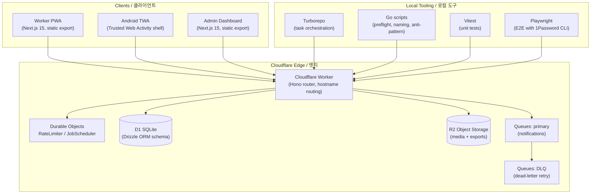

# SafetyWallet / 안전지갑

> Mobile-first PWA for construction-site safety reporting, attendance, and safety-point incentive management.
> 건설 현장의 안전 보고 · 출퇴근 · 안전 포인트 인센티브를 관리하는 모바일 우선 PWA.


## Overview / 개요

SafetyWallet is a field-worker safety platform composed of:

- A **Cloudflare Worker** that hosts a **Hono** API on top of a **Drizzle / D1** data layer.
- Two statically-exported **Next.js 15** frontends — a *worker PWA* and an *admin dashboard* — served from the same Worker through hostname routing.
- An **Android Trusted Web Activity (TWA)** wrapper that packages the worker PWA as a native-installable app.
- A scheduled-job system backed by **Durable Objects** (`RateLimiter`, `JobScheduler`), with notification delivery through **R2** and **Queues** (primary + DLQ).
- A **Go**-based development-tooling layer that enforces lint, naming, anti-pattern, and preflight invariants at commit and push time.

SafetyWallet은 다음과 같이 구성됩니다.

- **Hono** API와 **Drizzle / D1** 데이터 계층을 호스팅하는 **Cloudflare Worker**
- 동일 Worker에서 호스트명 라우팅으로 서빙되는 두 개의 정적 export **Next.js 15** 프런트엔드(작업자 PWA + 관리자 대시보드)
- 작업자 PWA를 네이티브 설치 가능 앱으로 패키징하는 **Android Trusted Web Activity (TWA)** 래퍼
- **Durable Objects**(`RateLimiter`, `JobScheduler`) 기반의 스케줄 작업 시스템과 **R2** · **Queues**(Primary + DLQ)를 통한 알림 전달
- 커밋 · 푸시 시점에 린트 · 명명 규칙 · 안티 패턴 · 프리플라이트 불변식을 강제하는 **Go** 기반 개발 도구 계층

## Key Features / 주요 기능

- **Hazard reporting** with image / video attachments uploaded to R2.
- **Attendance check-in / check-out** optimized for low-bandwidth on-site usage.
- **Safety-point incentives** issued to workers, with consumption and history tracking.
- **Admin dashboard** for site managers to review reports, approve points, and manage rosters.
- **Offline-tolerant PWA** with a service worker and a TWA-installed Android shell.
- **Push notifications** delivered through a queue-driven pipeline (Primary + DLQ) for retry safety.
- **Rate limiting** via `RateLimiter` Durable Object to protect public endpoints.
- **Internationalization** with Korean (`ko`) as the primary field-facing locale.

## 아키텍처 / Architecture

The system runs entirely on the Cloudflare edge. Static assets, the Hono API, scheduled jobs, storage, and queues all live inside a single Worker deployment. Hostname routing decides whether an incoming request is served as the worker PWA, the admin dashboard, or an API call.



### Request routing / 요청 라우팅

- The Worker inspects the incoming `Host` header.
- The *worker PWA* host is served from `apps/worker/out` (Next.js static export).
- The *admin* host is served from `apps/admin/out` mounted under `/admin`.
- All other paths are forwarded to the Hono API.
- API mutations that fan out work enqueue messages on the primary queue; poison messages land in the DLQ for replay.

## Tech Stack / 기술 스택

| Layer / 계층 | Technology / 기술 |
| --- | --- |
| Edge runtime / 엣지 런타임 | Cloudflare Workers |
| API framework / API 프레임워크 | Hono |
| Database / 데이터베이스 | Cloudflare D1 (SQLite) |
| ORM / ORM | Drizzle |
| Storage / 저장소 | Cloudflare R2 |
| Queues / 큐 | Cloudflare Queues (Primary + DLQ) |
| Coordination / 조정 | Cloudflare Durable Objects |
| Frontend / 프런트엔드 | Next.js 15 (static export) |
| Styling / 스타일링 | Tailwind CSS, PostCSS |
| Android shell / Android 셸 | Trusted Web Activity (Bubblewrap) |
| Monorepo / 모노레포 | Turborepo + npm workspaces |
| Unit tests / 단위 테스트 | Vitest |
| E2E tests / E2E 테스트 | Playwright (run via `op` / 1Password CLI) |
| Git hooks / Git 훅 | Husky + lint-staged |
| Tooling / 도구 | Go (preflight, anti-pattern, naming checks) |

## Repository Structure / 저장소 구조

```text
.
├── AGENTS.md                 # Agent / contributor behavior contract
├── ARCHITECTURE.md           # Detailed architecture notes
├── CODE_STYLE.md             # TypeScript and naming conventions
├── CONTRIBUTING.md           # Contribution workflow
├── LICENSE                   # Project license
├── README.md                 # This document
├── package.json              # Root workspace + scripts
├── package-lock.json
├── turbo.json                # Turborepo pipeline
├── vitest.config.ts          # Root Vitest config
├── playwright.config.ts      # Playwright E2E config
├── wrangler.toml             # Cloudflare Worker binding config
└── apps/
    └── worker/               # Worker PWA (Next.js 15, static export)
        ├── AGENTS.md
        ├── I18N_IMPLEMENTATION.md
        ├── next.config.mjs
        ├── next-env.d.ts
        ├── package.json
        ├── postcss.config.cjs
        ├── tailwind.config.js
        ├── tsconfig.json
        ├── vitest.config.ts
        ├── src/
        │   └── app/          # App router entry, global CSS, error boundary
        │       ├── AGENTS.md
        │       ├── error.tsx
        │       ├── globals.css
        │       ├── layout.tsx
        │       └── page.tsx
        └── android/          # TWA shell (Bubblewrap-generated Gradle project)
            ├── build.gradle
            ├── gradle.properties
            ├── gradlew / gradlew.bat
            ├── settings.gradle
            ├── twa-manifest.json
            ├── manifest-checksum.txt
            ├── store_icon.png
            ├── app/
            │   ├── build.gradle
            │   └── src/main/
            │       ├── AndroidManifest.xml
            │       ├── java/me/jclee/safetywallet/twa/
            │       │   ├── Application.java
            │       │   ├── DelegationService.java
            │       │   └── LauncherActivity.java
            │       └── res/  # icons, splash, manifest, strings (i18n)
            └── gradle/wrapper/
```

> The `apps/worker/src/app/` tree shown above is the portion of the worker PWA visible in this snapshot. Additional routes, components, and libs are expected under `apps/worker/src/`.
>
> The root `package.json` declares `apps/*` and `packages/*` workspaces. Other workspaces (for example `apps/api` and `packages/types` referenced by `build:api`) are not enumerated in this snapshot and are documented in their own directories.

## Quick Start / 빠른 시작

### Prerequisites / 사전 요구 사항

- **Node.js** `>= 20.0.0` (engines-pinned in `package.json`).
- **npm** `10.8.2` (declared as `packageManager`; use Corepack to enforce).
- **Go** `>= 1.22` for the dev-tooling scripts.
- **Wrangler** (`npm i -g wrangler`) for local Worker emulation and remote bindings.
- **1Password CLI** (`op`) — required for E2E test secrets (`op run --env-file=.env.e2e`).
- **Java 17 + Android SDK** — only required if you build the TWA Android shell.

### Install / 설치

```bash
git clone <repository-url> safetywallet
cd safetywallet
npm install
corepack enable
```

### Run the dev server / 개발 서버 실행

```bash
npm run dev
```

Turborepo fans out `dev` to every workspace, starting the Hono Worker, the worker PWA, and the admin dashboard in parallel.

### Run a single workspace / 단일 워크스페이스 실행

```bash
npx turbo run dev --filter=apps/worker
```

## Configuration / 설정

| File / 파일 | Purpose / 용도 |
| --- | --- |
| `wrangler.toml` | Cloudflare bindings: D1 database id, R2 bucket name, queue names, Durable Object class names, environment vars. |
| `apps/worker/next.config.mjs` | Next.js static-export options and image domains. |
| `apps/worker/tailwind.config.js` | Tailwind theme tokens for the worker PWA. |
| `apps/worker/postcss.config.cjs` | PostCSS pipeline (Tailwind + autoprefixer). |
| `turbo.json` | Pipeline task graph for `build`, `dev`, `lint`, `test`, `typecheck`, `clean`. |
| `vitest.config.ts` | Root Vitest configuration. |
| `playwright.config.ts` | Playwright projects, base URL, reporter. |
| `.env.e2e` | Local-only E2E secrets, injected via `op run --env-file`. |

> Never commit `.env*` files. The CI pipeline consumes secrets through the 1Password CLI reference, mirroring local development.

## Commands Reference / 명령어 레퍼런스

| Command / 명령어 | Description / 설명 |
| --- | --- |
| `npm run dev` | Start all workspaces in dev mode via Turborepo. |
| `npm run build` | Build every workspace, then assemble `dist/` with both static exports. |
| `npm run build:api` | Build only `packages/types` and `apps/api`. |
| `npm run build:static` | Rebuild `dist/` from the `apps/*/out` folders. |
| `npm run build:one-worker` | Alias for `build:api` when iterating on a single worker. |
| `npm run lint` | Lint every workspace. |
| `npm run lint:naming` | Run the project naming-convention checker. |
| `npm run typecheck` | Run TypeScript checks across the monorepo. |
| `npm run test` | Run Vitest unit tests in every workspace. |
| `npm run test:coverage` | Run Vitest with coverage collection. |
| `npm run check:wrangler-sync` | Verify that `wrangler.toml` matches the bindings actually referenced in code. |
| `npm run git:preflight` | Local pre-push invariant check (Go). |
| `npm run verify` | Aggregate verification (Go). |
| `npm run format` / `npm run format:check` | Prettier write / verify. |
| `npm run db:generate` | Generate Drizzle migrations for `apps/api`. |
| `npm run clean` | Remove build artifacts and `node_modules`. |
| `npm run e2e` | Run Playwright with secrets injected from 1Password. |
| `npm run e2e:headed` / `npm run e2e:ui` | Headed and UI-driven Playwright runs. |

> Manual API deploys are intentionally disabled. `npm run deploy:api` exits non-zero with a notice — production deploys are Git-ref driven via CI on `master`.

## Local Development / 로컬 개발

### Worker API / Worker API

```bash
npx turbo run dev --filter=apps/api
# In another terminal
npx wrangler dev --local
```

`wrangler dev --local` boots the full Worker locally with D1, R2, Queues, and Durable Objects emulated.

### Worker PWA / 작업자 PWA

```bash
npx turbo run dev --filter=apps/worker
```

The Next.js dev server runs on a local port. Static export is produced by `npm run build` into `apps/worker/out/`.

### Admin dashboard / 관리자 대시보드

The admin frontend is built and exported the same way (`apps/admin/out/`) and is served by the Worker at `/admin` once `npm run build:static` has assembled `dist/`.

### Android TWA / Android TWA

```bash
cd apps/worker/android
./gradlew assembleRelease
```

The generated APK is a Bubblewrap TWA shell that points at the deployed worker PWA. The `me.jclee.safetywallet.twa` Java sources wire up `Application`, `LauncherActivity`, and the `DelegationService` required for Play Billing and digital-asset link verification.

### Git hooks / Git 훅

Husky is wired via `npm run prepare`. `lint-staged` runs the Go anti-pattern check and Prettier on staged files before commit. `git:preflight` is intended to be run before push.

## Testing / 테스트

- **Unit tests** — Vitest, configured at the root (`vitest.config.ts`) and per workspace. Run with `npm run test` or scope with `npx turbo run test --filter=apps/worker`.
- **End-to-end tests** — Playwright (`playwright.config.ts`). Secrets are pulled from 1Password via `op run --env-file=.env.e2e -- npx playwright test`. Use `npm run e2e`, `npm run e2e:headed`, or `npm run e2e:ui`.
- **Type checking** — `npm run typecheck` runs `tsc --noEmit` across workspaces.
- **Coverage** — `npm run test:coverage` reports per-workspace coverage.
- **Static / invariant checks** — `npm run check:wrangler-sync`, `npm run lint:naming`, `npm run verify`.

## Internationalization / 국제화

The worker PWA ships with Korean (`ko`) as the primary field-facing locale, and Android strings live in `apps/worker/android/app/src/main/res/values/strings.xml`. See `apps/worker/I18N_IMPLEMENTATION.md` for the full strategy (locale routing, message catalog, and Android resource parity).

## Build & Deploy / 빌드 및 배포

1. `npm run build` — every workspace builds, then `dist/` is assembled:

   ```text
   dist/
   ├── ...      # apps/worker/out
   └── admin/
       └── ...  # apps/admin/out
   ```

2. CI runs `wrangler deploy` against the assembled Worker.
3. The TWA APK is built and signed in a separate pipeline, then published to the Play Store as `me.jclee.safetywallet.twa`.

## Contribution Guide / 기여 가이드

1. Read `AGENTS.md`, `ARCHITECTURE.md`, `CODE_STYLE.md`, and `CONTRIBUTING.md` at the repo root before opening a pull request.
2. Create a feature branch: `git checkout -b feat/<short-name>`.
3. Make changes; ensure `npm run lint`, `npm run typecheck`, and `npm run test` pass locally.
4. For UI changes, add or update Playwright coverage.
5. Husky will run `lint-staged` and the Go anti-pattern check on commit. If a hook blocks, fix the issue rather than bypassing it.
6. Push the branch and open a pull request. CI runs the same `verify` script locally you can run with `npm run verify`.

## License / 라이선스

This repository is distributed under the terms described in the [`LICENSE`](./LICENSE) file. The `Private` badge above reflects the project's distribution policy; review the file for the exact terms.

## Acknowledgments / 감사의 말

- The Cloudflare developer platform (Workers, D1, R2, Queues, Durable Objects).
- The Hono, Drizzle, and Next.js maintainers.
- The Bubblewrap project for the TWA scaffolding.