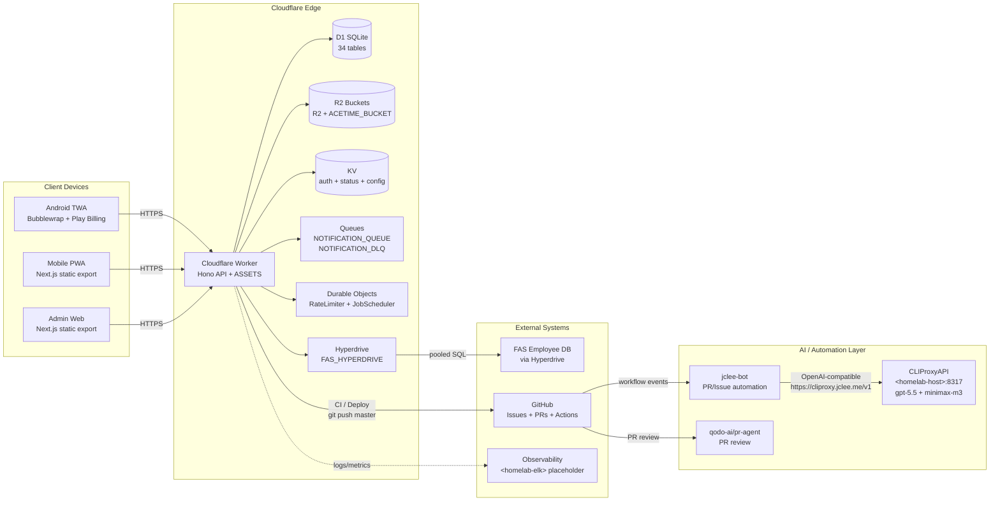

# SafetyWallet

> **건설 현장 안전 관리 플랫폼**
> **Construction Site Safety Management Platform**

[](#license--라이선스)
[](https://nodejs.org)
[](https://www.typescriptlang.org)
[](https://nextjs.org)
[](https://workers.cloudflare.com)
[](https://developers.cloudflare.com/d1)
[](https://hono.dev)
[](https://orm.drizzle.team)
[](https://turbo.build)
[](https://vitest.dev)
[](https://playwright.dev)
[](#android-trusted-web-activity-twa)
[](#internationalization--다국어)
[](#jclee-bot-automation-surfaces--jclee-bot-자동화-영역)

---

## Table of Contents / 목차

- [Overview / 개요](#overview--개요)
- [Features / 주요 기능](#features--주요-기능)
- [Architecture / 아키텍처](#architecture--아키텍처)
- [Repository Structure / 저장소 구조](#repository-structure--저장소-구조)
- [Cloudflare Bindings / Cloudflare 바인딩](#cloudflare-bindings--cloudflare-바인딩)
- [Authentication & Authorization / 인증과 권한](#authentication--authorization--인증과-권한)
- [Internationalization / 다국어](#internationalization--다국어)
- [Android Trusted Web Activity (TWA)](#android-trusted-web-activity-twa)
- [jclee-bot Automation Surfaces / jclee-bot 자동화 영역](#jclee-bot-automation-surfaces--jclee-bot-자동화-영역)
- [Go Tools / Go 도구](#go-tools--go-도구)
- [Quick Start / 빠른 시작](#quick-start--빠른-시작)
- [Local Development / 로컬 개발](#local-development--로컬-개발)
- [Commands Reference / 명령어 레퍼런스](#commands-reference--명령어-레퍼런스)
- [Testing / 테스트](#testing--테스트)
- [Contribution Guide / 기여 가이드](#contribution-guide--기여-가이드)
- [External Links / 외부 링크](#external-links--외부-링크)
- [License / 라이선스](#license--라이선스)

---

## Overview / 개요

**SafetyWallet**은 현장 근로자가 모바일 PWA로 위험 요소를 신고하고 출퇴근을 기록하며 안전 포인트를 적립하고, 현장 관리자가 대시보드에서 검토·정산·컴플라이언스를 처리하는 **건설 현장 안전 관리 플랫폼**입니다.
**SafetyWallet** is a **construction-site safety management platform** where field workers report hazards, log attendance, and earn safety points from a mobile PWA, while site administrators review, settle, and audit compliance from a dashboard.

단일 Cloudflare Worker가 Hono 기반 API와 두 개의 정적-export Next.js 프런트엔드를 **호스트명 라우팅**으로 동시에 제공합니다.
A single Cloudflare Worker serves the Hono API and two statically-exported Next.js frontends through **hostname-based routing**.

핵심 가치 제안은 다음 네 가지입니다.
The four core value propositions are:

1. **근로자 중심 모바일 경험** – Android TWA로 배포되어 설치 마찰 없이 동작
   **Worker-first mobile experience** delivered as an Android TWA with no install friction
2. **단일 엣지 워커** – API와 두 SPA를 한 Worker에서 호스트 라우팅
   **Single-edge Worker** that hosts the API and two SPAs behind hostname routing
3. **다국어 즉시 지원** – ko · en · vi · zh 런타임 i18n
   **Out-of-the-box multilingual** runtime i18n in ko · en · vi · zh
4. **자동화 우선 운영** – jclee-bot이 이슈·PR·릴리스를 종단간으로 운영
   **Automation-first operations** with jclee-bot driving issues, PRs, and releases end-to-end

---

## Features / 주요 기능

- **위험 요소 신고 (Hazard reporting)** – 사진·동영상 첨부, 카테고리·우선순위 태깅, 현장 단위 격리
  **Hazard reporting** with photo/video attachments, category/priority tagging, and per-site isolation
- **출퇴근 관리 (Attendance)** – GPS·QR 기반 출퇴근 기록, R2 버킷 기반 자산 첨부
  **Attendance tracking** with GPS/QR check-in, R2-backed asset attachments
- **안전 포인트 (Safety points)** – 위험 신고·교육 이수에 대한 포인트 적립 및 정산
  **Safety points** earned from hazard reports and education completion, with settlement
- **관리자 대시보드 (Admin dashboard)** – 출퇴근·게시글·투표·교육 관리
  **Admin dashboard** for attendance, posts, votes, and education management
- **컴플라이언스 (Compliance)** – 34개 D1 테이블 기반 감사 추적, KV 캐시로 인증 최적화
  **Compliance** with audit trail over 34 D1 tables and KV-cached auth
- **다국어 (i18n)** – 4개 언어 런타임 번역, `packages/types`의 번역 데이터 공유
  **i18n** across 4 languages with shared translation data in `packages/types`
- **알림 파이프라인 (Notification pipeline)** – Queue + DLQ 기반 안정적 알림 전달
  **Notification pipeline** with Queue + DLQ for reliable delivery
- **자동화 (Automation)** – jclee-bot이 이슈 트리아지, PR 리뷰, 의존성 업데이트, 릴리스 노트를 운영
  **Automation** with jclee-bot triaging issues, reviewing PRs, merging Dependabot, and shipping releases

---

## Architecture / 아키텍처

다음 다이어그램은 클라이언트, Cloudflare 엣지, AI/자동화 레이어, 외부 시스템 간의 데이터 흐름을 보여 줍니다.
The diagram below shows data flow across clients, the Cloudflare edge, the AI/automation layer, and external systems.

> **Mermaid 규칙 / Mermaid rule** – `<homelab-host>` / `<homelab-elk>` 같은 플레이스홀더와 URL을 포함한 노드 레이블은 모두 큰따옴표로 감싸고 `<` `>`를 `&lt;` `&gt;`로 이스케이프했습니다.
> **Mermaid rule** – node labels containing placeholders such as `<homelab-host>` / `<homelab-elk>` or URLs are quoted and the angle brackets are HTML-escaped.



핵심 설계 결정 / Key design decisions:

- **단일 워커, 다중 호스트** – `worker.jclee.me`(사용자 PWA), `admin.jclee.me`(관리 콘솔), `api.jclee.me`(API)로 호스트 라우팅. 정적 자산은 `ASSETS` 바인딩을 통해 제공.
  **Single Worker, multiple hostnames** – routing by `worker.jclee.me` (user PWA), `admin.jclee.me` (admin console), and `api.jclee.me` (API). Static assets served via the `ASSETS` binding.
- **엣지 우선 데이터 평면** – D1(SQLite)이 1차 저장소, R2가 미디어, KV가 인증 캐시, Hyperdrive가 외부 FAS 연결.
  **Edge-first data plane** – D1 (SQLite) is the system of record, R2 holds media, KV caches auth, Hyperdrive fronts the external FAS database.
- **자동화는 워커 외부** – `apps/worker`는 결정적인 HTTP 비즈니스 로직만 담당. AI/자동화는 워커 외부(jclee-bot + CLIProxyAPI + pr-agent)에서 비동기로 처리.
  **Automation lives outside the Worker** – `apps/worker` stays focused on deterministic HTTP business logic; AI/automation runs asynchronously in jclee-bot + CLIProxyAPI + pr-agent.
- **Git-ref 기반 배포** – `master` 푸시가 곧 배포 트리거. 수동 배포 스크립트는 의도적으로 비활성화.
  **Git-ref driven deploys** – pushing to `master` is the deploy trigger. The manual deploy script is intentionally disabled.

---

## Repository Structure / 저장소 구조

실제 최상위 레이아웃은 다음과 같습니다. 트랜지언트 CI 체크아웃 경로(예: `_bot-scripts/`)는 **실제 디렉터리가 아니므로 절대 기재하지 않습니다**.
The actual top-level layout is shown below. Transient CI checkout paths such as `_bot-scripts/` are **never real directories** and must not appear here.

```text
.
├── AGENTS.md                  # 60개의 프로젝트 지식 베이스 (프로젝트당 자동 생성)
├── ARCHITECTURE.md            # 아키텍처 결정 기록 (ADR)
├── CODE_STYLE.md              # 코딩 스타일 규칙
├── CONTRIBUTING.md            # 기여 절차
├── LICENSE                    # MIT 라이선스
├── README.md                  # 본 문서
├── package.json               # npm workspaces + Turborepo 스크립트
├── package-lock.json
├── turbo.json                 # Turborepo 파이프라인 (types → ui → apps)
├── wrangler.toml              # 루트 Cloudflare Worker 설정 + 전체 바인딩
├── vitest.config.ts
├── playwright.config.ts       # 6개 Playwright 프로젝트
├── apps/
│   ├── api/                   # Cloudflare Worker API (Hono + Drizzle + D1)
│   │   ├── src/routes/        # 18개 API 라우트 모듈 (admin/ 하위 중첩)
│   │   ├── src/lib/           # Auth, helpers, FAS 통합, R2 헬퍼
│   │   ├── src/middleware/    # CORS, 로깅, 분석, 보안 헤더
│   │   ├── src/db/            # Drizzle 스키마 (34 테이블), seed, helpers
│   │   ├── src/durable-objects/ # RateLimiter, JobScheduler Durable Object
│   │   ├── src/jobs/          # 10개 cron 스케줄 잡
│   │   ├── src/validators/    # Zod 요청 스키마
│   │   └── migrations/        # 31개 D1 SQL 마이그레이션
│   ├── admin/                 # Next.js 15 관리 대시보드 (포트 3001, static export)
│   │   └── src/app/           # App Router: 출퇴근, 게시글, 투표, 교육
│   └── worker/                # Next.js 15 사용자 PWA (포트 3000, static export)
│       ├── android/           # Bubblewrap 기반 Android TWA 프로젝트
│       └── src/app/           # App Router: 로그인, 게시글, 출퇴근, 교육
├── packages/
│   ├── types/                 # 공유 TS 타입, enum, DTO, i18n 번역 데이터
│   └── ui/                    # 공유 shadcn/ui 컴포넌트 + Tailwind v4 테마 토큰
├── docs/                      # PRD, 요구사항 명세, 운영 런북
├── scripts/                   # Go/JS 도구 (verify, naming lint, anti-pattern 검사)
├── e2e/                       # Playwright E2E (인증 셋업, admin, worker 시나리오)
└── .github/workflows/         # GitHub Actions: lint → typecheck → guards → test → build → migrate
```

---

## Cloudflare Bindings / Cloudflare 바인딩

`wrangler.toml`에 선언된 바인딩과 그 역할입니다.
Bindings declared in `wrangler.toml` and their roles:

| Binding / 바인딩 | Type / 종류 | Purpose / 용도 |
| --- | --- | --- |
| `DB` | D1 | Primary database (34 tables, SQLite via Drizzle) / 1차 DB |
| `FAS_HYPERDRIVE` | Hyperdrive | External FAS employee database / 외부 FAS 사원 DB |
| `ASSETS` | Workers Static Assets | Static frontend files (worker + admin SPAs) / 정적 프런트 |
| `R2` | R2 | User-uploaded images and videos / 사용자 업로드 미디어 |
| `ACETIME_BUCKET` | R2 | Attendance-related assets / 출퇴근 자산 |
| `KV` | KV | Auth cache, system status, config / 인증·상태·설정 |
| `NOTIFICATION_QUEUE` / `NOTIFICATION_DLQ` | Queue | Notification delivery pipeline / 알림 파이프라인 |
| `RATE_LIMITER` | Durable Object | Per-IP / per-user rate limiting / 속도 제한 |
| `JOB_SCHEDULER` | Durable Object | Cron-driven job orchestration / 스케줄러 |

---

## Authentication & Authorization / 인증과 권한

- **인증 흐름 / Auth flow** – 로그인 → KST 자정 만료 JWT 발급 → 클라이언트 Zustand에 저장.
  Login → JWT issued with KST same-day midnight expiry → stored in client Zustand.
- **3중 검증 / Triple-layer validation** – JWT 디코드 → KST 날짜 확인 → KV 캐시 조회 → D1 폴백.
  JWT decode → KST date check → KV cache lookup → D1 fallback.
- **3단계 권한 / Three-tier permissions** – 역할 기반(`WORKER`, `SITE_ADMIN`, `SUPER_ADMIN`, `SYSTEM`) → 현장별 멤버십 → 필드 플래그(`canAwardPoints`, `canReview`, `canExportData`).
  Role-based (`WORKER`, `SITE_ADMIN`, `SUPER_ADMIN`, `SYSTEM`) → site-specific membership → field-level flags (`canAwardPoints`, `canReview`, `canExportData`).
- **클라이언트 상태 / Client auth** – Zustand 영속 스토어 + 401 리프레시 뮤텍스. 사용자 키 `safetywallet-auth`, 관리자 키 `safetywallet-admin-auth`.
  Zustand persisted store + 401 refresh mutex. Worker key `safetywallet-auth`, admin key `safetywallet-admin-auth`.

---

## Internationalization / 다국어

런타임 커스텀 i18n(`apps/worker/src/i18n/`)을 사용하며 번역 데이터는 `packages/types`에 공유됩니다. 지원 언어는 **ko · en · vi · zh** 네 가지입니다.
A custom runtime i18n (`apps/worker/src/i18n/`) is used and translation data is shared via `packages/types`. Supported languages are **ko · en · vi · zh**.

자세한 구현은 `apps/worker/I18N_IMPLEMENTATION.md`를 참조하세요.
See `apps/worker/I18N_IMPLEMENTATION.md` for implementation details.

---

## Android Trusted Web Activity (TWA)

`apps/worker/android/`은 Bubblewrap으로 생성된 TWA 프로젝트입니다. Play 스토어 배포용 자산(`store_icon.png`, 매니페스트 체크섬 등)과 Digital Asset Links 검증용 구성이 포함되어 있습니다.
`apps/worker/android/` is a Bubblewrap-generated TWA project. It ships Play Store assets (`store_icon.png`, manifest checksum, etc.) and Digital Asset Links verification configuration.

핵심 빌드 산출물과 권한은 다음 위치에 있습니다.
Key build outputs and permissions live at:

- `android/app/build.gradle` – TWA 앱 모듈 빌드 스크립트
  TWA app module build script
- `android/app/src/main/AndroidManifest.xml` – 매니페스트 (Play Billing 포함)
  Manifest (includes Play Billing)
- `android/twa-manifest.json` – TWA 매니페스트 (Asset Links 검증)
  TWA manifest (Asset Links verification)

---

## jclee-bot Automation Surfaces / jclee-bot 자동화 영역

> **중요 / Important** – 본 섹션은 워크플로 파일을 표로 나열하지 않습니다. 워크플로 파일은 **트리거 구현체**일 뿐이며, 자동화의 진실 공급원(source of truth)은 **jclee-bot이 소유한 App 차원의 동작**입니다.
> **Important** – this section does **not** render a workflow-file inventory table. Workflow files are only **trigger implementations**; the source of truth for automation is the **app-level behavior owned by jclee-bot**.

`apps/worker`는 결정적 HTTP 비즈니스 로직만 담당하며, **상태를 변경하는 모든 자동화는 jclee-bot이 소유**합니다.
`apps/worker` only owns deterministic HTTP business logic; **all mutating automation is owned by jclee-bot**.

jclee-bot이 운영히는 자동화 영역은 다음과 같습니다.
The automation surfaces operated by jclee-bot are:

### 1. 브랜치 → PR 변환 / Branch → PR conversion
- 푸시된 브랜치를 자동으로 PR로 변환하고 reviewers/label을 적용
  Automatically convert pushed branches into PRs and apply reviewers/labels

### 2. 이슈 → 브랜치 변환 / Issue → Branch conversion
- 라벨 또는 명령으로 표시된 이슈에 대해 작업 브랜치를 자동 생성
  **마커 `jclee-bot에의해자동화됨`** 가 붙은 이슈에 한해 자동 작업 브랜치가 생성되며, 이후 PR로 연결
  Issue-labeled branches are created **only for issues carrying the marker `jclee-bot에의해자동화됨`**, then linked to a PR
- 일반 사용자의 이슈는 자동화 대상에서 제외되며, 사람이 직접 라벨을 부여해야 함
  Plain user issues are excluded until a maintainer applies the marker explicitly

### 3. PR 자동 리뷰 / Automated PR review
- 일반 PR 리뷰어와 보안 리뷰어를 분리하여 2단 리뷰를 수행
  Two-stage review pipeline: standard reviewer + security reviewer

### 4. Dependabot 자동 머지 / Dependabot auto-merge
- 패치/마이너 범위의 의존성 업데이트는 CI 통과 시 자동 머지
  Patch/minor dependency updates auto-merge after CI green

### 5. PR 자동 머지 / PR auto-merge
- 사전 승인된 라벨/체크리스트가 부착된 PR은 CI 통과 후 자동 머지
  PRs carrying pre-approved labels/checklists auto-merge once CI is green

### 6. PR 자동 자가 수정 / PR bot auto-fix
- 린트·타입 오류가 발생한 PR에 대해 jclee-bot이 직접 수정 커밋을 푸시
  For PRs with lint/type errors, jclee-bot pushes fix commits directly

### 7. 머지된 PR 정리 / Merged PR cleanup
- 머지된 PR의 원격 브랜치와 임시 라벨을 주기적으로 정리
  Periodically cleans remote branches and ephemeral labels of merged PRs

### 8. 이슈 백필 / Issue backfill
- 누락된 이슈 메타데이터(라벨, 마일스톤, 담당자)를 과거 이슈에 일괄 보강
  Backfills missing issue metadata (labels, milestones, assignees) across history

### 9. 릴리스 노트 / Release notes
- 머지된 PR을 자동 수집하여 릴리스 노트 초안을 생성
  Aggregates merged PRs into a release-notes draft

### 10. 릴리스 퍼블리시 / Release publish
- 태그 생성 시 빌드 산출물을 자동으로 퍼블리시
  Auto-publishes build artifacts on tag creation

### 11. 다운스트림 헬스 체크 / Downstream health check
- 의존 워커(`api.jclee.me` 등)의 헬스 엔드포인트를 주기적으로 점검
  Periodically probes the health endpoint of downstream workers (e.g. `api.jclee.me`)

### 12. CI 실패 이슈 자동 생성 / CI failure → issue
- `master`에서 CI가 실패하면 자동으로 실패 이슈를 생성하고 트리아지 라벨을 부착
  CI failures on `master` auto-open a triage-labeled issue

### 13. 지속적 통합 파이프라인 / Continuous integration
- PR·push 시 lint → typecheck → 가드 → 테스트 → 빌드 → 마이그레이션 순서로 실행
  On PR/push: lint → typecheck → guards → test → build → migrate

AI 호출은 OpenAI 호환 엔드포인트인 `https://cliproxy.jclee.me/v1`을 통해 이루어지며, 현재 기본 모델은 **gpt-5.5**, 폴백은 **minimax-m3**(CLIProxyAPI 경유)입니다.
AI calls go through the OpenAI-compatible endpoint `https://cliproxy.jclee.me/v1`. The current primary model is **gpt-5.5**, with **minimax-m3** as the fallback (via CLIProxyAPI).

PR 리뷰 보조로 [qodo-ai/pr-agent](https://github.com/qodo-ai/pr-agent)을 함께 사용합니다.
[qodo-ai/pr-agent](https://github.com/qodo-ai/pr-agent) is used alongside jclee-bot for PR review assistance.

---

## Go Tools / Go 도구

본 저장소는 Go로 작성된 보조 도구를 `scripts/` 아래에 보관합니다. 이들은 npm 스크립트의 사전/사후 훅으로 호출됩니다.
The repo keeps Go-authored helpers under `scripts/`. They run as pre/post hooks around npm scripts.

| Tool / 도구 | Invocation / 호출 | Purpose / 용도 |
| --- | --- | --- |
| `scripts/verify.go` | `go run scripts/verify.go` | 빌드 가능성·바인딩 일관성 등 종합 검증 |
| Comprehensive verification (buildable, binding consistency) | | |
| `scripts/git-preflight.go` | `go run scripts/git-preflight.go` | 커밋 전 브랜치·작업 디렉터리·원격 동기화 점검 |
| Pre-commit branch/workdir/remote sync sanity check | | |
| `scripts/check-anti-patterns.go` | `go run scripts/check-anti-patterns.go` | 코드 안티 패턴 탐지(`lint-staged` 훅) |
| Detects code anti-patterns (invoked by `lint-staged`) | | |

Go가 로컬에 설치되어 있지 않다면 [go.dev/dl](https://go.dev/dl/)에서 설치하세요.
If Go is not installed locally, grab it from [go.dev/dl](https://go.dev/dl/).

---

## Quick Start / 빠른 시작

사전 요구 사항 / Prerequisites:

- **Node.js ≥ 20.0.0** (권장 / recommended 20.x LTS)
- **npm ≥ 10.8.2** (`packageManager` 필드 기준)
- **Go** (선택 사항이지만 verify/preflight 실행 시 필요 / optional, required for `verify`/`git:preflight`)
- **Cloudflare 계정 / Cloudflare account** (D1, R2, KV, Hyperdrive, Queue, Durable Object 권한)

5분 부트스트랩 / 5-minute bootstrap:

```bash
# 1. 클론 + 의존성 설치 / Clone and install
git clone <your-fork-or-mirror-url>
cd safetywallet
npm install

# 2. wrangler.toml 확인 (실제 계정 ID로 교체)
#    Verify wrangler.toml (replace placeholder account ID)

# 3. D1 마이그레이션 / Apply D1 migrations
npm run db:generate

# 4. 개발 서버 실행 (Turborepo가 apps/* 병렬 실행)
#    Run dev servers (Turborepo fans out across apps/*)
npm run dev
```

기본 포트 / Default ports:

- `apps/worker` 사용자 PWA: **3000**
- `apps/admin` 관리자 콘솔: **3001**
- API는 별도 포트가 아닌 호스트명(`api.jclee.me`)으로 라우팅됨
  API is reached by hostname (`api.jclee.me`), not by port

---

## Local Development / 로컬 개발

### 환경 변수 / Environment variables

1. `wrangler.toml`을 실제 Cloudflare 계정 ID, D1 ID, R2 버킷, KV namespace, Queue, Durable Object 이름으로 교체
   Replace placeholders in `wrangler.toml` with real Cloudflare account ID, D1 ID, R2 buckets, KV namespaces, Queues, and Durable Object names
2. Playwright E2E는 1Password CLI를 통해 `.env.e2e` 시크릿을 주입 (`op run --env-file=.env.e2e`)
   Playwright E2E injects secrets from `.env.e2e` via 1Password CLI (`op run --env-file=.env.e2e`)

### 워커 로컬 실행 / Running the Worker locally

```bash
# 단일 워커 빌드 / Build only the API worker
npm run build:api

# 워커 + admin + worker 동시 실행 (Turborepo)
# Run worker + admin + worker concurrently (Turborepo)
npm run dev

# 풀 파이프라인 검증 / Full pipeline verify
npm run verify
```

### Android TWA 빌드 / Building the Android TWA

```bash
cd apps/worker/android
./gradlew assembleRelease   # 또는 / or ./gradlew bundleRelease
```

---

## Commands Reference / 명령어 레퍼런스

루트 `package.json`의 스크립트 전체 레퍼런스입니다.
A complete reference of the scripts in the root `package.json`.

### 빌드 / Build

| Command | Description / 설명 |
| --- | --- |
| `npm run build` | Turbo 빌드 + admin/worker 정적 산출물을 `dist/`로 결합 |
| `npm run build:api` | `packages/types` 빌드 → `apps/api` 빌드 |
| `npm run build:static` | `dist/` 재작성 후 admin/worker 정적 산출물 복사 |
| `npm run build:one-worker` | `build:api`의 별칭 (단일 워커만 빌드) |

### 개발 / Develop

| Command | Description / 설명 |
| --- | --- |
| `npm run dev` | Turbo를 통해 모든 워크스페이스의 dev 스크립트 실행 |
| `npm run lint` | Turbo를 통해 린트 실행 |
| `npm run lint:naming` | 명명 규칙 린트 (`scripts/lint-naming.js`) |
| `npm run typecheck` | Turbo를 통해 타입 체크 |
| `npm run format` | Prettier로 포맷팅 |
| `npm run format:check` | 포맷 검사만 (CI에서 사용) |

### 검증 / Verify

| Command | Description / 설명 |
| --- | --- |
| `npm run verify` | `go run scripts/verify.go` 종합 검증 |
| `npm run git:preflight` | `go run scripts/git-preflight.go` 커밋 전 점검 |
| `npm run check:wrangler-sync` | wrangler 설정 동기화 검사 |

### 데이터베이스 / Database

| Command | Description / 설명 |
| --- | --- |
| `npm run db:generate` | `apps/api` 워크스페이스에서 Drizzle 마이그레이션 생성 |

### 배포 / Deploy

| Command | Description / 설명 |
| --- | --- |
| `npm run deploy:api` | **의도적으로 실패 / intentionally fails** – 수동 배포는 비활성화. `master` 푸시만 배포 트리거. |
| Manual deploy is disabled. Push to `master` to deploy. | |

### 테스트 / Test

| Command | Description / 설명 |
| --- | --- |
| `npm run test` | Turbo를 통해 모든 워크스페이스 테스트 실행 |
| `npm run test:coverage` | 커버리지 포함 Vitest 실행 |
| `npm run e2e` | Playwright E2E (1Password로 시크릿 주입) |
| `npm run e2e:headed` | 헤드드 모드 Playwright |
| `npm run e2e:ui` | Playwright UI 모드 |

### 정리 / Cleanup

| Command | Description / 설명 |
| --- | --- |
| `npm run clean` | Turbo clean + `node_modules` 제거 |
| `npm run prepare` | Husky 훅 설치 |

### Pre-commit 훅 / Pre-commit hooks

`lint-staged` 설정:

- `*.{ts,tsx}` – `go run scripts/check-anti-patterns.go` → Prettier
- `*.{js,jsx,json,md}` – Prettier

---

## Testing / 테스트

- **단위 테스트 / Unit tests** – Vitest, 워크스페이스 단위 실행 (`npm run test`)
  Vitest, run per workspace via `npm run test`
- **E2E 테스트 / End-to-end tests** – Playwright, 6개 프로젝트(`playwright.config.ts`). 1Password CLI로 `.env.e2e` 시크릿 주입 필요.
  Playwright with 6 projects (`playwright.config.ts`). Requires `.env.e2e` secrets injected via 1Password CLI.
- **타입 체크 / Type-checking** – `npm run typecheck`
- **자동 수정 가드 / Auto-fix guards** – jclee-bot이 PR에 직접 fix 커밋을 푸시하므로 로컬에서 먼저 실행하는 것을 권장
  Because jclee-bot pushes fix commits to PRs, prefer running guards locally first

---

## Contribution Guide / 기여 가이드

기여를 시작하기 전 다음 문서를 반드시 읽어 주세요.
Before contributing, please read:

- [`CONTRIBUTING.md`](./CONTRIBUTING.md) – PR 절차, 커밋 규약, 리뷰 SLA
  PR procedure, commit conventions, review SLA
- [`CODE_STYLE.md`](./CODE_STYLE.md) – 코드 스타일·네이밍·테스트 규칙
  Code style, naming, and testing conventions
- [`AGENTS.md`](./AGENTS.md) – 프로젝트 지식 베이스(60개 AGENTS.md 파일의 인덱스)
  Project knowledge base (index of 60 AGENTS.md files)
- [`ARCHITECTURE.md`](./ARCHITECTURE.md) – 아키텍처 결정 기록(ADR)
  Architecture Decision Records (ADR)

기여 워크플로 / Contribution workflow:

1. 이슈 생성 또는 기존 이슈 확인. 자동화 대상이면 메인테이너가 `jclee-bot에의해자동화됨` 마커를 부착
   Open or pick an issue. A maintainer attaches the `jclee-bot에의해자동화됨` marker for automation-eligible work
2. 작업 브랜치 생성(예: `feat/hazard-report-export`)
   Create a working branch (e.g. `feat/hazard-report-export`)
3. 로컬에서 `npm run lint && npm run typecheck && npm run test` 통과 확인
   Locally pass `npm run lint && npm run typecheck && npm run test`
4. PR을 열면 jclee-bot이 자동 리뷰를, qodo-ai/pr-agent가 보조 리뷰를 수행
   On PR open, jclee-bot reviews automatically and qodo-ai/pr-agent co-reviews
5. CI가 통과하면 사전 승인된 PR은 자동 머지, 그 외는 메인테이너 머지
   After CI passes, pre-approved PRs auto-merge; otherwise a maintainer merges

---

## External Links / 외부 링크

- **공개 엔드포인트 / Public endpoint** – https://cliproxy.jclee.me/v1 (OpenAI-compatible, AI 자동화 게이트웨이 / AI automation gateway)
- **봇 운영 도메인 / Bot operations domain** – https://bot.jclee.me
- **PR 리뷰 도우미 / PR review assistant** – [qodo-ai/pr-agent](https://github.com/qodo-ai/pr-agent)

---

## License / 라이선스

본 프로젝트는 **MIT License**로 배포됩니다. 자세한 내용은 [`LICENSE`](./LICENSE) 파일을 참조하세요.
This project is released under the **MIT License**. See [`LICENSE`](./LICENSE) for the full text.