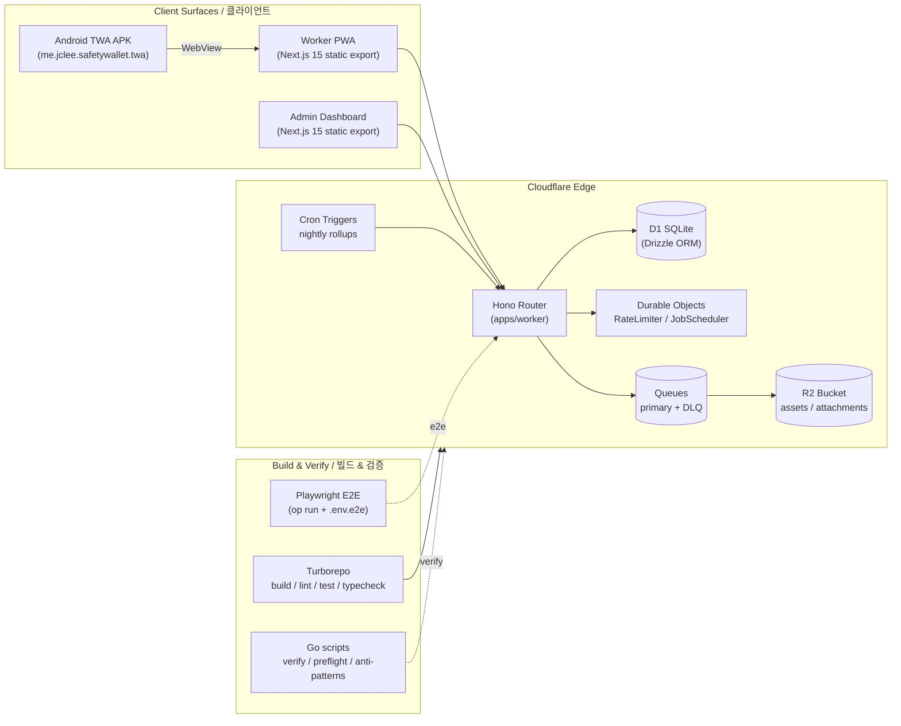

# SafetyWallet / 안전지갑

> Mobile-first PWA for construction-site safety reporting, attendance, and safety-point incentive management.
> 건설 현장의 안전 보고 · 출퇴근 · 안전 포인트 인센티브를 관리하는 모바일 우선 PWA.


## Overview / 개요

SafetyWallet is a field-worker safety platform organized as a **Turborepo monorepo** and deployed entirely on the **Cloudflare** edge. It targets construction sites where workers need a low-friction, installable mobile experience and site managers need a dashboard to triage reports, attendance, and incentive accrual.

SafetyWallet은 **Cloudflare** 엣지에 전량 배포되는 **Turborepo 모노레포** 기반의 현장 작업자 안전 플랫폼입니다. 작업자가 현장에서 마찰 없이 설치 가능한 모바일 환경을 사용하고, 현장 관리자가 보고 · 출퇴근 · 인센티브 적립을 심사할 수 있는 대시보드를 제공합니다.

The product surface is composed of:

- A **Cloudflare Worker** that hosts a **Hono** HTTP API on top of a **Drizzle / D1** data layer (`apps/api`).
- A statically-exported **Next.js 15** *Worker PWA* (`apps/worker`) — the field-worker experience.
- A statically-exported **Next.js 15** *Admin Dashboard* (`apps/admin`) — served from the same Worker via hostname routing.
- An **Android Trusted Web Activity (TWA)** wrapper (`apps/worker/android`) that packages the Worker PWA as a native-installable APK and verifies the hosted origin through a `manifest-checksum.txt` asset.
- A scheduled-job system backed by **Durable Objects** (`RateLimiter`, `JobScheduler`) with notification delivery through **R2** and **Queues** (primary + DLQ).
- A **Go**-based developer tooling layer (`scripts/`) that performs pre-commit, naming, and pre-deploy verification of the monorepo.

The repository is private and intended for use by contracted construction firms and their on-site managers.

## Features / 주요 기능

- **Safety Reporting / 안전 보고** — workers file photo-attached incident/near-miss reports from a mobile-first PWA.
- **Attendance / 출퇴근** — check-in / check-out with geolocation and shift windows.
- **Safety-Point Incentives / 안전 포인트** — points accrue on accepted reports; configurable per-site rules.
- **Admin Dashboard / 관리자 콘솔** — review queue, attendance ledgers, point adjustments, and role management.
- **Installable Mobile PWA / 설치형 모바일 PWA** — offline-friendly Service Worker, install prompts, push notifications.
- **Android TWA / Android TWA** — TWA-wrapped APK distributed through site channels with origin verification (`twa-manifest.json` + `manifest-checksum.txt`).
- **Bilingual UI / 이중 언어 UI** — Korean (default) and English, locale-driven formatting.
- **Edge-Native Backend / 엣지 네이티브 백엔드** — Hono on Cloudflare Workers, D1 (SQLite at the edge), Durable Objects for rate limiting and scheduling.
- **Background Jobs / 백그라운드 작업** — Queues with a dead-letter queue; R2 for asset storage; cron triggers for nightly rollups.

## Architecture / 아키텍처



### Repository Layout / 저장소 구조

```
.
├── AGENTS.md                 # AI/automation agent instructions (context only)
├── ARCHITECTURE.md           # Extended architecture notes
├── CODE_STYLE.md             # TypeScript / Go style guide
├── CONTRIBUTING.md           # Contribution policy
├── LICENSE
├── README.md                 # This file
├── package.json              # Root workspaces + scripts
├── package-lock.json
├── turbo.json                # Turborepo pipeline
├── vitest.config.ts
├── playwright.config.ts
├── wrangler.toml             # Cloudflare Worker bindings
├── apps/
│   ├── worker/               # Next.js 15 PWA (static export) + Android TWA
│   │   ├── android/          # Gradle project: twa-manifest.json, manifest-checksum.txt, LauncherActivity
│   │   └── src/app/          # App Router pages, error.tsx, globals.css, layout.tsx, page.tsx
│   └── …                     # apps/api, apps/admin (workspace siblings, see package.json)
└── packages/
    └── …                     # Shared types and utilities (e.g. packages/types)
```

## Quick Start / 빠른 시작

### Prerequisites / 사전 요구사항

| Tool / 도구 | Version / 버전 | Notes / 비고 |
|---|---|---|
| Node.js | `>= 20.0.0` | Enforced via `engines` |
| npm | `10.8.2` | Pinned via `packageManager` |
| Go | `>= 1.22` | Required for `scripts/verify.go`, `scripts/git-preflight.go`, `scripts/check-anti-patterns.go` |
| 1Password CLI (`op`) | latest | Required for `npm run e2e*` to inject secrets |
| Wrangler | matches `wrangler.toml` | Cloudflare Workers local dev & deploy |

### Install / 설치

```bash
npm install
```

This installs the root and all workspace dependencies (`apps/*`, `packages/*`) and triggers `husky` (`prepare` script).

### First Build / 첫 빌드

```bash
npm run build
```

This runs `turbo run build` across all workspaces and then assembles the static output of `apps/worker/out/*` and `apps/admin/out/*` into `dist/` and `dist/admin/`.

### Local API Build Only / API 단독 빌드

```bash
npm run build:api           # packages/types → apps/api
npm run build:one-worker    # alias for the above
```

### Local Development / 로컬 개발

```bash
npm run dev
```

This delegates to `turbo run dev` so every workspace starts in parallel (Worker PWA, Admin, and the API Worker via Wrangler).

## Configuration / 설정

### Cloudflare Bindings (`wrangler.toml`)

The Worker declared in `wrangler.toml` binds the runtime to:

- **D1** — primary SQL store.
- **Durable Objects** — `RateLimiter` and `JobScheduler`.
- **R2** — asset/attachment storage.
- **Queues** — primary queue and a dead-letter queue.

Validate that your local `wrangler.toml` matches the deployed remote configuration:

```bash
npm run check:wrangler-sync
```

### Environment Files

- `.env.e2e` — secrets consumed by Playwright via `op run --env-file`.
- Worker secrets (e.g. D1 IDs, R2 tokens, signing keys) are configured through Cloudflare dashboard / `wrangler secret put`.

### Android TWA / Android TWA

- `apps/worker/android/twa-manifest.json` — Digital Asset Links / TWA metadata.
- `apps/worker/android/manifest-checksum.txt` — origin checksum used by the TWA wrapper to verify the hosted PWA.
- `apps/worker/android/app/src/main/java/me/jclee/safetywallet/twa/` — Java sources (`Application.java`, `DelegationService.java`, `LauncherActivity.java`).
- App icons: `ic_launcher.png`, `ic_maskable.png` (mdpi → xxxhdpi), `ic_notification_icon.png`, `splash.png`.
- Shortcuts: `res/xml/shortcuts.xml`. File provider: `res/xml/filepaths.xml`.

To rebuild the TWA, open `apps/worker/android/` in Android Studio or run the included `gradlew` wrapper:

```bash
cd apps/worker/android
./gradlew assembleRelease
```

## Commands Reference / 명령어 참조

| Command / 명령 | Description / 설명 |
|---|---|
| `npm run dev` | Start every workspace in dev mode (Turbo). |
| `npm run build` | Build all workspaces; assemble static `dist/` and `dist/admin/`. |
| `npm run build:api` | Build `packages/types` and `apps/api` only. |
| `npm run build:one-worker` | Alias for `build:api`. |
| `npm run build:static` | Copy static exports of `apps/worker` and `apps/admin` into `dist/`. |
| `npm run lint` | Run lint across all workspaces. |
| `npm run lint:naming` | Enforce naming conventions via `scripts/lint-naming.js`. |
| `npm run typecheck` | Run TypeScript type-checking. |
| `npm run test` | Run unit tests (Vitest) across workspaces. |
| `npm run test:coverage` | Run unit tests with coverage. |
| `npm run check:wrangler-sync` | Verify `wrangler.toml` matches the remote. |
| `npm run git:preflight` | Run the Go-based pre-flight check before pushing. |
| `npm run verify` | Run the full Go-based repository verification. |
| `npm run format` | Format TS/TSX/JS/JSX/JSON/MD with Prettier. |
| `npm run format:check` | Verify formatting without modifying files. |
| `npm run clean` | Remove `node_modules` and build outputs. |
| `npm run db:generate` | Generate Drizzle artifacts (`apps/api`). |
| `npm run e2e` | Run Playwright E2E with secrets from 1Password. |
| `npm run e2e:headed` | Run Playwright with a visible browser. |
| `npm run e2e:ui` | Open the Playwright UI runner. |
| `npm run deploy:api` | Intentionally disabled — production deploys are Git-ref driven via CI on `master`. |

## Local Development / 로컬 개발 가이드

- **Day-to-day loop** — `npm run dev` to start all workspaces, edit code with hot reload, run `npm run typecheck` and `npm run lint` before pushing.
- **Pre-commit hooks** — `lint-staged` runs `go run scripts/check-anti-patterns.go` and `prettier --write` on staged TS/TSX files, and `prettier --write` on JS/JSX/JSON/MD.
- **Pre-push** — `npm run git:preflight` is the canonical gate.
- **Mirroring production** — run `npm run build` and serve the resulting `dist/` from a local static server to validate the static-export path.
- **TWA iteration** — when changing the PWA origin or the `twa-manifest.json`, regenerate `manifest-checksum.txt` so the TWA's origin check stays valid.

## Testing / 테스트

- **Unit tests / 단위 테스트** — Vitest, configured at the root (`vitest.config.ts`) and per-workspace.

  ```bash
  npm test
  npm run test:coverage
  ```

- **End-to-end tests / E2E 테스트** — Playwright (`playwright.config.ts`). Secrets are injected by 1Password CLI:

  ```bash
  npm run e2e
  npm run e2e:headed
  npm run e2e:ui
  ```

- **Static checks / 정적 검사** — `npm run typecheck`, `npm run lint`, `npm run lint:naming`, `npm run format:check`, `npm run check:wrangler-sync`.

- **Repository verification / 저장소 검증** — `npm run verify` and `npm run git:preflight` (Go-based; see `scripts/`).

## Contribution Guide / 기여 가이드

Contributions follow the project conventions in `CONTRIBUTING.md`, `CODE_STYLE.md`, and the agent-facing rules in `AGENTS.md`. Highlights:

- **Branching** — create a feature branch from `master`; production deploys are Git-ref driven via CI on `master`.
- **Code style** — TypeScript uses the repository's Prettier configuration; Go scripts follow standard `gofmt` plus the project rules in `CODE_STYLE.md`.
- **Naming** — enforced by `npm run lint:naming`; do not bypass it.
- **Commits** — keep commits focused; the pre-commit hook will reformat staged files.
- **Pull requests** — fill in the PR template, link any tracked issue, and ensure `npm run verify` succeeds locally before requesting review.

## License / 라이선스

This repository is **private and proprietary**. See `LICENSE` for the full terms. Unauthorized copying, redistribution, or external deployment is prohibited.

이 저장소는 **비공개 및 독점 소프트웨어**입니다. 자세한 사항은 `LICENSE`를 참고하세요. 무단 복제 · 재배포 · 외부 배포는 금지됩니다.