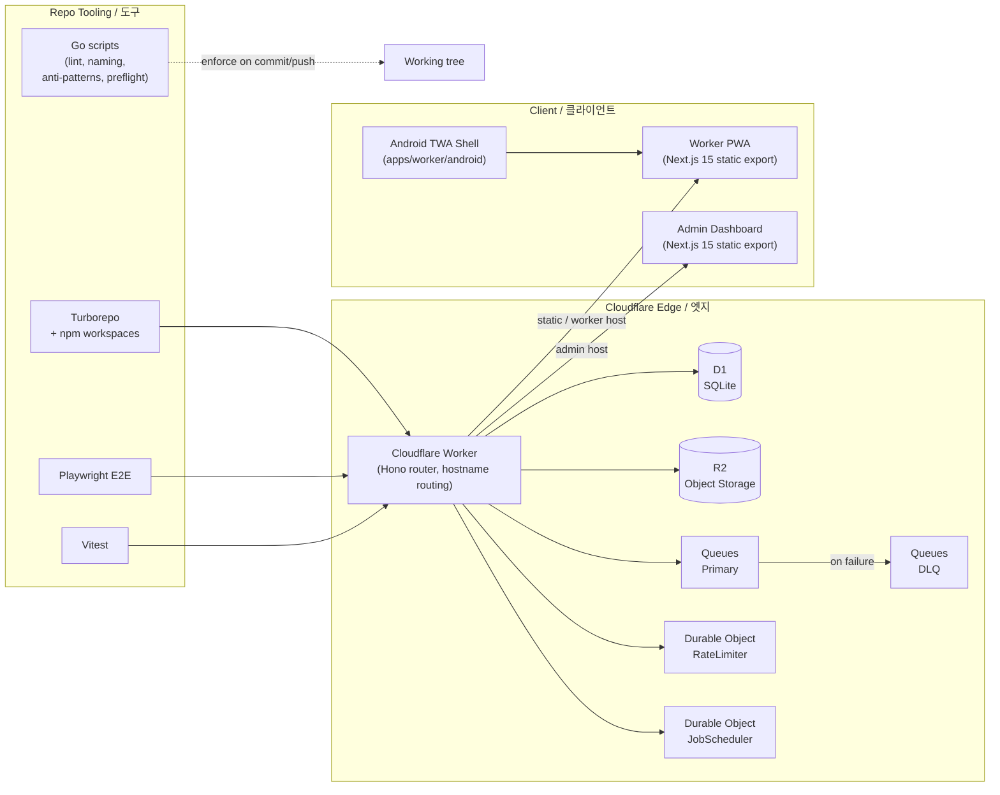

# SafetyWallet / 안전지갑

> Mobile-first PWA for construction-site safety reporting, attendance, and safety-point incentive management.
> 건설 현장의 안전 보고 · 출퇴근 · 안전 포인트 인센티브를 관리하는 모바일 우선 PWA.


## Overview / 개요

SafetyWallet is a field-worker safety platform composed of:

- A **Cloudflare Worker** that hosts a **Hono** API on top of a **Drizzle / D1** data layer.
- Two statically-exported **Next.js 15** frontends — a *worker PWA* and an *admin dashboard* — served from the same Worker through hostname routing.
- An **Android Trusted Web Activity (TWA)** wrapper that packages the worker PWA as a native-installable app.
- A scheduled-job system backed by **Durable Objects** (`RateLimiter`, `JobScheduler`), with notification delivery through **R2** and **Queues** (primary + DLQ).
- A **Go**-based development-tooling layer that enforces lint, naming, anti-pattern, and preflight invariants at commit and push time.

SafetyWallet은 다음과 같이 구성됩니다.

- **Hono** API와 **Drizzle / D1** 데이터 계층을 호스팅하는 **Cloudflare Worker**
- 동일 Worker에서 호스트명 라우팅으로 서빙되는 두 개의 정적 export **Next.js 15** 프런트엔드(작업자 PWA + 관리자 대시보드)
- 작업자 PWA를 네이티브 설치 가능 앱으로 패키징하는 **Android Trusted Web Activity (TWA)** 래퍼
- **Durable Objects**(`RateLimiter`, `JobScheduler`) 기반의 스케줄 작업 시스템과 **R2** · **Queues**(Primary + DLQ)를 통한 알림 전달
- 커밋 · 푸시 시점에 린트 · 명명 규칙 · 안티 패턴 · 프리플라이트 불변식을 강제하는 **Go** 기반 개발 도구 계층

## Key Features / 주요 기능

- **Hazard reporting** with image / video attachments uploaded to R2.
- **Attendance check-in / check-out** optimized for low-bandwidth on-site use.
- **Safety points** incentive ledger with accrual rules and redemption flows.
- **Admin dashboard** for site managers, including member management and report review.
- **Push notifications** delivered through a R2 + Queues + DLQ pipeline.
- **Rate limiting** and **scheduled jobs** powered by Cloudflare Durable Objects.
- **Android installability** via TWA so workers can install the PWA from the Play Store or via APK.
- **Multilingual UI** (English / Korean) with locale-aware formatting.
- **E2E coverage** with Playwright, and **unit / integration coverage** with Vitest.

- **R2 업로드** 기반의 이미지 / 동영상 첨부 기능을 갖춘 **위험 요인 신고**.
- **저대역 현장 환경**에 최적화된 **출퇴근 체크인 / 체크아웃**.
- 적립 규칙과 사용 흐름을 갖춘 **안전 포인트** 인센티브 원장.
- **관리자 대시보드** — 현장 관리자용 멤버 관리 및 신고 검토.
- R2 + Queues + DLQ 파이프라인을 통한 **푸시 알림** 전달.
- Cloudflare Durable Objects 기반의 **레이트 리미팅** 및 **스케줄 작업**.
- **TWA** 기반의 Android 설치성 — Play Store 또는 APK로 설치 가능.
- **다국어 UI**(영어 / 한국어) 및 로케일 인지 포맷.
- Playwright 기반 **E2E**, Vitest 기반 **단위 / 통합** 테스트.

## Repository Layout / 저장소 구조

```
.
├── AGENTS.md                # AI agent operating manual
├── ARCHITECTURE.md          # Detailed architecture decisions
├── CODE_STYLE.md            # Language and formatting conventions
├── CONTRIBUTING.md          # Contribution guidelines
├── LICENSE
├── README.md
├── package.json             # Root monorepo scripts & workspaces
├── package-lock.json
├── turbo.json               # Turborepo pipeline configuration
├── wrangler.toml            # Cloudflare Worker configuration
├── playwright.config.ts     # Playwright E2E configuration
├── vitest.config.ts         # Vitest configuration
└── apps/
    └── worker/              # Next.js 15 + Cloudflare Worker host
        ├── AGENTS.md
        ├── I18N_IMPLEMENTATION.md
        ├── next.config.mjs
        ├── package.json
        ├── tailwind.config.js
        ├── postcss.config.cjs
        ├── tsconfig.json
        ├── vitest.config.ts
        ├── android/         # TWA Android wrapper
        │   ├── build.gradle
        │   ├── settings.gradle
        │   ├── twa-manifest.json
        │   ├── store_icon.png
        │   ├── app/         # Native shell
        │   └── gradle/
        └── src/
            └── app/         # PWA routes (layout, page, error, styles)
```

## Architecture / 아키텍처



### Component notes / 구성 요소 설명

- **Cloudflare Worker** — single deployable that handles Hono API requests and routes static assets to the matching Next.js export (`/` for the worker PWA, `/admin` for the dashboard).
- **D1 + Drizzle** — typed schema-first persistence for users, sites, reports, attendance, and points ledger.
- **R2** — media bucket for hazard-report attachments (images, video clips, audio notes).
- **Queues** — decouple notification fan-out from the request path; failed jobs are routed to a DLQ for inspection.
- **Durable Objects** — `RateLimiter` provides per-actor fairness; `JobScheduler` runs cron-style jobs that drive accruals and reminders.
- **TWA** — `apps/worker/android` is a Bubblewrap-style wrapper with its own `Application`, `LauncherActivity`, and `DelegationService`, validating the PWA via DigitalAssetLinks.
- **Go tooling** — fast, dependency-free scripts under `scripts/` that integrate with `lint-staged` and Husky.

## Quick Start / 빠른 시작

### Prerequisites / 사전 준비물

- **Node.js** ≥ 20.0.0
- **npm** 10.8.2 (the repo pins a package manager version)
- **Go** ≥ 1.22 (only required for the tooling scripts under `scripts/`)
- A Cloudflare account with D1, R2, and Queues enabled (for full-stack local emulation with `wrangler dev`)

### Install / 설치

```bash
npm install
```

### Build everything / 전체 빌드

```bash
npm run build
```

This invokes Turborepo to build every workspace and then assembles a deployable `dist/` directory containing both PWA bundles and the Worker entrypoint.

### Run the API only / API만 실행

```bash
npm run build:api
```

### Start local dev (all workspaces) / 로컬 개발

```bash
npm run dev
```

### Run unit / integration tests / 단위·통합 테스트

```bash
npm run test
```

### Run E2E tests (Playwright) / E2E 테스트

```bash
# secrets are loaded from .env.e2e via 1Password CLI
op run --env-file=.env.e2e -- npx playwright test
# interactive variants
npm run e2e:headed
npm run e2e:ui
```

## Configuration / 설정

### Root-level knobs / 루트 설정

| Item | File | Purpose |
| --- | --- | --- |
| Workspaces | `package.json` | Declares `apps/*` and `packages/*` |
| Pipeline | `turbo.json` | Task graph and caching for `build`, `dev`, `test`, `lint`, `typecheck` |
| Cloudflare | `wrangler.toml` | Bindings for D1, R2, Queues, Durable Objects, and per-environment vars |
| E2E | `playwright.config.ts` | Browser matrix and reporter config |
| Unit / Integration | `vitest.config.ts` | Test discovery, coverage |

### Per-workspace configs / 워크스페이스별 설정

- `apps/worker/next.config.mjs` — static export settings and `output: 'export'`.
- `apps/worker/tailwind.config.js` — design tokens for both frontends.
- `apps/worker/postcss.config.cjs` — Tailwind / autoprefixer pipeline.
- `apps/worker/android/` — Gradle project for the TWA shell.
- `apps/worker/src/app/` — App Router pages, global styles, and error boundary.

### Environment / 환경 변수

E2E runs use 1Password CLI to inject secrets from `.env.e2e`. Worker runtime secrets are configured in `wrangler.toml` per environment (e.g. `vars`, `[[d1_databases]]`, `[[r2_buckets]]`, `[[queues.producers]]`).

## Commands Reference / 명령어 레퍼런스

| Script | Description |
| --- | --- |
| `npm run build` | Build all workspaces and assemble `dist/` |
| `npm run build:api` | Build types and the API workspace only |
| `npm run build:static` | Compose the static PWA bundles into `dist/` |
| `npm run build:one-worker` | Alias for `build:api` |
| `npm run dev` | Run all workspaces in dev mode via Turborepo |
| `npm run lint` | Lint all workspaces |
| `npm run lint:naming` | Run the naming-convention checker |
| `npm run typecheck` | TypeScript checks across the monorepo |
| `npm run test` | Run unit / integration tests |
| `npm run test:coverage` | Run tests with coverage reports |
| `npm run e2e` | Playwright E2E (requires 1Password CLI) |
| `npm run e2e:headed` | Playwright in headed mode |
| `npm run e2e:ui` | Playwright with the interactive UI |
| `npm run check:wrangler-sync` | Verify `wrangler.toml` matches bindings in code |
| `npm run git:preflight` | Run pre-push invariants from Go |
| `npm run verify` | Aggregate verification (build + lint + typecheck + tests) |
| `npm run format` | Prettier write across the repo |
| `npm run format:check` | Prettier check (CI-friendly) |
| `npm run db:generate` | Generate Drizzle schema artifacts |
| `npm run clean` | Remove all build artifacts and `node_modules` |

> The `deploy:api` script is intentionally disabled; production deploys are Git-ref driven through CI on the `master` branch.

## Local Development / 로컬 개발 워크플로

1. **Install** dependencies once at the root.
2. **Pick a workspace** — for the PWA, work under `apps/worker/src/app/`; for the TWA, work under `apps/worker/android/`.
3. **Run dev mode** with `npm run dev` to start Turborepo's parallel watchers.
4. **Lint before commit** — Husky hooks invoke Go-based anti-pattern and preflight scripts via `lint-staged`.
5. **Typecheck** with `npm run typecheck` to catch issues across workspaces.
6. **Run focused tests** with `vitest` from the workspace you're iterating in.
7. **Run E2E** before opening a PR; the Playwright config is wired to load `.env.e2e` via 1Password.

### TWA development / TWA 개발

- The Android project is a standard Gradle build: `cd apps/worker/android && ./gradlew assembleDebug`.
- `twa-manifest.json` and `web_app_manifest.json` must stay in sync with the PWA; `check:wrangler-sync` and related Go scripts help enforce that.
- Asset files live under `apps/worker/android/app/src/main/res/`.

## Testing / 테스트

- **Vitest** — unit and integration tests per workspace, runnable with `npm run test` or scoped to a single workspace.
- **Playwright** — end-to-end browser tests covering the worker PWA and admin dashboard. Use `npm run e2e:ui` when debugging.
- **Go scripts** — treat these as additional test-class invariants: naming, anti-patterns, preflight, and wrangler sync checks all run on commit / push and in CI.

## Contribution Guide / 기여 가이드

1. Read `CODE_STYLE.md`, `ARCHITECTURE.md`, and `CONTRIBUTING.md` before opening a PR.
2. Branch from `master`; keep commits scoped and conventional.
3. Run the full verification locally:

   ```bash
   npm run verify
   ```

4. Make sure your branch passes the E2E suite against a clean environment.
5. Open a PR that describes the change, screenshots for UI changes, and links to the relevant issue.
6. CI will run the Turborepo pipeline, Playwright E2E, and Go-based preflight checks.

## Operational Notes / 운영 메모

- **Manual deploys are disabled** by design — the `deploy:api` script exits with a clear error. Releases flow through CI on `master`.
- **Static bundle assembly** (`build:static`) overwrites `dist/` and is idempotent; safe to run repeatedly.
- **Drizzle migrations** are produced by `db:generate` in the API workspace; never edit generated SQL by hand.
- **Hostnames**: the Worker uses hostname-based routing to split traffic between the worker PWA and the admin dashboard. Update `wrangler.toml` routes when adding a new public hostname.

## License / 라이선스

This repository is distributed under a private license. See `LICENSE` for the full terms. / 본 저장소는 비공개 라이선스로 배포됩니다. 자세한 내용은 `LICENSE` 파일을 참고하세요.