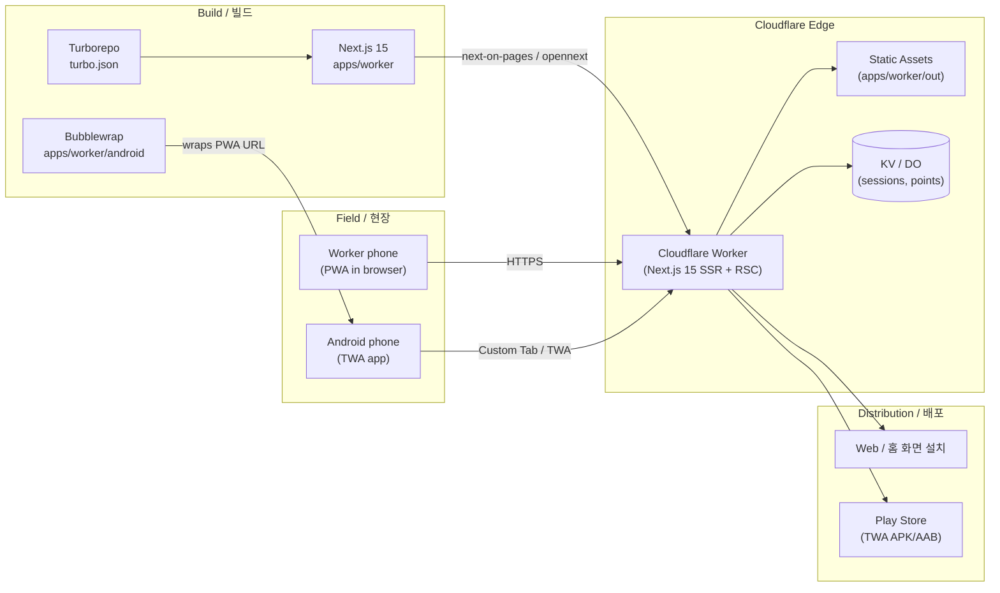

# SafetyWallet / 안전지갑

> Mobile-first PWA for construction-site safety reporting, attendance, and safety-point incentive management — deployed end-to-end on the Cloudflare edge.
> 건설 현장의 안전 보고 · 출퇴근 · 안전 포인트 인센티브를 관리하는 모바일 우선 PWA. **Cloudflare** 엣지에 전량 배포됩니다.


---

## Table of Contents / 목차

- [Overview / 개요](#overview--개요)
- [Key Features / 주요 기능](#key-features--주요-기능)
- [Architecture / 아키텍처](#architecture--아키텍처)
- [Tech Stack / 기술 스택](#tech-stack--기술-스택)
- [Repository Layout / 저장소 구조](#repository-layout--저장소-구조)
- [Quick Start / 빠른 시작](#quick-start--빠른-시작)
- [Configuration / 설정](#configuration--설정)
- [Commands Reference / 명령어 레퍼런스](#commands-reference--명령어-레퍼런스)
- [Local Development / 로컬 개발](#local-development--로컬-개발)
- [Testing / 테스트](#testing--테스트)
- [Android TWA Build / Android TWA 빌드](#android-twa-build--android-twa-빌드)
- [Internationalization / 국제화](#international화)
- [Contribution Guide / 기여 가이드](#contribution-guide--기여-가이드)
- [License / 라이선스](#license--라이선스)

---

## Overview / 개요

**SafetyWallet** is a field-worker safety platform organized as a **Turborepo monorepo** and deployed end-to-end on **Cloudflare**. It targets construction sites where workers need a low-friction, installable mobile experience and site managers need a dashboard to triage safety reports, attendance, and incentive accrual.

**SafetyWallet**은 **Cloudflare** 엣지에 전량 배포되는 **Turborepo 모노레포** 기반 현장 작업자 안전 플랫폼입니다. 작업자가 현장에서 마찰 없이 설치 가능한 모바일 환경을 사용하고, 현장 관리자가 안전 보고 · 출퇴근 · 인센티브 적립을 심사할 수 있도록 설계되었습니다.

The repository is composed of TypeScript workspaces coordinated by Turbo, with the primary deliverable being a Next.js 15 PWA that runs as a Cloudflare Worker. A Bubblewrap-style Android Trusted Web Activity (TWA) wraps the same PWA so it can be distributed via the Play Store while staying in lock-step with the web surface.

이 저장소는 Turbo가 조율하는 TypeScript 워크스페이스로 구성되며, 핵심 결과물은 Cloudflare Worker로 실행되는 Next.js 15 PWA 입니다. 동일한 PWA를 Bubblewrap 방식의 Android Trusted Web Activity(TWA)로 감싸 Play Store 배포 시 웹 표면과 완전히 동일한 동작을 보장합니다.

### Primary Surfaces / 주요 표면

| Surface / 표면 | Location / 위치 | Purpose / 용도 |
| --- | --- | --- |
| Worker PWA / 워커 PWA | `apps/worker` | Next.js 15 + Cloudflare Worker. Field-worker mobile UI, safety reporting, attendance, points. / 현장 작업자 모바일 UI, 안전 보고, 출퇴근, 포인트 |
| Android TWA / Android TWA | `apps/worker/android` | Bubblewrap-built wrapper that ships the PWA as a Play Store app with `me.jclee.safetywallet.twa` package. / Play Store용 PWA 래퍼 (`me.jclee.safetywallet.twa`) |

> **Note / 참고:** The monorepo's `workspaces` field (`apps/*`, `packages/*`) and the root scripts (`build:api`, `build:static` → `dist/admin`) reserve room for an API service and an admin dashboard. They are referenced by build pipelines but are not part of the present tree snapshot.
> 루트 `package.json`의 `workspaces`(`apps/*`, `packages/*`)와 루트 스크립트(`build:api`, `build:static` → `dist/admin`)는 API 서비스와 관리자 대시보드를 위한 자리를预留해 둡니다. 빌드 파이프라인에서 참조되지만 현재 트리 스냅샷에는 포함되어 있지 않습니다.

---

## Key Features / 주요 기능

- **Mobile-first PWA / 모바일 우선 PWA** — Installable to the home screen with offline-capable service worker and manifest. / 홈 화면에 설치 가능, 오프라인 대응 서비스 워커와 매니페스트 지원.
- **Edge-native deployment / 엣지 네이티브 배포** — Runs on Cloudflare Workers via OpenNext/Next-on-Workers; no origin server. / OpenNext 기반 Next-on-Workers로 Cloudflare Workers에 배포, 오리진 서버 없음.
- **Safety reporting / 안전 보고** — Workers can file hazards, near-misses, and observations from a phone. / 작업자가 휴대전화에서 위험 요소 · 아차사고 · 관찰 사항을 즉시 보고.
- **Attendance / 출퇴근** — On-site check-in tied to location and time. / 현장 위치와 시간에 연동된 출퇴근 체크인.
- **Safety-point incentives / 안전 포인트 인센티브** — Points accrue from approved reports and attendance; redeemable on-site. / 승인된 보고와 출퇴근에서 포인트 적립, 현장에서 사용 가능.
- **Android TWA distribution / Android TWA 배포** — Play Store-installable APK/AAB that mirrors the PWA via Digital Asset Links. / Digital Asset Links로 PWA를 미러링하는 Play Store용 APK/AAB.
- **Bilingual UI / 이중 언어 UI** — Korean and English throughout. (See `apps/worker/I18N_IMPLEMENTATION.md`.) / 한국어와 영어 동시 지원 (`apps/worker/I18N_IMPLEMENTATION.md` 참고).

---

## Architecture / 아키텍처

The worker PWA is built with Next.js 15 and compiled to a Cloudflare Worker bundle. The Android TWA loads the same URL inside a Chrome-backed `LauncherActivity` and verifies the origin through `asset_statements` in `twa-manifest.json` / `AndroidManifest.xml`. The wrangler configuration (`wrangler.toml`) drives the edge binding for assets, KV, and Durable Objects used by the runtime.

워커 PWA는 Next.js 15로 빌드되어 Cloudflare Worker 번들로 컴파일됩니다. Android TWA는 동일한 URL을 Chrome 기반 `LauncherActivity`에서 로드하며, `twa-manifest.json`과 `AndroidManifest.xml`의 `asset_statements`로 오리진을 검증합니다. 엣지 바인딩(자산, KV, Durable Objects)은 `wrangler.toml`로 구동됩니다.



### Request Flow / 요청 흐름

1. The field worker opens the PWA either directly in a mobile browser **or** via the installed TWA. / 현장 작업자는 모바일 브라우저에서 직접 또는 설치된 TWA를 통해 PWA를 실행합니다.
2. The TWA's `LauncherActivity` validates the Digital Asset Link with `twa-manifest.json` and launches the PWA URL inside a Trusted Web Activity. / TWA의 `LauncherActivity`는 `twa-manifest.json`의 Digital Asset Link를 검증한 뒤 PWA URL을 Trusted Web Activity로 실행합니다.
3. Requests terminate at the Cloudflare Worker, which serves SSR/RSC and reads from KV / Durable Objects for session and points state. / 모든 요청은 Cloudflare Worker에서 종료되며, SSR/RSC를 처리하고 KV/Durable Objects에서 세션과 포인트 상태를 조회합니다.

---

## Tech Stack / 기술 스택

| Layer / 계층 | Technology / 기술 |
| --- | --- |
| Runtime / 런타임 | Node.js ≥ 20, npm 10.8.2 |
| Monorepo / 모노레포 | Turborepo (`turbo.json`), npm workspaces (`apps/*`, `packages/*`) |
| Frontend / 프런트엔드 | Next.js 15 (App Router), React 18.3.1, TypeScript |
| Styling / 스타일링 | Tailwind CSS, PostCSS |
| Edge / 엣지 | Cloudflare Workers, `wrangler.toml` |
| Backend / 백엔드 (workspace-reserved) | Hono, Drizzle ORM |
| Data / 데이터 | Cloudflare KV / Durable Objects bindings via `wrangler.toml` |
| Validation / 검증 | TypeScript, `tsconfig.json` per workspace |
| Unit testing / 단위 테스트 | Vitest (`vitest.config.ts`) |
| E2E testing / E2E 테스트 | Playwright (`playwright.config.ts`) with `op run` for `.env.e2e` secrets |
| Hooks / 훅 | Husky + lint-staged |
| Formatting / 포맷팅 | Prettier |
| Android wrapper / Android 래퍼 | Bubblewrap-style TWA, Gradle, AndroidX |
| i18n / 국제화 | See `apps/worker/I18N_IMPLEMENTATION.md` |

---

## Repository Layout / 저장소 구조

The repository is a Turborepo monorepo. Only directories that exist in the present tree are listed; future workspaces reserved by `package.json#workspaces` are noted at the end.

이 저장소는 Turborepo 모노레포입니다. 현재 트리에 실제로 존재하는 디렉터리만 나열하며, `package.json#workspaces`로 예약된 향후 워크스페이스는 마지막에 표기합니다.

```
/
├── AGENTS.md                 # Agent-facing project guidance
├── ARCHITECTURE.md           # Long-form architecture notes
├── CODE_STYLE.md             # Code style rules
├── CONTRIBUTING.md           # Contribution workflow
├── LICENSE
├── README.md
├── package.json              # Root workspace manifest
├── package-lock.json
├── playwright.config.ts      # Playwright E2E config (root)
├── turbo.json                # Turborepo pipeline definition
├── vitest.config.ts          # Vitest config (root)
├── wrangler.toml             # Cloudflare Worker bindings
│
└── apps/
    └── worker/               # Primary deliverable: Next.js 15 PWA on Cloudflare Workers
        ├── AGENTS.md
        ├── I18N_IMPLEMENTATION.md
        ├── next-env.d.ts
        ├── next.config.mjs
        ├── package.json
        ├── postcss.config.cjs
        ├── tailwind.config.js
        ├── tsconfig.json
        ├── vitest.config.ts
        ├── src/
        │   └── app/
        │       ├── AGENTS.md
        │       ├── error.tsx
        │       ├── globals.css
        │       ├── layout.tsx
        │       └── page.tsx
        └── android/          # Bubblewrap-style Android TWA wrapper
            ├── build.gradle
            ├── gradle.properties
            ├── gradlew
            ├── gradlew.bat
            ├── manifest-checksum.txt
            ├── settings.gradle
            ├── store_icon.png
            ├── twa-manifest.json
            ├── app/
            │   ├── build.gradle
            │   └── src/main/
            │       ├── AndroidManifest.xml
            │       ├── java/me/jclee/safetywallet/twa/
            │       │   ├── Application.java
            │       │   ├── DelegationService.java
            │       │   └── LauncherActivity.java
            │       └── res/  # icons (mipmap-*), splash, shortcuts, web_app_manifest.json
            └── gradle/wrapper/
                ├── gradle-wrapper.jar
                └── gradle-wrapper.properties
```

### Future workspaces / 향후 워크스페이스

The root `package.json` declares the following workspace globs that are referenced by build pipelines but are not present in this snapshot:

루트 `package.json`은 다음 워크스페이스 glob을 선언하며 빌드 파이프라인에서 참조되지만, 본 스냅샷에는 존재하지 않습니다:

- `apps/api` — Referenced by `npm run build:api` and `deploy:api`. / `npm run build:api`, `deploy:api`에서 참조.
- `apps/admin` — Referenced by `build:static` (outputs copied to `dist/admin/`). / `build:static`에서 참조 (`dist/admin/`로 출력 복사).
- `packages/*` — Shared TypeScript packages (e.g. `packages/types` used by `build:api`). / 공유 TypeScript 패키지 (예: `build:api`가 사용하는 `packages/types`).

---

## Quick Start / 빠른 시작

### Prerequisites / 사전 요구 사항

- Node.js ≥ 20
- npm 10.8.2 (or a compatible npm that respects `packageManager`)
- A Cloudflare account (only required for `wrangler deploy`)
- The 1Password CLI (`op`) for E2E test secrets if you plan to run `npm run e2e`

```bash
node --version   # v20.x or newer
npm --version    # 10.8.2 recommended
```

### Install / 설치

```bash
npm install
```

This installs all workspaces (`apps/*`, `packages/*`) and the root dev tools (Turborepo, Playwright, Prettier, Husky).

이 명령은 모든 워크스페이스(`apps/*`, `packages/*`)와 루트 개발 도구(Turborepo, Playwright, Prettier, Husky)를 설치합니다.

### Run the worker PWA in dev / 워커 PWA 개발 서버 실행

```bash
npm run dev --workspace=apps/worker
# or, equivalently, from the repo root with Turbo:
npm run dev
```

The Next.js dev server will print a local URL (typically `http://localhost:3000`). Open it in a mobile-emulated browser to exercise the field UI.

Next.js 개발 서버가 로컬 URL(보통 `http://localhost:3000`)을 출력합니다. 모바일 에뮬레이션 브라우저에서 현장 UI를 확인하세요.

### Build for the edge / 엣지 배포용 빌드

```bash
# Build every workspace and assemble a static dist/ directory
npm run build
```

This runs `turbo run build` and then `build:static`, which removes `dist/`, copies the worker output to `dist/`, and copies any admin output to `dist/admin/`.

이 명령은 `turbo run build`를 실행한 뒤 `build:static`을 수행하여 `dist/`를 비우고 워커 출력을 `dist/`로, 관리자 출력을 `dist/admin/`로 복사합니다.

---

## Configuration / 설정

### `wrangler.toml`

`wrangler.toml` at the repository root declares the Cloudflare Worker bindings, compatibility date, and entry point consumed by Wrangler. Bindings typically include:

저장소 루트의 `wrangler.toml`은 Cloudflare Worker 바인딩, 호환성 날짜, Wrangler가 사용하는 진입점을 선언합니다. 일반적으로 다음과 같은 바인딩을 포함합니다:

- `[[kv_namespaces]]` — Sessions and rate-limit counters. / 세션과 레이트 리밋 카운터.
- `[[durable_objects.bindings]]` — Safety-points ledger, attendance state. / 안전 포인트 원장, 출퇴근 상태.
- `assets` — Static asset binding pointing to `apps/worker/out`. / `apps/worker/out`을 가리키는 정적 자산 바인딩.

> Keep `wrangler.toml` and any hand-edited environment YAML in sync. The `scripts/check-wrangler-sync.js` helper enforces that. / `wrangler.toml`과 수동 편집된 환경 YAML은 동기화 상태를 유지하세요. `scripts/check-wrangler-sync.js`가 이를 검증합니다.

### Environment variables / 환경 변수

- `.env.e2e` — Used by Playwright through `op run --env-file=.env.e2e ...`. Do **not** commit this file. / Playwright가 `op run --env-file=.env.e2e ...`로 읽는 파일. 커밋 금지.
- `.env.local` — Local overrides for `next dev`. / `next dev`용 로컬 오버라이드.
- Cloudflare account secrets — Provided to Wrangler through `CLOUDFLARE_API_TOKEN` or `wrangler login`. / `CLOUDFLARE_API_TOKEN` 또는 `wrangler login`을 통해 Wrangler에 제공.

### Naming lint / 명명 규칙 검사

```bash
npm run lint:naming
```

Runs `scripts/lint-naming.js` to enforce naming conventions documented in `CODE_STYLE.md`.

`scripts/lint-naming.js`를 실행해 `CODE_STYLE.md`의 명명 규칙을 강제합니다.

### Wrangler sync / Wrangler 동기화

```bash
npm run check:wrangler-sync
```

Fails CI if the committed `wrangler.toml` drifts from any environment-specific overrides.

커밋된 `wrangler.toml`이 환경별 오버라이드와 어긋나면 CI를 실패시킵니다.

---

## Commands Reference / 명령어 레퍼런스

All commands are run from the repository root unless otherwise noted.

별도 표기가 없는 한 모든 명령은 저장소 루트에서 실행합니다.

### Top-level scripts / 루트 스크립트

| Script / 스크립트 | Purpose / 용도 |
| --- | --- |
| `npm run build` | Run `turbo run build` then assemble `dist/`. / `turbo run build` 후 `dist/` 조립. |
| `npm run build:api` | Build `packages/types` and `apps/api`. / `packages/types`와 `apps/api` 빌드. |
| `npm run build:static` | Rebuild `dist/` from compiled outputs. / 컴파일된 출력으로 `dist/` 재구성. |
| `npm run build:one-worker` | Alias for `build:api` when shipping only the API. / API만 배포할 때의 단축 명령. |
| `npm run dev` | Run `turbo run dev` across all workspaces. / 모든 워크스페이스에 대해 `turbo run dev`. |
| `npm run lint` | Run `turbo run lint`. / `turbo run lint` 실행. |
| `npm run lint:naming` | Run the naming-convention script. / 명명 규칙 스크립트 실행. |
| `npm run test` | Run `turbo run test`. / `turbo run test` 실행. |
| `npm run test:coverage` | Run tests with coverage. / 커버리지 포함 테스트 실행. |
| `npm run typecheck` | Run `turbo run typecheck`. / `turbo run typecheck` 실행. |
| `npm run check:wrangler-sync` | Verify `wrangler.toml` is in sync. / `wrangler.toml` 동기화 검증. |
| `npm run git:preflight` | Run `scripts/git-preflight.go` to vet branches/commits. / `scripts/git-preflight.go`로 브랜치/커밋 사전 점검. |
| `npm run verify` | Run `scripts/verify.go` (Go toolchain required). / `scripts/verify.go` 실행 (Go 툴체인 필요). |
| `npm run format` / `format:check` | Prettier write / check. / Prettier 쓰기 / 검사. |
| `npm run clean` | `turbo run clean` and remove `node_modules`. / `turbo run clean` 후 `node_modules` 제거. |
| `npm run db:generate` | Generate Drizzle artifacts in `apps/api`. / `apps/api`에서 Drizzle 산출물 생성. |
| `npm run prepare` | Install Husky hooks. / Husky 훅 설치. |
| `npm run e2e` | Playwright tests with secrets from `.env.e2e`. / `.env.e2e` 비밀을 사용한 Playwright. |
| `npm run e2e:headed` | Same, headed browser. / 동일, 헤드드 브라우저. |
| `npm run e2e:ui` | Same, Playwright UI mode. / 동일, Playwright UI 모드. |
| `npm run deploy:api` | Intentionally disabled — deploys are Git-ref driven via CI on `master`. / 의도적으로 비활성화 — 배포는 `master` CI에서 Git-ref 기반. |

### Workspace scripts / 워크스페이스 스크립트

```bash
# Worker PWA
npm run dev       --workspace=apps/worker
npm run build     --workspace=apps/worker
npm run test      --workspace=apps/worker
npm run typecheck --workspace=apps/worker
npm run lint      --workspace=apps/worker

# Reserved API workspace (when present)
npm run dev       --workspace=apps/api
npm run db:generate --workspace=apps/api
```

---

## Local Development / 로컬 개발

### Editor setup / 에디터 설정

- TypeScript ≥ 5 with the workspace's `tsconfig.json` references. / 워크스페이스 `tsconfig.json` 참조 기반 TypeScript ≥ 5.
- Prettier with the repository's defaults (run `npm run format`). / 저장소 기본 Prettier (`npm run format`).
- The Pre-commit hook (Husky) runs `scripts/check-anti-patterns.go` and Prettier on staged `*.{ts,tsx}`. / Pre-commit 훅(Husky)이 스테이지된 `*.{ts,tsx}`에 대해 `scripts/check-anti-patterns.go`와 Prettier를 실행합니다.

### Day-to-day loop / 일상 개발 루프

```bash
# 1. Make sure deps are fresh
npm install

# 2. Start the dev server (Turborepo fans out to all workspaces that define dev)
npm run dev

# 3. Run unit tests in watch mode for the worker
npm run test --workspace=apps/worker -- --watch

# 4. Run E2E tests against a running dev server
npm run e2e

# 5. Before pushing
npm run lint
npm run typecheck
npm run test
npm run verify
```

### Pre-commit / 커밋 전

`lint-staged` will automatically run on `git commit`:

`lint-staged`가 `git commit` 시 자동으로 실행됩니다:

- `*.{ts,tsx}` → `go run scripts/check-anti-patterns.go` + Prettier write. / `*.{ts,tsx}` → `go run scripts/check-anti-patterns.go` + Prettier 쓰기.
- `*.{js,jsx,json,md}` → Prettier write. / `*.{js,jsx,json,md}` → Prettier 쓰기.

---

## Testing / 테스트

### Unit tests / 단위 테스트

Vitest is configured both at the root (`vitest.config.ts`) and per-workspace (e.g. `apps/worker/vitest.config.ts`). Run all suites with:

Vitest는 루트(`vitest.config.ts`)와 워크스페이스별(예: `apps/worker/vitest.config.ts`)로 설정되어 있습니다. 전체 실행:

```bash
npm run test
```

Coverage:

```bash
npm run test:coverage
```

### End-to-end tests / E2E 테스트

Playwright is wired through `playwright.config.ts` at the root. Secrets are loaded from `.env.e2e` via the 1Password CLI:

Playwright는 루트의 `playwright.config.ts`로 연결되며, 비밀은 1Password CLI를 통해 `.env.e2e`에서 로드됩니다:

```bash
# Make sure .env.e2e is provisioned via `op`
op run --env-file=.env.e2e -- npx playwright install

# Run
npm run e2e           # headless
npm run e2e:headed    # headed
npm run e2e:ui        # interactive UI
```

The TWA flow is exercised in a separate suite when targeting Android; in CI it can be smoke-tested against the headless Chromium build of the same PWA URL.

TWA 흐름은 Android 대상일 때 별도 스위트에서 검증되며, CI에서는 동일 PWA URL의 헤드리스 Chromium 빌드로 스모크 테스트할 수 있습니다.

---

## Android TWA Build / Android TWA 빌드

The `apps/worker/android/` directory is a Bubblewrap-generated Trusted Web Activity project that wraps the deployed PWA. The Android package id is **`me.jclee.safetywallet.twa`**, declared across:

`apps/worker/android/` 디렉터리는 배포된 PWA를 감싸는 Bubblewrap로 생성된 Trusted Web Activity 프로젝트입니다. Android 패키지 ID는 **`me.jclee.safetywallet.twa`**이며 다음 위치에 선언됩니다:

- `twa-manifest.json` — `packageId`, `host`, `startUrl`, `themeColor`, and `assetStatements` (Digital Asset Links). / 패키지 ID, 호스트, 시작 URL, 테마 색상, `assetStatements`.
- `app/src/main/AndroidManifest.xml` — `<application>` and intent filters for the launcher. / 런처 인텐트 필터.
- `app/build.gradle` — `applicationId`, `versionCode`, `versionName`, signing config. / `applicationId`, `versionCode`, `versionName`, 서명 설정.
- `app/src/main/java/me/jclee/safetywallet/twa/` — `Application.java`, `LauncherActivity.java`, `DelegationService.java`. / 런처 액티비티와 위임 서비스.

### Build commands / 빌드 명령

```bash
cd apps/worker/android

# Debug build for local install
./gradlew assembleDebug

# Release build for Play Store
./gradlew bundleRelease
```

Outputs:

- `app/build/outputs/apk/debug/app-debug.apk`
- `app/build/outputs/bundle/release/app-release.aab`

### Updating the wrapped URL / 래핑 URL 변경

When the production URL changes:

1. Update `twa-manifest.json` (`host`, `startUrl`, `assetStatements`). / `twa-manifest.json`의 `host`, `startUrl`, `assetStatements`를 갱신합니다.
2. Regenerate `assetlinks.json` and host it on the new origin under `/.well-known/assetlinks.json`. / `assetlinks.json`을 재생성하여 새 오리진의 `/.well-known/assetlinks.json`에 호스팅합니다.
3. Refresh `manifest-checksum.txt` if Bubblewrap reports drift. / Bubblewrap이 차이를 보고하면 `manifest-checksum.txt`를 갱신합니다.

### Icons and resources / 아이콘과 리소스

- Launcher / maskable icons live under `res/mipmap-{m,h,xh,xxh,xxxh}dpi/`. / 런처 / 마스크형 아이콘.
- Splash screens live under `res/drawable-*/splash.png`. / 스플래시.
- Notification icon: `res/drawable-*/ic_notification_icon.png`. / 알림 아이콘.
- Embedded PWA manifest: `res/raw/web_app_manifest.json`. / 임베디드 PWA 매니페스트.

---

## Internationalization / 국제화

The worker PWA ships Korean and English resources. Implementation details (message catalog location, ICU pluralization, RTL readiness, locale negotiation) are documented in:

워커 PWA는 한국어와 영어 리소스를 제공합니다. 메시지 카탈로그 위치, ICU 복수형 처리, RTL 대응, 로케일 협상 등 구현 세부 사항은 다음 문서에 정리되어 있습니다:

- `apps/worker/I18N_IMPLEMENTATION.md`

When adding a new locale:

새 로케일을 추가할 때:

1. Add the message catalog and locale code per the conventions in `I18N_IMPLEMENTATION.md`. / `I18N_IMPLEMENTATION.md`의 규약대로 메시지 카탈로그와 로케일 코드를 추가합니다.
2. Verify with `npm run typecheck` and the i18n unit tests in `apps/worker`. / `npm run typecheck`과 `apps/worker`의 i18n 단위 테스트로 검증합니다.
3. Update the locale picker in `apps/worker/src/app/layout.tsx` if it is hard-coded. / 하드코딩된 경우 `apps/worker/src/app/layout.tsx`의 로케일 선택기를 갱신합니다.

---

## Contribution Guide / 기여 가이드

Before opening a pull request, please read:

PR을 열기 전에 다음 문서를 읽어 주세요:

- `CONTRIBUTING.md` — Branching, commit message, and review expectations. / 브랜치 정책, 커밋 메시지, 리뷰 절차.
- `CODE_STYLE.md` — Naming, formatting, and anti-pattern rules. / 명명, 포맷팅, 안티 패턴 규칙.
- `ARCHITECTURE.md` — High-level component boundaries and data flow. / 상위 컴포넌트 경계와 데이터 흐름.
- `AGENTS.md` (root and `apps/worker`) — Agent-facing guidance that may also help human contributors. / 에이전트용 가이드(인간 기여자에게도 유용).

### Pre-PR checklist / PR 전 체크리스트

- [ ] `npm run lint` passes. / `npm run lint` 통과.
- [ ] `npm run typecheck` passes. / `npm run typecheck` 통과.
- [ ] `npm run test` and `npm run test:coverage` pass (no coverage regression on changed files). / `npm run test`, `npm run test:coverage` 통과 (변경 파일 커버리지 회귀 없음).
- [ ] `npm run format:check` passes. / `npm run format:check` 통과.
- [ ] `npm run check:wrangler-sync` passes if you touched `wrangler.toml`. / `wrangler.toml`을 변경했다면 `npm run check:wrangler-sync` 통과.
- [ ] `npm run git:preflight` passes locally. / `npm run git:preflight` 로컬 통과.
- [ ] Any new strings are added to both Korean and English catalogs. / 새 문자열은 한국어와 영어 카탈로그 모두에 추가.

---

## License / 라이선스

This project is released under the terms described in `LICENSE`.

이 프로젝트는 `LICENSE`에 명시된 조건에 따라 배포됩니다.