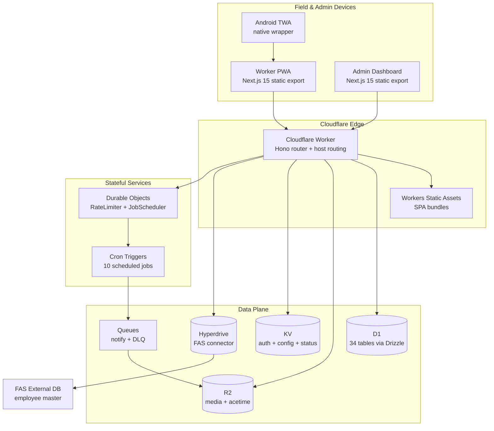

# SafetyWallet / 안전지갑

> Mobile-first PWA for construction-site safety reporting, attendance, and safety-point incentive management.
> 건설 현장의 안전 보고 · 출퇴근 · 안전 포인트 인센티브를 관리하는 모바일 우선 PWA.

## Overview / 개요

SafetyWallet is a field-worker safety platform composed of:

- A **Cloudflare Worker** that hosts a **Hono** API on top of a **Drizzle / D1** data layer.
- Two statically-exported **Next.js 15** frontends — a *worker PWA* and an *admin dashboard* — served from the same Worker through hostname routing.
- An **Android Trusted Web Activity (TWA)** wrapper that packages the worker PWA as a native-installable app.
- A scheduled-job system backed by **Durable Objects** (`RateLimiter`, `JobScheduler`), with notification delivery through **R2** and **Queues** (primary + DLQ).
- A **Go**-based development-tooling layer that enforces lint, naming, anti-pattern, and preflight invariants at commit and push time.

SafetyWallet은 다음과 같이 구성됩니다:

- **Hono** API와 **Drizzle / D1** 데이터 계층을 호스팅하는 **Cloudflare Worker**
- 동일 Worker에서 호스트명 라우팅으로 서빙되는 두 개의 정적 export **Next.js 15** 프런트엔드(작업자 PWA + 관리자 대시보드)
- 작업자 PWA를 네이티브 설치 가능 앱으로 패키징하는 **Android Trusted Web Activity (TWA)** 래퍼
- **Durable Objects**(`RateLimiter`, `JobScheduler`) 기반의 스케줄 작업 시스템과 **R2** · **Queues**(Primary + DLQ)를 통한 알림 전달
- 커밋 · 푸시 시점에 린트 · 명명 규칙 · 안티 패턴 · 프리플라이트 불변식을 강제하는 **Go** 기반 개발 도구 계층

## Features / 주요 기능

- **Hazard reporting** with image / video attachments uploaded to R2.
- **Attendance logging** with KST-timezone calendar boundaries.
- **Safety point** incentives awarded by site admins after verified reports and training completion.
- **Education & training** module with course delivery and completion tracking.
- **Posts & votes** for on-site announcements and prioritization.
- **Reviews & settlements** workflow for compliance sign-off.
- **FAS integration** through Hyperdrive to the external employee master database.
- **Multi-language UI** (Korean, English, Vietnamese, Chinese) via a custom i18n runtime in the worker PWA.
- **Role-based access control** with four roles (`WORKER`, `SITE_ADMIN`, `SUPER_ADMIN`, `SYSTEM`) and field-level flags (`canAwardPoints`, `canReview`, `canExportData`).
- **Android TWA** distribution so the worker PWA installs from the Play Store as a native app.
- **Scheduled automation** with 10 cron jobs driving attendance rollups, point calculation, and notification dispatch.
- **End-to-end testing** with Playwright across 6 projects (auth setup, admin, worker flows).

- **R2 업로드 기반의 Hazard 보고**(이미지 / 동영상 첨부)
- **KST 시간대** 경계로 기록되는 출퇴근 관리
- 사고 보고 및 교육 이수 검증 후 **사이트 관리자가 부여하는 안전 포인트 인센티브**
- **교육 · 훈련** 모듈(코스 제공 및 이수 추적)
- 현장 공지 및 우선순위 결정을 위한 **게시글 · 투표**
- 컴플라이언스 결재를 위한 **리뷰 · 정산** 워크플로
- **Hyperdrive** 기반 외부 임직원 마스터 DB(FAS) 연동
- 작업자 PWA의 커스텀 i18n 런타임을 통한 **다국어 UI**(한국어 · 영어 · 베트남어 · 중국어)
- 4단계 역할(`WORKER`, `SITE_ADMIN`, `SUPER_ADMIN`, `SYSTEM`)과 필드 단위 플래그 기반 **RBAC**
- 작업자 PWA를 Play Store에서 네이티브 앱으로 설치할 수 있게 해주는 **Android TWA** 배포
- 출퇴근 집계 · 포인트 산정 · 알림 발송을 처리하는 **10개의 스케줄 작업**
- 인증 · 관리자 · 작업자 플로우를 다루는 **Playwright E2E 테스트 6개 프로젝트**

## Architecture / 아키텍처

### Bindings / 바인딩

The single Cloudflare Worker declared in `wrangler.toml` is the source of truth for every binding.

`wrangler.toml`에 선언된 단일 Cloudflare Worker가 모든 바인딩의 단일 진실 공급원입니다.

- `DB` — D1 primary database (34 tables via Drizzle ORM).
- `FAS_HYPERDRIVE` — Hyperdrive to the external FAS employee database.
- `ASSETS` — Workers Static Assets for the worker and admin SPAs.
- `R2` — User-uploaded images and videos.
- `ACETIME_BUCKET` — R2 bucket for attendance-related assets.
- `KV` — Auth cache, system status, and configuration.
- `NOTIFICATION_QUEUE` / `NOTIFICATION_DLQ` — Notification delivery pipeline.
- `RATE_LIMITER` — Durable Object for per-route rate limiting.
- `JOB_SCHEDULER` — Durable Object that owns cron execution and back-off semantics.

### Authentication / 인증

- **JWT** issued at login with KST same-day midnight expiry, stored in a client-side Zustand store.
- **Triple-layer validation**: JWT decode → KST date check → KV cache lookup → D1 fallback.
- **Three-tier permissions**: role → site-specific membership → field-level flags.
- **Client stores**: `safetywallet-auth` (worker PWA) and `safetywallet-admin-auth` (admin dashboard); 401s trigger a single-flight refresh through a mutex.

## jclee-bot Automation Surfaces / jclee-bot 자동화 영역

Mutating GitHub automation in this repository is owned and operated by **jclee-bot**. The workflow YAML files in `.github/workflows/` are implementation triggers; the policy, identity, and merge authority live with the bot. Treat