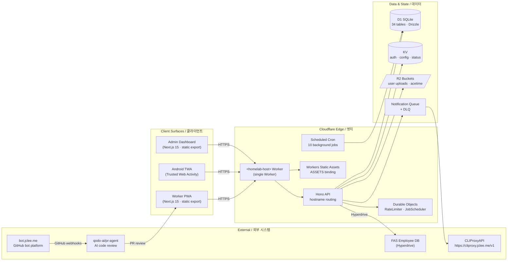
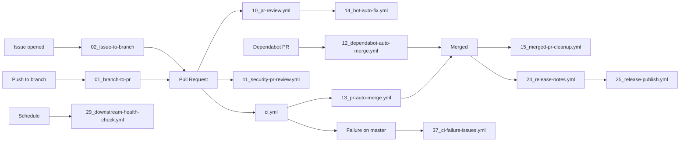

# SafetyWallet

> **건설 현장 안전 관리 플랫폼**
> **Construction Site Safety Management Platform**

[](#license)
[](https://nodejs.org)
[](https://www.typescriptlang.org)
[](https://nextjs.org)
[](https://workers.cloudflare.com)
[](https://developers.cloudflare.com/d1)
[](https://hono.dev)
[](https://orm.drizzle.team)
[](https://turbo.build)
[](https://vitest.dev)
[](https://playwright.dev)
[](#android-trusted-web-activity-twa)
[](#internationalization--다국어)

---

## Table of Contents / 목차

- [Overview / 개요](#overview--개요)
- [Features / 주요 기능](#features--주요-기능)
- [Architecture / 아키텍처](#architecture--아키텍처)
- [Repository Structure / 저장소 구조](#repository-structure--저장소-구조)
- [Automation Inventory / 자동화 인벤토리](#automation-inventory--자동화-인벤토리)
- [Quick Start / 빠른 시작](#quick-start--빠른-시작)
- [Local Development / 로컬 개발](#local-development--로컬-개발)
- [Commands Reference / 명령어 레퍼런스](#commands-reference--명령어-레퍼런스)
- [Internationalization / 다국어](#internationalization--다국어)
- [Android Trusted Web Activity / Android TWA](#android-trusted-web-activity--android-twa)
- [Contributing / 기여 가이드](#contributing--기여-가이드)
- [License / 라이선스](#license--라이선스)

---

## Overview / 개요

**SafetyWallet** is an end-to-end construction-site safety management platform that unifies hazard reporting, attendance tracking, safety-points incentives, and admin review/settlement into a single Cloudflare-native stack.

Field workers use a **mobile PWA** to file hazard reports, log attendance, complete safety education, and earn redeemable points. Site admins use a **dashboard** to review submissions, settle rewards, manage memberships, and export compliance data. A single **Cloudflare Worker** serves both the Hono API and the two statically-exported Next.js frontends through hostname-based routing.

**SafetyWallet**는 건설 현장의 안전 관리를 위해 위험 요인 보고, 출퇴근 기록, 안전 포인트 인센티브, 관리자 검토/정산을 단일 Cloudflare 스택으로 통합한 엔드 투 엔드 플랫폼입니다.

현장 작업자는 **모바일 PWA**를 통해 위험 요인을 신고하고, 출퇴근을 기록하며, 안전 교육을 이수하고, 사용 가능한 포인트를 적립합니다. 현장 관리자는 **대시보드**를 통해 제출물을 검토하고, 보상을 정산하며, 멤버십을 관리하고, 컴플라이언스 데이터를 내보냅니다. 단일 **Cloudflare Worker**가 Hono API와 정적 export된 두 개의 Next.js 프런트엔드를 호스트명 기반 라우팅으로 동시에 제공합니다.

---

## Features / 주요 기능

### Worker PWA / 작업자 PWA

- **Hazard reporting** with photo/video attachments uploaded to R2.
- **Attendance logging** with geolocation and time-window validation.
- **Safety education** modules with completion tracking.
- **Points wallet** with transaction history and redemption flows.
- **Multi-language UI** (Korean / English / Vietnamese / Chinese).
- **Offline-tolerant** PWA shell with cached assets.

### Admin Dashboard / 관리자 대시보드

- **Post review** queue with approve/reject and award-points workflows.
- **Settlement management** for point redemptions.
- **Membership administration** with site-scoped roles.
- **Education authoring** for safety training content.
- **Data export** (CSV / JSON) for compliance reporting.

### Platform / 플랫폼

- **Single Cloudflare Worker** serves API + two SPAs via hostname routing.
- **D1 (SQLite)** as the primary data store (34 tables, Drizzle ORM).
- **JWT auth** with KST same-day expiry and triple-layer validation.
- **Hyperdrive** to a remote FAS employee database.
- **Durable Objects** for rate limiting and scheduled jobs.
- **Notification queue** with DLQ for async delivery.
- **PR-Agent** for AI-driven code review and auto-fix.

---

## Architecture / 아키텍처

The platform runs on a **single Cloudflare Worker** that multiplexes the Hono API and two statically-exported Next.js 15 frontends. Static assets are served via Workers Static Assets (`ASSETS`), and routing is performed by hostname inspection.



### Authentication Flow / 인증 흐름

1. User logs in via username + password.
2. The API issues a **JWT** whose `exp` is set to **KST same-day midnight** (rolling).
3. The client stores the JWT in a Zustand-persisted store (`safetywallet-auth` for workers, `safetywallet-admin-auth` for admins).
4. On every request, validation runs in three layers: **JWT decode → KST date check → KV cache lookup → D1 fallback**.
5. A 401 triggers a **refresh mutex** so concurrent requests do not stampede the auth endpoint.

### Authorization Model / 인가 모델

- **Role tier** — `WORKER`, `SITE_ADMIN`, `SUPER_ADMIN`, `SYSTEM`.
- **Site membership** — every privileged action is scoped to a specific site.
- **Field flags** — `canAwardPoints`, `canReview`, `canExportData`, etc.

### Cloudflare Bindings / Cloudflare 바인딩

| Binding | Type | Purpose / 용도 |
| --- | --- | --- |
| `DB` | D1 | Primary database (34 tables, Drizzle ORM) |
| `FAS_HYPERDRIVE` | Hyperdrive | External FAS employee database connection |
| `ASSETS` | Workers Static Assets | Static frontend bundles (worker + admin SPAs) |
| `R2` | R2 | User-uploaded images and videos |
| `ACETIME_BUCKET` | R2 | Attendance-related media assets |
| `KV` | KV | Auth cache, system status, configuration |
| `NOTIFICATION_QUEUE` / `NOTIFICATION_DLQ` | Queue | Async notification pipeline + dead-letter queue |
| `RATE_LIMITER` | Durable Object | Per-IP / per-token rate limiting |
| `JOB_SCHEDULER` | Durable Object | Cron and deferred-job orchestration |

---

## Repository Structure / 저장소 구조

The repo is a **Turborepo monorepo** with `npm` workspaces (`apps/*` and `packages/*`). The layout below reflects the on-disk top level as shipped in this checkout.

```text
.
├── AGENTS.md                  # Project knowledge base (auto-indexed, 60 files)
├── ARCHITECTURE.md            # Deep architectural notes
├── CODE_STYLE.md              # Coding conventions enforced by linters
├── CONTRIBUTING.md            # Contribution policy & PR flow
├── LICENSE                    # MIT
├── README.md                  # You are here
├── package.json               # Workspaces, scripts, overrides, lint-staged
├── package-lock.json          # Locked dependency graph
├── playwright.config.ts       # Playwright E2E configuration (6 projects)
├── turbo.json                 # Turborepo pipeline (types → ui → apps)
├── vitest.config.ts           # Vitest root configuration
├── wrangler.toml              # Cloudflare Worker config + all bindings
├── apps/
│   └── worker/                # Next.js 15 worker PWA (port 3000, static export)
│       ├── android/           # Android TWA shell (Gradle, Bubblewrap)
│       ├── src/
│       │   └── app/           # App Router entry (login, posts, attendance, education)
│       ├── src/i18n/          # Custom runtime (ko, en, vi, zh)
│       ├── src/components/    # Worker-specific UI components
│       ├── AGENTS.md
│       ├── I18N_IMPLEMENTATION.md
│       ├── next.config.mjs
│       ├── tailwind.config.js
│       ├── postcss.config.cjs
│       ├── tsconfig.json
│       ├── vitest.config.ts
│       └── package.json
└── packages/                  # Shared workspace packages (types, ui)
```

> **Note / 참고**: The workspace configuration in `package.json` (`apps/*`, `packages/*`) hosts the additional apps documented in `AGENTS.md` (e.g. `apps/api` for the Hono Worker API and `apps/admin` for the admin dashboard), along with shared packages such as `packages/types` and `packages/ui`. These are referenced by workspace scripts and consumed by the `worker` app shown above.

### Repository Conventions / 저장소 규약

- **Root config** — `turbo.json`, `vitest.config.ts`, `playwright.config.ts`, and `wrangler.toml` are kept in sync via `npm run check:wrangler-sync`.
- **Naming policy** — enforced by `npm run lint:naming` (see `scripts/lint-naming.js`).
- **Anti-pattern guard** — `go run scripts/check-anti-patterns.go` runs in pre-commit for `*.ts` / `*.tsx`.
- **AGENTS.md** — every package emits an `AGENTS.md` for AI-agent context.

---

## Automation Inventory / 자동화 인벤토리

This repository ships **14 GitHub Actions workflows** under `.github/workflows/`. Workflows use a numeric prefix to encode their position in the lifecycle.

### Workflow Index / 워크플로 인덱스

| # | File / 파일 | Purpose / 역할 |
| - | --- | --- |
| 1 | `01_branch-to-pr.yml` | Promote a freshly pushed branch into a draft pull request with auto-filled metadata. |
| 2 | `02_issue-to-branch.yml` | Create a feature branch from an issue number and scaffold the commit. |
| 3 | `10_pr-review.yml` | Run [qodo-ai/pr-agent](https://github.com/qodo-ai/pr-agent) on every PR with adaptive feedback. |
| 4 | `11_security-pr-review.yml` | Security-focused review pass on PRs touching auth, secrets, or bindings. |
| 5 | `12_dependabot-auto-merge.yml` | Auto-merge Dependabot PRs once CI is green and the bump is patch/minor. |
| 6 | `13_pr-auto-merge.yml` | Auto-merge PRs labelled `auto-merge` after all required checks pass. |
| 7 | `14_bot-auto-fix.yml` | Apply automated fixes suggested by [qodo-ai/pr-agent](https://github.com/qodo-ai/pr-agent). |
| 8 | `15_merged-pr-cleanup.yml` | Delete merged branches and remove remote worktrees. |
| 9 | `19_issue-backfill.yml` | Backfill GitHub Issues from external trackers / form submissions. |
| 10 | `24_release-notes.yml` | Aggregate PR titles into a release-notes draft on tag push. |
| 11 | `25_release-publish.yml` | Build, publish, and tag a release once notes are approved. |
| 12 | `29_downstream-health-check.yml` | Smoke-test downstream services (`https://cliproxy.jclee.me/v1`, `https://bot.jclee.me`) on a schedule. |
| 13 | `37_ci-failure-issues.yml` | Auto-file a triage issue when CI fails on `master`. |
| 14 | `ci.yml` | Default CI: lint → typecheck → guards → test → build → D1 migration dry-run. |

### End-to-End Pipeline Flow / 파이프라인 흐름



### Standalone Automation Tools / 자동화 도구

This repository currently ships **no standalone Go-based GitHub automation tools** — all repository automation is implemented as the workflows above. Operational tooling (preflight checks, naming lint, anti-pattern scan) lives under `scripts/` and is invoked from npm scripts rather than from GitHub.

---

## Quick Start / 빠른 시작

### Prerequisites / 사전 요구 사항

- **Node.js** ≥ 20.0.0
- **npm** ≥ 10.8.2 (uses `packageManager` field)
- **Go** ≥ 1.22 (for `scripts/*.go` tools)
- **Wrangler** ≥ 3.x (`npx wrangler --version`)
- **1Password CLI** (`op`) — required for `e2e` scripts to inject secrets from `.env.e2e`.

### One-time Setup / 최초 설정

```bash
# Clone and install
git clone <repository-url> safetywallet
cd safetywallet
npm install

# Verify toolchain
node --version       # >= v20
npm --version        # >= 10.8.2
go version           # >= 1.22
npx wrangler --version
```

### First Run / 첫 실행

```bash
# Run unit tests across the workspace
npm test

# Boot the worker PWA + API + admin in parallel
npm run dev

# In another terminal, sanity-check the build pipeline
npm run verify
```

---

## Local Development / 로컬 개발

### Daily Workflow / 일상 워크플로

```bash
# Hot-reload the full monorepo (Turbo handles dependency order)
npm run dev

# Run only the API worker (Hono on Cloudflare Workers local runtime)
npm run build:api
npx wrangler dev --config wrangler.toml

# Generate Drizzle schema diffs after a schema change
npm run db:generate
```

### Pre-commit Hooks / 커밋 전 훅

The repo uses **Husky** + **lint-staged**:

- `*.{ts,tsx}` → `go run scripts/check-anti-patterns.go` then `prettier --write`.
- `*.{js,jsx,json,md}` → `prettier --write`.

Hooks install automatically via `npm run prepare` after `npm install`.

### Pre-push Guardrails / 푸시 전 가드

```bash
# Verify Cloudflare binding parity vs. wrangler.toml
npm run check:wrangler-sync

# Verify git state (no large files, no secrets, branch hygiene)
npm run git:preflight

# Full verification gate (CI parity, locally)
npm run verify
```

### End-to-End Tests / E2E 테스트

E2E tests use **Playwright** with 6 projects defined in `playwright.config.ts`. Secrets are injected from 1Password:

```bash
# Headless
npm run e2e

# Headed (for local debugging)
npm run e2e:headed

# Playwright UI mode
npm run e2e:ui
```

> **Note / 참고**: E2E runs require a valid `.env.e2e` accessible to the `op` CLI on the host.

---

## Commands Reference / 명령어 레퍼런스

All commands run from the repository root unless noted.

### Build / 빌드

| Command | Description / 설명 |
| --- | --- |
| `npm run build` | Full pipeline (`turbo run build` + static asset copy into `dist/`). |
| `npm run build:api` | Build shared `packages/types` and `apps/api`. |
| `npm run build:one-worker` | Alias for `build:api`. |
| `npm run build:static` | Assemble the static `dist/` directory for `ASSETS` binding. |

### Test / 테스트

| Command | Description / 설명 |
| --- | --- |
| `npm test` | Run unit tests across the workspace via Turbo. |
| `npm run test:coverage` | Run unit tests with coverage reporting. |
| `npm run e2e` | Run Playwright E2E suites (headless, secrets from 1Password). |
| `npm run e2e:headed` | Run Playwright with a visible browser. |
| `npm run e2e:ui` | Open Playwright in interactive UI mode. |

### Quality / 품질

| Command | Description / 설명 |
| --- | --- |
| `npm run lint` | Run ESLint across the workspace. |
| `npm run lint:naming` | Enforce repo naming policy. |
| `npm run typecheck` | Run TypeScript `--noEmit` across the workspace. |
| `npm run format` | Format all source files with Prettier. |
| `npm run format:check` | Verify formatting without modifying files. |
| `npm run check:wrangler-sync` | Confirm binding parity in `wrangler.toml`. |
| `npm run git:preflight` | Pre-push guardrail (`scripts/git-preflight.go`). |
| `npm run verify` | Full CI-parity verification gate. |

### Deploy / 배포

| Command | Description / 설명 |
| --- | --- |
| `npm run deploy:api` | **Disabled.** Manual deploys are refused; deploys are Git-ref driven via CI on `master`. |

### Maintenance / 유지보수

| Command | Description / 설명 |
| --- | --- |
| `npm run db:generate` | Regenerate Drizzle artefacts after a schema change. |
| `npm run clean` | Remove `node_modules` and all build outputs. |

---

## Internationalization / 다국어

The worker PWA ships a **custom i18n runtime** supporting four locales:

- `ko` — 한국어 (Korean, default)
- `en` — English
- `vi` — Tiếng Việt (Vietnamese)
- `zh` — 中文 (Chinese)

Translation data lives in `packages/types` and is consumed by both `apps/worker` and `apps/admin`. The runtime contract is documented in [`apps/worker/I18N_IMPLEMENTATION.md`](apps/worker/I18N_IMPLEMENTATION.md).

Locale negotiation order:

1. Persisted user preference (`localStorage`).
2. `Accept-Language` header.
3. Default fallback (`ko`).

---

## Android Trusted Web Activity / Android TWA

The worker PWA is wrapped as a **TWA** so it can ship through the Play Store while remaining a real web app.

### Build / 빌드

```bash
cd apps/worker/android
./gradlew assembleRelease
```

The TWA configuration lives in:

- `apps/worker/android/twa-manifest.json` — Digital Asset Links.
- `apps/worker/android/app/src/main/AndroidManifest.xml` — Launcher activity, shortcuts, and notification channel.
- `apps/worker/android/app/src/main/res/xml/filepaths.xml` — FileProvider paths.
- `apps/worker/android/app/src/main/res/xml/shortcuts.xml` — App shortcuts (legacy).
- `apps/worker/android/app/src/main/java/me/jclee/safetywallet/twa/` — `Application`, `LauncherActivity`, `DelegationService`.

### Asset Bundles / 에셋 번들

All launcher / maskable / splash / notification icons across the standard density buckets (`mdpi` → `xxxhdpi`) ship in `apps/worker/android/app/src/main/res/`.

---

## Contributing / 기여 가이드

Please read [`CONTRIBUTING.md`](CONTRIBUTING.md), [`CODE_STYLE.md`](CODE_STYLE.md), and [`ARCHITECTURE.md`](ARCHITECTURE.md) before opening a pull request. Highlights:

### Branch and PR Model / 브랜치 & PR 모델

- Branch from `master` using `feat/`, `fix/`, `chore/`, or `docs/` prefixes.
- The `02_issue-to-branch.yml` and `01_branch-to-pr.yml` workflows can scaffold this for you — comment `/branch` on an issue or push a branch to trigger them.
- Keep PRs small and focused. One logical change per PR.

### Commit Hygiene / 커밋 위생

- Imperative mood subject (`Add attendance validator`, not `Added…`).
- Reference the issue number in the body (`Refs #123`).
- Sign commits if your fork is configured for it.

### Review Pipeline / 리뷰 파이프라인

1. `ci.yml` runs lint → typecheck → naming → anti-pattern → unit tests → build → D1 migration dry-run.
2. `10_pr-review.yml` posts [qodo-ai/pr-agent](https://github.com/qodo-ai/pr-agent) feedback.
3. `11_security-pr-review.yml` performs a security pass on sensitive paths.
4. Maintainers may label `auto-merge` for the `13_pr-auto-merge.yml` workflow.

### Auto-fix Behaviour / 자동 수정 동작

The `14_bot-auto-fix.yml` workflow can push commits back to your branch when [qodo-ai/pr-agent](https://github.com/qodo-ai/pr-agent) detects safe fixes. These commits are authored by `bot.jclee.me`.

---

## License / 라이선스

This project is released under the **MIT License**. See [`LICENSE`](LICENSE) for the full text.

---

### External Services / 외부 서비스

- **AI code review** — [qodo-ai/pr-agent](https://github.com/qodo-ai/pr-agent)
- **LLM proxy** — `https://cliproxy.jclee.me/v1`
- **Bot platform** — `https://bot.jclee.me`
- **Play Store listing** — Android TWA bundle under `apps/worker/android/`